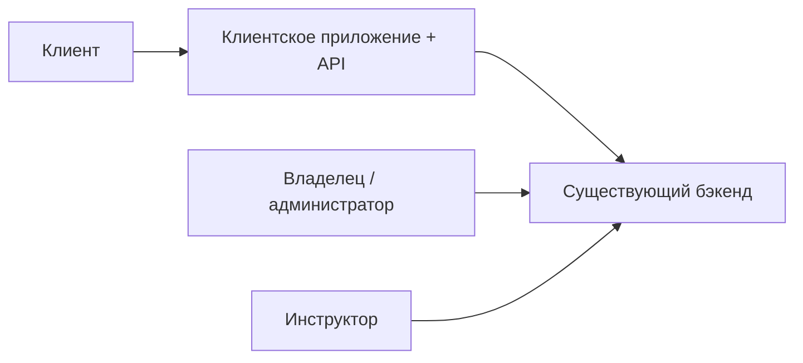

# Описание домена — скалодром «Вертикаль»

> Этап выявления требований. Источник: [brief-climbing.md](../0-customer-brief/brief-climbing.md).

---

## 1. Предметная область

**Скалодром** — спортивное учреждение для занятий скалолазанием в помещении. В данном проекте речь о скалодроме «Вертикаль» (бывший складской ангар), где проводятся **групповые тренировки с инструктором**.

Предметная область проекта — **управление записью клиентов на групповые тренировки**: просмотр расписания, доступность мест, бронирование, отмены, обратная связь по инструкторам. Операционная работа зала (формирование расписания, управление инструкторами, профилактика зон) реализована в **существующем бэкенде**. В фокусе текущей работы — **клиентский мобильный канал** и **API для него**.

---

## 2. Ключевые сущности

| Сущность | Описание |
| :-- | :-- |
| **Скалодром** | Площадка с зонами, адресом, правилами работы |
| **Зона / формат** | Тип активности: болдеринг с инструктажем (новички), трассы с верёвкой (опытные) |
| **Слот (тренировка)** | Конкретное занятие: дата и время (~1,5 ч), зона/формат, инструктор, лимит и свободные места |
| **Инструктор** | Ведёт групповую тренировку; у части инструкторов высокий спрос |
| **Клиент** | Пользователь, который записывается на слот; может использовать своё снаряжение или прокат |
| **Бронь (запись)** | Связь «клиент ↔ слот»; имеет статусы (активна, отменена клиентом, отменена скалодромом, посещена и др.) |
| **Снаряжение** | Скальники, страховочная система — своё или прокатное |
| **Оценка инструктора** | Обратная связь клиента после тренировки |

---

## 3. Бизнес-правила

- Группа вмещает до **16 человек**; на **новичковых** тренировках — не более **8** (требования безопасности и контроля техники).
- Расписание планируется **на неделю вперёд**; в клиентском приложении по умолчанию отображаются слоты на **ближайшие 7 дней** (R-027).
- Клиент видит **свободные места** и записывается самостоятельно.
- **Двойная запись** на одно место исключается на стороне бэкенда — атомарная проверка свободных мест при бронировании (R-004).
- **Отмена клиентом:** при заблаговременной отмене место освобождается; поздняя отмена (около 10 минут до начала) создаёт операционную проблему — правила ограничения уточняются у заказчика.
- **Отмена скалодромом** (профилактика, закрытие зоны): бронь не удаляется, а получает статус **«Отменена скалодромом»** с указанием причины; клиенту отправляется **push-уведомление**; повторная запись на отменённый слот **запрещена** (R-008).
- После тренировки клиент может **оценить инструктора** — для контроля качества и распределения нагрузки между инструкторами.

---

## 4. Акторы

| Актор | Роль в домене | В скоупе текущей поставки |
| :-- | :-- | :-- |
| **Клиент** | Просмотр слотов, запись, отмена, выбор проката, оценки, уведомления | Да (R-028) |
| **Инструктор** | Ведение тренировок, работа с группой | Нет — существующий интерфейс |
| **Владелец / администратор** | Управление расписанием, инструкторами, отменами, профилактикой | Нет — существующая админка |

---

## 5. Основные процессы

### 5.1. Просмотр расписания

Клиент открывает приложение и видит доступные слоты на 7 дней (расширение периода — через фильтр дат). Для каждого слота отображаются: время начала, зона/формат, инструктор, количество свободных мест. Если слотов нет — показывается empty state («Пока нет доступных тренировок»).

### 5.2. Бронирование

Клиент выбирает слот, указывает, приходит ли со своим снаряжением или нужен прокат. Бэкенд атомарно проверяет наличие мест и подтверждает или отклоняет бронь.

### 5.3. Отмена брони

- **Клиентом** — с освобождением места (при соблюдении правил отмены).
- **Скалодромом** — массово или точечно (профилактика зоны); клиент получает уведомление и видит причину отмены.

### 5.4. Напоминания

Push-уведомления для снижения неявок (конкретные сценарии и сроки — уточняются у заказчика).

### 5.5. Оценка инструктора

После посещённой тренировки клиент может оставить оценку — для аналитики качества работы инструкторов.

### 5.6. Профилактика зоны

Закрытие зоны (перекрутка трасс, проверка снаряжения) инициируется в существующей инфраструктуре; все записанные клиенты уведомляются через клиентское приложение.

---

## 6. Границы системы

### В скоупе

- Мобильное приложение для **роли «Клиент»**
- **API** для клиентского приложения (auth, слоты, бронирования, профиль, инструкторы/рейтинги — по контракту)

### Вне скоупа

- Создание и редактирование расписания
- Админка владельца / администратора
- Интерфейс инструктора
- Транзакционность, SLA и внутренняя реализация бэкенда (R-004)
- Миграция исторических данных (R-015)
- Онлайн-оплата (под вопросом на старте)
- Программа лояльности для постоянных клиентов (идея на будущее)

---

## 7. Болевые точки (мотивация проекта)

Сейчас запись ведётся вручную через **Telegram и тетрадку**. В часы пик это приводит к:

- путанице в расписании;
- **двойным бронированиям** (два клиента на одно место);
- недовольству клиентов, пришедших на уже занятую группу.

Цель — **самообслуживание записи** для клиентов при сохранении контроля владельца через существующую админку.

---

## 8. Глоссарий

| Термин | Определение |
| :-- | :-- |
| **Болдеринг** | Лазание без верёвки на низких трассах (боулдеринг-зона) |
| **Трассы с верёвкой** | Лазание с использованием страховки на высоте |
| **Слот** | Единица расписания, на которую клиент может записаться |
| **Прокат** | Выдача скальников и/или страховочной системы на время тренировки |
| **Профилактика** | Плановое закрытие зоны для перекрутки трасс или проверки снаряжения |
| **Empty state** | Состояние интерфейса при отсутствии доступных слотов |
