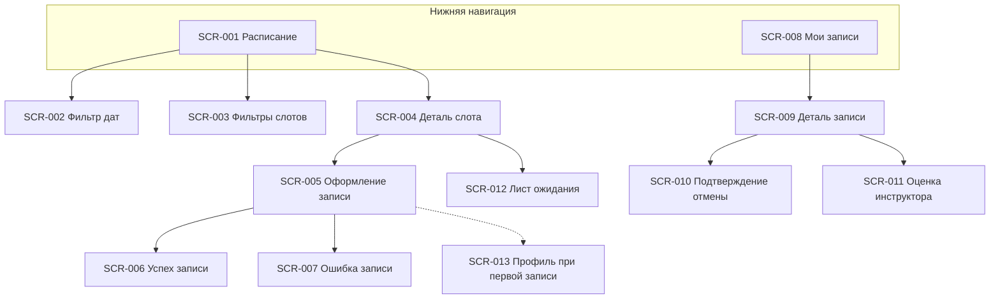

# Реестр экранов — скалодром «Вертикаль»

> Клиентское мобильное приложение (роль «Клиент», R-028).
> Источники: [2-requirements/](../2-requirements/), [1-elicitation/customer-questions.md](../1-elicitation/customer-questions.md).
> Постановки на дизайн: [screens/](screens/).

## Навигация приложения

---

## Реестр

| ID | Экран | Тип | Приоритет | Use Case / FR | Постановка |
| :- | :-- | :-- | :--: | :-- | :-- |
| SCR-001 | Расписание | Экран (вкладка) | Must | UC-001; FR-001–004 | [SCR-001-schedule.md](screens/SCR-001-schedule.md) |
| SCR-002 | Фильтр периода дат | Bottom sheet | Must | FR-002; Q 1.5 | [SCR-002-date-filter.md](screens/SCR-002-date-filter.md) |
| SCR-003 | Фильтры слотов | Bottom sheet | Must | Q 1.6 | [SCR-003-slot-filters.md](screens/SCR-003-slot-filters.md) |
| SCR-004 | Деталь слота | Экран | Must | UC-002; FR-003, Q 5.3, 7.1 | [SCR-004-slot-detail.md](screens/SCR-004-slot-detail.md) |
| SCR-005 | Оформление записи | Экран | Must | UC-002; FR-005–006; Q 1.1, 2.3, 7.1 | [SCR-005-booking-form.md](screens/SCR-005-booking-form.md) |
| SCR-006 | Успешная запись | Экран / modal | Must | UC-002; FR-006 | [SCR-006-booking-success.md](screens/SCR-006-booking-success.md) |
| SCR-007 | Ошибка записи | Dialog / modal | Must | UC-002; FR-006; Q 2.4 | [SCR-007-booking-error.md](screens/SCR-007-booking-error.md) |
| SCR-008 | Мои записи | Экран (вкладка) | Must | UC-003; FR-007; Q 9.2 | [SCR-008-my-bookings.md](screens/SCR-008-my-bookings.md) |
| SCR-009 | Деталь записи | Экран | Must | UC-003–005; FR-008–011; Q 4.1 | [SCR-009-booking-detail.md](screens/SCR-009-booking-detail.md) |
| SCR-010 | Подтверждение отмены | Dialog | Must | UC-004; Q 3.1–3.2 | [SCR-010-cancel-confirm.md](screens/SCR-010-cancel-confirm.md) |
| SCR-011 | Оценка инструктора | Bottom sheet / modal | Must | UC-006; FR-012; Q 5.1–5.2 | [SCR-011-rate-instructor.md](screens/SCR-011-rate-instructor.md) |
| SCR-012 | Лист ожидания | Экран / секция | Must | Q 1.4, 6.1, 10.1 | [SCR-012-waitlist.md](screens/SCR-012-waitlist.md) |
| SCR-013 | Контактные данные | Секция / экран | Must | Q 1.1; FR-016 (profile) | [SCR-013-contact-profile.md](screens/SCR-013-contact-profile.md) |

---

## Сквозные NFR для всех экранов

| ID | Требование | Источник |
| :- | :-- | :-- |
| NFR-001 | Мобильный клиентский интерфейс | [NFR-001](../2-requirements/non-functional-requirements.md) |
| — | Только русский язык | Q 9.3 |
| — | Push-уведомления (deep link на SCR-009 / SCR-001) | FR-010, FR-013; Q 6.1–6.2 |
| — | Офлайн: кэш «Мои записи» (SCR-008, SCR-009) | Q 9.2 |

---

## Статусы брони (отображение на SCR-008, SCR-009)

| Статус | Отображение | Действия клиента |
| :-- | :-- | :-- |
| Активна | Бейдж «Записан» | Отменить (SCR-010) |
| Отменена клиентом | Бейдж «Отменена вами» | — |
| Отменена скалодромом | Бейдж + причина | Перезаписаться на другой слот (SCR-001) |
| Посещена | Бейдж «Посещена» | Оценить инструктора (SCR-011) |
| Лист ожидания | Бейдж «В очереди» | Покинуть очередь |
