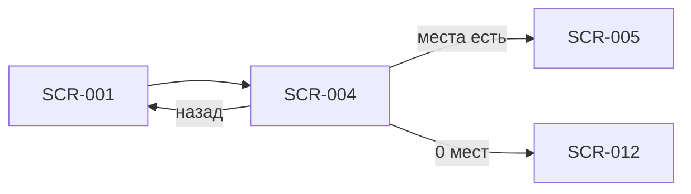

# SCR-004 — Деталь слота

| Поле | Значение |
| :-- | :-- |
| **ID** | SCR-004 |
| **Тип** | Экран |
| **Приоритет** | Must |
| **Связь** | UC-002; FR-003; Q 5.3, 7.1, 2.4 |

## Назначение

Показать полную информацию о выбранной тренировке, чтобы клиент принял решение о записи. Экран закрывает FR-003 (время, зона/формат, инструктор, свободные места) и дополняет его ценой (Q 7.1) и рейтингом инструктора (Q 5.3). Основная точка конверсии в поток бронирования.

## Точки входа

- **SCR-001** — тап по карточке слота в расписании.
- Deep link / push (редко) — при переходе на конкретный слот из уведомления.

## Точки выхода

| Действие | Куда |
| :-- | :-- |
| «Назад» / свайп | SCR-001 (расписание) |
| «Записаться» | SCR-005 (оформление записи) |
| «В лист ожидания» | SCR-012 (лист ожидания) |
| Тап по карточке инструктора (опционально) | Расширенная карточка / bottom sheet с рейтингом (в рамках этого экрана) |

## Структура экрана

```
┌─────────────────────────────────┐
│ ← Назад                         │
├─────────────────────────────────┤
│ Заголовок: дата + время начала  │
│ Длительность ~1,5 ч             │
│ Бейдж: зона / формат            │
├─────────────────────────────────┤
│ Свободные места: X / Y          │
│ (прогресс-бар или индикатор)    │
├─────────────────────────────────┤
│ Карточка инструктора            │
│ [фото] Имя                      │
│ ★★★★☆ 4,2 (N оценок)           │
├─────────────────────────────────┤
│ Цена: от XXX ₽                  │
│ (подсказка: оплата на месте)    │
├─────────────────────────────────┤
│ [ sticky CTA внизу ]            │
└─────────────────────────────────┘
```

Вертикальный скролл; CTA закреплён внизу (sticky footer).

## Элементы UI

| Элемент | Описание | Обязательность |
| :-- | :-- | :--: |
| Кнопка «Назад» | Возврат к расписанию без потери контекста фильтров | Must |
| Дата и время начала | Формат: «Ср, 9 июля · 18:30» | Must |
| Длительность | Текст «~1,5 ч» (фиксированное доменное значение или поле API) | Must |
| Бейдж зоны/формата | Например: «Болдеринг для новичков», «Трассы с верёвкой» | Must |
| Счётчик мест | «Свободно X из Y»; Y приходит из API (8 для новичкового формата, до 16 для остальных) | Must |
| Индикатор заполненности | Визуальный прогресс (полоска, кольцо) — помогает быстро оценить дефицит мест | Should |
| Карточка инструктора | Фото (или плейсхолдер), имя, рейтинг звёздами 1–5, средний балл, число оценок | Must |
| Блок цены | Итоговая цена тренировки; при необходимости «от XXX ₽» если прокат влияет на сумму | Must |
| Подпись об оплате | «Оплата на месте» — вторичный текст под ценой (Q 7.1) | Must |
| CTA «Записаться» | Primary button; видна при `freeSpots > 0` и доступности слота | Must |
| CTA «В лист ожидания» | Secondary / outline; при `freeSpots = 0` | Must |
| Баннер «Прокат недоступен» | Информирует, почему запись невозможна (Q 2.4) | Must |
| Skeleton / shimmer | При загрузке данных слота | Must |

## Состояния

| Состояние | Условие | Поведение UI |
| :-- | :-- | :-- |
| Загрузка | Запрос `GET /slots/{id}` в процессе | Skeleton вместо контента |
| Доступен | `freeSpots > 0`, прокатный фонд достаточен (или клиент пойдёт со своим — CTA активна) | CTA «Записаться» активна |
| Заполнен | `freeSpots = 0` | CTA «В лист ожидания»; «Записаться» скрыта или заменена |
| Прокат исчерпан | API: `rentalAvailable = false` (или аналог) | CTA «Записаться» **disabled**; баннер «Прокат на это время закончился. Запись недоступна» |
| Ошибка загрузки | Сеть / 404 / 5xx | Empty state + «Повторить» + «К расписанию» |
| Нет рейтинга | У инструктора 0 оценок | Звёзды серые; текст «Пока нет оценок» |

## Сценарии и переходы

1. **Успешный просмотр → запись:** клиент видит слот с местами → «Записаться» → SCR-005.
2. **Группа заполнена:** `freeSpots = 0` → «В лист ожидания» → SCR-012 (Q 1.4).
3. **Прокат закончился:** слот виден, но запись заблокирована → клиент возвращается к SCR-001 или выбирает другой слот.
4. **Отмена:** «Назад» → SCR-001 с сохранением позиции скролла и фильтров.



## Данные с API

`GET /slots/{slotId}` (или поля из списка + детальный запрос):

| Поле API | Отображение |
| :-- | :-- |
| `startAt` | Дата и время начала |
| `durationMinutes` | «~1,5 ч» (ожидаемо 90) |
| `zoneName`, `formatName` | Бейдж зоны/формата |
| `capacity` | Y в «X / Y» |
| `freeSpots` | X в «X / Y» |
| `price` | Цена тренировки |
| `rentalAvailable` | Доступность записи при необходимости проката |
| `instructor.id`, `instructor.name`, `instructor.photoUrl` | Карточка инструктора |
| `instructor.rating`, `instructor.ratingCount` | Звёзды и подпись «4,2 · 28 оценок» |

## Правила и ограничения

- Лимит Y для новичкового формата — **8** (приходит из API, не хардкодить в UI).
- Рейтинг инструктора **публичный** — виден всем клиентам при выборе слота (Q 5.3).
- Цену **показываем**, оплата только на месте — без кнопок оплаты (Q 7.1).
- Если прокатный фонд исчерпан — слот **недоступен для записи**, не скрываем из расписания (Q 2.4).
- Один клиент — одна запись в день (Q 1.3): проверка на SCR-005/бэкенде; на SCR-004 не блокируем CTA превентивно (опционально — предупреждение, если API отдаёт флаг `hasBookingToday`).
- Запись только на себя (Q 1.2) — не показывать выбор количества участников.

## Заметки для дизайнера

- Счётчик «3 из 8» для новичковых слотов должен визуально отличаться от «12 из 16» — одинаковый компонент, разные Y.
- Рейтинг — компактные звёзды (1–5), без текстовых отзывов (Q 5.2). Средний балл с одним знаком после запятой.
- CTA внизу: на iOS учесть safe area; на Android — elevation / тень для отделения от контента.
- При `freeSpots ≤ 2` можно подсветить дефицит (например, оранжевый акцент «Осталось 2 места») — усиливает срочность, но не блокирует UX.
- Баннер «Прокат недоступен» — нейтральный тон, без ощущения ошибки; предложить выбрать другой слот.
- Не дублировать длинное описание формата — достаточно бейджа; детали формата клиент уже видел в SCR-001.
