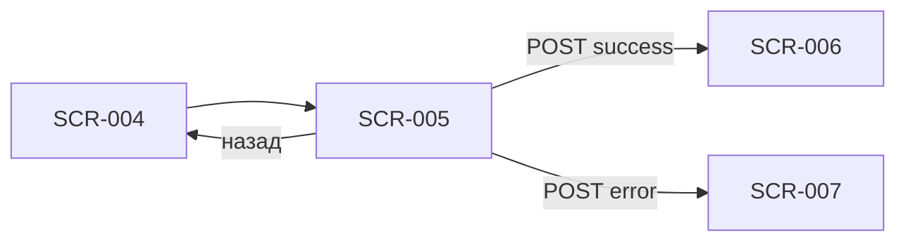

# SCR-005 — Оформление записи

| Поле | Значение |
| :-- | :-- |
| **ID** | SCR-005 |
| **Тип** | Экран |
| **Приоритет** | Must |
| **Связь** | UC-002; FR-005, FR-006; Q 1.1, 1.3, 2.3, 2.4, 7.1 |

## Назначение

Собрать данные для бронирования: контакты клиента (при первой записи), выбор снаряжения (своё / прокат) и показать итоговую стоимость перед отправкой запроса на бэкенд. Закрывает FR-005 и инициирует FR-006.

## Точки входа

- **SCR-004** — тап «Записаться» на детали слота с доступными местами.

## Точки выхода

| Действие | Куда |
| :-- | :-- |
| «Назад» / отмена | SCR-004 (деталь слота) |
| Успешная отправка | SCR-006 (успех записи) |
| Отказ бэкенда | SCR-007 (ошибка записи) |
| Редактирование профиля (опционально) | SCR-013 (контактные данные) |

## Структура экрана

```
┌─────────────────────────────────┐
│ ← Оформление записи             │
├─────────────────────────────────┤
│ Краткая сводка слота            │
│ (дата, время, формат, инструктор)│
├─────────────────────────────────┤
│ Контактные данные               │
│ [ Имя *        ]                │
│ [ Телефон *    ]                │
│ (или превью из профиля + Edit)  │
├─────────────────────────────────┤
│ Снаряжение                      │
│ ○ Со своим снаряжением          │
│ ○ Нужен прокат                  │
│   ☐ Скальники                   │
│   ☐ Страховочная система        │
├─────────────────────────────────┤
│ Итого                           │
│ Тренировка          XXX ₽       │
│ Прокат (если есть)   XX ₽       │
│ ─────────────────────────       │
│ К оплате на месте   XXX ₽       │
│ ℹ Оплата на месте в скалодроме  │
├─────────────────────────────────┤
│ [ Записаться ]  (sticky)        │
└─────────────────────────────────┘
```

## Элементы UI

| Элемент | Описание | Обязательность |
| :-- | :-- | :--: |
| Кнопка «Назад» | Возврат на SCR-004 | Must |
| Сводка слота | Компактный блок: дата, время, формат, инструктор — для контекста без возврата | Must |
| Поле «Имя» | Обязательное при первой записи (Q 1.1); валидация непустого значения | Must |
| Поле «Телефон» | Обязательное при первой записи; маска +7, 10 цифр | Must |
| Блок профиля | Если имя и телефон уже есть — показать с кнопкой «Изменить» | Must |
| Radio «Со своим снаряжением» | По умолчанию может быть выбрано | Must |
| Radio «Нужен прокат» | Раскрывает чекбоксы проката | Must |
| Чекбокс «Скальники» | Активен только при выборе проката | Must |
| Чекбокс «Страховочная система» | Активен только при выборе проката | Must |
| Разбивка цены | Строки: тренировка, прокат (по позициям), итого | Must |
| Подпись «Оплата на месте» | Информационный блок, не кнопка оплаты (Q 7.1) | Must |
| CTA «Записаться» | Primary; запускает отправку | Must |
| Индикатор загрузки | На кнопке или full-screen overlay при submit | Must |
| Inline-ошибки валидации | Под полями имени/телефона | Must |

## Состояния

| Состояние | Условие | Поведение UI |
| :-- | :-- | :-- |
| Первая запись | Профиль пуст (`name`, `phone` отсутствуют) | Поля имени и телефона редактируемые, обязательные |
| Повторная запись | Профиль заполнен | Превью контактов + «Изменить»; поля можно раскрыть inline |
| Своё снаряжение | Выбран radio «Со своим» | Чекбоксы проката скрыты/disabled; строки проката в цене = 0 |
| Прокат: скальники | Чекбокс скальников | Добавляется строка в разбивку цены |
| Прокат: страховка | Чекбокс страховки | Добавляется строка в разбивку цены |
| Прокат: оба | Оба чекбокса | Две строки в разбивке |
| Прокат без выбора | Radio «Прокат», но ни один чекбокс | CTA disabled + подсказка «Выберите, что нужно взять в прокат» |
| Отправка | `POST /bookings` в процессе | CTA disabled, спиннер; блокировка повторного тапа |
| Ошибка валидации | Пустые поля / неверный телефон | Inline-ошибки, submit не уходит |
| Ошибка бэкенда | 4xx/409 от API | SCR-007 (modal) поверх формы |

## Сценарии и переходы

1. **Первая запись, своё снаряжение:** заполнить имя и телефон → выбрать «Со своим» → «Записаться» → loading → SCR-006.
2. **Прокат оба:** выбрать прокат → отметить скальники и страховку → цена пересчитывается → submit → SCR-006.
3. **Гонка за место:** submit → бэкенд отклоняет (мест нет) → SCR-007 с вариантом «К расписанию» / «В лист ожидания».
4. **Уже есть запись сегодня:** бэкенд отклоняет → SCR-007 с текстом про лимит 1 запись в день (Q 1.3).
5. **Прокат закончился между SCR-004 и submit:** бэкенд отклоняет → SCR-007 (Q 2.4).
6. **Отмена:** «Назад» → SCR-004, введённые данные формы не сохраняются (контакты из профиля — сохранены).



## Данные с API

**Вход (из SCR-004 / кэша):**

| Поле | Использование |
| :-- | :-- |
| `slotId` | Идентификатор для бронирования |
| `price` | Базовая цена тренировки |
| `rentalPrices.shoes`, `rentalPrices.harness` | Строки разбивки при прокате |
| `instructor`, `startAt`, `formatName` | Сводка слота |

**Профиль клиента:**

| Поле | Использование |
| :-- | :-- |
| `profile.name`, `profile.phone` | Предзаполнение; скрытие полей при наличии |

**Отправка:**

`POST /bookings`

```json
{
  "slotId": "...",
  "contact": { "name": "...", "phone": "+79..." },
  "equipment": {
    "type": "own" | "rental",
    "rentalItems": ["shoes", "harness"]
  }
}
```

**Ответ:** `201` + объект брони → SCR-006; `409` / `422` + `errorCode` → SCR-007.

## Правила и ограничения

- Имя и телефон **обязательны при первой записи** (Q 1.1); сохраняются в профиле для следующих визитов.
- **Не более 1 записи в день** на клиента (Q 1.3) — проверка на бэкенде; UI показывает понятную ошибку через SCR-007.
- Клиент записывает **только себя** (Q 1.2) — нет поля «количество мест».
- При прокате клиент **сам выбирает** скальники, страховку или оба (Q 2.3); минимум один пункт при выборе «Прокат».
- Цена проката влияет **незначительно** — показывать в разбивке, но без акцента на мелочи.
- **Оплата на месте** — нет интеграции с платёжными системами в MVP (Q 7.1).
- Двойной submit блокируется до ответа API (FR-006, R-004).
- Если на SCR-004 слот был доступен, но прокат кончился к моменту submit — обработать через SCR-007, не silent fail.

## Заметки для дизайнера

- Сводка слота вверху — компактная «якорная» карточка (1–2 строки), чтобы форма не казалась оторванной от контекста.
- Radio + чекбоксы: при переключении на «Со своим» чекбоксы плавно скрываются; при «Прокат» — раскрываются с отступом (вложенная группа).
- Телефон: маска `+7 (___) ___-__-__`; клавиатура numeric.
- Блок «К оплате на месте» — визуально отделить от разбивки (итог крупнее); иконка ℹ рядом с пояснением про оплату в скалодроме.
- Loading: предпочтительно спиннер на кнопке + dim overlay, чтобы пользователь не менял выбор во время запроса.
- При ошибке SCR-007 форма **остаётся заполненной** под модалкой — клиент может исправить выбор снаряжения и повторить.
- Для повторных клиентов поля контактов не должны создавать трение — превью + «Изменить» вместо двух пустых инпутов.
