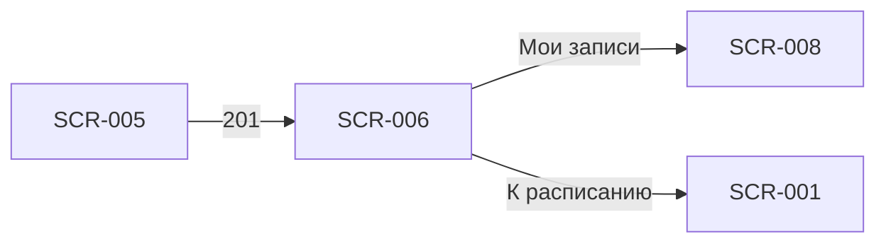

# SCR-006 — Успешная запись

| Поле | Значение |
| :-- | :-- |
| **ID** | SCR-006 |
| **Тип** | Экран / modal |
| **Приоритет** | Must |
| **Связь** | UC-002; FR-006 |

## Назначение

Подтвердить клиенту, что бронь создана, и показать краткую сводку записи. Снижает тревожность после submit и задаёт следующий шаг (просмотр записей или возврат к расписанию). Закрывает успешную ветку FR-006.

## Точки входа

- **SCR-005** — успешный ответ `POST /bookings` (201).

## Точки выхода

| Действие | Куда |
| :-- | :-- |
| «Мои записи» | SCR-008 (вкладка «Мои записи») |
| «К расписанию» | SCR-001 (вкладка «Расписание») |
| «Добавить в календарь» (nice-to-have) | Системный календарь OS |
| Системная «Назад» | SCR-001 (не возвращать на SCR-005 — сброс стека навигации) |

## Структура экрана

```
┌─────────────────────────────────┐
│                                 │
│         ✓ (иконка успеха)       │
│                                 │
│      Вы записаны!               │
│                                 │
├─────────────────────────────────┤
│ Сводка брони                    │
│ 📅 Ср, 9 июля · 18:30           │
│ ⏱ ~1,5 ч                        │
│ 🏷 Болдеринг для новичков       │
│ 👤 Инструктор: Алексей          │
│ 🎒 Со своим / Прокат: ...       │
│ 💰 К оплате на месте: XXX ₽     │
├─────────────────────────────────┤
│ [ Добавить в календарь ]        │  ← Could
├─────────────────────────────────┤
│ [ Мои записи ]    (primary)     │
│ [ К расписанию ]  (secondary)   │
└─────────────────────────────────┘
```

Полноэкранный success-state или крупный modal без затемнения фона формы (предпочтительно полный экран для ясности завершения потока).

## Элементы UI

| Элемент | Описание | Обязательность |
| :-- | :-- | :--: |
| Иконка успеха | Галочка / анимация подтверждения | Must |
| Заголовок | «Вы записаны!» или «Запись подтверждена» | Must |
| Сводка брони | Дата, время, длительность, формат, инструктор, снаряжение, сумма к оплате на месте | Must |
| Бейдж статуса | «Записан» (согласован со статусами SCR-008) | Must |
| CTA «Мои записи» | Primary — ведёт на детальный список с новой записью | Must |
| CTA «К расписанию» | Secondary / text — возврат к поиску других слотов | Must |
| «Добавить в календарь» | Генерация .ics / intent в календарь OS | Could |
| Подпись про напоминания | «Мы напомним о тренировке» (push, Q 6.1) | Should |

## Состояния

| Состояние | Условие | Поведение UI |
| :-- | :-- | :-- |
| Успех (своё снаряжение) | `equipment.type = own` | В сводке: «Со своим снаряжением» |
| Успех (прокат) | `equipment.type = rental` | Перечисление: «Прокат: скальники, страховочная система» |
| Календарь доступен | OS поддерживает intent | Кнопка «Добавить в календарь» активна |
| Календарь недоступен | Ошибка / отказ разрешения | Скрыть кнопку или показать toast «Не удалось добавить» |

Единственное основное состояние — успех; ошибки обрабатываются на SCR-007, не здесь.

## Сценарии и переходы

1. **Проверить запись:** успех → «Мои записи» → SCR-008 (новая бронь вверху списка со статусом «Записан»).
2. **Записаться ещё (другой день):** успех → «К расписанию» → SCR-001. Учесть лимит 1 запись в день — на тот же день повторная запись невозможна (Q 1.3).
3. **Календарь (nice-to-have):** тап «Добавить в календарь» → системный диалог → событие с названием, временем, адресом скалодрома.
4. **Системная «Назад»:** сброс стека до SCR-001 или SCR-008 — **не** возврат на SCR-005 (избежать повторного submit).



## Данные с API

Данные из ответа `POST /bookings` (201):

| Поле | Отображение |
| :-- | :-- |
| `booking.id` | Для deep link на SCR-009 (не показывать пользователю) |
| `booking.status` | Бейдж «Записан» |
| `slot.startAt` | Дата и время |
| `slot.durationMinutes` | «~1,5 ч» |
| `slot.formatName` | Формат / зона |
| `slot.instructor.name` | Имя инструктора |
| `equipment` | Своё / перечень проката |
| `totalPrice` | «К оплате на месте: XXX ₽» |
| `gym.address` | Для события календаря (Could) |

Дополнительный запрос не требуется, если ответ create содержит полную сводку.

## Правила и ограничения

- Экран показывается **только** после подтверждения бэкенда (FR-006) — не оптимистичный UI.
- Оплата не производится в приложении — в сводке явно «К оплате на месте» (Q 7.1).
- После успеха push «подтверждение записи» уходит с бэкенда (Q 6.1) — можно упомянуть в подписи на экране.
- Навигация «Назад» не должна возвращать на форму с активной кнопкой «Записаться» (clear back stack).
- Одна запись в день уже создана — клиент не сможет оформить вторую на этот день до отмены (Q 1.3).

## Заметки для дизайнера

- Тон экрана — позитивный, но сдержанный; избегать излишней праздничной анимации (скалодром, не fintech).
- Сводка — карточка с чёткой иерархией: дата/время крупнее остального.
- Два CTA: primary «Мои записи» (основной сценарий проверки), secondary «К расписанию» — не конкурируют визуально.
- «Добавить в календарь» — tertiary, иконка календаря; приоритет Could, можно отложить в MVP без блокировки релиза.
- Если экран реализован как modal поверх SCR-005 — при закрытии всё равно сбрасывать стек, не оставлять форму под модалкой.
- Учесть safe area; на маленьких экранах сводка скроллится, CTA остаются внизу.
- Для accessibility: иконка успеха дублируется текстом заголовка; focus на заголовок при появлении экрана.
