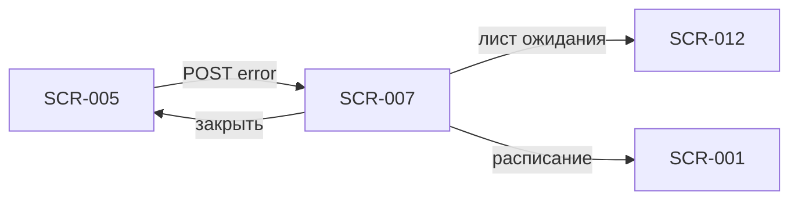

# SCR-007 — Ошибка записи

| Поле | Значение |
| :-- | :-- |
| **ID** | SCR-007 |
| **Тип** | Dialog / modal |
| **Приоритет** | Must |
| **Связь** | UC-002; FR-006; Q 1.3, 2.4 |

## Назначение

Информировать клиента об отказе бронирования после submit на SCR-005. Покрывает гонку за последнее место, лимит одной записи в день и исчерпание проката. Закрывает неуспешную ветку FR-006 без потери контекста формы.

## Точки входа

- **SCR-005** — ошибка `POST /bookings` (409, 422 или доменные коды отказа).
- Реже — сетевая ошибка после retry (5xx, timeout).

## Точки выхода

| Действие | Куда |
| :-- | :-- |
| «К расписанию» | SCR-001 (закрыть modal + pop до расписания или reset stack) |
| «В лист ожидания» | SCR-012 (только при ошибке `NO_SPOTS` / мест нет) |
| «Понятно» / закрытие (X) | Остаётся SCR-005 с сохранёнными данными формы |
| «Повторить» (сеть) | Повторный `POST /bookings` на SCR-005 |

## Структура экрана

Modal поверх SCR-005 (форма видна затемнённой под modal):

```
┌─────────────────────────────────┐
│            ✕                    │
│                                 │
│     [ иконка предупреждения ]   │
│                                 │
│     {Заголовок по типу ошибки}  │
│                                 │
│     {Поясняющий текст}          │
│                                 │
│  [ В лист ожидания ]  (если нет мест) │
│  [ К расписанию ]     (primary) │
│  [ Понятно ]          (secondary)│
└─────────────────────────────────┘
```

Компактный dialog по центру; на маленьких экранах — bottom sheet с тем же содержимым.

## Элементы UI

| Элемент | Описание | Обязательность |
| :-- | :-- | :--: |
| Кнопка закрытия (✕) | Закрывает modal, форма под ним сохранена | Must |
| Иконка | Предупреждение (не error-red паника — скорее нейтральный amber) | Must |
| Заголовок | Зависит от `errorCode` (см. состояния) | Must |
| Текст пояснения | 1–2 предложения, конкретная причина | Must |
| CTA «К расписанию» | Primary для большинства сценариев | Must |
| CTA «В лист ожидания» | Только когда мест нет (`NO_SPOTS`) | Must |
| CTA «Понятно» | Закрыть modal, остаться на форме (изменить снаряжение / повторить) | Should |
| CTA «Повторить» | При сетевой ошибке | Should |

## Состояния

| `errorCode` (API) | Заголовок | Текст | CTA |
| :-- | :-- | :-- | :-- |
| `NO_SPOTS` | Мест больше нет | Пока вы оформляли запись, последнее место заняли. Выберите другой слот или встаньте в лист ожидания. | «В лист ожидания», «К расписанию» |
| `BOOKING_LIMIT_PER_DAY` | Уже есть запись на этот день | Можно записаться не более одного раза в день. Отмените текущую запись или выберите другой день. | «К расписанию», «Мои записи» (опционально) |
| `RENTAL_UNAVAILABLE` | Прокат закончился | Скальники или страховочные системы на это время разобрали. Выберите другой слот или приходите со своим снаряжением на другое время. | «К расписанию», «Понятно» |
| `SLOT_CANCELLED` | Тренировка отменена | Этот слот больше недоступен. | «К расписанию» |
| `NETWORK_ERROR` | Не удалось записаться | Проверьте подключение к интернету и попробуйте снова. | «Повторить», «К расписанию» |
| Generic | Не удалось записаться | Попробуйте ещё раз или выберите другой слот. | «Понятно», «К расписанию» |

## Сценарии и переходы

1. **Гонка за место:** два клиента на последнее место → первый успех, второй `NO_SPOTS` → modal → «В лист ожидания» → SCR-012 или «К расписанию» → SCR-001.
2. **Лимит 1 запись/день:** клиент уже записан утром, вечером пытается снова → `BOOKING_LIMIT_PER_DAY` → «К расписанию» или переход в SCR-008.
3. **Прокат кончился на submit:** выбран прокат, фонд исчерпан между SCR-004 и POST → `RENTAL_UNAVAILABLE` → «Понятно» (вернуться на форму, переключить на «Со своим») или «К расписанию».
4. **Сеть:** timeout → «Повторить» на SCR-005 без потери полей.
5. **Закрытие modal:** «Понятно» / ✕ → SCR-005 с теми же данными; клиент может изменить прокат и отправить снова (если ошибка не `BOOKING_LIMIT_PER_DAY`).



## Данные с API

Ответ ошибки `POST /bookings`:

| Поле | Использование |
| :-- | :-- |
| `errorCode` | Выбор текста и набора CTA |
| `message` | Fallback-текст, если код неизвестен |
| `slotId` | Для перехода в SCR-012 с предзаполненным слотом |
| `details.rentalItem` | Уточнение в тексте `RENTAL_UNAVAILABLE` («скальники» / «страховка») |

Клиент **не** интерпретирует бизнес-логику сам — полагается на код ответа бэкенда (R-004, NFR-003).

## Правила и ограничения

- Modal **не уничтожает** форму SCR-005 под собой — данные сохраняются (FR-006).
- При `NO_SPOTS` обязательно предложить **лист ожидания** (Q 1.4), не только «вернуться».
- Лимит **1 запись в день** (Q 1.3) — отдельный понятный текст, без технического жаргона.
- Прокат исчерпан (Q 2.4) — не винить клиента; предложить альтернативы.
- Не показывать этот modal при ошибках валидации полей — только inline на SCR-005.
- Двойное бронирование одного места исключено бэкендом — UI корректно показывает отказ (R-004).
- После «К расписанию» желательно обновить список слотов (pull-to-refresh / invalidate cache), чтобы `freeSpots` актуализировались.

## Заметки для дизайнера

- Modal — **не** полноэкранная ошибка; форма остаётся в контексте, клиент понимает, что попытка не удалась, а не что «всё сломалось».
- Заголовки короткие; основная информация — в теле текста.
- Для `NO_SPOTS`: primary «В лист ожидания», secondary «К расписанию» — лист ожидания приоритетнее удержания клиента (Q 1.4).
- Для `BOOKING_LIMIT_PER_DAY`: можно добавить ссылку «Посмотреть мою запись» → SCR-008/SCR-009.
- Иконка — warning, не красный крестик (ситуация штатная, не системный сбой).
- Затемнение фона 40–60 %; tap outside закрывает modal (= «Понятно»).
- Accessibility: focus trap внутри modal; озвучка заголовка при открытии.
- Тексты на русском, без кодов ошибок в UI (`NO_SPOTS` не показывать пользователю).
