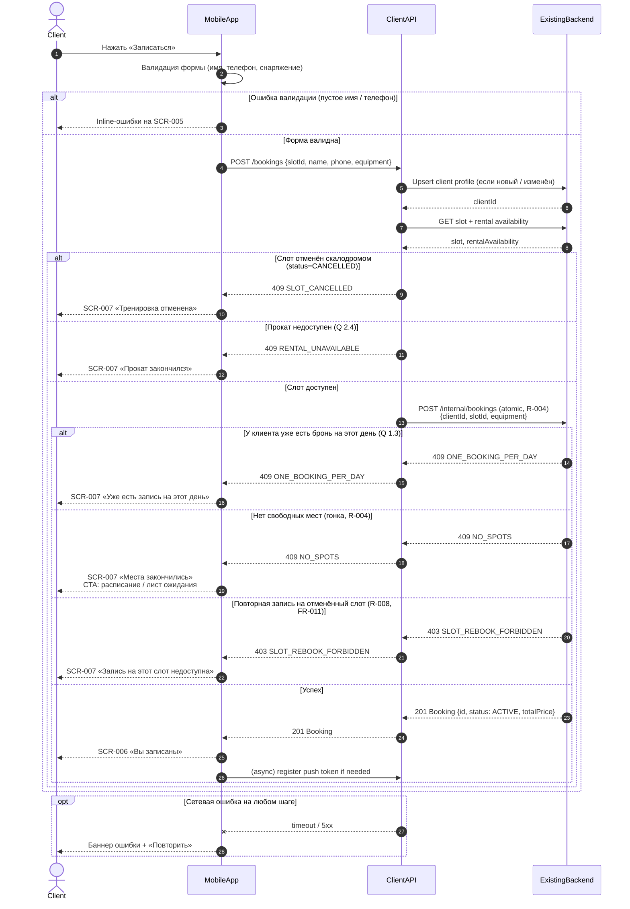

# API Sequence — createBooking

> Этап проектирования. Источники: [data-model.md](data-model.md), UC-002, FR-005–006, R-004; [customer-questions.md](../1-elicitation/customer-questions.md) (Q 1.1, 1.3, 2.4).
>
> Диаграмма описывает поток **создания брони** из клиентского приложения через Client API в Existing Backend.

---

## 1. Участники

| Участник | Описание |
| :-- | :-- |
| **Client** | Пользователь (клиент скалодрома) |
| **MobileApp** | Клиентское мобильное приложение (SCR-005 → SCR-006 / SCR-007) |
| **ClientAPI** | API слоя клиентского приложения (контракт для mobile) |
| **ExistingBackend** | Существующий бэкенд скалодрома — black-box, источник истины (R-004) |

---

## 2. Предусловия

- Клиент выбрал слот с `free_spots > 0` и `status = OPEN` (UC-002).
- На SCR-005 заполнены контакты и выбор снаряжения.

---

## 3. Диаграмма последовательности (с ветками)



---

## 4. Описание шагов

### 4.1. Локальная валидация (MobileApp)

| Шаг | Проверка | Результат |
| :-- | :-- | :-- |
| Имя | Непустое (Q 1.1) | Ошибка на SCR-005 |
| Телефон | Формат +7, 10 цифр | Ошибка на SCR-005 |
| Прокат | При `mode=RENTAL` — хотя бы один чекбокс | Ошибка на SCR-005 |

### 4.2. Upsert профиля (ClientAPI → Backend)

- Если первый визит или изменены контакты — сохранить `Client.name`, `Client.phone` (FR-016).
- Возвращает `clientId` для привязки брони.

### 4.3. Pre-check слота (опционально, ClientAPI)

- Повторное чтение `Slot` и `RentalAvailability` перед атомарным create.
- Ранний отказ без транзакции бронирования при `CANCELLED` или `!is_bookable`.

### 4.4. Атомарное создание (ExistingBackend, R-004)

Бэкенд в одной транзакции:
1. Блокирует слот.
2. Проверяет `free_spots > 0`.
3. Проверяет лимит 1 бронь/день на клиента (Q 1.3).
4. Проверяет запрет повторной записи на `CANCELLED` слот (R-008).
5. Проверяет прокатный фонд при `equipment.mode = RENTAL`.
6. Создаёт `Booking` со статусом `ACTIVE`, уменьшает `free_spots`.

---

## 5. Коды ответов Client API

| HTTP | Код | Условие | UI |
| :--: | :-- | :-- | :-- |
| 201 | — | Бронь создана | SCR-006 |
| 400 | `VALIDATION_ERROR` | Невалидное тело запроса | SCR-005 inline |
| 403 | `SLOT_REBOOK_FORBIDDEN` | Слот ранее отменён скалодромом | SCR-007 |
| 409 | `NO_SPOTS` | Мест нет (гонка) | SCR-007 + waitlist CTA |
| 409 | `ONE_BOOKING_PER_DAY` | Уже есть бронь на дату | SCR-007 |
| 409 | `SLOT_CANCELLED` | Слот отменён | SCR-007 |
| 409 | `RENTAL_UNAVAILABLE` | Прокат исчерпан | SCR-007 |
| 5xx / timeout | `SERVER_ERROR` | Ошибка бэкенда / сеть | Retry на SCR-005 |

---

## 6. Тело запроса POST /bookings

```json
{
  "slotId": "uuid",
  "client": {
    "name": "Иван",
    "phone": "+79001234567"
  },
  "equipment": {
    "mode": "RENTAL",
    "rentalShoes": true,
    "rentalHarness": false
  }
}
```

## 7. Тело ответа 201 Created

```json
{
  "id": "uuid",
  "slotId": "uuid",
  "status": "ACTIVE",
  "totalPrice": 1200.00,
  "equipment": {
    "mode": "RENTAL",
    "rentalShoes": true,
    "rentalHarness": false
  },
  "createdAt": "2026-07-03T10:00:00+03:00"
}
```

---

## 8. Связанные сценарии

| Сценарий | Документ |
| :-- | :-- |
| Отмена брони клиентом | UC-004, FR-008 |
| Лист ожидания (альтернатива при NO_SPOTS) | UC-002 alt, SCR-012 |
| Отмена скалодромом (обратный поток) | UC-005, FR-009–010 |
