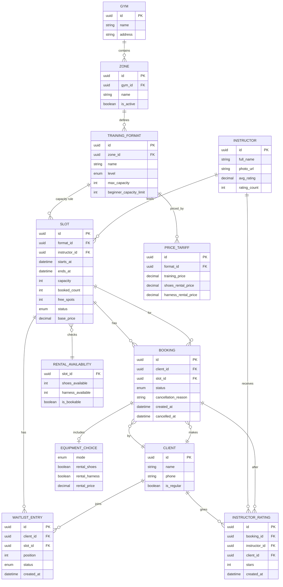
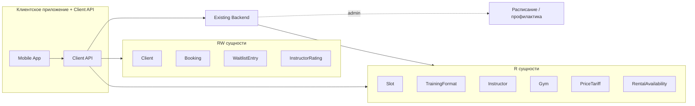

# Модель данных — скалодром «Вертикаль»

> Этап проектирования. Источники: [domain-description.md](../1-elicitation/domain-description.md), [2-requirements/](../2-requirements/), [customer-questions.md](../1-elicitation/customer-questions.md), [brief-climbing.md](../0-customer-brief/brief-climbing.md) (R-004, R-008, R-015, R-027).
>
> Каноническая схема для клиентского контура — **контракт API** (R-015). Бэкенд скалодрома — источник истины для расписания и атомарности бронирования (R-004).

---

## 1. ER-диаграмма

---

## 2. Матрица доступа клиентского приложения

Обозначения:
- **R** — только чтение (данные приходят из бэкенда, приложение не изменяет)
- **RW** — чтение и запись через Client API (приложение инициирует изменение)

| Сущность | Доступ | Кто владеет данными | Операции клиента |
| :-- | :--: | :-- | :-- |
| **Gym** (скалодром) | **R** | Бэкенд / админка | Просмотр названия, адреса |
| **Zone** (зона) | **R** | Бэкенд / админка | Просмотр в составе слота |
| **TrainingFormat** (формат) | **R** | Бэкенд / админка | Просмотр; лимит 8/16 — правило формата (Q 2.1) |
| **Instructor** (инструктор) | **R** | Бэкенд / админка | Просмотр, фильтр; рейтинг — агрегат из оценок |
| **Slot** (слот) | **R** | Бэкенд / админка | Просмотр расписания; `free_spots` обновляет бэкенд при бронировании |
| **RentalAvailability** (прокатный фонд) | **R** | Бэкенд / админка | Проверка доступности проката на слот (R-015, Q 2.4) |
| **PriceTariff** (тариф) | **R** | Бэкенд / админка | Отображение цены (Q 7.1) |
| **Client** (клиент / профиль) | **RW** | Client API + бэкенд | Создание при первой записи (имя, телефон — Q 1.1); обновление контактов |
| **Booking** (бронь) | **RW** | Client API + бэкенд | **Создание** записи; **отмена** клиентом; чтение своих броней |
| **EquipmentChoice** (выбор снаряжения) | **RW** | Часть Booking | Задаётся при создании брони (Q 2.3); не отдельная сущность в API |
| **WaitlistEntry** (лист ожидания) | **RW** | Client API + бэкенд | Вступление / выход из очереди (Q 1.4) |
| **InstructorRating** (оценка) | **RW** | Client API + бэкенд | **Создание** после посещённой тренировки (FR-012, Q 5.1–5.2) |

**Изменяются только бэкендом** (клиент лишь получает обновления):
- Статус слота при профилактике / отмене скалодромом
- Статус брони → `CANCELLED_BY_GYM` + `cancellation_reason` (R-008)
- Статус брони → `ATTENDED` после тренировки
- `booked_count` / `free_spots` слота

---

## 3. Описание сущностей

### 3.1. Gym (скалодром)

| Поле | Тип | Описание |
| :-- | :-- | :-- |
| `id` | UUID | Идентификатор |
| `name` | string | Название («Вертикаль») |
| `address` | string | Адрес площадки (R-015) |

**Доступ:** R · **Источник:** domain §2

---

### 3.2. Zone (зона)

| Поле | Тип | Описание |
| :-- | :-- | :-- |
| `id` | UUID | Идентификатор |
| `gym_id` | UUID FK | Ссылка на скалодром |
| `name` | string | Название зоны (болдеринг, трассы) |
| `is_active` | boolean | Зона доступна; `false` при профилактике |

**Доступ:** R · **Связи:** Gym 1—N Zone · **Источник:** domain §2, §5.6

---

### 3.3. TrainingFormat (формат тренировки)

| Поле | Тип | Описание |
| :-- | :-- | :-- |
| `id` | UUID | Идентификатор |
| `zone_id` | UUID FK | Зона проведения |
| `name` | string | Название формата |
| `level` | enum | `BEGINNER` \| `INTERMEDIATE` \| `ADVANCED` — для фильтра (Q 1.6) |
| `max_capacity` | int | Лимит группы (до 16) |
| `beginner_capacity_limit` | int | Лимит для новичкового формата (8) — **правило по формату** (Q 2.1) |

**Доступ:** R · **Связи:** Zone 1—N Format · **Источник:** domain §2–3, Q 2.1

---

### 3.4. Instructor (инструктор)

| Поле | Тип | Описание |
| :-- | :-- | :-- |
| `id` | UUID | Идентификатор |
| `full_name` | string | ФИО |
| `photo_url` | string? | Фото |
| `avg_rating` | decimal | Средний рейтинг (публичный, Q 5.3) |
| `rating_count` | int | Число оценок |

**Доступ:** R · **Связи:** Instructor 1—N Slot · **Источник:** domain §2, FR-014

---

### 3.5. Slot (слот / тренировка)

| Поле | Тип | Описание |
| :-- | :-- | :-- |
| `id` | UUID | Идентификатор |
| `format_id` | UUID FK | Формат тренировки |
| `instructor_id` | UUID FK | Инструктор |
| `starts_at` | datetime | Начало (~1,5 ч до `ends_at`) |
| `ends_at` | datetime | Окончание |
| `capacity` | int | Вместимость (8 или 16 по формату) |
| `booked_count` | int | Занято мест |
| `free_spots` | int | Свободно мест (`capacity - booked_count`) |
| `status` | enum | `OPEN` \| `FULL` \| `CANCELLED` \| `UNAVAILABLE` |
| `base_price` | decimal | Базовая цена тренировки |

**Доступ:** R (клиент); изменение счётчиков и статуса — бэкенд · **Источник:** domain §2–3, FR-001–003, R-027

**Правила:**
- `status = CANCELLED` — слот отменён скалодромом; повторная запись запрещена (R-008, FR-011)
- `status = UNAVAILABLE` — прокатный фонд исчерпан (Q 2.4)

---

### 3.6. RentalAvailability (доступность проката на слот)

| Поле | Тип | Описание |
| :-- | :-- | :-- |
| `slot_id` | UUID FK | Слот |
| `shoes_available` | int | Свободно пар скальников |
| `harness_available` | int | Свободно страховочных систем |
| `is_bookable` | boolean | Можно ли записаться с учётом проката |

**Доступ:** R · **Источник:** R-015, Q 2.4

---

### 3.7. PriceTariff (тариф)

| Поле | Тип | Описание |
| :-- | :-- | :-- |
| `id` | UUID | Идентификатор |
| `format_id` | UUID FK | Формат |
| `training_price` | decimal | Цена тренировки |
| `shoes_rental_price` | decimal | Прокат скальников |
| `harness_rental_price` | decimal | Прокат страховки |

**Доступ:** R · **Источник:** R-015, Q 7.1

---

### 3.8. Client (клиент)

| Поле | Тип | Описание |
| :-- | :-- | :-- |
| `id` | UUID | Идентификатор |
| `name` | string | Имя (Q 1.1) |
| `phone` | string | Телефон (Q 1.1) |
| `is_regular` | boolean | Метка постоянного клиента (Q 7.2) |

**Доступ:** RW · **Источник:** domain §2, FR-016, Q 1.1, 7.2

---

### 3.9. Booking (бронь)

| Поле | Тип | Описание |
| :-- | :-- | :-- |
| `id` | UUID | Идентификатор |
| `client_id` | UUID FK | Клиент |
| `slot_id` | UUID FK | Слот |
| `status` | enum | См. таблицу статусов ниже |
| `cancellation_reason` | string? | Причина при отмене скалодромом (R-008) |
| `equipment` | EquipmentChoice | Вложенный выбор снаряжения |
| `total_price` | decimal | Расчётная сумма к оплате на месте |
| `created_at` | datetime | Время создания |
| `cancelled_at` | datetime? | Время отмены |

**Статусы `Booking.status`:**

| Значение | Описание | Кто устанавливает |
| :-- | :-- | :-- |
| `ACTIVE` | Запись подтверждена | Client API / бэкенд при create |
| `CANCELLED_BY_CLIENT` | Отменена клиентом | Client API при cancel |
| `CANCELLED_BY_GYM` | Отменена скалодромом | Бэкенд (профилактика, R-008) |
| `ATTENDED` | Тренировка посещена | Бэкенд после занятия |
| `WAITLIST` | В листе ожидания | Client API при join waitlist |

**Доступ:** RW · **Источник:** domain §2–3, FR-005–011

**Правила:**
- Не более **1 активной брони в день** на клиента (Q 1.3)
- При отмене клиентом за ≥1 ч место освобождается сразу (Q 3.2, 3.4)

---

### 3.10. EquipmentChoice (выбор снаряжения)

Вложенный объект в `Booking`, не отдельная таблица в клиентском API.

| Поле | Тип | Описание |
| :-- | :-- | :-- |
| `mode` | enum | `OWN` \| `RENTAL` |
| `rental_shoes` | boolean | Прокат скальников |
| `rental_harness` | boolean | Прокат страховки |

**Доступ:** RW (при создании брони) · **Источник:** domain §2, FR-005, Q 2.3

---

### 3.11. WaitlistEntry (лист ожидания)

| Поле | Тип | Описание |
| :-- | :-- | :-- |
| `id` | UUID | Идентификатор |
| `client_id` | UUID FK | Клиент |
| `slot_id` | UUID FK | Заполненный слот |
| `position` | int | Позиция в очереди |
| `status` | enum | `WAITING` \| `NOTIFIED` \| `CONVERTED` \| `LEFT` |
| `created_at` | datetime | Время вступления |

**Доступ:** RW · **Источник:** Q 1.4, 6.1, 10.1

---

### 3.12. InstructorRating (оценка инструктора)

| Поле | Тип | Описание |
| :-- | :-- | :-- |
| `id` | UUID | Идентификатор |
| `booking_id` | UUID FK | Бронь после посещения |
| `instructor_id` | UUID FK | Инструктор |
| `client_id` | UUID FK | Клиент |
| `stars` | int | 1–5 (Q 5.2) |
| `created_at` | datetime | Время оценки |

**Доступ:** RW (только create клиентом) · **Источник:** domain §2, FR-012, Q 5.1–5.3

**Правила:** только после `Booking.status = ATTENDED`; одна оценка на бронь; срок без ограничений (Q 5.1)

---

## 4. Ключевые связи и кардинальности

| Связь | Кардинальность | Комментарий |
| :-- | :-- | :-- |
| Gym → Zone | 1:N | |
| Zone → TrainingFormat | 1:N | |
| TrainingFormat → Slot | 1:N | Лимит вместимости на уровне формата |
| Instructor → Slot | 1:N | |
| Client → Booking | 1:N | Макс. 1 ACTIVE в день (Q 1.3) |
| Slot → Booking | 1:N | Атомарная проверка мест (R-004) |
| Client → WaitlistEntry | 1:N | Один клиент — одна позиция на слот |
| Booking → InstructorRating | 1:0..1 | Оценка после посещения |
| Instructor → InstructorRating | 1:N | Агрегируется в `avg_rating` |

---

## 5. Граница Client API ↔ Existing Backend

**Existing Backend** создаёт и изменяет: Slot, Zone, TrainingFormat, Instructor, расписание, отмены скалодромом, статус `ATTENDED`.

**Client API** создаёт и изменяет: Client (profile), Booking, WaitlistEntry, InstructorRating; проксирует чтение остальных сущностей.
