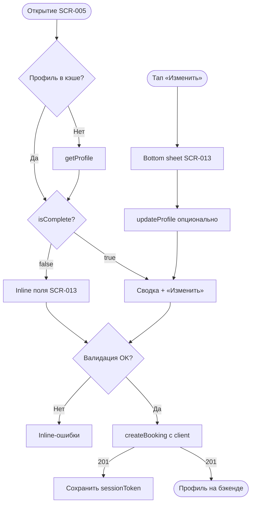

# LOGIC-001 — Контактный профиль

**ID:** LOGIC-001  
**Тип:** Логика  
**Приоритет:** Critical  
**Статус:** Актуален

---

## Обзор

Управление контактными данными клиента (имя, телефон) при первой записи и при редактировании
на [SCR-005](../../3-design-brief/screens/SCR-005-booking-form.md) / [SCR-013](../../3-design-brief/screens/SCR-013-contact-profile.md). Отдельного экрана
входа и вкладки «Профиль» в MVP нет (Q 1.1). Идентификация достаточна именем и телефоном;
после upsert бэкенд выдаёт `sessionToken` для последующих запросов с `ClientSession`.

---

## Точки применения

| Экран | Элемент/Триггер |
|-------|-----------------|
| [SCR-005](../../3-design-brief/screens/SCR-005-booking-form.md) | Открытие формы, валидация перед submit, inline-секция контактов |
| [SCR-013](../../3-design-brief/screens/SCR-013-contact-profile.md) | Поля имя/телефон, бейдж «Постоянный клиент», sheet «Изменить» |

---

## Флоу

---

## Описание логики

### Режимы отображения

| Условие | UI |
|---------|-----|
| `isComplete = false` или 404 `getProfile` | Inline-поля «Имя» и «Телефон» на SCR-005 |
| `isComplete = true` | Сводка «{name} · +7 XXX ***-XX-XX» + ссылка «Изменить» |
| `isRegularClient = true` | Бейдж «Постоянный клиент» (только отображение, Q 7.2) |

### Валидация

| Поле | Правило | Сообщение |
|------|---------|-----------|
| Имя | Непустое, 2–50 символов после trim | «Укажите имя» |
| Телефон | Паттерн `^\+7\d{10}$` (Q 1.1) | «Введите корректный номер» |

Валидация выполняется:
1. **Локально** на SCR-005 перед отправкой `createBooking`.
2. **На сервере** — 400 `VALIDATION_ERROR` с `details[].field` (`client.name`, `client.phone`).

### Маска телефона

- Отображение: `+7 (XXX) XXX-XX-XX`.
- Хранение / API: нормализованный `+79001234567`.
- Автоподстановка `+7`; поддержка вставки из буфера с нормализацией.

### Сохранение профиля

Два допустимых пути (не взаимоисключающих):

1. **Явный:** `updateProfile` при «Сохранить» в bottom sheet SCR-013.
2. **Неявный:** upsert в составе `createBooking` (api-sequence §4.2) — Client API сохраняет
   `Client.name`, `Client.phone` при первой записи или изменении контактов.

UI **обязан** гарантировать валидные контакты до `createBooking`. После первого успешного ответа
201 — сохранить `sessionToken` из `CreateBookingResponse` (или из `UpdateProfileResponse`).

### Офлайн

Если профиль не сохранён на сервере и нет сети — submit `createBooking` блокируется с сообщением
о необходимости подключения.

---

## Входные / выходные данные

| Параметр | Тип | Направление | Описание |
|----------|-----|-------------|----------|
| `profile.name` | string | in/out | Имя клиента |
| `profile.phone` | string | in/out | Телефон `+7XXXXXXXXXX` |
| `profile.isComplete` | boolean | in | Режим inline vs сводка |
| `profile.isRegularClient` | boolean | in | Показ бейджа |
| `client` | `ClientContacts` | out | Тело `createBooking.client` |
| `sessionToken` | string | out | JWT после upsert (локальное хранение) |

---

## Связанные требования

| ID | Описание |
|----|----------|
| FR-005 | Запись с контактными данными |
| FR-016 | Операции профиля через API |
| Q 1.1 | Имя + телефон достаточно для идентификации |
| Q 1.2 | Клиент записывает только себя |
| Q 7.2 | Бейдж постоянного клиента без привилегий |
| Q 9.3 | Сообщения на русском |

**API:** [../api/openapi.yaml](../api/openapi.yaml) → `getProfile`, `updateProfile`, `createBooking`

---

## Критерии приёмки

| ID | Критерий |
|----|----------|
| AC-L-001 | **Дано** пустой профиль (`isComplete = false`), **Когда** первая запись, **Тогда** требуются имя и телефон, CTA disabled до валидности. |
| AC-L-002 | **Дано** невалидный телефон, **Когда** submit, **Тогда** inline-ошибка «Введите корректный номер», `createBooking` не уходит. |
| AC-L-003 | **Дано** `isComplete = true`, **Когда** открыт SCR-005, **Тогда** сводка контактов вместо пустых полей. |
| AC-L-004 | **Дано** `isRegularClient = true`, **Когда** отображается секция, **Тогда** бейдж виден, цена и приоритет записи не меняются. |
| AC-L-005 | **Дано** первая успешная запись, **Когда** `createBooking` → 201, **Тогда** `sessionToken` сохранён локально для `ClientSession`. |
| AC-L-006 | **Дано** правка в sheet, **Когда** «Сохранить», **Тогда** вызывается `updateProfile` (PATCH `/profile`), сводка обновлена. |
