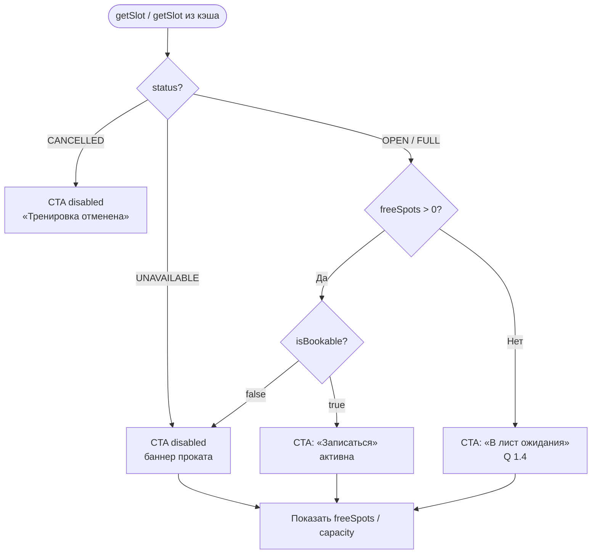

# LOGIC-002 — Доступность слота

**ID:** LOGIC-002  
**Тип:** Логика  
**Приоритет:** Critical  
**Статус:** Актуален

---

## Обзор

Определяет доступность слота для записи или листа ожидания на основе полей `SlotDetail` / `SlotSummary` из API (`getSlot`, `listSlots`). Учитывает свободные места (`freeSpots`), статус слота (`status`), флаг записи (`isBookable`) и доступность проката (`rentalAvailable`, `rentalAvailability.isBookable`) — Q 2.4, R-008.

---

## Точки применения

| Экран | Элемент/Триггер |
|-------|-----------------|
| [SCR-004](../../3-design-brief/screens/SCR-004-slot-detail.md) | CTA «Записаться» / «В лист ожидания», баннер проката, счётчик мест |
| [SCR-005](../../3-design-brief/screens/SCR-005-booking-form.md) | Pre-check перед submit `createBooking` |
| [SCR-012](../../3-design-brief/screens/SCR-012-waitlist.md) | Доступность листа ожидания при `freeSpots = 0` |

---

## Флоу

---

## Описание логики

### Источник данных

Поля из схемы OpenAPI `SlotSummary` / `SlotDetail`:

| Поле | Тип | Назначение |
|------|-----|------------|
| `freeSpots` | int | Число свободных мест в группе |
| `capacity` | int | Максимальная вместимость (8 для новичкового формата, до 16 — из API) |
| `status` | SlotStatus | `OPEN`, `FULL`, `CANCELLED`, `UNAVAILABLE` |
| `isBookable` | boolean | Итоговая доступность записи с учётом проката |
| `rentalAvailable` | boolean | Алиас для UI: можно ли записаться с прокатом |
| `rentalAvailability.isBookable` | boolean | Детальная проверка прокатного фонда |

**Спецификация:** [../../api/openapi.yaml](../../api/openapi.yaml) → `getSlot`, схемы `SlotDetail`, `SlotStatus`, `RentalAvailability`.

### Правила CTA на SCR-004

| Условие | UI |
|---------|-----|
| `status = CANCELLED` | Пометка «Тренировка отменена»; обе CTA disabled (R-008, FR-011) |
| `freeSpots = 0` и `status ≠ CANCELLED` | CTA **«В лист ожидания»** активна; «Записаться» скрыта (Q 1.4) |
| `freeSpots > 0` и `isBookable = true` и `status = OPEN` | CTA **«Записаться»** активна |
| `isBookable = false` или `rentalAvailable = false` или `status = UNAVAILABLE` | Баннер «Прокат на это время закончился. Запись недоступна»; «Записаться» **disabled** (Q 2.4) |
| `freeSpots ≤ 2` при доступной записи | Опционально: акцент «Осталось N мест» (Should) |

### Отображение мест

- Формат: **«Свободно X из Y»**, где `X = freeSpots`, `Y = capacity`.
- Значения **только из API** — не хардкодить лимиты 8/16 в UI.
- На SCR-001 карточке: «N мест» / бейдж «Мест нет» при `freeSpots = 0`.

### Pre-check на SCR-005

Перед `createBooking` клиент повторно запрашивает `getSlot` (api-sequence §4.3). Если `isBookable = false` или `freeSpots = 0` — блокировать submit и показать актуальное сообщение (переход на SCR-007 при ошибке API).

### Ошибки бронирования (связанные коды)

| ErrorCode | Смысл |
|-----------|-------|
| `NO_SPOTS` | Места закончились между просмотром и записью |
| `SLOT_CANCELLED` | Слот отменён скалодромом |
| `RENTAL_UNAVAILABLE` | Прокатный фонд исчерпан |
| `SLOT_REBOOK_FORBIDDEN` | Повторная запись на отменённый слот |

---

## Входные / выходные данные

| Параметр | Тип | Направление | Описание |
|----------|-----|-------------|----------|
| `slotId` | uuid | Вход | Идентификатор слота |
| `freeSpots` | int | Вход (API) | Свободные места |
| `capacity` | int | Вход (API) | Вместимость |
| `status` | SlotStatus | Вход (API) | Статус слота |
| `isBookable` | boolean | Вход (API) | Флаг доступности записи |
| `rentalAvailable` | boolean | Вход (API) | Доступность проката для UI |
| `ctaType` | enum | Выход | `book` \| `waitlist` \| `disabled` |
| `bannerMessage` | string? | Выход | Текст баннера при блокировке |
| `spotsLabel` | string | Выход | «Свободно X из Y» или «N мест» |

---

## Связанные требования

| ID | Описание |
|----|----------|
| FR-005 | Переход к записи при наличии мест |
| FR-011 | Блокировка записи на отменённый слот |
| Q 1.4 | Лист ожидания при `freeSpots = 0` |
| Q 2.4 | Блокировка при исчерпанном прокате |
| R-008 | Отмена слота скалодромом (`CANCELLED`) |
| UC-002 | Выбор слота перед записью |

---

## Критерии приёмки

| ID | Критерий |
|----|----------|
| AC-L-001 | **Дано** `getSlot` вернул `freeSpots = 0` и `status = FULL`, **Когда** отображается SCR-004, **Тогда** активна CTA «В лист ожидания», «Записаться» скрыта. |
| AC-L-002 | **Дано** `freeSpots > 0`, `isBookable = true`, `status = OPEN`, **Когда** отображается SCR-004, **Тогда** CTA «Записаться» активна. |
| AC-L-003 | **Дано** `rentalAvailable = false` или `isBookable = false`, **Когда** отображается SCR-004, **Тогда** «Записаться» disabled и показан баннер о недоступности проката (Q 2.4). |
| AC-L-004 | **Дано** `status = CANCELLED`, **Когда** отображается SCR-004, **Тогда** обе CTA disabled, показана пометка «Тренировка отменена». |
| AC-L-005 | **Дано** слот с `capacity = 8`, `freeSpots = 3`, **Когда** отображается счётчик мест, **Тогда** текст «Свободно 3 из 8» без хардкода лимита. |
