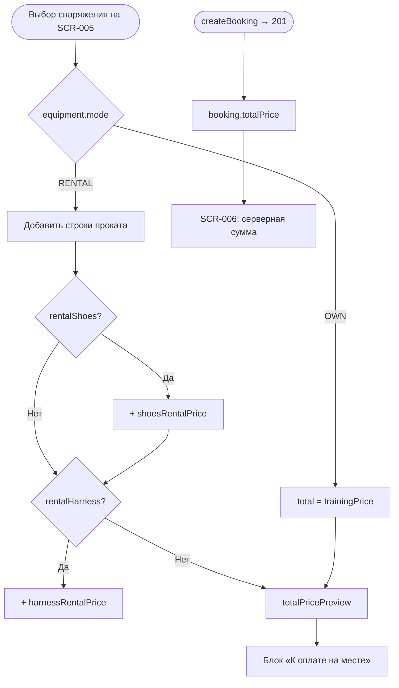

# LOGIC-003 — Расчёт цены брони

**ID:** LOGIC-003  
**Тип:** Логика  
**Приоритет:** High  
**Статус:** Актуален

---

## Обзор

Расчёт и отображение стоимости брони: базовая цена тренировки + позиции проката. Оплата
**на месте** в скалодроме (Q 7.1) — приложение не проводит онлайн-платёж. На SCR-005 показывается
**клиентский превью-расчёт**; после успешного `createBooking` — **серверный** `totalPrice`
(источник истины, R-004).

---

## Точки применения

| Экран | Элемент/Триггер |
|-------|-----------------|
| [SCR-004](../../3-design-brief/screens/SCR-004-slot-detail.md) | Блок базовой цены тренировки |
| [SCR-005](../../3-design-brief/screens/SCR-005-booking-form.md) | Разбивка «Итого», сумма на CTA «Записаться · XXX ₽» |
| [SCR-006](../../3-design-brief/screens/SCR-006-booking-success.md) | «К оплате на месте: XXX ₽» из `booking.totalPrice` |
| [SCR-008](../../3-design-brief/screens/SCR-008-my-bookings.md) | Сумма в карточке брони (если есть) |
| [SCR-009](../../3-design-brief/screens/SCR-009-booking-detail.md) | Детальная разбивка `priceBreakdown` (если есть) |

---

## Флоу



---

## Описание логики

### Формула превью (SCR-005)

```
totalPricePreview =
    trainingPrice
  + (equipment.rentalShoes   ? shoesRentalPrice   : 0)
  + (equipment.rentalHarness ? harnessRentalPrice : 0)
```

Где:
- `trainingPrice` — `slot.price` или `slot.basePrice` или `slot.priceBreakdown.trainingPrice`
- `shoesRentalPrice` — из `slot.priceBreakdown.shoesRentalPrice` (или аналог из API)
- `harnessRentalPrice` — из `slot.priceBreakdown.harnessRentalPrice`

Все значения **только из API** (R-015). Хардкод тарифов запрещён.

### Правила отображения

| Условие | Поведение |
|---------|-----------|
| `equipment.mode = OWN` | Строки проката скрыты; сумма = `trainingPrice` |
| `equipment.mode = RENTAL`, оба чекбокса false | CTA disabled; прокатные строки = 0 |
| `rentalShoes = true` | Строка «Прокат: скальники — XXX ₽» |
| `rentalHarness = true` | Строка «Прокат: страховочная система — XXX ₽» |
| Цена отсутствует в API (`null`) | Блок цены скрыт; подпись «Оплата на месте» остаётся |
| После 201 | Показывать `booking.totalPrice`; **не** пересчитывать на клиенте |

### Серверный расчёт

Бэкенд возвращает итог в `CreateBookingResponse.totalPrice` и опционально `priceBreakdown`
(`PriceBreakdown` в [schemas.yaml](../api/components/schemas.yaml)). Клиент принимает серверную
сумму как финальную на SCR-006 и далее.

На цену проката влияет **незначительно** (Q 2.3) — показывать в разбивке без акцента.

### Подпись UI

Обязательная информационная строка: «Оплата на месте в скалодроме» (Q 7.1).

---

## Входные / выходные данные

| Параметр | Тип | Описание |
|----------|-----|----------|
| `slot.price` / `slot.basePrice` | decimal? | Базовая цена тренировки |
| `slot.priceBreakdown` | `PriceBreakdown` | Разбивка из `getSlot` |
| `equipment.mode` | `OWN` \| `RENTAL` | Режим снаряжения |
| `equipment.rentalShoes` | boolean | Прокат скальников |
| `equipment.rentalHarness` | boolean | Прокат страховки |
| `totalPricePreview` | decimal | Выход превью для SCR-005 |
| `booking.totalPrice` | decimal | Серверный итог после 201 |

---

## Связанные требования

| ID | Описание |
|----|----------|
| FR-005 | Запись с выбором снаряжения |
| FR-006 | Подтверждение с итоговой суммой |
| Q 2.3 | Клиент сам выбирает позиции проката |
| Q 7.1 | Оплата на месте, показ цены в приложении |
| R-015 | Числа из API, не хардкод |

**API:** [../api/openapi.yaml](../api/openapi.yaml) → `getSlot`, `createBooking` · модель `PriceBreakdown`

---

## Критерии приёмки

| ID | Критерий |
|----|----------|
| AC-L-001 | **Дано** `equipment.mode = OWN`, **Когда** отображается блок цены, **Тогда** сумма = только `trainingPrice`, строки проката скрыты. |
| AC-L-002 | **Дано** `mode = RENTAL`, выбраны скальники и страховка, **Когда** меняется выбор, **Тогда** `totalPricePreview` пересчитывается в реальном времени из полей `slot`. |
| AC-L-003 | **Дано** успешный `createBooking` → 201, **Когда** открыт SCR-006, **Тогда** отображается `booking.totalPrice`, а не `totalPricePreview`. |
| AC-L-004 | **Дано** `slot.price = null`, **Когда** открыт SCR-005, **Тогда** числовой блок скрыт, подпись «Оплата на месте» видна. |
| AC-L-005 | **Дано** тарифы в API, **Когда** реализован расчёт, **Тогда** значения не захардкожены в коде приложения. |
