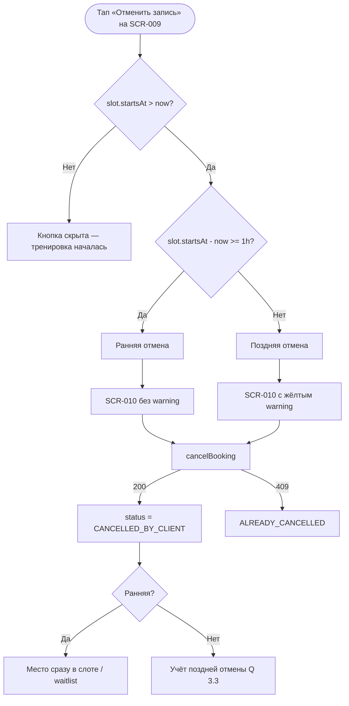

# LOGIC-004 — Отмена: правило 1 часа

**ID:** LOGIC-004  
**Тип:** Логика  
**Приоритет:** Critical  
**Статус:** Актуален

---

## Обзор

Классификация отмены активной брони клиентом на **раннюю** (≥ 1 ч до начала слота) и **позднюю** (< 1 ч до начала). Логика определяет:

- показ предупреждающего блока на [SCR-010](../../3-design-brief/screens/SCR-010-cancel-confirm.md);
- видимость кнопки «Отменить запись» на [SCR-009](../../3-design-brief/screens/SCR-009-booking-detail.md);
- ожидаемое поведение бэкенда при вызове `cancelBooking`.

В MVP: при поздней отмене показывается **предупреждение**, но отмена **не блокируется**; штрафов нет (Q 3.1, 3.2). При ранней отмене место освобождается **сразу** и становится доступным листу ожидания (Q 3.4, FR-008).

---

## Точки применения

| Экран | Элемент/Триггер |
|-------|-----------------|
| [SCR-009](../../3-design-brief/screens/SCR-009-booking-detail.md) | Кнопка «Отменить запись» — видимость при `ACTIVE` и `slot.startsAt > now` |
| [SCR-010](../../3-design-brief/screens/SCR-010-cancel-confirm.md) | Блок предупреждения; расчёт `isLateCancel` |
| [SCR-012](../../3-design-brief/screens/SCR-012-waitlist.md) | Косвенно: ранняя отмена другого клиента освобождает место для очереди |

---

## Флоу



---

## Описание логики

### Входные данные

| Параметр | Тип | Источник | Описание |
|----------|-----|----------|----------|
| `slot.startsAt` | datetime (ISO 8601) | `getBooking` / контекст SCR-009 | Время начала тренировки |
| `now` | datetime | Локальное время устройства (с учётом TZ слота) | Текущий момент |
| `status` | `BookingStatus` | `getBooking` | Должен быть `ACTIVE` |

### Формулы

```
minutesUntilStart = (slot.startsAt - now) в минутах

canCancel = status == ACTIVE AND minutesUntilStart > 0

isEarlyCancel = canCancel AND minutesUntilStart >= 60

isLateCancel = canCancel AND minutesUntilStart < 60
```

### Правила классификации

| Тип | Условие | UI (SCR-010) | Бэкенд (`cancelBooking`) |
|-----|---------|--------------|--------------------------|
| **Недоступна** | `minutesUntilStart <= 0` | Кнопка «Отменить» скрыта на SCR-009 | — |
| **Ранняя** | `minutesUntilStart >= 60` | Модал без жёлтого блока | 200; место освобождается сразу (Q 3.4) |
| **Поздняя** | `0 < minutesUntilStart < 60` | Модал с warning-блоком | 200 в MVP; штрафов нет (Q 3.1); учёт аналитики (Q 3.3) |

### Текст предупреждения (поздняя отмена)

> До начала тренировки осталось меньше часа. Место может не успеть освободиться для других участников.

- Фон: warning (жёлтый), **не** error.
- Без упоминания штрафов и блокировки (Q 3.1).

### Ограничения MVP

| Правило | Описание |
|---------|----------|
| Блокировка | Поздняя отмена **разрешена**; код `403 CANCEL_TOO_LATE` в API зарезервирован, но **не применяется** в MVP |
| Штрафы | Отсутствуют (Q 3.1) |
| Офлайн | Отмена недоступна без сети; кнопка disabled на SCR-009 |
| Повторная отмена | При `409 ALREADY_CANCELLED` — информирование и обновление UI |

### Связь с листом ожидания

При **ранней** отмене (`isEarlyCancel`) освободившееся место немедленно доступно для `joinWaitlist` / push первому в очереди (Q 3.4, [SCR-012](../../3-design-brief/screens/SCR-012-waitlist.md)).

---

## Входные / выходные данные

| Параметр | Тип | Направление | Описание |
|----------|-----|-------------|----------|
| `slot.startsAt` | datetime | Вход | Время начала слота |
| `status` | `BookingStatus` | Вход | Статус брони |
| `isEarlyCancel` | boolean | Выход | `true` если ≥ 60 мин до старта |
| `isLateCancel` | boolean | Выход | `true` если 0 < минут < 60 |
| `canCancel` | boolean | Выход | Можно ли показать кнопку отмены |
| `showWarning` | boolean | Выход | Показывать жёлтый блок на SCR-010 (= `isLateCancel`) |

---

## Связанные требования

| ID | Описание |
|----|----------|
| UC-004 | Отмена записи клиентом |
| FR-008 | Отмена клиентом; освобождение места |
| Q 3.1 | Поздняя отмена — предупреждение, без штрафов |
| Q 3.2 | Порог «заранее» = 1 час |
| Q 3.3 | Учёт поздних отмен для аналитики |
| Q 3.4 | Место сразу доступно при ранней отмене |
| Q 9.3 | Тексты на русском |

**API:** `cancelBooking` — [bookings.yaml](../../api/paths/bookings.yaml)

---

## Критерии приёмки

| ID | Критерий |
|----|----------|
| AC-L-001 | **Дано** до `slot.startsAt` осталось 2 ч и `status == ACTIVE`, **Когда** открывается SCR-010, **Тогда** `isEarlyCancel == true`, жёлтый блок **не** показывается |
| AC-L-002 | **Дано** до `slot.startsAt` осталось 30 мин и `status == ACTIVE`, **Когда** открывается SCR-010, **Тогда** `isLateCancel == true`, показывается warning-блок |
| AC-L-003 | **Дано** `slot.startsAt <= now`, **Когда** клиент на SCR-009, **Тогда** `canCancel == false`, кнопка «Отменить запись» скрыта |
| AC-L-004 | **Дано** поздняя отмена подтверждена в MVP, **Когда** вызван `cancelBooking`, **Тогда** отмена выполняется (200), штраф не применяется |
| AC-L-005 | **Дано** ранняя отмена подтверждена, **Когда** `cancelBooking` успешен, **Тогда** место слота освобождается для листа ожидания (Q 3.4) |
| AC-L-006 | **Дано** клиент на SCR-009 офлайн, **Когда** `status == ACTIVE`, **Тогда** кнопка «Отменить запись» disabled с пояснением «Требуется интернет» |
