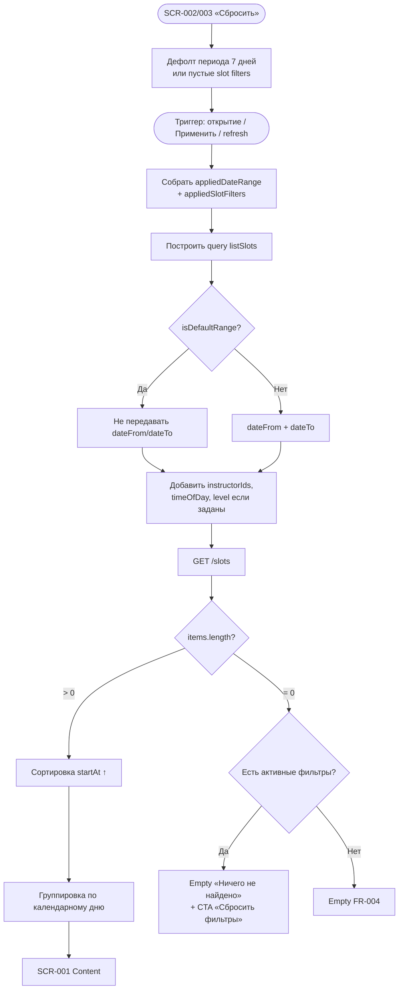

# LOGIC-005 — Фильтрация слотов

**ID:** LOGIC-005  
**Тип:** Логика  
**Приоритет:** High  
**Статус:** Актуален

---

## Обзор

Формирует query-параметры для `listSlots` из состояния фильтров периода ([SCR-002](../../3-design-brief/screens/SCR-002-date-filter.md)) и слотов ([SCR-003](../../3-design-brief/screens/SCR-003-slot-filters.md)), управляет badge активных фильтров на SCR-001, сортировкой и группировкой результата. Фильтр по формату болдеринг/трассы **не входит** в MVP (Q 1.6).

---

## Точки применения

| Экран | Элемент/Триггер |
|-------|-----------------|
| [SCR-001](../../3-design-brief/screens/SCR-001-schedule.md) | Загрузка списка, pull-to-refresh, empty по фильтрам, badge на чипах |
| [SCR-002](../../3-design-brief/screens/SCR-002-date-filter.md) | «Применить» / «Сбросить» — обновление `dateFrom`/`dateTo` |
| [SCR-003](../../3-design-brief/screens/SCR-003-slot-filters.md) | «Применить» / «Сбросить» — обновление `instructorIds`/`timeOfDay`/`level` |

---

## Флоу

---

## Описание логики

### Параметры `listSlots`

**Спецификация:** [../../api/openapi.yaml](../../api/openapi.yaml) → `listSlots`

| Параметр | Источник | По умолчанию | Правило передачи |
|----------|----------|--------------|------------------|
| `dateFrom` | SCR-002 | — (API: today) | Не передаётся при дефолтном периоде 7 дней |
| `dateTo` | SCR-002 | — (API: today + 6) | Не передаётся при дефолтном периоде 7 дней |
| `instructorIds` | SCR-003 | пусто = все | OR внутри группы; не передаётся при `[]` |
| `timeOfDay` | SCR-003 | не задано = все | `morning` / `afternoon` / `evening` |
| `level` | SCR-003 | не задано = все | `beginner` / `intermediate` / `advanced` |

### Комбинация фильтров

- Между группами (период, инструктор, время, уровень) — логика **AND**.
- Внутри группы инструкторов — логика **OR** (слот подходит, если инструктор ∈ `instructorIds`).
- Фильтрация выполняется на **бэкенде**; клиентская фильтрация допустима только как fallback.

### Дефолтный период (R-027)

- При первом входе и после «Сбросить» на SCR-002: `dateFrom`/`dateTo` **не передаются**.
- API возвращает слоты на **7 календарных дней** от текущей даты.
- Чип «Период» на SCR-001: нейтральная подпись «7 дней».

### Badge активных фильтров

Считается число **заполненных категорий** (0–3), не количество выбранных инструкторов:

| Категория | Условие +1 |
|-----------|------------|
| Инструктор | `instructorIds.length > 0` |
| Время суток | `timeOfDay` задан |
| Уровень | `level` задан |

Период ≠ дефолт отображается **отдельным чипом** на SCR-001, не входит в badge «Фильтры».

### Сортировка и группировка (клиент)

1. Сортировка: `startAt` по возрастанию.
2. Группировка: по календарному дню локали скалодрома.
3. Заголовки: «Сегодня, D MMM», «Завтра, D MMM», иначе «День недели, D MMM».
4. Дни без слотов после фильтрации — **не показываются**.

### Персистентность

- Слотовые фильтры **не сбрасываются** при смене периода (SCR-002) и pull-to-refresh.
- Период **не сбрасывается** при смене слотовых фильтров (SCR-003).

### Empty states

| Условие | Текст |
|---------|-------|
| Пустой список, дефолт период и фильтры | «Пока нет доступных тренировок» (FR-004) |
| Пустой список, активны фильтры или кастомный период | «Ничего не найдено» + CTA «Сбросить фильтры» |

---

## Входные / выходные данные

| Параметр | Тип | Направление | Описание |
|----------|-----|-------------|----------|
| `appliedDateRange.dateFrom` | date? | Вход | Начало периода |
| `appliedDateRange.dateTo` | date? | Вход | Конец периода |
| `appliedSlotFilters.instructorIds` | uuid[] | Вход | Выбранные инструкторы |
| `appliedSlotFilters.timeOfDay` | TimeOfDay? | Вход | Фильтр времени суток |
| `appliedSlotFilters.level` | TrainingLevel? | Вход | Фильтр уровня |
| `queryParams` | object | Выход | Параметры для `listSlots` |
| `filterBadgeCount` | int (0–3) | Выход | Число для badge «Фильтры» |
| `groupedSlots` | map | Выход | Слоты, сгруппированные по дню |
| `isDefaultRange` | boolean | Выход | Дефолт 7 дней |

---

## Связанные требования

| ID | Описание |
|----|----------|
| FR-001 | Список слотов на 7 дней по умолчанию |
| FR-002 | Расширение периода через SCR-002 |
| FR-003 | Отображение отфильтрованных слотов |
| FR-004 | Empty state при отсутствии слотов |
| FR-014 | Read-only данные из API |
| Q 1.6 | Фильтры: инструктор, время, уровень (без формата) |
| R-027 | Дефолтный горизонт 7 дней |
| UC-001 | Просмотр и фильтрация расписания |

---

## Критерии приёмки

| ID | Критерий |
|----|----------|
| AC-L-001 | **Дано** клиент нажал «Сбросить» на SCR-002, **Когда** SCR-001 перезагружает список, **Тогда** `dateFrom`/`dateTo` не передаются и API возвращает дефолт **7 дней** (R-027). |
| AC-L-002 | **Дано** выбраны 2 инструктора и `timeOfDay=evening`, **Когда** формируется query, **Тогда** запрос содержит `instructorIds` (OR) и `timeOfDay=evening`, badge = **2**. |
| AC-L-003 | **Дано** выбран только `level=beginner`, **Когда** формируется query, **Тогда** badge = **1**, параметр `level=beginner` передан в `listSlots`. |
| AC-L-004 | **Дано** `listSlots` вернул пустой `items` при активных фильтрах, **Когда** отображается SCR-001, **Тогда** empty «Ничего не найдено» с CTA «Сбросить фильтры». |
| AC-L-005 | **Дано** клиент сменил период в SCR-002, **Когда** список перезагружен, **Тогда** слотовые фильтры SCR-003 сохранены в query. |
| AC-L-006 | **Дано** непустой список слотов, **Когда** отображается SCR-001, **Тогда** слоты отсортированы по `startAt` ↑ и сгруппированы по дням; пустые дни скрыты. |
