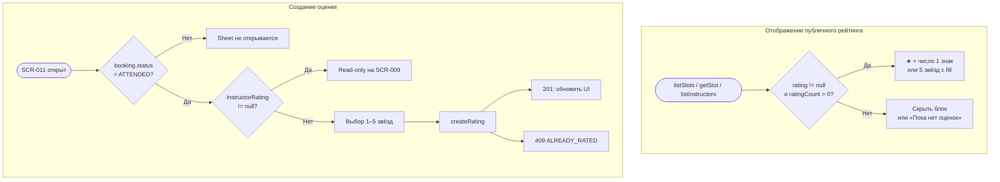

# LOGIC-006 — Оценка инструктора

**ID:** LOGIC-006  
**Тип:** Логика  
**Приоритет:** High  
**Статус:** Актуален

---

## Обзор

Два аспекта: **отображение** публичного агрегированного рейтинга инструктора (`instructor.rating`, `instructor.ratingCount`) на экранах выбора слота (Q 5.3) и **создание** оценки звёздами 1–5 после посещённой тренировки через `createRating` (Q 5.1–5.2, FR-012).

---

## Точки применения

| Экран | Элемент/Триггер |
|-------|-----------------|
| [SCR-001](../../3-design-brief/screens/SCR-001-schedule.md) | Рейтинг на карточке слота — `instructor.rating` |
| [SCR-003](../../3-design-brief/screens/SCR-003-slot-filters.md) | ★ на чипе инструктора — `listInstructors` → `rating` |
| [SCR-004](../../3-design-brief/screens/SCR-004-slot-detail.md) | Карточка инструктора — `rating`, `ratingCount` |
| [SCR-011](../../3-design-brief/screens/SCR-011-rate-instructor.md) | Создание оценки — `createRating` |

---

## Флоу

---

## Описание логики

### Отображение публичного рейтинга (read-only)

**Источники данных:**

| Запрос | Поля | Экраны |
|--------|------|--------|
| `listSlots` | `items[].instructor.rating` | SCR-001 |
| `getSlot` | `instructor.rating`, `instructor.ratingCount` | SCR-004 |
| `listInstructors` | `items[].rating` | SCR-003 |

**Спецификация:** [../../api/openapi.yaml](../../api/openapi.yaml) → `listSlots`, `getSlot`, `listInstructors`; схемы `InstructorSummary`, `InstructorDetail`.

**Правила UI:**

| Контекст | Условие | Отображение |
|----------|---------|-------------|
| SCR-001, SCR-003 | `rating != null` | Компактно: **★ 4.8** (1 знак после запятой) |
| SCR-001, SCR-003 | `rating == null` | Блок рейтинга **скрыт** (без заглушки «—») |
| SCR-004 | `ratingCount > 0` и `rating != null` | 5 звёзд с дробным fill + «4,2 · 28 оценок» |
| SCR-004 | `ratingCount = 0` или `rating == null` | Серые звёзды + текст **«Пока нет оценок»** |

Рейтинг — **публичный агрегат** всех оценок; не персональная оценка текущего клиента.

### Создание оценки (write)

**Спецификация:** [../../api/openapi.yaml](../../api/openapi.yaml) → `createRating`

**Метод:** POST `/ratings`

**Тело `CreateRatingRequest`:**

| Поле | Тип | Описание |
|------|-----|----------|
| `bookingId` | uuid | Бронь посещённой тренировки |
| `instructorId` | uuid | Инструктор из слота брони |
| `stars` | int (1–5) | Оценка звёздами |

**Правила:**

| Правило | Описание |
|---------|----------|
| Условие доступности | `Booking.status = ATTENDED` |
| Формат | Только звёзды 1–5, **без текстового отзыва** (Q 5.2) |
| Срок | Без ограничения по времени после посещения (Q 5.1) |
| Повтор | **Одна оценка на бронь**; `Booking.instructorRating != null` → read-only |
| Авторизация | `ClientSession` (Bearer) обязателен |
| Ошибка повтора | HTTP 409, код `ALREADY_RATED` |

**Ответ `CreateRatingResponse`:** `id`, `bookingId`, `instructorId`, `stars`, `createdAt`.

После успешной оценки публичный `instructor.rating` на SCR-001/004 обновится при следующем запросе API (агрегат пересчитывается бэкендом).

---

## Входные / выходные данные

| Параметр | Тип | Направление | Описание |
|----------|-----|-------------|----------|
| `instructor.rating` | number? | Вход (API) | Средний балл 0–5 |
| `instructor.ratingCount` | int? | Вход (API) | Число оценок |
| `bookingId` | uuid | Вход | Для `createRating` |
| `instructorId` | uuid | Вход | Для `createRating` |
| `stars` | int (1–5) | Вход/Выход | Выбранная оценка |
| `displayLabel` | string | Выход | «★ 4.8» или «Пока нет оценок» |
| `canRate` | boolean | Выход | Доступность CTA «Оценить» на SCR-009 |

---

## Связанные требования

| ID | Описание |
|----|----------|
| FR-012 | Оценка инструктора после посещения |
| Q 5.1 | Оценка без ограничения по сроку |
| Q 5.2 | Только звёзды, без текста |
| Q 5.3 | Публичный рейтинг на карточках слота и в фильтрах |
| UC-006 | Сценарий оценки инструктора |

---

## Критерии приёмки

| ID | Критерий |
|----|----------|
| AC-L-001 | **Дано** `instructor.rating = 4.8` в ответе `listSlots`, **Когда** отображается карточка на SCR-001, **Тогда** показано **★ 4.8** с одним знаком после запятой. |
| AC-L-002 | **Дано** `instructor.rating = null`, **Когда** отображается карточка SCR-001, **Тогда** блок рейтинга скрыт. |
| AC-L-003 | **Дано** `getSlot` вернул `ratingCount = 0`, **Когда** отображается SCR-004, **Тогда** текст «Пока нет оценок» вместо числового рейтинга. |
| AC-L-004 | **Дано** бронь `status = ATTENDED` и `instructorRating = null`, **Когда** клиент открывает SCR-011, **Тогда** доступен выбор 1–5 звёзд и отправка `createRating`. |
| AC-L-005 | **Дано** бронь уже имеет `instructorRating`, **Когда** клиент на SCR-009, **Тогда** CTA «Оценить» скрыт, оценка read-only. |
| AC-L-006 | **Дано** повторная отправка `createRating` для той же брони, **Когда** API вернул 409 `ALREADY_RATED`, **Тогда** UI показывает сообщение об ошибке без дублирования оценки. |
