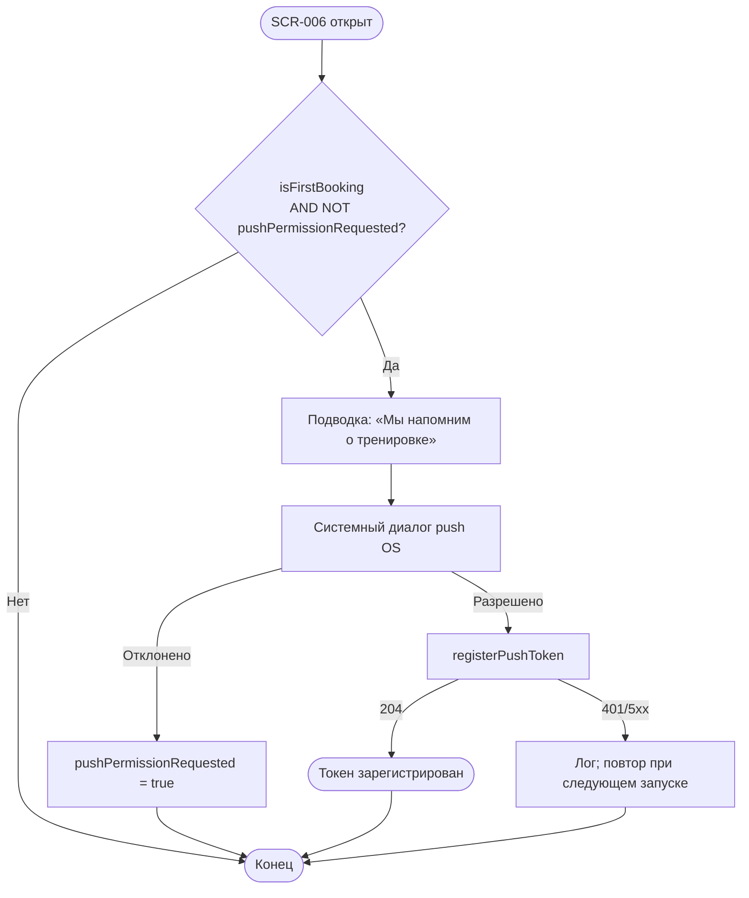

# LOGIC-007 — Запрос push-разрешения

**ID:** LOGIC-007  
**Тип:** Логика  
**Приоритет:** Medium  
**Статус:** Актуален

---

## Обзор

Системный запрос разрешения на push-уведомления после **первой успешной брони** (Q 6.2).
Единственный канал коммуникации в MVP — push (FR-013). Запрос показывается **один раз** на
устройстве; отказ не блокирует работу приложения. При согласии токен регистрируется через
`registerPushToken` (`POST /profile/push-token`).

---

## Точки применения

| Экран | Элемент/Триггер |
|-------|-----------------|
| [SCR-006](../../3-design-brief/screens/SCR-006-booking-success.md) | После отрисовки сводки успешной записи |

---

## Флоу

---

## Описание логики

### Условия показа

| Условие | Значение |
|---------|----------|
| `isFirstBooking` | `true` — первая успешная бронь клиента на устройстве |
| `pushPermissionRequested` | `false` — системный диалог ещё не показывался |
| Экран | SCR-006, **после** отрисовки сводки (не блокирует CTA) |

При второй и последующих записях — запрос **не** показывается.

### Последовательность

1. SCR-006 отображает сводку брони (Content).
2. Краткая подводка в UI: «Мы напомним о тренировке».
3. Системный диалог разрешения push (iOS / Android).
4. При **разрешении** — асинхронный вызов `registerPushToken` (не блокирует навигацию).
5. При **отказе** — установить `pushPermissionRequested = true`; повтор не показывать.

### registerPushToken

**Метод:** POST  
**Путь:** `/profile/push-token`  
**Спецификация:** [../api/openapi.yaml](../api/openapi.yaml) → `registerPushToken`

**Требования:**
- Заголовок `Authorization: Bearer {sessionToken}` — сессия выдана в ответе `createBooking` или `updateProfile`.
- Тело: `{ "token": "<FCM/APNs token>", "platform": "ios" | "android" }`.
- Ответ 204 — успех; ошибки логируются, UI не прерывается.

> **Не использовать** устаревший путь `/auth/push-tokens`.

### Типы push (Q 6.1)

| Тип | Назначение | Deep link |
|-----|------------|-----------|
| Напоминание за 24 ч | Предстоящая тренировка | SCR-009 |
| Напоминание за 2 ч | Скоро начало | SCR-009 |
| Подтверждение записи | Бронь создана | SCR-009 |
| Отмена клиентом / скалодромом | Изменение статуса | SCR-009 |
| Освободилось место | Лист ожидания | SCR-005 / SCR-012 |

---

## Входные / выходные данные

| Параметр | Тип | Направление | Описание |
|----------|-----|-------------|----------|
| `isFirstBooking` | boolean | in | Первая успешная бронь |
| `pushPermissionRequested` | boolean | in/out | Флаг «диалог уже показывался» (локально) |
| `sessionToken` | string | in | JWT для `ClientSession` |
| `deviceToken` | string | out | FCM/APNs токен устройства |
| `platform` | `ios` \| `android` | out | Платформа для `registerPushToken` |

---

## Связанные требования

| ID | Описание |
|----|----------|
| FR-010 | Push при отмене скалодромом, deep link |
| FR-013 | Push-уведомления и напоминания |
| Q 6.1 | Типы уведомлений (напоминания, подтверждение, отмена, waitlist) |
| Q 6.2 | Запрос разрешения после первой записи |

**API:** [../api/openapi.yaml](../api/openapi.yaml) → `registerPushToken`

---

## Критерии приёмки

| ID | Критерий |
|----|----------|
| AC-L-001 | **Дано** первая успешная бронь (`isFirstBooking = true`), **Когда** отображена сводка SCR-006, **Тогда** системный запрос push показывается один раз. |
| AC-L-002 | **Дано** клиент отклонил push, **Когда** нажимает CTA на SCR-006, **Тогда** навигация и бронь работают штатно, повторного запроса нет. |
| AC-L-003 | **Дано** клиент разрешил push, **Когда** получен device token, **Тогда** асинхронно вызывается `registerPushToken` на `POST /profile/push-token`. |
| AC-L-004 | **Дано** вторая и последующие записи, **Когда** открыт SCR-006, **Тогда** системный запрос push не показывается. |
| AC-L-005 | **Дано** `registerPushToken` вернул 5xx, **Когда** ошибка залогирована, **Тогда** UI SCR-006 не блокируется, клиент может перейти на SCR-008 / SCR-001. |
