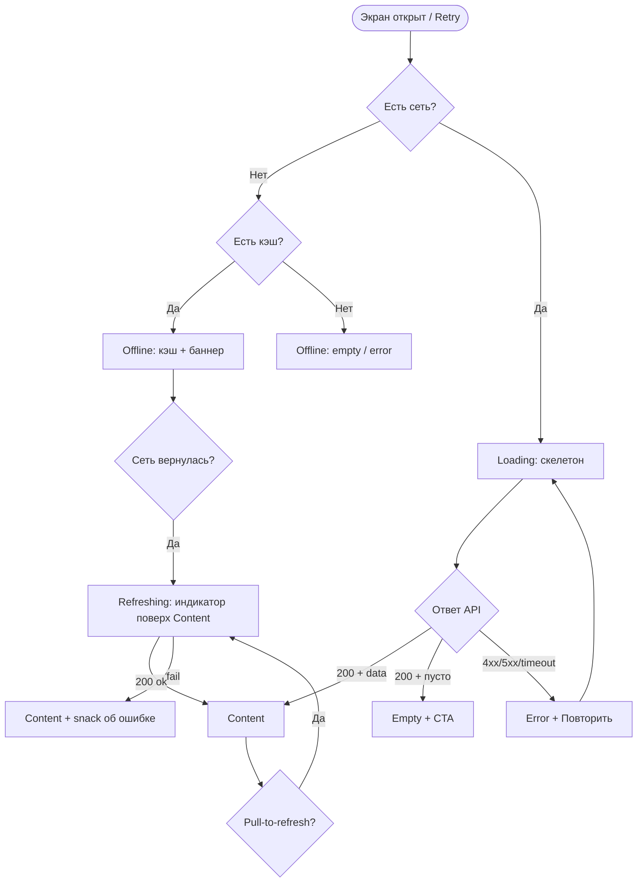
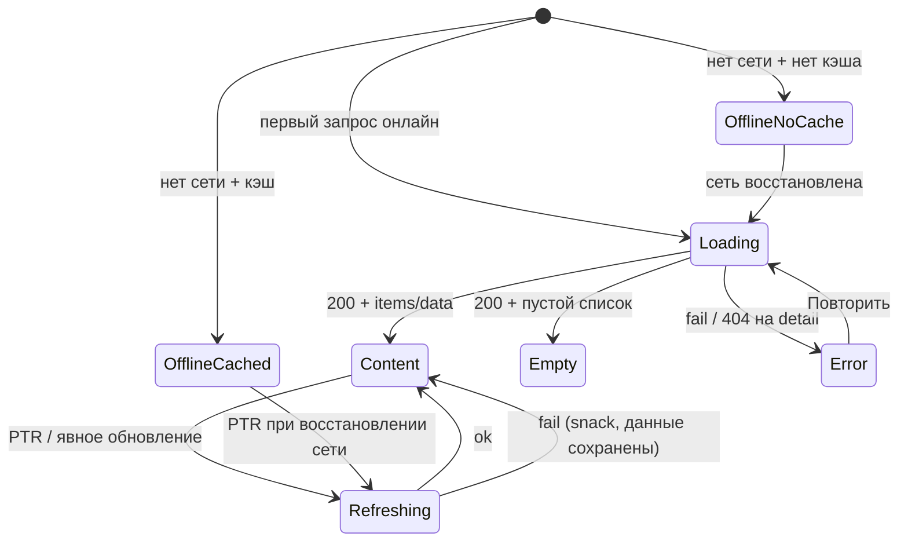

# LOGIC-008 — Паттерн состояний экрана

**ID:** LOGIC-008  
**Тип:** Логика  
**Приоритет:** High  
**Статус:** Актуален

---

## Обзор

Единый UI-паттерн для экранов и секций, загружающих данные через Client API. Задаёт шесть
канонических состояний — **Loading**, **Content**, **Empty**, **Error**, **Offline**, **Refreshing** —
и правила переходов между ними. Цель: предсказуемое поведение при сетевых запросах, единый UX
ошибок и офлайн-режима, согласованность между SCR-001, SCR-004, SCR-005, SCR-008, SCR-009, SCR-012.

**Не входит в паттерн:** экраны без GET-загрузки (SCR-002, SCR-003, SCR-006, SCR-007), bottom sheet /
dialog с единственным submit (SCR-010, SCR-011) — для них описаны **частные правила** в конце документа.

---

## Точки применения

| Экран | Элемент / триггер | Применимые состояния |
|-------|-------------------|----------------------|
| [SCR-001](../../3-design-brief/screens/SCR-001-schedule.md) | Открытие вкладки, pull-to-refresh, «Повторить» | Loading, Content, Empty, Error, Refreshing, Offline |
| [SCR-003](../../3-design-brief/screens/SCR-003-slot-filters.md) | Открытие sheet → `listInstructors` | Loading (список инструкторов), Content, Error |
| [SCR-004](../../3-design-brief/screens/SCR-004-slot-detail.md) | Открытие по `slotId`, «Обновить» | Loading, Content, Error, Refreshing |
| [SCR-005](../../3-design-brief/screens/SCR-005-booking-form.md) | `getProfile` / `getSlot` при инициализации | Loading, Content, Error (+ Submitting на CTA) |
| [SCR-008](../../3-design-brief/screens/SCR-008-my-bookings.md) | Открытие вкладки, pull-to-refresh | Loading, Content, Empty, Error, Offline, Refreshing |
| [SCR-009](../../3-design-brief/screens/SCR-009-booking-detail.md) | Открытие по `bookingId`, deep link | Loading, Content, Error, Offline |
| [SCR-012](../../3-design-brief/screens/SCR-012-waitlist.md) | `getSlot`, `getWaitlistEntry` | Loading, Content, Error (+ Joining на CTA) |
| [SCR-013](../../3-design-brief/screens/SCR-013-contact-profile.md) | `getProfile` при открытии sheet | Loading, Content, Error |

---

## Флоу

---

## Описание логики

### Канонические состояния

| Состояние | Условие входа | UI | Поведение |
|-----------|---------------|-----|-----------|
| **Loading** | Первичный GET онлайн, нет актуальных данных на экране | Скелетон / шиммер; шапка и навигация видны | Блокирует взаимодействие с контентом; CTA скрыты или disabled |
| **Content** | Успешный 200 с непустыми данными | Основной макет экрана | Все элементы интерактивны согласно ТЗ экрана |
| **Empty** | Успешный 200, но `items.length = 0` или эквивалент | Иллюстрация + текст + CTA | CTA зависит от контекста (см. таблицу Empty ниже) |
| **Error** | 4xx (кроме ожидаемых 404), 5xx, timeout, нет сети без кэша | Иконка + заголовок + «Повторить» | Тап «Повторить» → Loading; данные не показываются |
| **Offline** | `NetworkInfo` = offline | Подварианты **cached** / **no cache** | См. раздел «Офлайн» |
| **Refreshing** | Pull-to-refresh или явный refresh при уже показанном Content | Индикатор поверх списка / контента | **Не** сбрасывать Content в Loading; при ошибке — snack, список остаётся |

### Правила переходов (общие)

1. **Первичная загрузка** всегда начинается с Loading (онлайн) или Offline (офлайн).
2. **Refreshing** доступен только из Content и только при наличии сети.
3. При ошибке refresh **не** переходить в Error — показать snack «Не удалось обновить» и остаться в Content.
4. **404 на detail-экранах** (`getSlot`, `getBooking`) трактуется как Error с текстом «Не найдено» + «Назад» / «Обновить».
5. **Empty не применим** к detail-экранам: объект либо есть (Content), либо 404 (Error).
6. **Submitting** (POST/PATCH/DELETE) — локальное состояние кнопки/CTA, не заменяет Content целиком.

### Empty — тексты и CTA по экранам

| Экран | Условие | Заголовок / текст | CTA |
|-------|---------|-------------------|-----|
| SCR-001 | Нет слотов, фильтры в дефолте | «Пока нет доступных тренировок» (FR-004) | — |
| SCR-001 | Нет слотов, фильтры активны | «Ничего не найдено» | «Сбросить фильтры» → сброс LOGIC-005 |
| SCR-008 | Нет броней, онлайн | «У вас пока нет записей» | «Посмотреть расписание» → SCR-001 |
| SCR-008 | Нет кэша, офлайн | «Нет сохранённых записей» | — (PTR disabled) |

### Error — тексты по типу сбоя

| Тип | Текст (RU) | Действие |
|-----|------------|----------|
| Нет сети (без кэша) | «Нет подключения к интернету» | «Повторить» |
| 5xx / timeout | «Не удалось загрузить данные» | «Повторить» |
| 404 detail | «Тренировка не найдена» / «Запись не найдена» | «Назад» + «Обновить» |
| 401 (АЗ-экраны) | «Сессия истекла» | «На расписание» (сброс сессии) |

### Офлайн (Q 9.2)

Применяется к **SCR-008** и **SCR-009** (кэшируемые GET).

| Подсостояние | Условие | UI |
|--------------|---------|-----|
| **Offline cached** | Нет сети, есть последний успешный ответ | Content из кэша + жёлтый баннер «Офлайн · данные могут быть устаревшими»; PTR disabled; destructive actions disabled |
| **Offline no cache** | Нет сети, кэш пуст | SCR-008: empty «Нет сохранённых записей»; SCR-009: «Запись недоступна офлайн» + «Назад» |

**Кэшируется:** последний `listBookings`, детали `getBooking` по id.  
**Инвалидация:** успешный PTR; `cancelBooking`; push о смене статуса; успешный `createBooking`.

Для **SCR-001**, **SCR-004** офлайн без кэша → **Error** (расписание не кэшируется в MVP).

### Refreshing

| Экран | Триггер | Поведение |
|-------|---------|-----------|
| SCR-001 | Pull-to-refresh | `listSlots`; обновить `freeSpots` и группировку |
| SCR-008 | Pull-to-refresh, иконка ↻ | `listBookings`; перезаписать кэш |
| SCR-004 | Кнопка «Обновить» в Error / опционально PTR | `getSlot` |
| SCR-009 | Кнопка «Обновить» | `getBooking` |

### Частные правила (не полный паттерн)

| Экран | Состояние | Описание |
|-------|-----------|----------|
| SCR-002, SCR-003 | — | API не вызывают; Loading на SCR-001 после «Применить» |
| SCR-003 | Loading instructors | Скелетон чекбоксов при `listInstructors`; ошибка — inline «Не удалось загрузить инструкторов» + «Повторить» в sheet |
| SCR-005 | Submitting | Спиннер на CTA «Записаться»; форма disabled; Content сохраняется |
| SCR-006 | — | Только после 201; Loading/Empty/Error не применяются |
| SCR-007 | — | Dialog; источник — ответ `createBooking` на SCR-005 |
| SCR-010 | Submitting | Loading на кнопке «Подтвердить отмену» |
| SCR-011 | Submitting | Loading на «Отправить»; ошибка — inline в sheet |
| SCR-012 | Joining / Leaving | Спиннер на CTA «Встать в очередь» / «Покинуть очередь» |

---

## Входные / выходные данные

| Параметр | Тип | Описание |
|----------|-----|----------|
| `networkStatus` | `online \| offline` | Из OS network monitor |
| `cachedData` | `T \| null` | Последний успешный ответ для кэшируемых экранов |
| `apiResponse` | `200 \| 4xx \| 5xx \| timeout` | Результат GET-запроса |
| `items` | `array` | Для list-экранов; `length === 0` → Empty |
| `screenState` | enum | `loading \| content \| empty \| error \| offline_cached \| offline_no_cache \| refreshing` |
| `submitState` | enum | `idle \| submitting` — для POST/PATCH на формах и sheet |

---

## Связанные требования

| ID | Описание |
|----|----------|
| FR-001–004 | Расписание: loading, empty, refresh (SCR-001) |
| FR-004 | Empty «Пока нет доступных тренировок» |
| FR-007 | Список броней клиента (SCR-008) |
| Q 9.2 | Офлайн-кэш «Мои записи» |
| Q 9.3 | Все тексты состояний — только русский язык |
| R-015 | Данные Content — из API, не хардкод |

---

## Критерии приёмки

| ID | Критерий |
|----|----------|
| AC-L-001 | **Дано** SCR-001 открыт онлайн впервые, **Когда** `listSlots` в процессе, **Тогда** скелетоны карточек, чипы фильтров видны, список не интерактивен. |
| AC-L-002 | **Дано** `listSlots` вернул пустой `items`, фильтры в дефолте, **Тогда** Empty «Пока нет доступных тренировок». |
| AC-L-003 | **Дано** `listSlots` вернул пустой `items`, фильтры активны, **Тогда** Empty «Ничего не найдено» + CTA «Сбросить фильтры». |
| AC-L-004 | **Дано** первичный `listSlots` завершился 5xx или timeout, **Тогда** Error с «Повторить»; тап повторяет запрос через Loading. |
| AC-L-005 | **Дано** SCR-001 в Content, **Когда** pull-to-refresh и сеть есть, **Тогда** Refreshing поверх списка; при 200 список обновлён без полного скелетона. |
| AC-L-006 | **Дано** SCR-001 в Content, **Когда** pull-to-refresh и запрос упал, **Тогда** остаётся Content + snack «Не удалось обновить»; список не очищается. |
| AC-L-007 | **Дано** SCR-008 офлайн с кэшем, **Тогда** список из кэша + баннер офлайн; PTR и destructive actions disabled. |
| AC-L-008 | **Дано** SCR-008 офлайн без кэша, **Тогда** empty «Нет сохранённых записей» или Error по ТЗ экрана. |
| AC-L-009 | **Дано** SCR-004, `getSlot` вернул 404, **Тогда** Error «Тренировка не найдена», не Empty. |
| AC-L-010 | **Дано** SCR-005 submit, **Когда** `createBooking` в процессе, **Тогда** Submitting на CTA, поля формы disabled, экран не переходит в Loading целиком. |
| AC-L-011 | **Дано** SCR-001 без сети (MVP, без кэша расписания), **Тогда** Error «Нет подключения к интернету» + «Повторить». |
