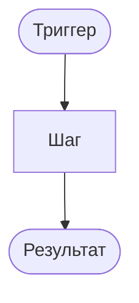

# {Название логики}

**ID:** LOGIC-XXX  
**Тип:** Логика  
**Приоритет:** {Critical | High | Medium}  
**Статус:** Черновик

---

## Обзор

{Что делает логика}

---

## Точки применения

| Экран | Элемент/Триггер |
|-------|-----------------|
| [SCR-XXX](../../3-design-brief/screens/SCR-XXX.md) | {триггер} |

---

## Флоу

---

## Описание логики

{Детальное описание правил, формул, ветвлений}

---

## Входные / выходные данные

| Параметр | Тип | Описание |
|----------|-----|----------|
| `{param}` | {type} | {desc} |

---

## Связанные требования

| ID | Описание |
|----|----------|
| FR-XXX | … |

---

## Критерии приёмки

| ID | Критерий |
|----|----------|
| AC-L-001 | … |
