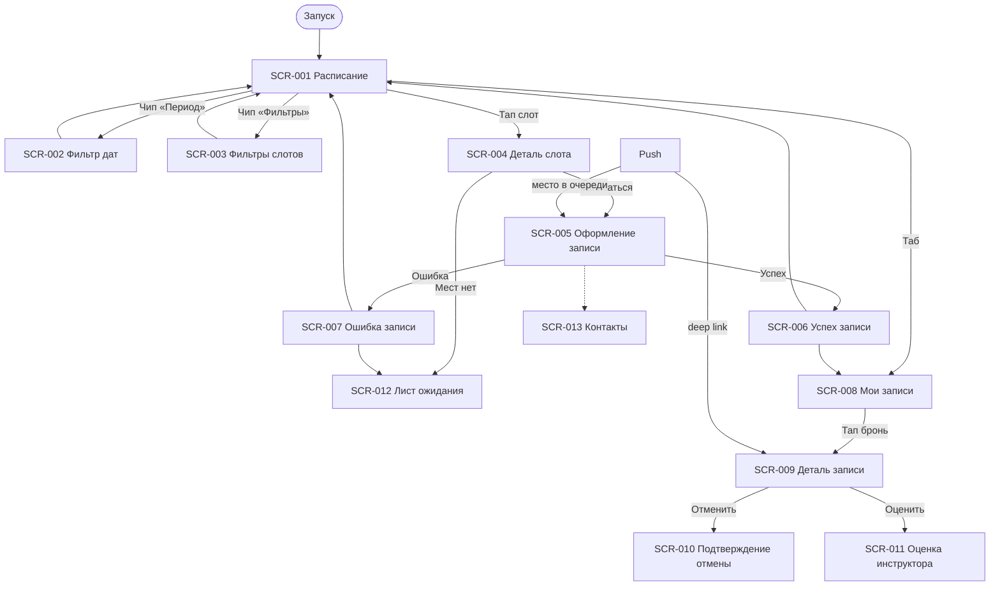

# Фича-лист — мобильное приложение «Вертикаль»

> **Этап 5.** Перечень экранов клиентского приложения и функций на них.
> Связующий артефакт между [требованиями](../2-requirements/) и детальным ТЗ по экранам.

**Статус:** Актуален · **Версия:** 1.0 · **Дата:** 2026-07-03

---

## 1. Назначение

**«Вертикаль»** — клиентское мобильное приложение скалодрома для самостоятельной записи на
групповые тренировки. Заменяет ручную запись через Telegram и тетрадь, устраняя двойные брони.

**Скоуп — только роль «Клиент»** (R-028). Владелец и инструктор работают через существующую
админку. Справочные данные (слоты, форматы, инструкторы) — **read-only** из API. Оплата —
**на месте**; приложение показывает цену и фиксирует запись.

**Источники:**
[brief-climbing.md](../0-customer-brief/brief-climbing.md) ·
[2-requirements/](../2-requirements/) ·
[3-design-brief/](../3-design-brief/) ·
[4-design/](../4-design/) ·
[customer-questions.md](../1-elicitation/customer-questions.md)

---

## 2. Глоссарий

| Термин | Значение |
|--------|----------|
| **Слот** | Групповая тренировка: дата, время, формат, инструктор, места, цена |
| **Формат** | Тип занятия (болдеринг / трассы); лимит 8 или 16 — правило формата |
| **Бронь** | Запись клиента на слот со статусом и выбором снаряжения |
| **Прокат** | Скальники и/или страховочная система из фонда скалодрома |
| **Лист ожидания** | Очередь на заполненный слот; уведомление при освобождении места |
| **Ранняя отмена** | ≥ 1 ч до начала → место освобождается (Q 3.2) |
| **Поздняя отмена** | < 1 ч до начала → предупреждение в MVP, штрафов нет (Q 3.1) |

> **Принцип:** лимиты мест, прокатный фонд и цены **не хардкодятся** — приходят из API (R-015).

---

## 3. Карта навигации

---

## 4. Инвентарь экранов

| ID | Экран | Тип | Приоритет | Постановка |
|----|-------|-----|-----------|------------|
| SCR-001 | Расписание | Экран (вкладка) | Critical | [SCR-001-schedule.md](../3-design-brief/screens/SCR-001-schedule.md) |
| SCR-002 | Фильтр периода дат | Bottom Sheet | High | [SCR-002-date-filter.md](../3-design-brief/screens/SCR-002-date-filter.md) |
| SCR-003 | Фильтры слотов | Bottom Sheet | High | [SCR-003-slot-filters.md](../3-design-brief/screens/SCR-003-slot-filters.md) |
| SCR-004 | Деталь слота | Экран | Critical | [SCR-004-slot-detail.md](../3-design-brief/screens/SCR-004-slot-detail.md) |
| SCR-005 | Оформление записи | Экран | Critical | [SCR-005-booking-form.md](../3-design-brief/screens/SCR-005-booking-form.md) |
| SCR-006 | Успешная запись | Экран | High | [SCR-006-booking-success.md](../3-design-brief/screens/SCR-006-booking-success.md) |
| SCR-007 | Ошибка записи | Dialog | High | [SCR-007-booking-error.md](../3-design-brief/screens/SCR-007-booking-error.md) |
| SCR-008 | Мои записи | Экран (вкладка) | Critical | [SCR-008-my-bookings.md](../3-design-brief/screens/SCR-008-my-bookings.md) |
| SCR-009 | Деталь записи | Экран | Critical | [SCR-009-booking-detail.md](../3-design-brief/screens/SCR-009-booking-detail.md) |
| SCR-010 | Подтверждение отмены | Bottom Sheet | High | [SCR-010-cancel-confirm.md](../3-design-brief/screens/SCR-010-cancel-confirm.md) |
| SCR-011 | Оценка инструктора | Bottom Sheet | High | [SCR-011-rate-instructor.md](../3-design-brief/screens/SCR-011-rate-instructor.md) |
| SCR-012 | Лист ожидания | Экран | High | [SCR-012-waitlist.md](../3-design-brief/screens/SCR-012-waitlist.md) |
| SCR-013 | Контактные данные | Секция / Sheet | High | [SCR-013-contact-profile.md](../3-design-brief/screens/SCR-013-contact-profile.md) |

---

## 5. Сквозные функции

- **Push-уведомления** (FR-010, FR-013; Q 6.1): напоминания, отмена скалодромом, место в очереди
- **Офлайн-кэш** «Мои записи» (Q 9.2): SCR-008, SCR-009
- **Паттерн состояний** [LOGIC-008](09_Логики/LOGIC-008_Паттерн-состояний-экрана.md): Loading → Content → Empty → Error → Offline → Refreshing
- **Только русский язык** (Q 9.3)

---

## 6. Не входит в MVP

| Функция | Источник |
|---------|----------|
| Онлайн-оплата | Q 10.3, backlog |
| Штрафы за позднюю отмену | Q 3.1, вторая итерация |
| Фильтр болдеринг / трассы | Q 1.6 |
| Админка / интерфейс инструктора | R-028 |
| Скидки для постоянных клиентов | Q 7.2 |

---

## 7. Трассировка требований → экраны

| Требование | Экран |
|------------|-------|
| FR-001–004 | SCR-001 |
| FR-002 | SCR-002 |
| Q 1.6 | SCR-003 |
| FR-003, FR-005 | SCR-004, SCR-005 |
| FR-006 | SCR-005 → SCR-006 / SCR-007 |
| FR-007 | SCR-008, SCR-009 |
| FR-008 | SCR-009, SCR-010 |
| FR-009–011 | SCR-009 |
| FR-012 | SCR-011 |
| Q 1.4 | SCR-012 |
| Q 1.1 | SCR-005, SCR-013 |
| UC-001 | SCR-001 → SCR-004 → SCR-005 → SCR-006 |
| UC-002 | SCR-005 → SCR-006 / SCR-007 |
| UC-003 | SCR-008 → SCR-009 |
| UC-004 | SCR-009 → SCR-010 |
| UC-006 | SCR-011 |

---

## 8. API контракт

Спецификация Client API: [openapi.yaml](../api/openapi.yaml) (версия 1.0.0).

Базовый URL: `https://api.vertical.example/v1`. Идентификация — сессионный `Bearer`-токен
(`ClientSession`), выдаётся в ответах `PATCH /profile` и `POST /bookings`.

### Эндпоинты

| operationId | Метод | Путь | Tag | Экран(ы) | Назначение |
|-------------|-------|------|-----|----------|------------|
| `listSlots` | GET | `/slots` | slots | SCR-001 | Список слотов расписания с фильтрами |
| `getSlot` | GET | `/slots/{slotId}` | slots | SCR-004, SCR-005, SCR-012 | Детали слота, pre-check перед записью |
| `listInstructors` | GET | `/instructors` | instructors | SCR-003 | Справочник инструкторов для фильтра |
| `listBookings` | GET | `/bookings` | bookings | SCR-008 | Список броней клиента |
| `createBooking` | POST | `/bookings` | bookings | SCR-005 | Создание брони (+ upsert профиля) |
| `getBooking` | GET | `/bookings/{bookingId}` | bookings | SCR-009, SCR-011 | Детали брони, deep link из push |
| `cancelBooking` | POST | `/bookings/{bookingId}/cancel` | bookings | SCR-010 | Отмена брони клиентом |
| `leaveWaitlist` | POST | `/bookings/{bookingId}/leave-waitlist` | bookings | SCR-009 | Выход из очереди через бронь |
| `joinWaitlist` | POST | `/slots/{slotId}/waitlist` | waitlist | SCR-012 | Вступление в лист ожидания |
| `getWaitlistEntry` | GET | `/waitlist/{waitlistEntryId}` | waitlist | SCR-012, SCR-008 | Позиция в очереди |
| `deleteWaitlistEntry` | DELETE | `/waitlist/{waitlistEntryId}` | waitlist | SCR-012 | Покинуть лист ожидания |
| `getProfile` | GET | `/profile` | profile | SCR-005, SCR-013 | Чтение контактного профиля |
| `updateProfile` | PATCH | `/profile` | profile | SCR-013, SCR-005 | Upsert имени и телефона |
| `registerPushToken` | POST | `/profile/push-token` | profile | SCR-006 | Регистрация push-токена устройства |
| `createRating` | POST | `/ratings` | ratings | SCR-011 | Оценка инструктора после тренировки |
