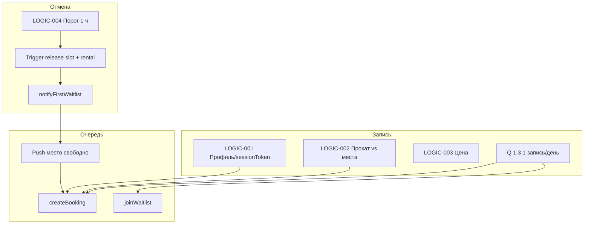

# Ревью ТЗ — `Climbing/01-analysis`

**Дата:** 2026-07-05  
**Объект:** артефакты аналитики скалодрома «Вертикаль» (`Climbing/01-analysis/`)  
**Метод:** сопоставление ТЗ с реализацией (`Climbing/backend/`, `Climbing/client/`) и аудитом `Climbing/bugs/` (срез 2026-07-05)

---

## 1. Контекст и источники истины

### 1.1. Структура артефактов

| Слой | Путь | Роль |
|------|------|------|
| Вход | `0-customer-brief/brief-climbing.md` | Сырой бриф заказчика |
| Выявление | `1-elicitation/` | Домен, Q&A заказчика (фиксация 03.07.2026) |
| Требования | `2-requirements/` | FR, NFR, UC, user stories |
| Дизайн-бриф | `3-design-brief/` | SCR-001–013, screen-registry |
| Проектирование | `4-design/` | data-model, api-sequence |
| ТЗ | `5-mobile-app-spec/` | feature-list, LOGIC-001–008 |
| Контракт | `api/` | OpenAPI (многофайловый) |
| Черновики | `temp/5-mobile-app-spec/` | **Не канон** — наследие шаблона SUP-клуба «Волна» |

### 1.2. Рекомендуемая иерархия при конфликтах

```
customer-questions.md (ответы заказчика)
        ↓
OpenAPI (api/) + LOGIC-00X (5-mobile-app-spec/09_Логики/)
        ↓
SCR-00X (3-design-brief/screens/)
        ↓
domain-description / functional-requirements (обобщения)
```

**Важно:** `01-analysis/README.md` помечает часть файлов как «пустые шаблоны», но на дату ревью **feature-list (v1.0), LOGIC-001–008 и OpenAPI уже заполнены**. README устарел — это само по себе риск для новых участников команды.


## 2. Карта фич MVP и статус внедрения

Сводка по `feature-list.md`, `customer-questions.md` Q 10.1–10.2 и аудиту `bugs/07-priority-fix-list.md`.

| Фича / правило | ТЗ-якорь | BE | CMP | Комментарий |
|----------------|----------|:--:|:---:|-------------|
| Расписание 7 дней + фильтры | FR-001–004, LOGIC-005 | ✅ | ⚠️ | PTR, календарь SCR-002 упрощён |
| Запись + прокат | FR-005–006, LOGIC-002–003 | ✅ | ✅ | |
| Контактный профиль (без OTP) | LOGIC-001, Q 1.1 | ✅ | ⚠️ | Нет SCR-013 sheet, бейджа |
| 1 запись/день (бронь + waitlist) | Q 1.3 | ✅* | ⚠️ | *Исправлено 2026-07-05 (BE-01) |
| Лист ожидания | Q 1.4, SCR-012 | ✅ | ⚠️ | Push/deep link — нет |
| Отмена, порог 1 ч | LOGIC-004, Q 3.1–3.4 | ✅* | ⚠️ | *Граница 60 мин выровнена (BE-02) |
| Мои записи + статусы | FR-007, SCR-008–009 | ✅ | ⚠️ | P1 закрыт в коде; офлайн — нет |
| Оценка инструктора | FR-012, LOGIC-006, Q 10.2 | ✅ | ❌ | Must-have по заказчику, UI отсутствует |
| Push (все типы Q 6.1) | FR-010, FR-013, LOGIC-007 | stub | ❌ | Must-have, end-to-end разрыв |
| Офлайн «Мои записи» | Q 9.2, LOGIC-008 | — | ❌ | Must-have NFR |
| Отмена скалодромом + rebook ban | FR-009–011 | ✅ | ⚠️ | Push/deep link на SCR-009 — нет |

**Вывод:** P0/P1 инварианты бэкенда закрыты; **пробел MVP по ТЗ заказчика** сосредоточен в P2: рейтинги, push, офлайн, polish UI.

---

## 3. Импакт внедрения фич и изменений ТЗ

### 3.1. Смена модели авторизации (OTP vs контактный профиль)

**Текущее ТЗ:** LOGIC-001 — имя + телефон inline на SCR-005, `sessionToken` из `POST /bookings` или `PATCH /profile`. Отдельного логина нет (Q 1.1).

**Если внедрить OTP из `temp/`:**

| Затронутый слой | Импакт |
|-----------------|--------|
| OpenAPI | Новый домен `auth/*`, `TokenPair`, refresh/logout; смена `ClientSession` |
| SCR-001 | Вместо расписания — экран регистрации/входа |
| LOGIC-001 | Полная замена; SCR-013, createBooking upsert — пересмотр |
| BE | SMS-шлюз, хранение refresh, rate limit 429, чёрный список номеров |
| CMP | Keychain/Keystore, 401-flow, проактивный refresh |
| Тесты | Все интеграционные сценарии с Bearer |
| NFR | Заказчик явно выбрал минимальный порог входа без пароля |

**Неочевидные зависимости:** waitlist и «мои записи» требуют стабильного `client_id`; при смене телефона через OTP — связывание аккаунтов. Сейчас уникальность по `phone` в upsert.

**Риск регресса:** высокий. Текущий бэкенд (`BE_AUTH_SLOTS_PLAN.md`) реализует JWT ClientSession без OTP.

---

### 3.2. Изменение порога отмены (1 ч ↔ 2 ч или жёсткий запрет)

**Текущее ТЗ:** Q 3.2 — «заранее» = ≥ 1 ч; Q 3.1 — поздняя отмена = предупреждение, без штрафов в MVP.

| Изменение | Каскад |
|-----------|--------|
| Порог 2 ч | LOGIC-004, SCR-010 тексты; Go `isEarlyCancel`; PostgreSQL `trg_bookings_release_slot`; waitlist notify |
| Жёсткий запрет < 1 ч | Включить `CANCEL_TOO_LATE` в MVP; SCR-009 скрыть CTA; расхождение с Q 3.1 |
| Штрафы (итерация 2) | Новые статусы, биллинг, UI согласия, админка |

**Неочевидная связь:** при ранней отмене одновременно освобождаются **место в слоте и прокатный фонд** (BE-03, миграция `000005`). Изменение порога без синхронизации Go + SQL → рассинхрон waitlist и инвентаря (исторический XL-02).

**Тонкость:** `domain-description.md` §3 упоминает «около 10 минут до начала» как операционную проблему, тогда как Q 3.1–3.2 зафиксировали **1 час**. Канон — customer-questions, domain-description нужно обновить.

---

### 3.3. Must-have: рейтинги (FR-012, LOGIC-006)

**Явный скоуп:** SCR-011, `POST /ratings`, отображение на SCR-001/003/004 (Q 5.3).

**Скрытые зависимости:**

- Агрегат `instructor.rating` обновляется триггерами БД → кэш списка слотов устаревает после оценки.
- CTA «Оценить» только при `ATTENDED` → зависит от корректной смены статуса брони в админке/бэкенде.
- `ALREADY_RATED`, `BOOKING_NOT_ATTENDED` — обработка на SCR-009 и SCR-011.
- Публичный рейтинг влияет на выбор слота (продуктовая гипотеза Q 5.3) — A/B и сортировка не описаны.

**Риск регресса:** частичная реализация (только ★ на SCR-001, как сейчас) создаёт несогласованный UX — пользователь видит рейтинг в списке, но не на детали/фильтре.

---

### 3.4. Must-have: push-уведомления (FR-010, FR-013, LOGIC-007, Q 6.1)

**Явный скоуп:** SCR-006 (запрос разрешения), `POST /profile/push-token`, deep links на SCR-009 / SCR-005.

**Скрытые зависимости:**

| Событие | BE | CMP | Связанное правило |
|---------|----|----|-------------------|
| Место в waitlist | `notifyFirstWaitlist` (log) | deep link → SCR-005 | LOGIC-004 ранняя отмена, Q 3.4 |
| Отмена скалодромом | stub | SCR-009 + причина | FR-009, FR-011 |
| Напоминание 24h/2h | scheduler stub | SCR-009 | Снижение неявок |
| Подтверждение записи | не описан в handler | SCR-006 | После createBooking |

**Риск регресса:** без deep links waitlist-поток обрывается (XL-04): клиент не завершает запись после освобождения места.

**Платформенный импакт:** FCM/APNs, разрешения iOS, wasm/web — push может быть out of scope для webApp stub.

---

### 3.5. Офлайн-кэш «Мои записи» (Q 9.2, LOGIC-008)

**Явный скоуп:** SCR-008, SCR-009 — Offline + баннер; расписание SCR-001 — Error без stale-данных (TZ-INT-05).

**Скрытые зависимости:**

- Инвалидация кэша после отмены/создания с другого устройства.
- LOGIC-004 L-004-10: отмена offline disabled — политика должна согласоваться с кэшем (нельзя показать устаревший `ACTIVE` с активной кнопкой).
- LOGIC-001 L-001-13: блок submit без сети при несохранённом профиле.

**Риск регресса:** кэш без TTL/версии → клиент видит отменённую бронь как активную.

---

### 3.6. Прокатный фонд (Q 2.4, LOGIC-002)

**Правило:** места и прокат — **независимые лимиты** (data-model, LOGIC-002).

**Импакт изменения «слот недоступен при исчерпании проката»:**

| Компонент | Текущее | Ожидание ТЗ | Пробел |
|-----------|---------|-------------|--------|
| `rental_availability.is_bookable` | ✅ | ✅ | |
| `slots.status = UNAVAILABLE` | OPEN | UNAVAILABLE | BE-04 открыт |
| `getSlot.isBookable` | не учитывает выбор пользователя | per-item | BE-11 |
| UI SCR-004 | баннер rental exhausted | ✅ | |

**Риск регресса:** клиент показывает «есть места», submit падает с `RENTAL_UNAVAILABLE` — штатно, но UX-разрыв; при исправлении BE-04 изменится фильтрация SCR-001.

---

### 3.7. Лимит «1 запись в день» (Q 1.3)

**Семантика:** одна «живая» запись — `ACTIVE` **или** `WAITLIST` на календарный день слота.

**Импакт любого ослабления лимита:**

- Нагрузка на инструктора / зал в пиковые часы.
- Конфликт с операционной практикой «одна тренировка в день».
- Waitlist + вторая бронь в тот же день — исторический P0-баг (XL-01).

**Тонкость:** «день» привязан к `slot.startsAt` (календарная дата слота), не к моменту запроса — граница полночь/TZ должна быть единой на BE и в UI фильтров.

---

## 4. Неочевидные зависимости (сквозная карта)



| Связь | Почему неочевидна |
|-------|-------------------|
| Отмена → waitlist → push → запись | Четыре слоя; ошибка на границе 60 мин ломает цепочку |
| Прокат → отмена → доступность слота | Release только при **ранней** отмене |
| Gym cancel → FR-011 → createBooking | Отдельный код `SLOT_REBOOK_FORBIDDEN`, не путать с `SLOT_CANCELLED` |
| Рейтинг → listSlots | Агрегат инструктора в карточке слота |
| Session → все mutating API | Потеря token = потеря истории броней на устройстве |
| SCR-007 коды ошибок → навигация | `NO_SPOTS` ведёт в SCR-012, остальные — в SCR-001/008 |

---

## 5. Противоречия и тонкости внутри ТЗ

### 5.1. Зафиксированные расхождения (TZ-INT-*)

Источник: `bugs/01-tz-internal-inconsistencies.md`.

| ID | Суть | Канон | Действие |
|----|------|-------|----------|
| TZ-INT-01 | Код лимита дня | `ONE_BOOKING_PER_DAY` (OpenAPI) | Обновить SCR-007 (`BOOKING_LIMIT_PER_DAY`) |
| TZ-INT-02 | Эндпоинт рейтинга | `POST /ratings` | Обновить SCR-011 |
| TZ-INT-03 | Выход из waitlist | `DELETE /waitlist/{id}` или `leave-waitlist` | Унифицировать SCR-009 и SCR-012 |
| TZ-INT-04 | `CANCEL_TOO_LATE` | LOGIC-004: не в MVP | BE возвращает при `startsAt <= now`, не при < 1 ч — уточнить OpenAPI |
| TZ-INT-05 | Офлайн расписания | SCR-001: кэш не нужен | Согласовано с LOGIC-008-09 |

### 5.2. Противоречия между этапами анализа

| Тема | Артефакт A | Артефакт B | Рекомендация |
|------|------------|------------|--------------|
| Порог поздней отмены | `domain-description` §3: «~10 минут» | Q 3.2: **1 час** | Обновить domain-description |
| Must-have уведомления | Q 6.1, Q 10.2: все push | `feature-list` §6: штрафы в backlog, push не в «не входит» | Явно вынести push в §5 сквозных функций как blocking MVP |
| Публичные рейтинги | Q 10.3: «публичные рейтинги» в отложенном | Q 5.3: клиенты **видят** рейтинги | Q 5.3 + LOGIC-006 — канон; уточнить Q 10.3 |
| Auth в API | `feature-list` §8: ClientSession | `README` этапа 1: домены auth в redocly | Фактически auth = profile upsert, не OTP |
| Статус README | «шаблоны пустые» | feature-list v1.0, LOGIC заполнены | Обновить README |

### 5.3. Семантические тонкости реализации vs документа

| Тонкость | Описание | Риск |
|----------|----------|------|
| `CANCEL_TOO_LATE` | В OpenAPI зарезервирован для MVP «не применяется», BE использует для «слот уже начался» | Клиент может показать неверный текст |
| Граница ровно 60 мин | Должна быть `>=` везде (исправлено BE-02) | Off-by-one в waitlist |
| Поздняя отмена | MVP разрешает, но место может не освободиться | Текст SCR-010 корректен; ожидания support могут расходиться с Q 3.4 |
| `minutesUntilStart` на клиенте | LOGIC-004: `now` с устройства | Расхождение с сервером при неверных часах телефона |
| Waitlist `CONVERTED` | BE-05 открыт | UI может не отличать «вышел» vs «записался» |
| Имя SCR-007 | «Ошибка записи» vs booking error | Не путать с SCR-007-profile из temp («Волна») |

### 5.4. Расхождение ТЗ и фактического кода (закрыто / открыто)

По `bugs/04-cross-layer-bugs.md`:

- **Закрыто 2026-07-05:** XL-01 (waitlist + бронь/день), XL-02 (60 мин), XL-03 (прокат при отмене), XL-04 (частично waitlist UI), XL-06/07 (мои записи, ошибки отмены).
- **Открыто:** XL-05 (рейтинги UI), XL-08 (имя кода в SCR-007), XL-09 (push E2E).

**Критично для ревью ТЗ:** исправления внесены в **код**, артефакты `01-analysis/` **не обновлялись** (`bugs/07-priority-fix-list.md`). Документация отстаёт от канонического поведения системы.

---

## 6. Матрица: изменение ТЗ → что перепроверить

| Если меняем… | Обязательный регрессионный набор |
|--------------|----------------------------------|
| Порог отмены | LOGIC-004 AC, trigger SQL, `notifyFirstWaitlist`, SCR-010, интеграционный тест границы |
| Лимит записей/день | `checkOneLiveBookingPerDay`, join + create, SCR-007, waitlist сценарий XL-01 |
| Модель auth | OpenAPI security, все SCR с Bearer, миграция клиентов по phone |
| Прокат / isBookable | LOGIC-002, SCR-004/005/007, миграции triggers, BE-04/11 |
| Push / deep links | LOGIC-007, SCR-006/009, waitlist E2E, scheduler |
| Офлайн | LOGIC-008, SCR-008/009, LOGIC-004 offline block |
| Рейтинги | LOGIC-006 все SCR, triggers агрегата, 409 flows |
| Коды ошибок API | SCR-007, `ApiErrorDto`, responses.yaml, контрактные тесты |

---

## 7. Рекомендации по доработке ТЗ (без изменения кода)

### 7.1. Срочно (снижение риска разработки)

1. **Синхронизировать SCR с OpenAPI:** TZ-INT-01–03 (коды, пути рейтинга, waitlist).
2. **Уточнить `CANCEL_TOO_LATE`:** переименовать в `SLOT_ALREADY_STARTED` или описать фактическую семантику (TZ-INT-04).
3. **Обновить `domain-description.md` §3** по отмене: 1 час, не 10 минут.
4. **Пометить `temp/`** как неактуальный шаблон; исключить из ссылок в README.
5. **Обновить `01-analysis/README.md`** — актуальный статус артефактов.

### 7.2. Перед закрытием MVP

1. **Чек-лист must-have Q 10.2:** рейтинги + push — явные acceptance criteria на уровне epic, не только FR.
2. **Документировать TZ устройства** для LOGIC-004 (`slot.startsAt` timezone).
3. **Единая таблица кодов ошибок** API ↔ SCR ↔ CMP (`api-sequence.md` расширить).
4. **Отразить в ТЗ исправления BE-01–03** (поведение стало каноном).

### 7.3. Для тест-дизайна (`03-test`)

Приоритетные сценарии для тест-кейсов:

1. Waitlist утром → запись вечером → `ONE_BOOKING_PER_DAY`.
2. Отмена ровно за 60 мин → место + прокат + уведомление waitlist.
3. Прокат: исчерпание → отмена → повторная доступность.
4. Gym cancel → запрет rebook на тот же slot → разрешение на другой.
5. Поздняя отмена (< 1 ч) → 200, предупреждение, место может не освободиться.
6. Офлайн: просмотр кэша брони, блок отмены и create без сети.
7. Рейтинг: только ATTENDED, повтор → ALREADY_RATED.
8. Push waitlist → deep link → успешная запись (когда CMP-04 готов).

---

## 8. Итоговая оценка зрелости ТЗ

| Критерий | Оценка | Комментарий |
|----------|:------:|-------------|
| Полнота скоупа MVP | 8/10 | FR + Q&A покрывают продукт; push/офлайн недостаточно детализированы в acceptance |
| Согласованность внутри | 6/10 | 5 TZ-INT, устаревший domain-description, путаница с temp/ |
| Трассируемость | 9/10 | feature-list → SCR → LOGIC → API хорошо связаны |
| Готовность к тестированию | 7/10 | LOGIC AC есть; нет единого каталога кодов ошибок |
| Соответствие реализации | 7/10 | BE ~95% P0/P1; CMP ~70%; доки не отражают фиксы 2026-07-05 |

**Главный вывод:** ТЗ «Вертикаль» в `5-mobile-app-spec/` и `api/` — рабочий канон для скалодрома, но **требует синхронизации SCR с OpenAPI и вычистки наследия `temp/`**. Наибольший **импакт и скрытый каскад** дают не новые экраны, а сквозные правила: **1 запись/день + waitlist**, **порог отмены 1 ч + прокат**, **push-цепочка waitlist**, **must-have рейтинги/уведомления** при текущих пробелах клиента.

---

## Приложение A. Проверенные файлы репозитория

```
Climbing/01-analysis/README.md
Climbing/01-analysis/1-elicitation/domain-description.md
Climbing/01-analysis/1-elicitation/customer-questions.md
Climbing/01-analysis/2-requirements/functional-requirements.md
Climbing/01-analysis/3-design-brief/screen-registry.md
Climbing/01-analysis/3-design-brief/screens/SCR-007-booking-error.md
Climbing/01-analysis/4-design/data-model.md
Climbing/01-analysis/5-mobile-app-spec/feature-list.md
Climbing/01-analysis/5-mobile-app-spec/09_Логики/_INDEX.md
Climbing/01-analysis/5-mobile-app-spec/09_Логики/LOGIC-001..008 (выборочно)
Climbing/01-analysis/temp/5-mobile-app-spec/ (сравнение)
Climbing/01-analysis/api/ (openapi, schemas, paths)
Climbing/bugs/01..07, README.md
Climbing/02-development/BE_AUTH_SLOTS_PLAN.md
Climbing/02-development/CMP_CLIENT_IMPLEMENTATION_REPORT.md
Climbing/backend/internal/domain/errors.go
Climbing/client/.../ApiErrorDto.kt
```

## Приложение B. Связанные документы

- [01-tz-internal-inconsistencies.md](../bugs/01-tz-internal-inconsistencies.md)
- [04-cross-layer-bugs.md](../bugs/04-cross-layer-bugs.md)
- [05-logic-coverage-matrix.md](../bugs/05-logic-coverage-matrix.md)
- [07-priority-fix-list.md](../bugs/07-priority-fix-list.md)
