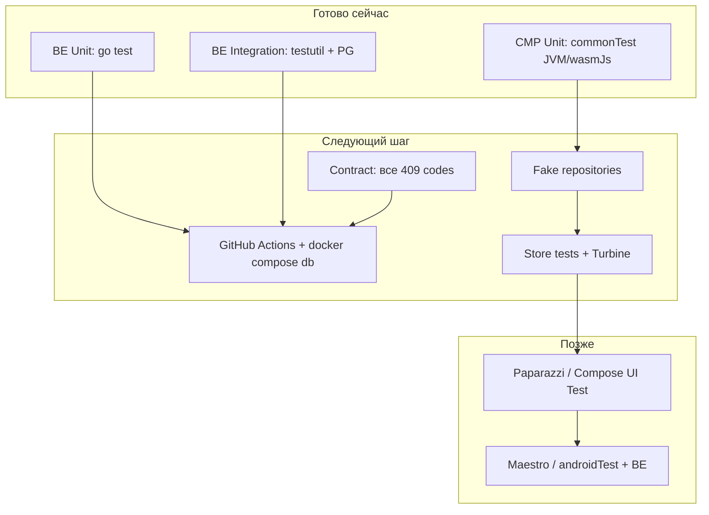

# Анализ возможности автотестов — «Вертикаль»

**Дата:** 2026-07-05  
**Источники:** `Climbing/backend`, `Climbing/client`, `Climbing/03-test/test_cases.json`, `TEST_COVERAGE_PLAN.md`, `bugs/`

---

## Итог

Проект **можно покрыть автотестами**: бэкенд уже близок к production-ready для U/I/C, клиент (CMP) — на ранней стадии. Из **64** кейсов в [`test_cases.json`](../03-test/test_cases.json) **~58 автоматизируемы** после доработки инфраструктуры; **6 заблокированы** отсутствующими фичами.

---

## Что уже есть

### Backend (Go) — готов к расширению

| Компонент | Состояние |
|-----------|-----------|
| **22 тест-функции** в 7 файлах | Unit + integration + contract |
| **Интеграции** | `flow_integration_test.go` — 9 сценариев через HTTP + PostgreSQL |
| **Test DB** | `testutil.PrepareDatabase` — изолированная schema, migrations, cleanup |
| **Запуск** | `make test` → `go test ./...`, нужен `TEST_DATABASE_URL` |
| **Contract** | `contract_test.go` — 15 operationId из OpenAPI |

**Покрыто:** профиль, слоты/фильтры, booking, waitlist, 1 запись/день, gym rebook, price breakdown, early cancel, rating после ATTENDED, validate, token, router.

**Не покрыто (~14 BE-T):** late cancel, CANCEL_TOO_LATE, rental recycle, UNAVAILABLE, CONVERTED, все 409-коды, push-token, reminder scheduler, gym cancel reason, ALREADY_RATED / NOT_ATTENDED.

**Ключевые файлы:**

| Назначение | Путь |
|------------|------|
| Integration tests | `backend/internal/handler/flow_integration_test.go` |
| PG testutil | `backend/internal/store/testutil/database.go` |
| Makefile | `backend/Makefile` (`test`, `docker-up`) |
| Документация | `backend/README.md` (§Тесты) |

### Client (KMP/CMP) — минимальная база

| Компонент | Состояние |
|-----------|-----------|
| **1 файл, 5 тестов** | `DomainPolicyTest.kt` — цена, телефон, метки мест |
| **Зависимости** | `kotlin-test`, `kotlinx-coroutines-test` в `commonTest` |
| **Архитектура** | Интерфейсы репозиториев (`SlotRepository`, `BookingRepository`…) — удобно для fake/mock |
| **ViewModels** | `ScheduleStore`, `BookingFormStore`, `WaitlistStore` — без тестов |
| **UI / E2E** | Нет `androidTest`, Compose UI Test, Paparazzi, Maestro |
| **Fakes** | Только `Ktor*` реализации, in-memory fakes нет |

**Готовы к unit-тестам без UI:** `CancellationPolicy`, `BookingErrorPolicy`, `SlotFilterPolicy`, `QuickDateFilter` — pure Kotlin в `commonMain`.

**Ключевые файлы:**

| Назначение | Путь |
|------------|------|
| Unit tests | `client/shared/src/commonTest/.../DomainPolicyTest.kt` |
| Репозитории | `client/shared/src/commonMain/.../data/Repositories.kt` |
| Policies | `client/shared/src/commonMain/.../domain/policy/` |
| Gradle deps | `client/shared/build.gradle.kts` (`commonTest`) |

### CI

**GitHub Actions / другого CI нет** — тесты только локально.

---

## Сопоставление с каталогом (64 кейса)

| Статус в JSON | Кол-во | Автоматизация |
|---------------|--------|---------------|
| `existing` | 12 | Уже есть (в основном BE) |
| `partial` | 13 | Частично; доработка шагов |
| `planned` | 33 | Нужна реализация |
| `blocked` | 6 | Ждут фичи |

### По уровням

| Уровень | Кейсов* | Реалистичный стек | Готовность |
|---------|---------|-------------------|------------|
| **U** | ~14 | Go `testing` / Kotlin `commonTest` | BE ✅, CMP 🔶 |
| **I** | ~30 | BE: PG + httptest; CMP: fake repos + `runTest` | BE ✅, CMP ⬜ |
| **C** | 4 | OpenAPI enum vs handler 409 | 🔶 (1 contract test) |
| **E2E** | ~16 | BE-only сейчас; full-stack — emulator + API | BE 🔶, full ⬜ |
| **UI** | ~25 | Compose UI Test / Paparazzi (T-058–064) | ⬜ |

\*Кейс может затрагивать несколько уровней.

### Заблокированные (автотесты после фич)

| ID | Причина |
|----|---------|
| T-003, T-044 | SCR-013, SCR-011 не реализованы |
| T-018, T-049, T-050, T-062 | Push / FCM / deep links (CMP-04) |

Остальные **58 кейсов** — автоматизируемы по дизайну; без UI-фреймворка ~25 UI-кейсов сейчас по сути **ручные**.

---

## Рекомендуемый стек

| Слой | Инструмент | Почему подходит |
|------|------------|-----------------|
| BE unit | `go test`, table-driven | Уже принят в проекте |
| BE integration | `testutil` + Docker Postgres | Проверенный паттерн |
| BE contract | Расширить `contract_test.go` | OpenAPI + oapi-codegen уже есть |
| CMP unit | `kotlin-test` + `runTest` | Зависимости подключены |
| CMP integration | Fake `*Repository` + coroutines | Интерфейсы в `Repositories.kt` |
| UI snapshot | Paparazzi / Roborazzi на `androidUnitTest` | T-058–064 в каталоге |
| Full E2E | Maestro или Compose + `:androidApp` + `docker compose` | T-019, T-025, T-032 |

---

## Блокеры (фичи → тесты)

| Блокер | Какие автотесты ждут |
|--------|----------------------|
| **CMP-08** offline cache | T-039, T-040, E2E-06, CMP-T09 |
| **CMP-04** push/FCM | T-018, T-047–049, CMP-T13–14 |
| **CMP-01** SCR-011 rating UI | T-044, E2E-07 UI |
| **BE-04/05** UNAVAILABLE, CONVERTED | T-011, T-024 |
| **BE-10** все 409-коды | T-055, BE-T20 |
| **TZ-INT-04** CANCEL_TOO_LATE | T-028, BE-T13 |

Подробнее: [`TEST_COVERAGE_PLAN.md`](../03-test/TEST_COVERAGE_PLAN.md) §9, [`bugs/07-priority-fix-list.md`](../bugs/07-priority-fix-list.md).

---

## Оценка усилий (только тесты + CI, без фич)

| Фаза | Что | Кейсов | Оценка |
|------|-----|--------|--------|
| **F0** | CI: PG + `go test` + `:shared:allTests` | — | 2–3 дн |
| **F1** | BE P0: late cancel, rental recycle, 409s | ~6 | 3–5 дн |
| **F2** | Contract + CMP policies (T-022, T-031, T-053) | ~10 | 4–6 дн |
| **F3** | Fake repos + Store tests, offline (после CMP-08) | ~15 | 8–12 дн |
| **F4** | UI snapshots T-058–064 | ~8 | 10–15 дн |
| **F5** | Device E2E (T-019, T-025…) | ~4 | 8–10 дн |

**Итого:** ~35–51 чел.-дня до ~75 автотестов (20 есть + ~55 новых по TEST_COVERAGE_PLAN).

### Quick wins (максимальный ROI)

1. **CI** для существующих 22 Go + 5 Kotlin тестов — ~2 дн
2. **BE F1:** T-027, T-028, T-029, T-021 — инфраструктура готова, ~3 дн
3. **CMP unit:** `CancellationPolicy`, `BookingErrorPolicy` — pure Kotlin, ~2 дн

---

## Инвентарь существующих тестов

### Backend — 7 файлов, 22 функции

| Файл | Тип | Функции |
|------|-----|---------|
| `internal/handler/flow_integration_test.go` | Integration | `TestProfileAuthIntegration`, `TestListSlotsIntegration`, `TestBookingFlowIntegration`, `TestJoinWaitlistIntegration`, `TestOneBookingPerDayAfterWaitlistIntegration`, `TestRebookForbiddenIntegration`, `TestGetBookingIncludesPriceBreakdownIntegration`, `TestEarlyCancelNotifiesWaitlistIntegration`, `TestRatingAfterAttendedIntegration` |
| `internal/handler/router_test.go` | Unit | `TestRouterHealthz`, `TestRouterUnauthorizedBookings`, `TestRouterInvalidJSON`, `TestRouterUnknownPath` |
| `internal/store/price_test.go` | Unit | `TestCalcTotalPrice` |
| `internal/store/tz_compliance_test.go` | Unit | `TestIsEarlyCancel` |
| `internal/validate/validate_test.go` | Unit | `TestClientContactsPhone`, `TestEquipmentRentalRequiresItem` |
| `internal/platform/auth/token_test.go` | Unit | `TestIssueAndParseToken`, `TestParseExpiredToken`, `TestParseInvalidToken` |
| `internal/gen/contract_test.go` | Contract | `TestServerInterfaceHasAllOperationIDs` |

### Client — 1 файл, 5 методов

| Файл | Методы |
|------|--------|
| `shared/.../DomainPolicyTest.kt` | `bookingPriceOwnOnly`, `bookingPriceRentalBoth`, `phoneValidation`, `phoneMaskFormatting`, `spotsShortLabelShowsFreeCapacity` |

---

## Вердикт по слоям

| Слой | Вердикт |
|------|---------|
| **Backend U/I/C** | **Высокая** — можно начинать сразу, ~60% catalog BE уже зелёный или близко |
| **CMP unit** | **Высокая** — policies и mappers без сети и UI |
| **CMP integration** | **Средняя** — нужны fakes и тестовый Koin-модуль |
| **UI / snapshot** | **Средняя** — архитектура CMP подходит, стек не выбран |
| **Full E2E** | **Низкая–средняя** — нужны CI emulator, стабильный seed, часть фич |
| **6 blocked кейсов** | **Нет** — до реализации push, rating UI, profile sheet |

---

## Рекомендуемый порядок работ

1. CI → закрыть BE P0 (F1)
2. CMP policies + fakes (F2–F3)
3. UI snapshots (F4)
4. Device E2E (F5)
5. Blocked-кейсы — после фич из `bugs/07-priority-fix-list.md`

---

## Связанные документы

- [test_cases.json](../03-test/test_cases.json)
- [TEST_COVERAGE_PLAN.md](../03-test/TEST_COVERAGE_PLAN.md)
- [TEST_PLAN.md](../03-test/TEST_PLAN.md)
- [backend/README.md](../backend/README.md)
- [bugs/07-priority-fix-list.md](../bugs/07-priority-fix-list.md)
