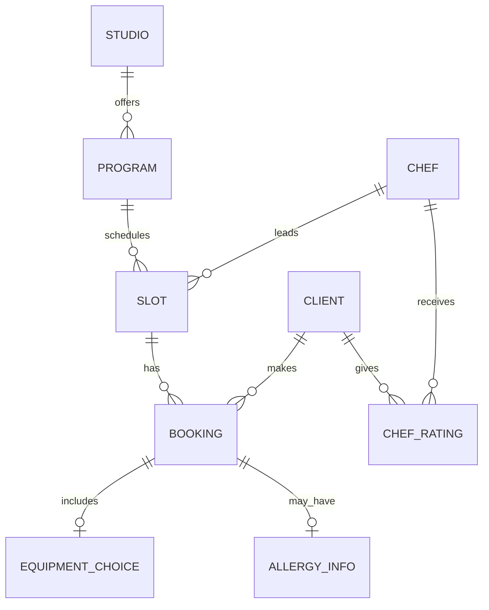
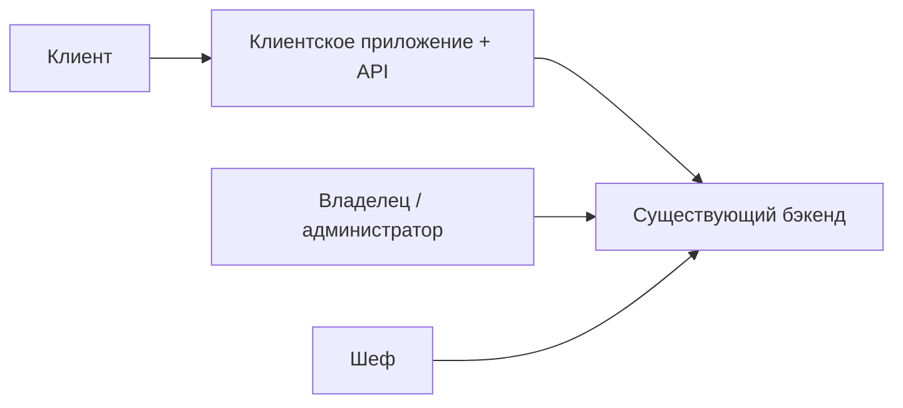

# Описание домена — кулинарная студия «Шеф-стол»

> Этап выявления требований. Источники: [brief-cooking.md](../0-customer-brief/brief-cooking.md),
> [customer-questions.md](customer-questions.md) (ответы зафиксированы 03.07.2026).

---

## 1. Предметная область

**Кулинарная студия** — площадка для групповых практических занятий по cooking-классам. В данном проекте речь о студии **«Шеф-стол»** (лофт на бывшем заводе), где проводятся **групповые кулинарные классы** (~3 ч).

Предметная области проекта — **управление записью клиентов на кулинарные классы**: просмотр расписания, бронирование, выбор экипировки, учёт аллергий, отмены, оценки шефов, уведомления. Операционная работа (расписание, шефы, закупки, отмены по форс-мажору) — в **существующем бэкенде и админке**. В фокусе — **клиентское мобильное приложение (Android, MVP)** и **Client API** (R-028).

---

## 2. Ключевые сущности

| Сущность | Описание |
| :-- | :-- |
| **Студия** | Площадка с адресом, 12 рабочих мест (столов) |
| **Программа класса** | Тип занятия: меню / кухня / уровень; определяет **цену** |
| **Слот (класс)** | Конкретное занятие: дата и время (~3 ч), программа, шеф, лимит и свободные места |
| **Шеф** | Ведёт класс; лимит группы (8 или 12) **настраивается на уровне шефа** |
| **Клиент** | Записывается на слот; своё или прокатное снаряжение; может быть **постоянным** |
| **Бронь (запись)** | Связь «клиент ↔ слот»; статусы (активна, отменена клиентом, отменена студией, посещена и др.) |
| **Экипировка** | Фартук, набор ножей — своё или прокат (на цену не влияет) |
| **Аллергии** | Текстовое поле; обязательный шаг при первой записи |
| **Оценка шефа** | Звёзды 1–5; одна оценка на пару «клиент ↔ шеф», публичный рейтинг |

---

## 3. Бизнес-правила

### Вместимость и расписание

- На студии **12 рабочих мест**; лимит **8 или 12** на конкретный класс задаётся **в зависимости от шефа**, который ведёт занятие.
- Расписание на **неделю вперёд**; в приложении по умолчанию — **7 дней** (R-027); расширение — фильтр дат.
- Фильтры MVP: **время суток**, **уровень**, **тип кухни** (фильтр по шефу — не в первой версии).
- **Не более 1 записи в день** на клиента; **один человек на одну запись**.
- **Двойная запись** исключается бэкендом — атомарная проверка мест (R-004).
- Группа заполнена → только **«мест нет»** (лист ожидания **не** в MVP).
- Проверка уровня клиента **не требуется**.

### Бронирование и экипировка

- Идентификация: **имя + телефон** при первой записи.
- Клиент выбирает **своё** или **прокат** (фартук, ножи).
- **Прокат не влияет на цену** (исключение: повреждение / поломка прокатного оборудования).
- Если прокатный фонд исчерпан — запись **возможна только «со своим»**.
- Цена зависит от **программы**; показывается в приложении; оплата **на месте**.

### Аллергии

- **Обязательно при первой записи**; далее — сохранённое значение, можно изменить.
- Формат: **свободное текстовое поле**; можно изменить в существующей записи.
- Несовместимость с меню → **предупреждение** (запись не блокируется).
- Сбор аллергий — **обязательный шаг** в приложении (не только push-напоминание).

### Отмена клиентом

- **Ранняя отмена:** ≥ **3 часов** до начала → место **сразу** освобождается.
- **Поздняя отмена:** < 3 часов → **предупреждение** (продукты уже закуплены); отмена **разрешена**, штрафов в MVP **нет**.
- **Учёт** поздних отмен ведётся; последствий для клиента пока **нет**.

### Отмена студией (форс-мажор, R-008)

- Бронь → статус **«Отменён студией»** + **причина** (фиксированный список + свободный текст из админки).
- **Push** с просьбой **перезаписаться на другой класс**; перезапись из push и экрана детали.
- Повторная запись на **отменённый слот запрещена**.
- Уведомление о **переносе** класса (смена времени / шефа) — **нужно**.

### Оценки шефов

- Только после **посещённого** класса; срок — **в течение недели**.
- Формат: **звёзды** (без текстовых отзывов в MVP).
- Рейтинги **видны** другим клиентам при выборе слота.
- **Один пользователь — одна оценка на шефа**; можно изменить в течение недели или при повторном классе с тем же шефом.

### Постоянные клиенты

- **Метка** в профиле + **приоритет записи** (скидки — не в MVP).

### Уведомления (MVP)

Push в приложении: напоминание **за день** и **за 2 часа**, подтверждение записи, отмена (клиент / студия), запрос аллергий, перенос класса.

---

## 4. Акторы

| Актор | Роль | В скоупе MVP |
| :-- | :-- | :-- |
| **Клиент** | Запись, отмена, аллергии, оценки, уведомления | **Да** (R-028) |
| **Шеф** | Ведение класса на кухне | **Нет** — существующий интерфейс |
| **Владелец** | Расписание, отмены, админка | **Нет** — существующая админка |

---

## 5. Основные процессы

### 5.1. Просмотр расписания

Клиент видит классы на 7 дней с фильтрами (время, уровень, тип кухни). Карточка: время, программа (кратко), шеф, рейтинг, свободные места, цена. Empty state: **«Пока нет доступных классов»**.

### 5.2. Бронирование

Выбор слота → контакты (имя, телефон) → аллергии (обязательный шаг) → экипировка (своё / прокат) → подтверждение. Бэкенд атомарно проверяет места и прокат.

### 5.3. Отмена брони

Клиентом (с правилами 3 ч) или студией (форс-мажор) — см. §3.

### 5.4. Аллергии и напоминания

Обязательный сбор аллергий в потоке записи; push-напоминания о классе и аллергиях.

### 5.5. Оценка шефа

После посещённого класса — звёзды в течение недели; публичный рейтинг на карточке слота.

### 5.6. Форс-мажор

Срыв поставки / поломка оборудования → отмена в админке → push + перезапись (R-008).

---

## 6. Границы системы

### В скоупе MVP

- **Android**-приложение для роли «Клиент»
- **Client API** (слоты, брони, профиль, шефы/рейтинги, аллергии, прокат — R-015)
- Офлайн-просмотр **своих записей**

### Вне скоупа / backlog

- iOS (вторая платформа)
- Админка, интерфейс шефа, экран владельца
- Онлайн-оплата
- Лист ожидания
- Фильтр по шефу
- Текстовые отзывы
- SMS / email / WhatsApp
- Скидки для постоянных (метка и приоритет — **в MVP**)
- Внутренняя реализация бэкенда (R-004), миграция данных (R-015)

---

## 7. Болевые точки

Запись через **WhatsApp + Google-таблицу** → двойные брони, путаница в выходные, продукты закуплены не на того гостя. Цель — **самообслуживание записи** для клиентов.

---

## 8. Глоссарий

| Термин | Определение |
| :-- | :-- |
| **Кулинарный класс** | Групповое занятие ~3 ч под руководством шефа |
| **Программа** | Тема и меню класса; определяет цену |
| **Слот** | Конкретный класс в дату и время |
| **Рабочее место** | Стол участника; всего 12, лимит 8/12 — по шефу |
| **Прокат** | Фартук и/или набор ножей на время класса |
| **Постоянный клиент** | Метка + приоритет записи |
| **Ранняя отмена** | ≥ 3 ч до начала |
| **Поздняя отмена** | < 3 ч до начала; предупреждение |
| **Empty state** | «Пока нет доступных классов» |

---

## 9. Трассировка Q&A → домен

| Тема | Ответ заказчика | § домена |
| :-- | :-- | :-- |
| Имя + телефон | Да | §3 |
| 1 запись / день, 1 человек | Да | §3 |
| Без листа ожидания | Да | §3, §6 |
| Лимит 8/12 по шефу | Да | §3 |
| Прокат → только «со своим» при исчерпании | Да | §3 |
| Аллергии — обязательный шаг | Да | §3, §5.2 |
| Отмена ≥ 3 ч | Да | §3 |
| Оценка — неделя, 1 на шефа | Да | §3 |
| Push-only, все типы MVP | Да | §3 |
| Android, русский, офлайн записей | Да | §6 |
