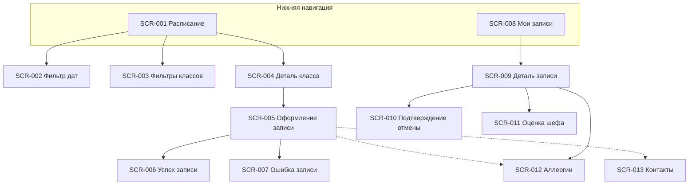

# Реестр экранов — кулинарная студия «Шеф-стол»

> Клиентское мобильное приложение Android (роль «Клиент», R-028).
> Источники: [2-requirements/](../2-requirements/), [1-elicitation/](../1-elicitation/).
> Постановки на дизайн: [screens/](screens/).

## Навигация приложения

---

## Реестр

| ID | Экран | Тип | Приоритет | Use Case / FR | Постановка |
| :- | :-- | :-- | :--: | :-- | :-- |
| SCR-001 | Расписание классов | Экран (вкладка) | Must | UC-001; FR-001–FR-005 | [SCR-001-schedule.md](screens/SCR-001-schedule.md) |
| SCR-002 | Фильтр периода дат | Bottom sheet | Must | FR-002; R-027 | [SCR-002-date-filter.md](screens/SCR-002-date-filter.md) |
| SCR-003 | Фильтры классов | Bottom sheet | Must | FR-003 | [SCR-003-class-filters.md](screens/SCR-003-class-filters.md) |
| SCR-004 | Деталь класса | Экран | Must | UC-002; FR-004, FR-015, FR-026 | [SCR-004-class-detail.md](screens/SCR-004-class-detail.md) |
| SCR-005 | Оформление записи | Экран | Must | UC-002; FR-006–FR-015, FR-028 | [SCR-005-booking-form.md](screens/SCR-005-booking-form.md) |
| SCR-006 | Успешная запись | Экран / modal | Must | UC-002; FR-009, FR-015 | [SCR-006-booking-success.md](screens/SCR-006-booking-success.md) |
| SCR-007 | Ошибка записи | Dialog / modal | Must | UC-002; FR-009–FR-011 | [SCR-007-booking-error.md](screens/SCR-007-booking-error.md) |
| SCR-008 | Мои записи | Экран (вкладка) | Must | UC-003; FR-016; NFR-009 | [SCR-008-my-bookings.md](screens/SCR-008-my-bookings.md) |
| SCR-009 | Деталь записи | Экран | Must | UC-003–UC-006; FR-017–FR-023 | [SCR-009-booking-detail.md](screens/SCR-009-booking-detail.md) |
| SCR-010 | Подтверждение отмены | Bottom sheet / Dialog | Must | UC-004; FR-017, FR-018 | [SCR-010-cancel-confirm.md](screens/SCR-010-cancel-confirm.md) |
| SCR-011 | Оценка шефа | Bottom sheet / modal | Must | UC-007; FR-024–FR-026 | [SCR-011-rate-chef.md](screens/SCR-011-rate-chef.md) |
| SCR-012 | Аллергии | Секция / Bottom sheet | Must | UC-009; FR-012–FR-014 | [SCR-012-allergies.md](screens/SCR-012-allergies.md) |
| SCR-013 | Контактные данные | Секция / Bottom sheet | Must | FR-006; FR-028 | [SCR-013-contact-profile.md](screens/SCR-013-contact-profile.md) |

---

## Сквозные NFR для всех экранов

| ID | Требование | Источник |
| :- | :-- | :-- |
| NFR-001 | Android-клиентский интерфейс | [NFR-001](../2-requirements/non-functional-requirements.md) |
| NFR-008 | Только русский язык | [NFR-008](../2-requirements/non-functional-requirements.md) |
| NFR-010 | Push-уведомления (deep link на SCR-009 / SCR-001) | FR-020, FR-023, FR-027 |
| NFR-009 | Офлайн: кэш «Мои записи» (SCR-008, SCR-009) | [NFR-009](../2-requirements/non-functional-requirements.md) |

---

## Статусы брони (отображение на SCR-008, SCR-009)

| Статус | Отображение | Действия клиента |
| :-- | :-- | :-- |
| Активна | Бейдж «Записан» | Отменить (SCR-010); изменить аллергии (SCR-012) |
| Отменена клиентом | Бейдж «Отменена вами» | — |
| Отменена студией | Бейдж + причина | Перезаписаться на другой класс (SCR-001) |
| Посещена | Бейдж «Посещена» | Оценить шефа (SCR-011) |

---

## Фильтры SCR-003 (MVP)

| Фильтр | Значения | Примечание |
| :-- | :-- | :-- |
| Время суток | Утро / День / Вечер | FR-003 |
| Уровень | Начинающий / Средний / Продвинутый | FR-003 |
| Тип кухни | Список из API | FR-003 |
| ~~Шеф~~ | — | **Не в MVP** |

---

## Отличия от скалодрома (task1)

| Аспект | «Шеф-стол» |
| :-- | :-- |
| Лист ожидания | **Нет** |
| Аллергии | **Обязательный шаг** (SCR-012) |
| Отмена | Порог **3 ч** (не 1 ч) |
| Прокат | Фартук / ножи; **не влияет на цену** |
| Фильтры | Время, уровень, кухня (**без шефа**) |
| Платформа | **Android** first |
