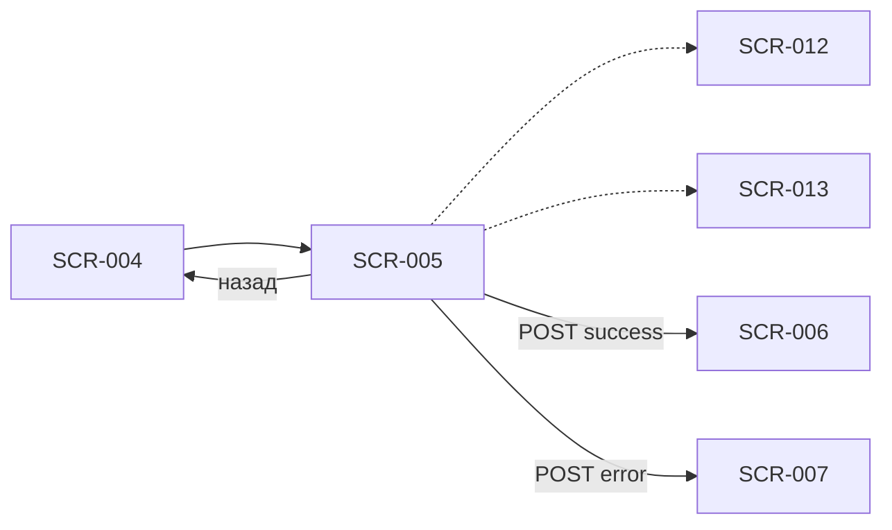

# Оформление записи

**ID:** SCR-005  
**Тип:** Экран  
**Домен:** 02. Бронирование  
**Приоритет:** Critical  
**Статус:** Актуален  
**Сессия клиента:** Не требуется (первая запись); ClientSession — Bearer при повторной записи  
**Дизайн-макет:** Figma — TBD · **Design brief:** [SCR-005-booking-form.md](SCR-005-booking-form.md)

> **Платформа:** Android (NFR-001) · **Язык UI:** только русский (NFR-008) · **Оплата:** на месте (FR-015).

---

## Содержание

- [Обзор](#обзор)
- [Навигация](#навигация)
- [Входные данные](#входные-данные)
- [Применяемые логики](#применяемые-логики)
- [Инициализация](#инициализация)
- [Используемые запросы](#используемые-запросы)
- [Макет экрана](#макет-экрана)
- [Элементы экрана](#элементы-экрана)
- [Состояния экрана](#состояния-экрана)
- [Связанные требования](#связанные-требования)
- [Критерии приёмки](#критерии-приёмки)

---

## Обзор

Экран сбора данных для бронирования кулинарного класса: контактные данные ([SCR-013](#секция-контактов-scr-013)), обязательный шаг аллергий ([SCR-012](#секция-аллергий-scr-012)), выбор экипировки (своё / прокат) и итоговая стоимость перед отправкой `createBooking`. Цена зависит **только от программы**; прокат на неё не влияет (FR-015). Закрывает FR-006, FR-007, FR-009, FR-012, FR-014, FR-015.

### User Story

> Как клиент, я хочу оформить запись на класс, указав контакты, аллергии и экипировку, чтобы студия подготовилась к моему визиту, а я увидел итоговую сумму к оплате на месте.

**Не в MVP:** лист ожидания при `NO_SPOTS` (FR-011) — только возврат к расписанию; фильтр по шефу; iOS.

---

## Навигация

### Входящая

| Источник | Триггер | Условие | Параметры |
| :-- | :-- | :-- | :-- |
| SCR-004 | CTA «Записаться» | `freeSpots > 0`, `status = OPEN` | `slotId` |
| SCR-009 → SCR-001 → SCR-004 | Перезапись после отмены студией | Профиль может быть заполнен | `slotId` |
| Push / deep link | Косвенный вход | Только через выбор слота (SCR-001 → SCR-004) | `slotId` |

### Исходящая

| Назначение | Триггер | Параметры |
| :-- | :-- | :-- |
| SCR-004 | «Назад» / системная кнопка «Назад» | — |
| SCR-006 | `createBooking` → 201 | `bookingId`, `sessionToken` |
| SCR-007 | `createBooking` → 403/409 или 5xx после retry | код ошибки |
| SCR-012 (sheet) | «Изменить» в сводке аллергий | `slotId`, `allergiesText` |
| SCR-013 (sheet) | «Изменить» в сводке контактов | `profile` |

> **Нижняя навигация:** 2 вкладки — «Расписание» (SCR-001) | «Мои записи» (SCR-008). Отдельной вкладки «Профиль» нет.



---

## Входные данные

| Название | Тип | Источник | Описание |
| :-- | :-- | :-- | :-- |
| `slotId` | uuid | Навигация | Идентификатор выбранного класса |
| `slot` | SlotDetail | API `getSlot` | Детали класса для сводки и проверки проката |
| `profile` | ClientProfile | API `getProfile` | Контакты и аллергии; 404 → режим первой записи |
| `profile.isComplete` | boolean | API `getProfile` | Inline-поля vs сводка контактов |
| `profile.isRegularClient` | boolean | API `getProfile` | Бейдж «Постоянный клиент» (FR-028) |
| `slot.rentalAvailability` | RentalAvailability | API `getSlot` | Доступность фартука и ножей |
| `slot.price` | decimal? | API `getSlot` | Цена программы для блока «Итого» |
| `allergiesText` | string | Локально / профиль | Текст аллергий, max 500 символов |
| `equipment` | EquipmentChoice | Локально | `mode`: OWN \| RENTAL; чекбоксы проката |
| `allergyConflict` | boolean | API `checkAllergyCompatibility` | Флаг для баннера FR-014 |

---

## Применяемые логики

| Логика | Элемент / триггер | Описание |
| :-- | :-- | :-- |
| [LOGIC-001_Контактный-профиль](../../5-mobile-app-spec/09_Логики/LOGIC-001_Контактный-профиль.md) | Секция SCR-013, валидация, submit | Режимы inline / сводка; бейдж постоянного клиента; upsert при `createBooking` |
| [LOGIC-003_Цена-класса](../../5-mobile-app-spec/09_Логики/LOGIC-003_Цена-класса.md) | Блок «Итого», CTA | Цена только от программы; прокат бесплатный; оплата на месте |
| [LOGIC-008_Паттерн-состояний-экрана](../../5-mobile-app-spec/09_Логики/LOGIC-008_Паттерн-состояний-экрана.md) | Загрузка, submit | Loading / Content / Error + Submitting на CTA |
| [LOGIC-009_Аллергии](../../5-mobile-app-spec/09_Логики/LOGIC-009_Аллергии.md) | Секция SCR-012, баннер | Обязательный шаг; `checkAllergyCompatibility`; предупреждение не блокирует запись |

---

## Инициализация

### Запросы при открытии

| № | operationId | Критичный | Условие |
| :-: | :-- | :--: | :-- |
| 1 | `getSlot` | Да | При открытии по `slotId` |
| 2 | `getProfile` | Нет | Параллельно; 404 → первая запись, inline-режимы SCR-012 / SCR-013 |

> После загрузки профиля с непустым `allergies` — предзаполнение секции SCR-012 и debounced `checkAllergyCompatibility`.

---

## Используемые запросы

### getSlot

**Метод:** GET  
**Путь:** `/slots/{slotId}`  
**Спецификация:** [../../api/openapi.yaml](../../api/openapi.yaml) → `getSlot`

**Обработка ответа:**

| HTTP / код | UI-реакция |
| :-- | :-- |
| 200 + data | Content: сводка класса, блок цены, настройка экипировки по `rentalAvailability` |
| 200 + data (`rentalFullyExhausted = true`) | Radio «Прокат» disabled; только «Со своим» + пояснение (FR-008) |
| 404 | Error state + «К расписанию» |
| 5xx / timeout | Error state + «Повторить» |

---

### getProfile

**Метод:** GET  
**Путь:** `/profile`  
**Спецификация:** [../../api/openapi.yaml](../../api/openapi.yaml) → `getProfile`

**Обработка ответа:**

| HTTP / код | UI-реакция |
| :-- | :-- |
| 200 + data (`isComplete = true`) | Сводки SCR-013 и SCR-012; CTA активен при валидной экипировке |
| 200 + data (`isComplete = false`) | Inline-поля SCR-013; аллергии — обязательный inline SCR-012 |
| 404 | Первая запись: пустые контакты и аллергии |
| 401 | Повтор без сессии → режим первой записи (inline) |
| 5xx / timeout | Snack; форма в режиме inline с ручным вводом |

---

### checkAllergyCompatibility

**Метод:** POST  
**Путь:** `/allergies/check`  
**Спецификация:** [../../api/openapi.yaml](../../api/openapi.yaml) → `checkAllergyCompatibility`

**Обработка ответа:**

| HTTP / код | UI-реакция |
| :-- | :-- |
| 200 + `hasConflict = true` | Amber-баннер под SCR-012 с `message`; CTA активен (FR-014) |
| 200 + `hasConflict = false` | Баннер скрыт |
| 4xx / 5xx | Баннер скрыт; submit не блокируется |

> Вызывается debounced после изменения `allergiesText` (≥ 3 символов) или при предзаполнении из профиля.

---

### updateProfile

**Метод:** PATCH  
**Путь:** `/profile`  
**Спецификация:** [../../api/openapi.yaml](../../api/openapi.yaml) → `updateProfile`

**Обработка ответа:**

| HTTP / код | UI-реакция |
| :-- | :-- |
| 200 + data | Закрытие sheet SCR-013; обновление сводки; сохранение `sessionToken` |
| 400 `VALIDATION_ERROR` | Inline-ошибки в sheet |
| 5xx / timeout | Snack + «Повторить» в sheet |

> Опционально при «Сохранить» в sheet SCR-013. При submit формы upsert выполняется неявно в `createBooking`.

---

### createBooking

**Метод:** POST  
**Путь:** `/bookings`  
**Спецификация:** [../../api/openapi.yaml](../../api/openapi.yaml) → `createBooking`

**Тело запроса (ключевые поля):**

| Поле | Источник UI |
| :-- | :-- |
| `slotId` | Навигация |
| `client.name`, `client.phone` | SCR-013 |
| `allergies.allergiesText` | SCR-012 |
| `allergies.menuWarningAcknowledged` | `true` при активном баннере FR-014 |
| `equipment.mode`, `rentalApron`, `rentalKnives` | Секция экипировки |

**Обработка ответа:**

| HTTP / код | UI-реакция |
| :-- | :-- |
| 201 + data | Сохранить `sessionToken`; переход SCR-006 с `booking.totalPrice` |
| 400 `VALIDATION_ERROR` | Inline-ошибки на SCR-005 / SCR-012 / SCR-013 |
| 403 `SLOT_REBOOK_FORBIDDEN` | SCR-007 (modal) |
| 409 `NO_SPOTS` | SCR-007 (modal, без waitlist CTA) |
| 409 `ONE_BOOKING_PER_DAY` | SCR-007 (modal) |
| 409 `SLOT_CANCELLED` | SCR-007 (modal) |
| 409 `RENTAL_UNAVAILABLE` | SCR-007 (modal) + рекомендация «со своим» |
| 5xx / timeout | Snack + retry submit; форма сохранена |

**Доменные коды createBooking:** `NO_SPOTS`, `ONE_BOOKING_PER_DAY`, `SLOT_CANCELLED`, `RENTAL_UNAVAILABLE`, `SLOT_REBOOK_FORBIDDEN`.

> При `RENTAL_UNAVAILABLE` после «Понятно» в SCR-007 клиент остаётся на SCR-005 и переключает экипировку на «Со своим» (FR-008). Форма под modal **остаётся заполненной**.

---

## Макет экрана

```
┌─────────────────────────────────┐
│ ← Оформление записи             │
├─────────────────────────────────┤
│ Краткая сводка класса           │
│ 📅 Ср, 9 июля · 18:00           │
│ 🍝 Итальянская кухня для        │
│    новичков · ~3 ч              │
│ 👨‍🍳 Шеф: Мария · ★ 4,8         │
├─────────────────────────────────┤
│ Контактные данные          SCR-013│
│ [🏷 Постоянный клиент]          │  ← если isRegularClient
│ Имя *     [________________]    │  ← или сводка + «Изменить»
│ Телефон * [+7 (___) ___-__-__]  │
├─────────────────────────────────┤
│ Аллергии                   SCR-012│
│ [ Укажите аллергии...      › ]  │  ← обязательный шаг
│ ⚠ Предупреждение (если есть)    │
├─────────────────────────────────┤
│ Экипировка                      │
│ ○ Со своим (фартук и ножи)      │
│ ○ Нужен прокат                  │
│   ☐ Фартук                      │
│   ☐ Набор ножей                 │
│ ℹ Прокат бесплатный             │
├─────────────────────────────────┤
│ Итого                           │
│ Класс               3 500 ₽     │
│ ─────────────────────────       │
│ К оплате на месте   3 500 ₽     │
│ ℹ Оплата в студии «Шеф-стол»    │
├─────────────────────────────────┤
│ [ Записаться · 3 500 ₽ ] sticky │
└─────────────────────────────────┘

--- Первая запись: inline SCR-012 ---

┌─────────────────────────────────┐
│ Аллергии и ограничения *        │
│ ┌─────────────────────────────┐ │
│ │ Например: орехи, глютен…    │ │
│ └─────────────────────────────┘ │
│ [ Нет аллергий ]                │
│ ⚠ Баннер FR-014 (если конфликт) │
└─────────────────────────────────┘

--- Прокат исчерпан ---

┌─────────────────────────────────┐
│ ○ Со своим (выбрано)            │
│ ○ Нужен прокат  (disabled)      │
│ ℹ Прокат закончился — можно     │
│   записаться со своим           │
└─────────────────────────────────┘

--- Submitting ---

┌─────────────────────────────────┐
│ [ ◌ Записаться ]  dim overlay   │
└─────────────────────────────────┘
```

---

## Элементы экрана

| Элемент | Описание | Источник данных | Валидация / поведение |
| :-- | :-- | :-- | :-- |
| Кнопка «Назад» | Возврат на SCR-004 | Навигация | Черновик формы не сохраняется; профиль на сервере — сохранён |
| Сводка класса | Компактный блок: дата, программа, шеф, рейтинг | `slot.*` | Формат даты «Ср, 9 июля · 18:00»; длительность `~3 ч` |
| CTA «Записаться · XXX ₽» | Primary, sticky | `slot.price`, [LOGIC-003](../../5-mobile-app-spec/09_Логики/LOGIC-003_Цена-класса.md) | Disabled до валидных контактов, аллергий и экипировки |
| Radio «Со своим» | Фартук и ножи клиента | Локально | По умолчанию при `rentalFullyExhausted`; чекбоксы скрыты |
| Radio «Нужен прокат» | Раскрывает чекбоксы | `slot.rentalAvailability` | Disabled при полном исчерпании проката |
| Чекбокс «Фартук» | Прокат фартука | Локально + API | Disabled с подписью «Нет в прокате» при недоступности |
| Чекбокс «Набор ножей» | Прокат ножей | Локально + API | Аналогично фартуку |
| Подпись «Прокат бесплатный» | Инфо FR-015 | — | Не добавлять строку проката в разбивку цены |
| Разбивка цены | Стоимость класса | `slot.price` | Одна строка «Класс»; без строк проката |
| Итого «К оплате на месте» | Сумма к оплате | `slot.price` | Равна цене программы при любом `equipment.mode` |
| Подпись «Оплата в студии» | Информационный блок | — | Нет интеграции с платёжными системами |
| Индикатор загрузки | Spinner на CTA | Локально | При Submitting; блокировка повторного тапа |
| Inline-ошибки | Под полями контактов / экипировки | Локальная валидация | Фокус на первое невалидное поле |

**Терминология:** **шеф**, **программа класса**, **тип кухни**; прокат (фартук, ножи) **не влияет на цену** (FR-015).

### Секция контактов (SCR-013)

Inline-секция на SCR-005; bottom sheet при тапе «Изменить» на повторной записи. Детали — [SCR-013-contact-profile.md](SCR-013-contact-profile.md), логика — [LOGIC-001](../../5-mobile-app-spec/09_Логики/LOGIC-001_Контактный-профиль.md).

| Элемент | Описание | Источник данных | Валидация / поведение |
| :-- | :-- | :-- | :-- |
| Заголовок секции | «Контактные данные» | — | — |
| Бейдж «Постоянный клиент» | Chip при `isRegularClient` | `profile.isRegularClient` | Read-only; приоритет на бэкенде (FR-028) |
| Поле «Имя» | Inline при первой записи | `profile.name` | 1–50 символов; «Укажите имя» |
| Поле «Телефон» | Маска +7 (XXX) XXX-XX-XX | `profile.phone` | Паттерн `^\+7\d{10}$`; «Введите корректный номер» |
| Сводка (повтор) | «{name} · +7 XXX ***-XX-XX» | `profile` | Тап «Изменить» → bottom sheet SCR-013 |
| Кнопка «Сохранить» (sheet) | PATCH профиля | `updateProfile` | Активна при изменениях и валидности |

### Секция аллергий (SCR-012)

Inline-секция на SCR-005 (обязательный шаг); bottom sheet при «Изменить» на повторной записи. Детали — [SCR-012-allergies.md](SCR-012-allergies.md), логика — [LOGIC-009](../../5-mobile-app-spec/09_Логики/LOGIC-009_Аллергии.md).

| Элемент | Описание | Источник данных | Валидация / поведение |
| :-- | :-- | :-- | :-- |
| Заголовок секции | «Аллергии и ограничения» | — | `*` при первой записи |
| Текстовое поле | TextArea, свободный текст | `allergiesText` | Max 500; без чекбоксов аллергенов (Q 3.2) |
| Chip «Нет аллергий» | Быстрый ввод «нет» | — | Не скрывает обязательность шага |
| Сводка (повтор) | 1–2 строки + «Изменить» | `profile.allergies` | Sheet SCR-012 при редактировании |
| Баннер предупреждения | Amber, иконка ⚠ | `checkAllergyCompatibility` | FR-014: не блокирует CTA; `menuWarningAcknowledged: true` при submit |
| Подсказка gate | «Укажите аллергии» | Локально | CTA disabled при пустом поле на первой записи |

---

## Состояния экрана

| Состояние | Условие | Отображение |
| :-- | :-- | :-- |
| Loading | `getSlot` / `getProfile` в процессе | Skeleton сводки и секций |
| Content | 200 `getSlot` | Полный контент формы |
| Error | 404 / 5xx `getSlot` | Баннер + «Повторить» / «К расписанию» |
| Offline | Нет сети при открытии | «Нет подключения к интернету» + retry (без кэша в MVP) |
| Первая запись | 404 / пустой профиль | Inline SCR-013 и SCR-012; CTA disabled до валидности |
| Повторная запись | `isComplete = true` | Сводки контактов и аллергий + «Изменить» |
| Постоянный клиент | `isRegularClient = true` | Бейдж в секции SCR-013 (FR-028) |
| Аллергии не указаны | Пустое поле, первая запись | CTA disabled + подсказка «Укажите аллергии» |
| Аллергии указаны | Непустой `allergiesText` | Превью в строке; иконка ✓ на повторной |
| Предупреждение аллергий | `hasConflict = true` | Amber-баннер (FR-014); CTA активен |
| Своё снаряжение | `equipment.mode = OWN` | Чекбоксы проката скрыты / disabled |
| Прокат выбран | `mode = RENTAL` + чекбоксы | Цена не меняется; выбор в теле `createBooking` |
| Прокат без выбора | `RENTAL`, ни один чекбокс | CTA disabled + «Выберите, что нужно взять в прокат» |
| Прокат исчерпан | `rentalFullyExhausted = true` | Radio «Прокат» disabled; только «Со своим» (FR-008) |
| Прокат частично | Только фартук или ножи | Недоступный чекбокс disabled + «Нет в прокате» |
| Submitting | `createBooking` в процессе | Spinner на CTA, dim overlay |
| Ошибка валидации | Локальная проверка fail | Inline-ошибки; submit не уходит |
| Ошибка бэкенда | 403/409 от `createBooking` | SCR-007 modal поверх формы |

> Сквозной паттерн — [LOGIC-008](../../5-mobile-app-spec/09_Логики/LOGIC-008_Паттерн-состояний-экрана.md).

### Сценарии

1. **Первая запись, своё снаряжение:** заполнить SCR-013 → указать аллергии (SCR-012) → «Со своим» → «Записаться» → loading → SCR-006.
2. **Повторная запись:** профиль и аллергии предзаполнены → при необходимости «Изменить» (sheet SCR-013 / SCR-012) → экипировка → submit → SCR-006.
3. **Прокат оба:** прокат → фартук и ножи → цена не меняется → submit → SCR-006.
4. **Предупреждение аллергий:** ввод → `checkAllergyCompatibility` → баннер → клиент продолжает → SCR-006 с `menuWarningAcknowledged: true`.
5. **Прокат исчерпан на форме:** только «Со своим» → submit → SCR-006.
6. **Гонка за место:** submit → `NO_SPOTS` → SCR-007 (без листа ожидания).
7. **Уже есть запись сегодня:** submit → `ONE_BOOKING_PER_DAY` → SCR-007.
8. **Прокат кончился между SCR-004 и submit:** `RENTAL_UNAVAILABLE` → SCR-007 → «Понятно» → «Со своим» → повторить.
9. **Отмена:** «Назад» → SCR-004; черновик формы не сохраняется.

---

## Связанные требования

| ID | Связь |
| :-- | :-- |
| FR-006 | Сбор имени и телефона при первой записи (секция SCR-013) |
| FR-007 | Выбор своего или прокатного снаряжения |
| FR-008 | При исчерпании проката — только «со своим» на форме и в SCR-007 |
| FR-009 | Отправка `createBooking` и обработка ответа |
| FR-010 | Лимит 1 запись в день — `ONE_BOOKING_PER_DAY` через SCR-007 |
| FR-011 | При `NO_SPOTS` нет листа ожидания |
| FR-012 | Обязательный шаг аллергий — секция SCR-012 |
| FR-014 | Предупреждение при несовместимости аллергий с меню |
| FR-015 | Цена только от программы; оплата на месте; прокат бесплатный |
| FR-022 | `SLOT_REBOOK_FORBIDDEN` — запрет повторной записи на отменённый слот |
| FR-028 | Бейдж «Постоянный клиент»; приоритет записи на бэкенде |
| UC-002 | Оформление записи на класс |
| UC-009 | Указание аллергий в потоке записи |
| US-006 | Клиент указывает контакты при записи |
| US-007 | Клиент указывает аллергии при записи |
| US-008 | Клиент выбирает экипировку |

---

## Критерии приёмки

| ID | Критерий |
| :-- | :-- |
| AC-001 | **Дано** пользователь перешёл из SCR-004 с `slotId`, **Когда** `getSlot` и `getProfile` завершились, **Тогда** отображаются сводка класса, секции SCR-013, SCR-012, экипировка и блок «Итого». |
| AC-002 | **Дано** пустой профиль (404 `getProfile`), **Когда** открыт SCR-005, **Тогда** контакты и аллергии в inline-режиме, CTA «Записаться» disabled до заполнения обязательных полей. |
| AC-003 | **Дано** `isComplete = true` и непустые аллергии в профиле, **Когда** экран в Content, **Тогда** показаны сводки контактов и аллергий с ссылками «Изменить», CTA активен при валидной экипировке. |
| AC-004 | **Дано** `isRegularClient = true`, **Когда** отображается секция SCR-013, **Тогда** виден бейдж «Постоянный клиент». |
| AC-005 | **Дано** выбран прокат фартука и ножей, **Когда** отображается блок «Итого», **Тогда** сумма равна цене программы без дополнительных строк проката (FR-015). |
| AC-006 | **Дано** клиент ввёл аллергии с конфликтом меню, **Когда** `checkAllergyCompatibility` вернул `hasConflict = true`, **Тогда** показан amber-баннер, CTA «Записаться» остаётся активным. |
| AC-007 | **Дано** активный баннер FR-014, **Когда** пользователь нажимает «Записаться», **Тогда** в `createBooking` передаётся `menuWarningAcknowledged: true`. |
| AC-008 | **Дано** `rentalFullyExhausted = true`, **Когда** экран загружен, **Тогда** radio «Прокат» disabled, выбрано «Со своим», показано пояснение (FR-008). |
| AC-009 | **Дано** валидная форма, **Когда** `createBooking` вернул 201, **Тогда** сохранён `sessionToken`, выполнен переход на SCR-006 с `booking.totalPrice`. |
| AC-010 | **Дано** `createBooking` вернул `NO_SPOTS`, **Когда** открывается SCR-007, **Тогда** на ошибке отсутствует CTA листа ожидания (FR-011). |
| AC-011 | **Дано** `createBooking` вернул `RENTAL_UNAVAILABLE`, **Когда** пользователь закрыл SCR-007, **Тогда** форма SCR-005 сохранена, можно переключить на «Со своим» и повторить submit. |
| AC-012 | **Дано** невалидный телефон, **Когда** пользователь нажимает «Записаться», **Тогда** показана inline-ошибка, запрос `createBooking` не отправляется. |
