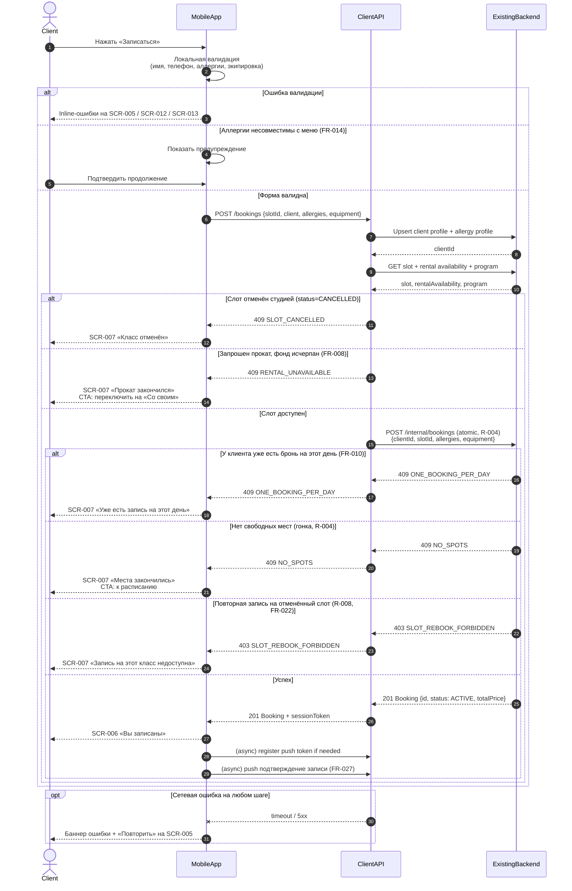

# API Sequence — createBooking

> Этап проектирования. Источники: [data-model.md](data-model.md), UC-002, FR-006–FR-015, R-004;
> [customer-questions.md](../1-elicitation/customer-questions.md) (Q 1.1, 1.3, 2.3, 2.4, 3.1–3.4).
>
> Диаграмма описывает поток **создания брони** из клиентского приложения через Client API в Existing Backend.

---

## 1. Участники

| Участник | Описание |
| :-- | :-- |
| **Client** | Пользователь (клиент кулинарной студии) |
| **MobileApp** | Клиентское Android-приложение (SCR-005 → SCR-006 / SCR-007) |
| **ClientAPI** | API слоя клиентского приложения (контракт для mobile) |
| **ExistingBackend** | Существующий бэкенд студии — black-box, источник истины (R-004) |

---

## 2. Предусловия

- Клиент выбрал слот с `free_spots > 0` и `status = OPEN` (UC-002).
- На SCR-005 заполнены: контакты (имя, телефон), **аллергии** (обязательный шаг, SCR-012), выбор экипировки.
- У клиента нет другой активной записи на этот календарный день (FR-010).

---

## 3. Диаграмма последовательности (с ветками)



---

## 4. Описание шагов

### 4.1. Локальная валидация (MobileApp)

| Шаг | Проверка | Результат |
| :-- | :-- | :-- |
| Имя | Непустое (FR-006) | Ошибка на SCR-005 / SCR-013 |
| Телефон | Формат +7, 10 цифр | Ошибка на SCR-005 / SCR-013 |
| Аллергии | Непустое при первой записи (FR-012) | Ошибка на SCR-012 |
| Экипировка | При `mode=RENTAL` — хотя бы фартук или ножи | Ошибка на SCR-005 |
| Несовместимость меню | Предупреждение, не блокировка (FR-014) | Баннер + подтверждение |

### 4.2. Upsert профиля и аллергий (ClientAPI → Backend)

- Сохранить `Client.name`, `Client.phone` при первой записи или изменении (FR-006).
- Сохранить `AllergyProfile.allergies_text` (FR-012).
- Возвращает `clientId` и `sessionToken` для последующих запросов.

### 4.3. Pre-check слота (ClientAPI)

- Повторное чтение `Slot`, `RentalAvailability`, `ClassProgram` перед атомарным create.
- Ранний отказ при `CANCELLED`.
- При `equipment.mode = RENTAL` и исчерпанном фонде — `409 RENTAL_UNAVAILABLE` (клиент может повторить с `OWN`).

### 4.4. Атомарное создание (ExistingBackend, R-004)

Бэкенд в одной транзакции:
1. Блокирует слот.
2. Проверяет `free_spots > 0`.
3. Проверяет лимит **1 бронь/день** на клиента (FR-010).
4. Проверяет запрет повторной записи на `CANCELLED` слот (R-008, FR-022).
5. При `equipment.mode = RENTAL` — проверяет прокатный фонд (фартук, ножи).
6. Применяет **приоритет записи** для постоянных клиентов при гонке (FR-028) — на стороне бэкенда.
7. Создаёт `Booking` со статусом `ACTIVE`, `total_price` = цена программы; уменьшает `free_spots`.

---

## 5. Коды ответов Client API

| HTTP | Код | Условие | UI |
| :--: | :-- | :-- | :-- |
| 201 | — | Бронь создана | SCR-006 |
| 400 | `VALIDATION_ERROR` | Невалидное тело запроса | SCR-005 / SCR-012 inline |
| 403 | `SLOT_REBOOK_FORBIDDEN` | Слот ранее отменён студией | SCR-007 |
| 409 | `NO_SPOTS` | Мест нет (гонка) | SCR-007 → SCR-001 |
| 409 | `ONE_BOOKING_PER_DAY` | Уже есть бронь на дату | SCR-007 |
| 409 | `SLOT_CANCELLED` | Класс отменён студией | SCR-007 |
| 409 | `RENTAL_UNAVAILABLE` | Прокат исчерпан при mode=RENTAL | SCR-007 → «Со своим» |
| 5xx / timeout | `SERVER_ERROR` | Ошибка бэкенда / сеть | Retry на SCR-005 |

> **Примечание:** лист ожидания **не** предусмотрен (FR-011). При `NO_SPOTS` — только возврат к расписанию.

---

## 6. Тело запроса POST /bookings

```json
{
  "slotId": "uuid",
  "client": {
    "name": "Иван",
    "phone": "+79001234567"
  },
  "allergies": {
    "allergiesText": "Арахис, лактоза",
    "menuWarningAcknowledged": true
  },
  "equipment": {
    "mode": "RENTAL",
    "rentalApron": true,
    "rentalKnives": false
  }
}
```

---

## 7. Тело ответа 201 Created

```json
{
  "id": "uuid",
  "slotId": "uuid",
  "status": "ACTIVE",
  "totalPrice": 3500.00,
  "equipment": {
    "mode": "RENTAL",
    "rentalApron": true,
    "rentalKnives": false
  },
  "allergies": {
    "allergiesText": "Арахис, лактоза"
  },
  "createdAt": "2026-07-03T10:00:00+03:00",
  "sessionToken": "eyJhbGciOiJIUzI1NiIsInR5cCI6IkpXVCJ9..."
}
```

---

## 8. Связанные сценарии

| Сценарий | Документ |
| :-- | :-- |
| Отмена брони клиентом (≥ 3 ч / < 3 ч) | UC-004, FR-017–FR-018 |
| Отмена класса студией | UC-005, FR-019–FR-022 |
| Перенос класса | UC-006, FR-023 |
| Изменение аллергий в записи | UC-009, FR-013 |
| Оценка шефа | UC-007, FR-024–FR-026 |
