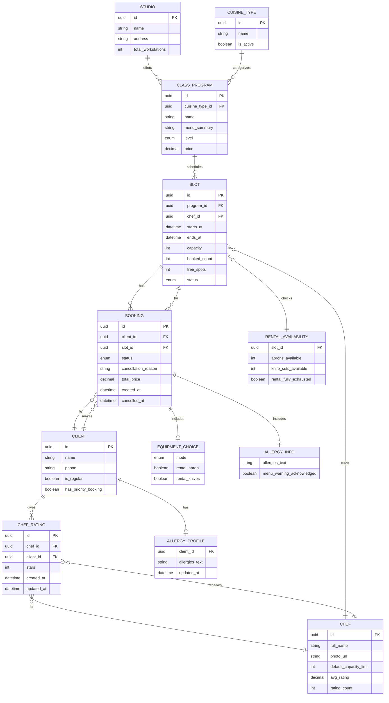
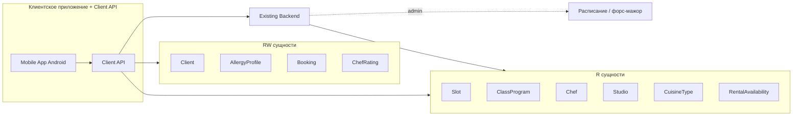

# Модель данных — кулинарная студия «Шеф-стол»

> Этап проектирования. Источники: [domain-description.md](../1-elicitation/domain-description.md),
> [2-requirements/](../2-requirements/), [customer-questions.md](../1-elicitation/customer-questions.md),
> [brief-cooking.md](../0-customer-brief/brief-cooking.md) (R-004, R-008, R-015, R-027).
>
> Каноническая схема для клиентского контура — **контракт API** (R-015). Бэкенд студии — источник истины
> для расписания и атомарности бронирования (R-004).

---

## 1. ER-диаграмма

---

## 2. Матрица доступа клиентского приложения

Обозначения:
- **R** — только чтение (данные приходят из бэкенда, приложение не изменяет)
- **RW** — чтение и запись через Client API (приложение инициирует изменение)

| Сущность | Доступ | Кто владеет данными | Операции клиента |
| :-- | :--: | :-- | :-- |
| **Studio** (студия) | **R** | Бэкенд / админка | Просмотр названия, адреса |
| **CuisineType** (тип кухни) | **R** | Бэкенд / админка | Фильтр расписания (FR-003) |
| **ClassProgram** (программа класса) | **R** | Бэкенд / админка | Просмотр; меню (кратко); цена (FR-015) |
| **Chef** (шеф) | **R** | Бэкенд / админка | Просмотр; рейтинг — агрегат из оценок (FR-026) |
| **Slot** (класс / слот) | **R** | Бэкенд / админка | Просмотр расписания; `free_spots` обновляет бэкенд |
| **RentalAvailability** (прокатный фонд) | **R** | Бэкенд / админка | Проверка проката фартука/ножей на слот (FR-008) |
| **Client** (клиент / профиль) | **RW** | Client API + бэкенд | Создание при первой записи (имя, телефон — FR-006) |
| **AllergyProfile** (профиль аллергий) | **RW** | Client API + бэкенд | Сохранение текста аллергий (FR-012) |
| **Booking** (бронь / запись) | **RW** | Client API + бэкенд | **Создание**; **отмена** клиентом; чтение своих записей |
| **EquipmentChoice** (экипировка) | **RW** | Часть Booking | Задаётся при создании брони (FR-007); не влияет на цену |
| **AllergyInfo** (аллергии в брони) | **RW** | Часть Booking | Текст при create/update (FR-012, FR-013) |
| **ChefRating** (оценка шефа) | **RW** | Client API + бэкенд | **Create/update** после посещения (FR-024, FR-025) |

**Изменяются только бэкендом** (клиент лишь получает обновления):
- Статус слота при отмене / переносе класса студией
- Статус брони → `CANCELLED_BY_STUDIO` + `cancellation_reason` (R-008)
- Статус брони → `ATTENDED` после класса
- `booked_count` / `free_spots` слота
- Метка `is_regular` / `has_priority_booking` (FR-028) — устанавливается бэкендом

**Не в MVP (отсутствуют в модели клиента):**
- **WaitlistEntry** — лист ожидания не реализуется (FR-011)

---

## 3. Описание сущностей

### 3.1. Studio (студия)

| Поле | Тип | Описание |
| :-- | :-- | :-- |
| `id` | UUID | Идентификатор |
| `name` | string | Название («Шеф-стол») |
| `address` | string | Адрес площадки (R-015) |
| `total_workstations` | int | Всего рабочих мест (12) |

**Доступ:** R · **Источник:** domain §2, brief

---

### 3.2. CuisineType (тип кухни)

| Поле | Тип | Описание |
| :-- | :-- | :-- |
| `id` | UUID | Идентификатор |
| `name` | string | Название (итальянская, азиатская и т. п.) |
| `is_active` | boolean | Доступен для фильтра |

**Доступ:** R · **Связи:** CuisineType 1—N ClassProgram · **Источник:** FR-003

---

### 3.3. ClassProgram (программа класса)

| Поле | Тип | Описание |
| :-- | :-- | :-- |
| `id` | UUID | Идентификатор |
| `cuisine_type_id` | UUID FK | Тип кухни для фильтра |
| `name` | string | Название программы |
| `menu_summary` | string | Краткое меню / что готовим (SCR-004, FR-004) |
| `level` | enum | `BEGINNER` \| `INTERMEDIATE` \| `ADVANCED` — фильтр (FR-003) |
| `price` | decimal | Цена класса (FR-015); прокат **не** влияет |

**Доступ:** R · **Источник:** domain §2–3, FR-015

---

### 3.4. Chef (шеф)

| Поле | Тип | Описание |
| :-- | :-- | :-- |
| `id` | UUID | Идентификатор |
| `full_name` | string | ФИО |
| `photo_url` | string? | Фото |
| `default_capacity_limit` | int | Лимит группы для этого шефа: **8 или 12** (Q 2.1) |
| `avg_rating` | decimal | Средний рейтинг (публичный, FR-026) |
| `rating_count` | int | Число оценок |

**Доступ:** R · **Связи:** Chef 1—N Slot · **Источник:** domain §2–3, FR-026

**Правило:** `Slot.capacity` определяется настройкой **шефа**, ведущего класс (не отдельным типом программы).

---

### 3.5. Slot (слот / кулинарный класс)

| Поле | Тип | Описание |
| :-- | :-- | :-- |
| `id` | UUID | Идентификатор |
| `program_id` | UUID FK | Программа класса |
| `chef_id` | UUID FK | Шеф |
| `starts_at` | datetime | Начало |
| `ends_at` | datetime | Окончание (~3 ч от начала) |
| `capacity` | int | Вместимость (8 или 12 — от шефа) |
| `booked_count` | int | Занято мест |
| `free_spots` | int | Свободно мест |
| `status` | enum | `OPEN` \| `FULL` \| `CANCELLED` \| `RESCHEDULED` |

**Доступ:** R (клиент); изменение счётчиков и статуса — бэкенд · **Источник:** domain §2–3, FR-001–004, R-027

**Правила:**
- `status = CANCELLED` — класс отменён студией; повторная запись запрещена (R-008, FR-022)
- `status = FULL` — мест нет; лист ожидания **не** предусмотрен (FR-011)
- `status = RESCHEDULED` — перенос времени/шефа (FR-023); клиент получает push

---

### 3.6. RentalAvailability (доступность проката на слот)

| Поле | Тип | Описание |
| :-- | :-- | :-- |
| `slot_id` | UUID FK | Слот |
| `aprons_available` | int | Свободно фартуков |
| `knife_sets_available` | int | Свободно наборов ножей |
| `rental_fully_exhausted` | boolean | Прокат полностью исчерпан |

**Доступ:** R · **Источник:** FR-008, R-015

**Правило (FR-008):** при исчерпании проката запись возможна только с `equipment.mode = OWN`.

---

### 3.7. Client (клиент)

| Поле | Тип | Описание |
| :-- | :-- | :-- |
| `id` | UUID | Идентификатор |
| `name` | string | Имя (FR-006) |
| `phone` | string | Телефон (FR-006) |
| `is_regular` | boolean | Метка постоянного клиента (FR-028) |
| `has_priority_booking` | boolean | Приоритет записи (FR-028) |

**Доступ:** RW · **Источник:** domain §2, FR-006, FR-028

---

### 3.8. AllergyProfile (профиль аллергий клиента)

| Поле | Тип | Описание |
| :-- | :-- | :-- |
| `client_id` | UUID FK | Клиент |
| `allergies_text` | string | Свободный текст (FR-012) |
| `updated_at` | datetime | Последнее изменение |

**Доступ:** RW · **Источник:** FR-012, FR-013, UC-009

---

### 3.9. Booking (бронь / запись)

| Поле | Тип | Описание |
| :-- | :-- | :-- |
| `id` | UUID | Идентификатор |
| `client_id` | UUID FK | Клиент |
| `slot_id` | UUID FK | Слот |
| `status` | enum | См. таблицу статусов ниже |
| `cancellation_reason` | string? | Причина при отмене студией (R-008) |
| `equipment` | EquipmentChoice | Вложенный выбор экипировки |
| `allergies` | AllergyInfo | Аллергии на момент записи |
| `total_price` | decimal | Цена программы (оплата на месте) |
| `created_at` | datetime | Время создания |
| `cancelled_at` | datetime? | Время отмены |

**Статусы `Booking.status`:**

| Значение | Описание | Кто устанавливает |
| :-- | :-- | :-- |
| `ACTIVE` | Запись подтверждена | Client API / бэкенд при create |
| `CANCELLED_BY_CLIENT` | Отменена клиентом | Client API при cancel |
| `CANCELLED_BY_STUDIO` | Отменена студией | Бэкенд (форс-мажор, R-008) |
| `ATTENDED` | Класс посещён | Бэкенд после занятия |

**Доступ:** RW · **Источник:** domain §2–3, FR-009–FR-022

**Правила:**
- Не более **1 активной брони в день** на клиента (FR-010)
- Один участник на одну запись (FR-010)
- При отмене клиентом за **≥ 3 ч** место освобождается сразу (FR-017)
- Поздняя отмена (< 3 ч) — учёт на бэкенде; штрафов в MVP нет (FR-018)

---

### 3.10. EquipmentChoice (выбор экипировки)

Вложенный объект в `Booking`, не отдельная таблица в клиентском API.

| Поле | Тип | Описание |
| :-- | :-- | :-- |
| `mode` | enum | `OWN` \| `RENTAL` |
| `rental_apron` | boolean | Прокат фартука |
| `rental_knives` | boolean | Прокат набора ножей |

**Доступ:** RW (при создании брони) · **Источник:** FR-007

**Правило:** выбор **не влияет на `total_price`** (FR-015, Q 2.3).

---

### 3.11. AllergyInfo (аллергии в брони)

Вложенный объект в `Booking` и профиле клиента.

| Поле | Тип | Описание |
| :-- | :-- | :-- |
| `allergies_text` | string | Свободный текст (FR-012) |
| `menu_warning_acknowledged` | boolean | Клиент подтвердил предупреждение о несовместимости (FR-014) |

**Доступ:** RW · **Источник:** FR-012–FR-014, UC-009

---

### 3.12. ChefRating (оценка шефа)

| Поле | Тип | Описание |
| :-- | :-- | :-- |
| `id` | UUID | Идентификатор |
| `chef_id` | UUID FK | Шеф |
| `client_id` | UUID FK | Клиент |
| `stars` | int | 1–5 (FR-024) |
| `created_at` | datetime | Первая оценка |
| `updated_at` | datetime | Последнее изменение |

**Доступ:** RW (create/update клиентом) · **Источник:** FR-024–FR-026

**Правила:**
- Только после `Booking.status = ATTENDED`
- Срок — **в течение недели** после класса (FR-024)
- **Один клиент — одна оценка на шефа**; можно изменить (FR-025)
- Без текстового отзыва в MVP
- Агрегируется в `Chef.avg_rating`

---

## 4. Ключевые связи и кардинальности

| Связь | Кардинальность | Комментарий |
| :-- | :-- | :-- |
| Studio → ClassProgram | 1:N | |
| CuisineType → ClassProgram | 1:N | Фильтр «тип кухни» |
| Chef → Slot | 1:N | Лимит 8/12 — на уровне шефа |
| ClassProgram → Slot | 1:N | Цена — от программы |
| Client → Booking | 1:N | Макс. 1 ACTIVE в день (FR-010) |
| Slot → Booking | 1:N | Атомарная проверка мест (R-004) |
| Client → ChefRating | 1:N | Уникальность пара (client, chef) |
| Chef → ChefRating | 1:N | Агрегируется в `avg_rating` |
| Client → AllergyProfile | 1:0..1 | Текст аллергий |

---

## 5. Граница Client API ↔ Existing Backend

**Existing Backend** создаёт и изменяет: Slot, ClassProgram, Chef, CuisineType, расписание, отмены/переносы студией, статус `ATTENDED`, метки постоянного клиента.

**Client API** создаёт и изменяет: Client, AllergyProfile, Booking (create/cancel), ChefRating; проксирует чтение остальных сущностей.
