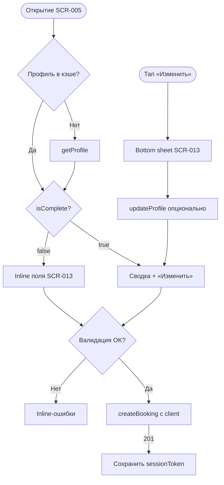

# LOGIC-001 — Контактный профиль

**ID:** LOGIC-001  
**Тип:** Логика  
**Приоритет:** Critical  
**Статус:** Актуален

---

## Обзор

Управление контактными данными клиента (имя, телефон) при первой записи и при редактировании
на [SCR-005](../../3-design-brief/screens/SCR-005-booking-form.md) / [SCR-013](../../3-design-brief/screens/SCR-013-contact-profile.md).
Отдельного экрана входа и вкладки «Профиль» в MVP нет (Q 1.1). Идентификация достаточна именем
и телефоном; после upsert бэкенд выдаёт `sessionToken` для `ClientSession`.

Метка **«Постоянный клиент»** и **приоритет записи** (`hasPriorityBooking`) — read-only из API (FR-028).

---

## Точки применения

| Экран | Элемент / триггер |
| :-- | :-- |
| [SCR-005](../../3-design-brief/screens/SCR-005-booking-form.md) | Открытие формы, валидация перед submit, inline-секция контактов |
| [SCR-013](../../3-design-brief/screens/SCR-013-contact-profile.md) | Поля имя/телефон, бейдж «Постоянный клиент», sheet «Изменить» |

---

## Флоу

---

## Описание логики

### Режимы отображения

| Условие | UI |
| :-- | :-- |
| `isComplete = false` или 404 `getProfile` | Inline-поля «Имя» и «Телефон» на SCR-005 |
| `isComplete = true` | Сводка «{name} · +7 XXX ***-XX-XX» + «Изменить» |
| `isRegularClient = true` | Бейдж «Постоянный клиент» (FR-028) |
| `hasPriorityBooking = true` | Только read-only; приоритет применяется на бэкенде при гонке |

### Валидация

| Поле | Правило | Сообщение |
| :-- | :-- | :-- |
| Имя | Непустое, 1–50 символов после trim | «Укажите имя» |
| Телефон | Паттерн `^\+7\d{10}$` (Q 1.1) | «Введите корректный номер» |

Валидация: локально на SCR-005; на сервере — 400 `VALIDATION_ERROR`.

### Сохранение профиля

1. **Явный:** `updateProfile` при «Сохранить» в sheet SCR-013.
2. **Неявный:** upsert в составе `createBooking` (api-sequence §4.2).

После 201 — сохранить `sessionToken` из ответа.

---

## Входные / выходные данные

| Параметр | Тип | Направление | Описание |
| :-- | :-- | :--: | :-- |
| `profile.name` | string | in/out | Имя клиента |
| `profile.phone` | string | in/out | Телефон `+7XXXXXXXXXX` |
| `profile.isComplete` | boolean | in | Режим inline vs сводка |
| `profile.isRegularClient` | boolean | in | Бейдж постоянного клиента |
| `profile.hasPriorityBooking` | boolean | in | Приоритет записи (read-only) |
| `client` | `ClientContacts` | out | Тело `createBooking.client` |
| `sessionToken` | string | out | JWT после upsert |

---

## Связанные требования

| ID | Описание |
| :-- | :-- |
| FR-006 | Имя и телефон при записи |
| FR-028 | Метка и приоритет постоянного клиента |
| Q 1.1 | Имя + телефон достаточно |
| NFR-008 | Сообщения на русском |

**API:** [../../api/openapi.yaml](../../api/openapi.yaml) → `getProfile`, `updateProfile`, `createBooking`

---

## Критерии приёмки

| ID | Критерий |
| :-- | :-- |
| AC-L-001 | **Дано** пустой профиль, **Когда** первая запись, **Тогда** требуются имя и телефон, CTA disabled до валидности. |
| AC-L-002 | **Дано** невалидный телефон, **Когда** submit, **Тогда** inline-ошибка, `createBooking` не уходит. |
| AC-L-003 | **Дано** `isComplete = true`, **Когда** открыт SCR-005, **Тогда** сводка контактов вместо пустых полей. |
| AC-L-004 | **Дано** `isRegularClient = true`, **Когда** отображается секция, **Тогда** бейдж «Постоянный клиент» виден. |
| AC-L-005 | **Дано** первая успешная запись, **Когда** `createBooking` → 201, **Тогда** `sessionToken` сохранён локально. |
