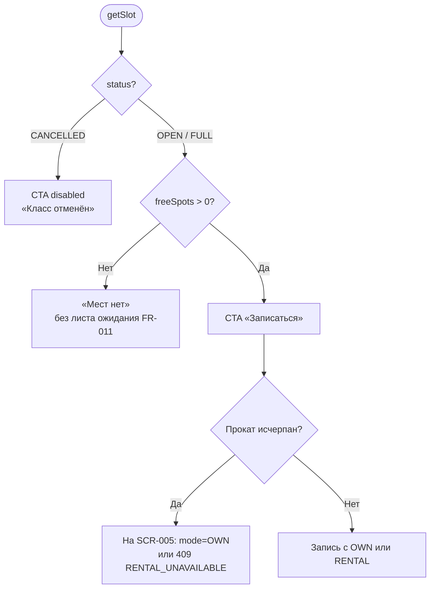

# LOGIC-002 — Доступность слота

**ID:** LOGIC-002  
**Тип:** Логика  
**Приоритет:** Critical  
**Статус:** Актуален

---

## Обзор

Определяет доступность кулинарного класса для записи на основе `SlotDetail` / `SlotSummary`
из API. Учитывает `freeSpots`, `status`, `isBookable` и прокатный фонд (`rentalAvailability`).

**Отличие от скалодрома:** при исчерпании проката запись **возможна со своим снаряжением** (FR-008);
лист ожидания **не реализуется** (FR-011).

---

## Точки применения

| Экран | Элемент / триггер |
| :-- | :-- |
| [SCR-004](../../3-design-brief/screens/SCR-004-class-detail.md) | CTA «Записаться», баннер проката, счётчик мест |
| [SCR-005](../../3-design-brief/screens/SCR-005-booking-form.md) | Pre-check перед `createBooking`; выбор OWN при исчерпании проката |
| [SCR-007](../../3-design-brief/screens/SCR-007-booking-error.md) | Коды `NO_SPOTS`, `RENTAL_UNAVAILABLE`, `SLOT_CANCELLED` |

---

## Флоу

---

## Описание логики

### Правила CTA на SCR-004

| Условие | UI |
| :-- | :-- |
| `status = CANCELLED` | «Класс отменён студией»; CTA disabled (FR-022) |
| `freeSpots = 0` | «Мест нет»; CTA disabled; **без** «В лист ожидания» (FR-011) |
| `freeSpots > 0`, `status = OPEN` | CTA **«Записаться»** активна |
| `rentalFullyExhausted = true` | Инфо: «Прокат закончился — можно записаться со своим снаряжением» (FR-008) |

### Отображение мест

- Формат: **«Свободно X из Y»** (`freeSpots`, `capacity`).
- Лимит 8/12 — **от шефа**, только из API.

### Pre-check на SCR-005

Перед `createBooking` — повторный `getSlot`. При `equipment.mode = RENTAL` и исчерпанном
фонде — `409 RENTAL_UNAVAILABLE`; UI предлагает переключить на «Со своим».

### Коды ошибок createBooking

| ErrorCode | UI (SCR-007) |
| :-- | :-- |
| `NO_SPOTS` | «Места закончились» → SCR-001 |
| `SLOT_CANCELLED` | «Класс отменён» |
| `RENTAL_UNAVAILABLE` | «Прокат закончился» → CTA «Со своим» |
| `ONE_BOOKING_PER_DAY` | «Уже есть запись на этот день» |
| `SLOT_REBOOK_FORBIDDEN` | «Запись на этот класс недоступна» |

---

## Входные / выходные данные

| Параметр | Тип | Направление | Описание |
| :-- | :-- | :--: | :-- |
| `freeSpots`, `capacity`, `status` | — | in | Из API |
| `rentalAvailability.rentalFullyExhausted` | boolean | in | Исчерпан прокат |
| `ctaEnabled` | boolean | out | Доступность «Записаться» |
| `spotsLabel` | string | out | «Свободно X из Y» |

---

## Связанные требования

| ID | Описание |
| :-- | :-- |
| FR-008 | Запись «со своим» при исчерпании проката |
| FR-009–FR-011 | Результат бронирования; без waitlist |
| FR-022 | Запрет повторной записи на отменённый слот |
| UC-002 | Запись на класс |

**API:** [../../api/openapi.yaml](../../api/openapi.yaml) → `getSlot`, `listSlots`, `createBooking`

---

## Критерии приёмки

| ID | Критерий |
| :-- | :-- |
| AC-L-001 | **Дано** `freeSpots = 0`, **Когда** SCR-004, **Тогда** CTA disabled, текста «лист ожидания» нет. |
| AC-L-002 | **Дано** `freeSpots > 0`, `status = OPEN`, **Когда** SCR-004, **Тогда** CTA «Записаться» активна. |
| AC-L-003 | **Дано** `rentalFullyExhausted = true`, **Когда** SCR-004, **Тогда** показана подсказка про «со своим», CTA «Записаться» активна. |
| AC-L-004 | **Дано** `409 RENTAL_UNAVAILABLE` при submit, **Когда** SCR-007, **Тогда** CTA переключения на OWN. |
| AC-L-005 | **Дано** `status = CANCELLED`, **Когда** SCR-004, **Тогда** CTA disabled. |
