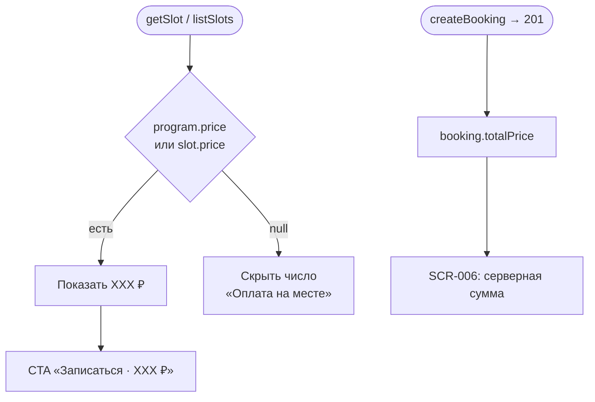

# LOGIC-003 — Цена класса

**ID:** LOGIC-003  
**Тип:** Логика  
**Приоритет:** High  
**Статус:** Актуален

---

## Обзор

Отображение стоимости кулинарного класса. Цена определяется **программой класса** (FR-015).
Выбор проката (фартук, ножи) **не влияет** на `totalPrice` (Q 2.3). Оплата **на месте** в студии.

---

## Точки применения

| Экран | Элемент / триггер |
| :-- | :-- |
| [SCR-004](../../3-design-brief/screens/SCR-004-class-detail.md) | Блок цены программы |
| [SCR-005](../../3-design-brief/screens/SCR-005-booking-form.md) | Сумма на CTA «Записаться · XXX ₽» |
| [SCR-006](../../3-design-brief/screens/SCR-006-booking-success.md) | «К оплате на месте: XXX ₽» |
| [SCR-008](../../3-design-brief/screens/SCR-008-my-bookings.md) | Сумма в карточке |
| [SCR-009](../../3-design-brief/screens/SCR-009-booking-detail.md) | `totalPrice` в детали |

---

## Флоу

---

## Описание логики

### Источник цены

| Поле | Источник |
| :-- | :-- |
| `slot.price` / `programInfo.price` | `getSlot`, `listSlots` |
| `booking.totalPrice` | `createBooking` 201 — **источник истины** после записи |

### Правила

| Условие | Поведение |
| :-- | :-- |
| Любой `equipment.mode` | Цена **не пересчитывается** на клиенте |
| `price = null` | Число скрыто; подпись «Оплата на месте» |
| После 201 | Показывать `booking.totalPrice`, не локальный preview |

### Подпись UI

«Оплата на месте в студии» (FR-015).

---

## Входные / выходные данные

| Параметр | Тип | Описание |
| :-- | :-- | :-- |
| `slot.price` | decimal? | Цена из API |
| `booking.totalPrice` | decimal | Серверный итог после 201 |
| `displayPrice` | decimal? | Для UI до/после записи |

---

## Связанные требования

| ID | Описание |
| :-- | :-- |
| FR-015 | Цена от программы; оплата на месте |
| Q 2.3 | Прокат не влияет на цену |
| R-015 | Числа из API |

**API:** [../../api/openapi.yaml](../../api/openapi.yaml) → `getSlot`, `createBooking`

---

## Критерии приёмки

| ID | Критерий |
| :-- | :-- |
| AC-L-001 | **Дано** выбран прокат фартука, **Когда** отображается цена на SCR-005, **Тогда** сумма = цена программы без доп. строк проката. |
| AC-L-002 | **Дано** `createBooking` → 201, **Когда** SCR-006, **Тогда** показан `booking.totalPrice`. |
| AC-L-003 | **Дано** `price = null`, **Когда** SCR-005, **Тогда** число скрыто, «Оплата на месте» видна. |
