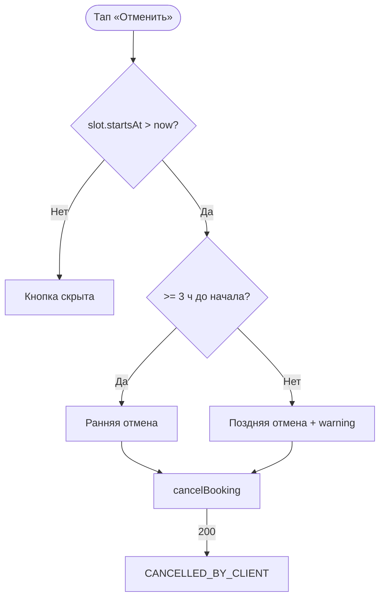

# LOGIC-004 — Отмена: правило 3 часов

**ID:** LOGIC-004  
**Тип:** Логика  
**Приоритет:** Critical  
**Статус:** Актуален

---

## Обзор

Классификация отмены активной брони на **раннюю** (≥ 3 ч до начала класса) и **позднюю**
(< 3 ч). Определяет предупреждение на [SCR-010](../../3-design-brief/screens/SCR-010-cancel-confirm.md)
и видимость «Отменить запись» на [SCR-009](../../3-design-brief/screens/SCR-009-booking-detail.md).

В MVP: поздняя отмена **разрешена** с предупреждением о закупленных продуктах; штрафов нет (FR-018).
При ранней отмене место освобождается **сразу** (FR-017).

---

## Точки применения

| Экран | Элемент / триггер |
| :-- | :-- |
| [SCR-009](../../3-design-brief/screens/SCR-009-booking-detail.md) | Кнопка «Отменить» при `ACTIVE` и `slot.startsAt > now` |
| [SCR-010](../../3-design-brief/screens/SCR-010-cancel-confirm.md) | Warning-блок; `isLateCancellation` |

---

## Флоу



---

## Описание логики

### Формулы

```
minutesUntilStart = (slot.startsAt - now) в минутах

canCancel = status == ACTIVE AND minutesUntilStart > 0

isEarlyCancel = canCancel AND minutesUntilStart >= 180

isLateCancel = canCancel AND minutesUntilStart < 180
```

### Правила

| Тип | UI (SCR-010) | Бэкенд |
| :-- | :-- | :-- |
| **Ранняя** (≥ 3 ч) | Без warning | 200; место освобождается (FR-017) |
| **Поздняя** (< 3 ч) | Warning о продуктах | 200; `isLateCancellation: true` (FR-018) |
| Класс начался | Кнопка скрыта | — |

### Текст предупреждения (поздняя)

> До начала класса осталось меньше 3 часов. Продукты могут быть уже закуплены. Отмена возможна.

- Фон: warning, **не** error; без упоминания штрафов.

### Офлайн

Отмена недоступна без сети; кнопка disabled на SCR-009.

---

## Входные / выходные данные

| Параметр | Тип | Направление | Описание |
| :-- | :-- | :--: | :-- |
| `slot.startsAt` | datetime | in | Начало класса |
| `isEarlyCancel` | boolean | out | ≥ 180 мин |
| `isLateCancel` | boolean | out | < 180 мин |
| `canCancel` | boolean | out | Показ кнопки |
| `showWarning` | boolean | out | = `isLateCancel` |

---

## Связанные требования

| ID | Описание |
| :-- | :-- |
| UC-004 | Отмена клиентом |
| FR-017 | Ранняя отмена ≥ 3 ч |
| FR-018 | Поздняя отмена — предупреждение, без штрафов |

**API:** `cancelBooking` → [../../api/openapi.yaml](../../api/openapi.yaml)

---

## Критерии приёмки

| ID | Критерий |
| :-- | :-- |
| AC-L-001 | **Дано** до начала 4 ч, **Когда** SCR-010, **Тогда** warning **не** показывается. |
| AC-L-002 | **Дано** до начала 2 ч, **Когда** SCR-010, **Тогда** warning показывается, отмена возможна. |
| AC-L-003 | **Дано** класс уже начался, **Когда** SCR-009, **Тогда** `canCancel = false`. |
| AC-L-004 | **Дано** офлайн на SCR-009, **Тогда** кнопка «Отменить» disabled. |
