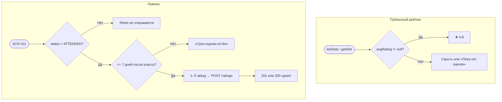

# LOGIC-006 — Оценка шефа

**ID:** LOGIC-006  
**Тип:** Логика  
**Приоритет:** High  
**Статус:** Актуален

---

## Обзор

**Отображение** публичного рейтинга шефа (`chef.avgRating`, `chef.ratingCount`) на карточках классов (FR-026)
и **создание/обновление** оценки 1–5 через `createOrUpdateChefRating` после посещённого класса (FR-024–FR-025).

---

## Точки применения

| Экран | Элемент / триггер |
| :-- | :-- |
| [SCR-001](../../3-design-brief/screens/SCR-001-schedule.md) | ★ на карточке — `chef.avgRating` |
| [SCR-004](../../3-design-brief/screens/SCR-004-class-detail.md) | Карточка шефа — рейтинг и число оценок |
| [SCR-009](../../3-design-brief/screens/SCR-009-booking-detail.md) | CTA «Оценить шефа» / read-only оценка |
| [SCR-011](../../3-design-brief/screens/SCR-011-rate-chef.md) | Выбор звёзд, `createOrUpdateChefRating` |

---

## Флоу

---

## Описание логики

### Отображение (read-only)

| Контекст | Условие | UI |
| :-- | :-- | :-- |
| SCR-001 | `avgRating != null` | **★ 4.8** (1 знак) |
| SCR-001 | `avgRating == null` | Блок скрыт |
| SCR-004 | `ratingCount > 0` | Звёзды + «4,2 · 28 оценок» |
| SCR-004 | иначе | «Пока нет оценок» |

### Создание / обновление

**API:** POST `/ratings` → `createOrUpdateChefRating`

| Поле | Описание |
| :-- | :-- |
| `chefId` | Обязателен |
| `bookingId` | Для проверки ATTENDED при первой оценке |
| `stars` | 1–5, без текста |

| Правило | Описание |
| :-- | :-- |
| Условие | `Booking.status = ATTENDED` |
| Срок | **7 дней** после класса (FR-024) |
| Уникальность | **Один клиент — одна оценка на шефа**; повторный POST обновляет (FR-025) |
| Ответ | 201 создание / 200 обновление |

Ошибки: 403 `BOOKING_NOT_ATTENDED`, `RATING_PERIOD_EXPIRED`.

---

## Входные / выходные данные

| Параметр | Тип | Направление | Описание |
| :-- | :-- | :--: | :-- |
| `chef.avgRating` | number? | in | Средний балл |
| `chef.ratingCount` | int? | in | Число оценок |
| `chefId`, `stars` | — | in | Тело запроса |
| `canRate` | boolean | out | CTA на SCR-009 |
| `chefRating` | object? | in | Read-only в `getBooking` |

---

## Связанные требования

| ID | Описание |
| :-- | :-- |
| FR-024–FR-026 | Оценка и публичный рейтинг |
| UC-007 | Оценка шефа |

**API:** [../../api/openapi.yaml](../../api/openapi.yaml) → `createOrUpdateChefRating`

---

## Критерии приёмки

| ID | Критерий |
| :-- | :-- |
| AC-L-001 | **Дано** `avgRating = 4.8` на SCR-001, **Тогда** **★ 4.8**. |
| AC-L-002 | **Дано** `ATTENDED`, ≤ 7 дней, **Когда** SCR-011, **Тогда** отправка 1–5 звёзд возможна. |
| AC-L-003 | **Дано** > 7 дней после класса, **Тогда** CTA «Оценить» скрыт. |
| AC-L-004 | **Дано** клиент уже оценивал шефа, **Когда** повторная отправка, **Тогда** 200 upsert. |
