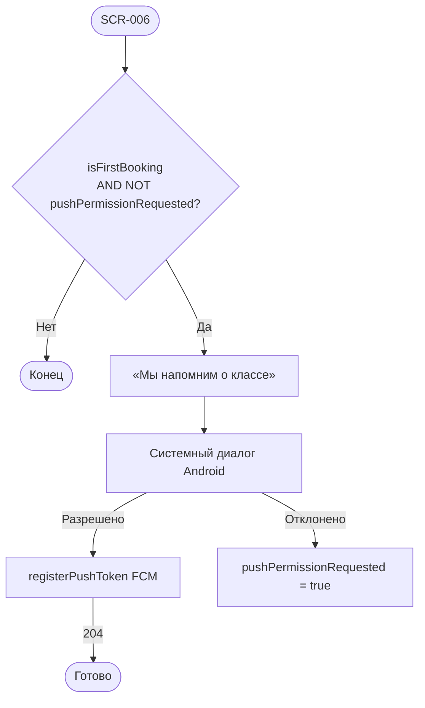

# LOGIC-007 — Запрос push-разрешения

**ID:** LOGIC-007  
**Тип:** Логика  
**Приоритет:** Medium  
**Статус:** Актуален

---

## Обзор

Системный запрос разрешения на push после **первой успешной брони**. Единственный канал в MVP — push
(NFR-010). Запрос **один раз** на устройстве; отказ не блокирует приложение. Токен — FCM через
`registerPushToken` (`platform: android`).

---

## Точки применения

| Экран | Элемент / триггер |
| :-- | :-- |
| [SCR-006](../../3-design-brief/screens/SCR-006-booking-success.md) | После отрисовки сводки успешной записи |

---

## Флоу



---

## Описание логики

### Условия показа

| Условие | Значение |
| :-- | :-- |
| `isFirstBooking` | Первая успешная бронь на устройстве |
| `pushPermissionRequested` | `false` — диалог ещё не показывался |
| Момент | После Content на SCR-006, не блокирует CTA |

### registerPushToken

**POST** `/profile/push-token` · `Authorization: Bearer {sessionToken}`

```json
{ "token": "<FCM>", "platform": "android" }
```

Ошибки логируются; UI не прерывается.

### Типы push (FR-027)

| Событие | Deep link |
| :-- | :-- |
| Напоминание за день / 2 ч | SCR-009 |
| Подтверждение записи | SCR-009 |
| Отмена клиентом / студией | SCR-009 |
| Перенос класса | SCR-009 |
| Запрос аллергий | SCR-009 → sheet SCR-012 |

> Лист ожидания и SMS/email **не** используются.

---

## Входные / выходные данные

| Параметр | Тип | Направление | Описание |
| :-- | :-- | :--: | :-- |
| `isFirstBooking` | boolean | in | Первая бронь |
| `pushPermissionRequested` | boolean | in/out | Флаг локально |
| `sessionToken` | string | in | ClientSession |
| `deviceToken` | string | out | FCM token |

---

## Связанные требования

| ID | Описание |
| :-- | :-- |
| FR-027 | Push-уведомления |
| NFR-010 | Только push, Android |

**API:** [../../api/openapi.yaml](../../api/openapi.yaml) → `registerPushToken`

---

## Критерии приёмки

| ID | Критерий |
| :-- | :-- |
| AC-L-001 | **Дано** первая бронь, **Когда** SCR-006 отрисован, **Тогда** системный запрос push один раз. |
| AC-L-002 | **Дано** отказ push, **Тогда** навигация с SCR-006 работает штатно. |
| AC-L-003 | **Дано** разрешение, **Тогда** async `registerPushToken` с `platform: android`. |
| AC-L-004 | **Дано** вторая запись, **Тогда** запрос push не показывается. |
