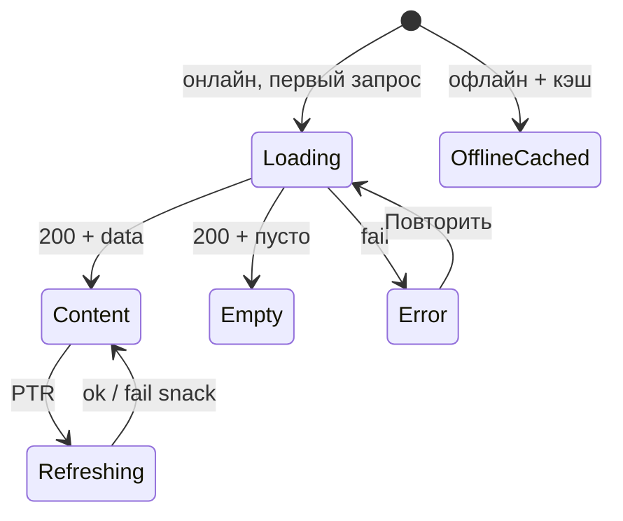

# LOGIC-008 — Паттерн состояний экрана

**ID:** LOGIC-008  
**Тип:** Логика  
**Приоритет:** High  
**Статус:** Актуален

---

## Обзор

Единый UI-паттерн для экранов с GET через Client API: **Loading**, **Content**, **Empty**, **Error**,
**Offline**, **Refreshing**. Согласованность SCR-001, SCR-004, SCR-005, SCR-008, SCR-009.

**Не входит:** SCR-002, SCR-003, SCR-006, SCR-007; sheet/dialog с одним submit (SCR-010, SCR-011).

---

## Точки применения

| Экран | Триггер | Состояния |
| :-- | :-- | :-- |
| [SCR-001](../../3-design-brief/screens/SCR-001-schedule.md) | Вкладка, PTR, retry | Loading, Content, Empty, Error, Refreshing |
| [SCR-003](../../3-design-brief/screens/SCR-003-class-filters.md) | `listCuisineTypes` | Loading, Content, Error (inline в sheet) |
| [SCR-004](../../3-design-brief/screens/SCR-004-class-detail.md) | `getSlot` | Loading, Content, Error, Refreshing |
| [SCR-005](../../3-design-brief/screens/SCR-005-booking-form.md) | `getProfile`, `getSlot` | Loading, Content, Error + Submitting |
| [SCR-008](../../3-design-brief/screens/SCR-008-my-bookings.md) | Вкладка, PTR | Loading, Content, Empty, Error, Offline, Refreshing |
| [SCR-009](../../3-design-brief/screens/SCR-009-booking-detail.md) | `getBooking`, deep link | Loading, Content, Error, Offline |
| [SCR-013](../../3-design-brief/screens/SCR-013-contact-profile.md) | `getProfile` в sheet | Loading, Content, Error |

---

## Флоу

---

## Описание логики

### Канонические состояния

| Состояние | UI | Поведение |
| :-- | :-- | :-- |
| **Loading** | Skeleton | Блокирует контент |
| **Content** | Макет экрана | Интерактивен |
| **Empty** | Иллюстрация + текст + CTA | См. таблицу ниже |
| **Error** | Иконка + «Повторить» | Retry → Loading |
| **Offline cached** | Кэш + баннер | SCR-008, SCR-009 |
| **Refreshing** | Индикатор поверх Content | Не сбрасывать в Loading |
| **Submitting** | Spinner на CTA | POST/PATCH |

### Empty по экранам

| Экран | Текст | CTA |
| :-- | :-- | :-- |
| SCR-001 | «Пока нет доступных классов» (FR-005) | — |
| SCR-001 + фильтры | «Ничего не найдено» | «Сбросить фильтры» |
| SCR-008 | «У вас пока нет записей» | «Посмотреть расписание» |

### Error

| Тип | Текст |
| :-- | :-- |
| Нет сети | «Нет подключения к интернету» |
| 5xx / timeout | «Не удалось загрузить данные» |
| 404 detail | «Класс не найден» / «Запись не найдена» |

### Офлайн (NFR-009)

- **SCR-008, SCR-009:** кэш последнего `listBookings` / `getBooking`; баннер «Офлайн»; destructive disabled.
- **SCR-001, SCR-004:** без кэша в MVP → Error.

### Частные правила

| Экран | Примечание |
| :-- | :-- |
| SCR-002, SCR-003 | Без собственного list API reload; SCR-003 — loading `listCuisineTypes` |
| SCR-005 | Submitting на «Записаться» |
| SCR-006 | Только после 201 |
| SCR-007 | Dialog от SCR-005 |
| SCR-010, SCR-011 | Submitting на confirm / «Отправить» |
| SCR-012 | Saving на PATCH аллергий (SCR-009) |

---

## Связанные требования

| ID | Описание |
| :-- | :-- |
| FR-001, FR-005 | Empty расписания |
| FR-016 | Список броней |
| NFR-009 | Офлайн-кэш |
| NFR-008 | Тексты на русском |

---

## Критерии приёмки

| ID | Критерий |
| :-- | :-- |
| AC-L-001 | **Дано** SCR-001 первый load, **Тогда** skeleton до ответа `listSlots`. |
| AC-L-002 | **Дано** пустой `items`, дефолт фильтры, **Тогда** «Пока нет доступных классов». |
| AC-L-003 | **Дано** PTR на Content, **Когда** fail, **Тогда** snack, список не очищается. |
| AC-L-004 | **Дано** SCR-008 офлайн с кэшем, **Тогда** список + баннер офлайн. |
| AC-L-005 | **Дано** SCR-005 submit, **Тогда** Submitting на CTA, не full-screen Loading. |
