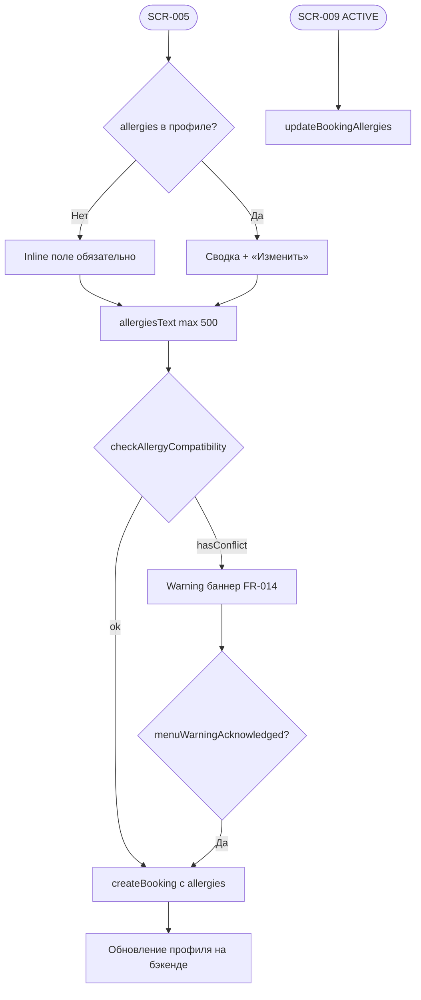

# LOGIC-009 — Аллергии

**ID:** LOGIC-009  
**Тип:** Логика  
**Приоритет:** Critical  
**Статус:** Актуален

---

## Обзор

Сбор, валидация и сохранение информации об аллергиях и пищевых ограничениях (UC-009, FR-012–FR-014).
Обязательный шаг при **первой записи**; при повторных — предзаполнение из профиля. Проверка
совместимости с меню — **предупреждение**, запись **не блокируется**.

---

## Точки применения

| Экран | Элемент / триггер |
| :-- | :-- |
| [SCR-005](../../3-design-brief/screens/SCR-005-booking-form.md) | Inline-секция SCR-012; поле в `createBooking` |
| [SCR-012](../../3-design-brief/screens/SCR-012-allergies.md) | Ввод текста, chip «Нет аллергий», sheet |
| [SCR-009](../../3-design-brief/screens/SCR-009-booking-detail.md) | Просмотр / «Изменить» → `updateBookingAllergies` |

---

## Флоу



---

## Описание логики

### Формат данных

| Поле | Тип | Описание |
| :-- | :-- | :-- |
| `allergiesText` | string, max 500 | Свободный текст (Q 3.2) |
| `menuWarningAcknowledged` | boolean | Подтверждение при конфликте (FR-014) |

**Не использовать:** чекбоксы фиксированных аллергенов.

### Режимы SCR-005

| Условие | UI |
| :-- | :-- |
| Первая запись, пустой профиль | Inline поле; CTA disabled если пусто |
| Повторная запись | Сводка + «Изменить» (sheet) |
| Chip «Нет аллергий» | Заполняет «нет» (опционально) |

### Проверка совместимости (FR-014)

**POST** `/allergies/check` → `checkAllergyCompatibility`

```json
{ "slotId": "...", "allergiesText": "орехи" }
```

Ответ: `{ "hasConflict": true, "message": "..." }`

- Баннер warning под полем; CTA «Записаться» и «Сохранить» **остаются активными**.
- При submit с конфликтом — `menuWarningAcknowledged: true` в теле брони.

### Сохранение

| Сценарий | API |
| :-- | :-- |
| Новая запись | `createBooking.allergies` + upsert профиля |
| Активная бронь | `updateBookingAllergies` (PATCH) |
| Профиль | `updateProfile.allergies` (опционально) |

Редактирование на SCR-009 только при `status = ACTIVE` (403 `BOOKING_NOT_ACTIVE` иначе).

### Push «запрос аллергий» (FR-027)

Deep link → SCR-009 → auto-open sheet SCR-012 (один раз за сессию). Не заменяет обязательный шаг при первой записи (Q 3.5).

---

## Входные / выходные данные

| Параметр | Тип | Направление | Описание |
| :-- | :-- | :--: | :-- |
| `allergiesText` | string | in/out | Текст аллергий |
| `slotId` | uuid | in | Для check |
| `hasConflict` | boolean | out | Из check API |
| `conflictMessage` | string? | out | Текст баннера |
| `allergies` | `AllergyInfo` | out | В create/update |

---

## Связанные требования

| ID | Описание |
| :-- | :-- |
| FR-012–FR-014 | Аллергии и предупреждение |
| FR-013 | Изменение в активной брони |
| FR-027 | Push запрос аллергий |
| UC-009 | Управление аллергиями |
| BR-011 | Информирование кухни |
| Q 3.1–Q 3.5 | Q&A по аллергиям |

**API:** [../../api/openapi.yaml](../../api/openapi.yaml) → `checkAllergyCompatibility`, `createBooking`, `updateBookingAllergies`

---

## Критерии приёмки

| ID | Критерий |
| :-- | :-- |
| AC-L-001 | **Дано** первая запись, пустые аллергии, **Тогда** CTA «Записаться» disabled. |
| AC-L-002 | **Дано** `hasConflict = true`, **Тогда** баннер виден, CTA активен. |
| AC-L-003 | **Дано** конфликт и submit, **Тогда** `menuWarningAcknowledged: true` в запросе. |
| AC-L-004 | **Дано** ACTIVE бронь на SCR-009, **Когда** «Сохранить» в sheet, **Тогда** `updateBookingAllergies`. |
| AC-L-005 | **Дано** бронь не ACTIVE, **Тогда** «Изменить аллергии» скрыто, read-only текст. |
| AC-L-006 | **Дано** повторная запись, **Тогда** предзаполнение из `getProfile.allergies`. |
