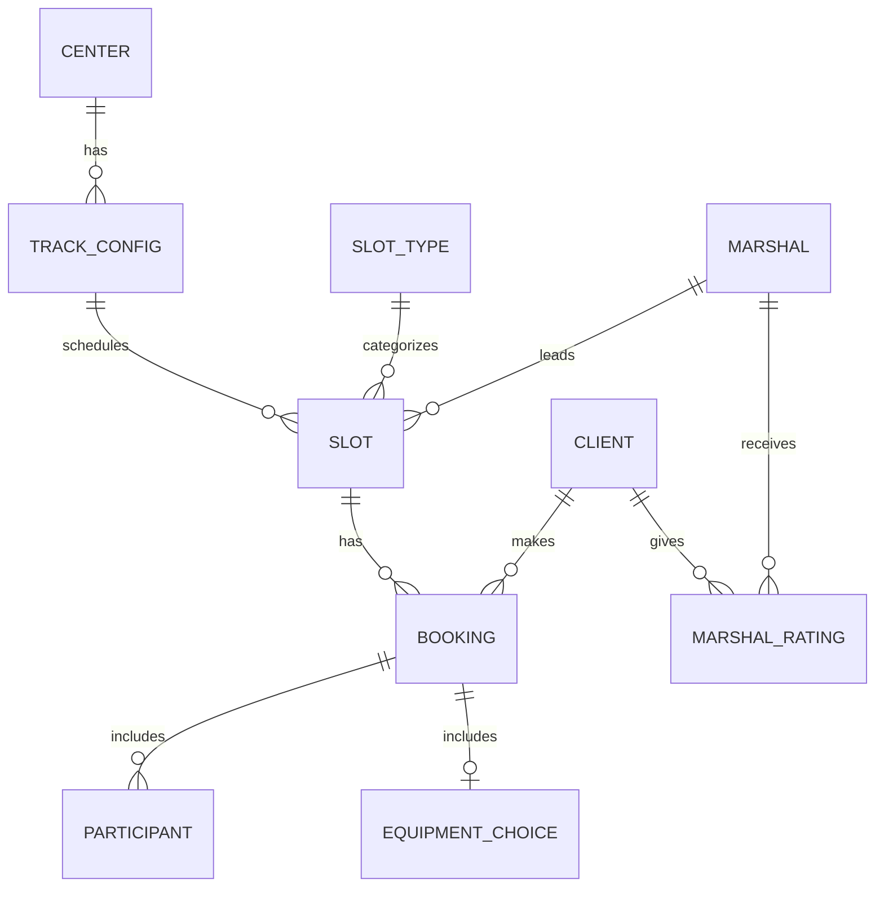
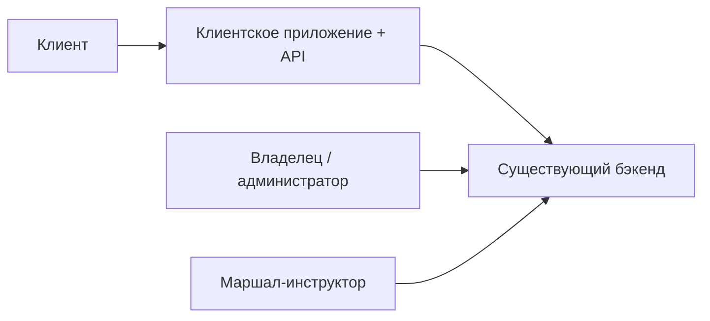

# Описание домена — картинг-центр «Апекс»

> Этап выявления требований. Источники: [brief-karting.md](../0-customer-brief/brief-karting.md),
> [customer-questions.md](customer-questions.md) (ответы зафиксированы 03.07.2026).

---

## 1. Предметная область

**Картинг-центр** — площадка для любительских заездов на картах. В данном проекте речь об **уличном** центре **«Апекс»** на окраине города, где клиенты катаются **группами (заездами)** по трассе под контролем **маршала-инструктора**.

Предметная область проекта — **управление записью клиентов на заезды**: просмотр расписания, бронирование (в т.ч. несколько участников), выбор экипировки, отмены, оценки маршалов, уведомления. Операционная работа (расписание, маршалы, отмены по погоде, учёт поздних отмен) — в **существующем бэкенде и админке**. В фокусе — **клиентское мобильное приложение (iOS, MVP v1)** и **Client API** (R-028).

---

## 2. Ключевые сущности

| Сущность | Описание |
| :-- | :-- |
| **Картинг-центр** | Уличная площадка с адресом, местом сбора; погода влияет на проведение заездов |
| **Конфигурация трассы** | Короткая (проще) или длинная (опытные); определяет **цену** |
| **Тип слота** | Категория заезда (в т.ч. новичковый — лимит **8** мест) |
| **Слот (заезд)** | Конкретный заезд: время старта, тип, конфигурация, маршал, свободные карты; ~15–20 мин |
| **Карт** | Единица вместимости; всего **14** в центре; карты с ограничением скорости назначает **маршал** |
| **Маршал-инструктор** | Брифинг (при необходимости), контроль трассы; рейтинг виден клиентам |
| **Клиент** | Записывается на заезд; может указать **нескольких участников** в одной брони |
| **Бронь (запись)** | Связь «клиент ↔ слот» (+ участники); статусы (активна, отменена клиентом, **отменена центром**, посещена и др.) |
| **Экипировка** | Шлем, подшлемник — своё или прокатное |
| **Оценка маршала** | Звёзды 1–5; одна оценка на пару «клиент ↔ маршал», публичный рейтинг |

---

## 3. Бизнес-правила

### Вместимость и расписание

- В центре **14 картов**; лимит **8** на новичковый заезд определяется **типом слота**.
- Расписание на **неделю вперёд**; в приложении по умолчанию — **7 дней** (R-027); расширение — фильтр дат.
- Фильтры MVP: **время суток**, **маршал** (конфигурация трассы и уровень — не в первой версии).
- **Несколько заездов в один день** разрешены; **несколько участников** в одной записи — **да**.
- Доступность: **«есть места» / «мест нет»** (без точного счётчика картов).
- **Двойная запись** на один карт исключается бэкендом (R-004).
- Группа заполнена → только **«мест нет»** (лист ожидания **не** в MVP).
- Проверка уровня клиента **не требуется**.
- Заезд **15–20 мин**; инструктаж **не всегда** (если клиент уже проходил — не нужен; флаг — из профиля/бэкенда).

### Бронирование и экипировка

- Идентификация: **имя + телефон** при первой записи.
- Клиент выбирает **своё** или **прокат** (шлем, подшлемник).
- **Прокат не влияет на цену**.
- Если прокатный фонд исчерпан — слот **недоступен** для записи (не «только со своим»).
- Цена зависит от **конфигурации трассы**; показывается в приложении; оплата **на месте**.
- Карты с ограничением скорости **не показываются** в UI — назначает маршал.

### Отмена клиентом

- **Ранняя отмена:** ≥ **1 часа** до начала → карт **сразу** освобождается.
- **Поздняя отмена:** < 1 часа → **предупреждение** клиенту; отмена **разрешена**; **пометка** у администраторов; штрафов в MVP **нет**.
- **Учёт** поздних отмен и неявок ведётся на стороне админки; последствий для клиента **нет**.

### Отмена центром и погода (R-008)

- Бронь → статус **«Отменён центром»** + **причина** (фиксированный список + свободный текст из админки).
- **Погода** (дождь, гололёд) — **тот же статус**; заезд отменяется целиком в инфраструктуре.
- **Push** (+ SMS во 2-й итерации); **перезапись на другой заезд** — из **push**.
- Повторная запись на **отменённый слот запрещена**.
- Уведомление о **переносе** (смена времени / маршала) — **нужно** (v2).

### Оценки маршалов (v2)

- Только после **посещённого** заезда; срок — **в течение недели**.
- Формат: **звёзды** (без текстовых отзывов).
- Рейтинги **видны** другим клиентам при выборе слота.
- **Один пользователь — одна оценка на маршала**; можно изменить в период оценивания.

### Постоянные клиенты

- **Метка** в профиле; скидки и приоритет записи — **не** в MVP.

### Уведомления (v2)

- **Push и SMS:** напоминание **за 2 часа**, отмены (клиент / центром, в т.ч. погода), перенос заезда.

---

## 4. Акторы

| Актор | Роль | В скоупе MVP v1 |
| :-- | :-- | :-- |
| **Клиент** | Запись, отмена, прокат, просмотр своих записей | **Да** (R-028) |
| **Маршал** | Брифинг, заезд, назначение картов | **Нет** — существующий интерфейс |
| **Владелец (Денис)** | Расписание, отмены, погода, пометки по клиентам | **Нет** — существующая админка |

---

## 5. Основные процессы

### 5.1. Просмотр расписания

Клиент видит заезды на 7 дней с фильтрами (время, маршал). Карточка: время, конфигурация (кратко), маршал, рейтинг *(v2)*, «есть места / мест нет», цена. Empty state: **«Пока нет доступных заездов»**.

### 5.2. Бронирование

Выбор слота → контакты → **участники** (при необходимости) → экипировка (своё / прокат) → подтверждение. Бэкенд атомарно проверяет карты и прокат.

### 5.3. Отмена брони

Клиентом (правило 1 ч) или центром (погода, форс-мажор) — см. §3.

### 5.4. Напоминания (v2)

Push + SMS: за 2 ч до заезда; отмены и переносы.

### 5.5. Оценка маршала (v2)

После посещённого заезда — звёзды в течение недели; публичный рейтинг на карточке слота.

### 5.6. Отмена по погоде

Инициируется в инфраструктуре; все записанные получают push с предложением перезаписаться на другой заезд.

---

## 6. Границы системы

### В скоупе MVP v1

- **iOS**-приложение для роли «Клиент»
- **Client API** (слоты, брони, профиль, маршалы, прокат — R-015)
- Запись (несколько участников), **мои записи**, отмена
- Офлайн-просмотр **своих записей** (NFR)
- Метка **постоянного клиента**

### В скоупе v2 (backlog)

- **Оценки маршалов**
- **Уведомления** (push + SMS)
- Перенос заезда в UI

### Вне скоупа / backlog

- Android (вторая платформа)
- Админка, интерфейс маршала
- Онлайн-оплата
- Лист ожидания
- Фильтры по конфигурации трассы и уровню
- Скидки / приоритет для постоянных
- Интеграция погодных сервисов в UI клиента
- Внутренняя реализация бэкенда (R-004), миграция данных (R-015)

---

## 7. Болевые точки

Запись через **Telegram и доску маркером**. В выходные:

- путаница в расписании и маршалах;
- **двойные брони** (два клиента на один карт);
- клиент приезжает — **заезд уже ушёл** без него.

Цель — **самообслуживание записи** к **высокому сезону** при ограниченном бюджете.

---

## 8. Глоссарий

| Термин | Определение |
| :-- | :-- |
| **Заезд** | Групповой выезд на трассу (~15–20 мин); инструктаж — при первом посещении |
| **Слот** | Конкретный заезд в расписании |
| **Тип слота** | Категория заезда; новичковый — лимит 8 картов |
| **Конфигурация трассы** | Короткая или длинная; определяет цену |
| **Карт** | Единица вместимости; всего 14 в центре |
| **Маршал** | Инструктор на трассе |
| **Прокат** | Шлем и/или подшлемник |
| **Постоянный клиент** | Метка в профиле |
| **Ранняя отмена** | ≥ 1 ч до начала |
| **Поздняя отмена** | < 1 ч до начала; предупреждение + пометка админу |
| **Empty state** | «Пока нет доступных заездов» |

---

## 9. Трассировка Q&A → домен

| Тема | Ответ заказчика | § домена |
| :-- | :-- | :-- |
| Имя + телефон | Да | §3 |
| Несколько участников, несколько заездов/день | Да | §3 |
| Без листа ожидания | Да | §3, §6 |
| Лимит 8 — тип слота | Да | §3 |
| Прокат исчерпан → слот недоступен | Да | §3 |
| Отмена ≥ 1 ч | Да | §3 |
| Оценка — неделя, 1 на маршала | Да (v2) | §3 |
| Push + SMS (v2) | Да | §3, §6 |
| iOS, русский, офлайн записей | Да | §6 |
| MVP v1: запись + мои + отмена | Да | §6 |
