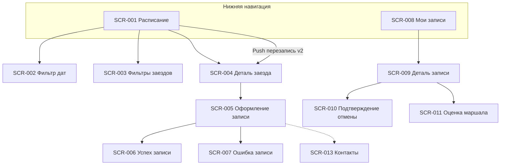

# Реестр экранов — картинг-центр «Апекс»

> Клиентское мобильное приложение iOS (роль «Клиент», R-028).
> Источники: [2-requirements/](../2-requirements/), [1-elicitation/](../1-elicitation/).
> Постановки на дизайн: [screens/](screens/).

## Навигация приложения

---

## Реестр

| ID | Экран | Тип | Приоритет | Use Case / FR | Постановка |
| :- | :-- | :-- | :--: | :-- | :-- |
| SCR-001 | Расписание заездов | Экран (вкладка) | Must | UC-001; FR-001–FR-005 | [SCR-001-schedule.md](screens/SCR-001-schedule.md) |
| SCR-002 | Фильтр периода дат | Bottom sheet | Must | FR-002; R-027 | [SCR-002-date-filter.md](screens/SCR-002-date-filter.md) |
| SCR-003 | Фильтры заездов | Bottom sheet | Must | FR-003 | [SCR-003-heat-filters.md](screens/SCR-003-heat-filters.md) |
| SCR-004 | Деталь заезда | Экран | Must | UC-002; FR-004, FR-013, FR-028 | [SCR-004-heat-detail.md](screens/SCR-004-heat-detail.md) |
| SCR-005 | Оформление записи | Экран | Must | UC-002; FR-006–FR-013, FR-019 | [SCR-005-booking-form.md](screens/SCR-005-booking-form.md) |
| SCR-006 | Успешная запись | Экран / modal | Must | UC-002; FR-010, FR-013 | [SCR-006-booking-success.md](screens/SCR-006-booking-success.md) |
| SCR-007 | Ошибка записи | Dialog / modal | Must | UC-002; FR-010, FR-012 | [SCR-007-booking-error.md](screens/SCR-007-booking-error.md) |
| SCR-008 | Мои записи | Экран (вкладка) | Must | UC-003; FR-014; NFR-009 | [SCR-008-my-bookings.md](screens/SCR-008-my-bookings.md) |
| SCR-009 | Деталь записи | Экран | Must | UC-003–UC-005; FR-015–FR-018 | [SCR-009-booking-detail.md](screens/SCR-009-booking-detail.md) |
| SCR-010 | Подтверждение отмены | Bottom sheet / Dialog | Must | UC-004; FR-015, FR-016 | [SCR-010-cancel-confirm.md](screens/SCR-010-cancel-confirm.md) |
| SCR-011 | Оценка маршала | Bottom sheet / modal | Should | UC-007; FR-026–FR-028 | [SCR-011-rate-marshal.md](screens/SCR-011-rate-marshal.md) |
| SCR-013 | Контактные данные | Секция / Bottom sheet | Must | FR-006; FR-019 | [SCR-013-contact-profile.md](screens/SCR-013-contact-profile.md) |

---

## Сквозные NFR для всех экранов

| ID | Требование | Источник |
| :- | :-- | :-- |
| NFR-001 | **iOS**-клиентский интерфейс | [NFR-001](../2-requirements/non-functional-requirements.md) |
| NFR-008 | Только русский язык | [NFR-008](../2-requirements/non-functional-requirements.md) |
| NFR-009 | Офлайн: кэш «Мои записи» (SCR-008, SCR-009) | [NFR-009](../2-requirements/non-functional-requirements.md) |
| NFR-010 | Push и SMS (v2); deep link на SCR-009 / SCR-001 / SCR-004 | FR-023–FR-025, FR-029 |

---

## Статусы брони (отображение на SCR-008, SCR-009)

| Статус | Отображение | Действия клиента |
| :-- | :-- | :-- |
| Активна | Бейдж «Записан» | Отменить (SCR-010) |
| Отменена клиентом | Бейдж «Отменена вами» | — |
| Отменена центром | Бейдж + причина | Перезапись на другой заезд — **из push** (v2, FR-024) |
| Посещена | Бейдж «Посещён» | Оценить маршала (SCR-011, v2) |

---

## Фильтры SCR-003 (MVP v1)

| Фильтр | Значения | Примечание |
| :-- | :-- | :-- |
| Время суток | Утро / День / Вечер | FR-003 |
| Маршал | Список из API | FR-003 |
| ~~Конфигурация трассы~~ | — | **Не в MVP v1** |
| ~~Уровень~~ | — | **Не в MVP v1** |

---

## Отличия от других проектов

| Аспект | «Апекс» |
| :-- | :-- |
| Лист ожидания | **Нет** |
| Аллергии | **Нет** |
| Участники | **Несколько** в одной брони |
| Записей в день | **Несколько** разрешены |
| Отмена | Порог **1 ч** (не 3 ч) |
| Прокат исчерпан | Слот **недоступен** (не «со своим») |
| Доступность | **«Есть места» / «Мест нет»** (без счётчика) |
| Фильтры v1 | Время, **маршал** |
| Платформа | **iOS** first |
| Оценки / push+SMS | **v2** (Should) |
