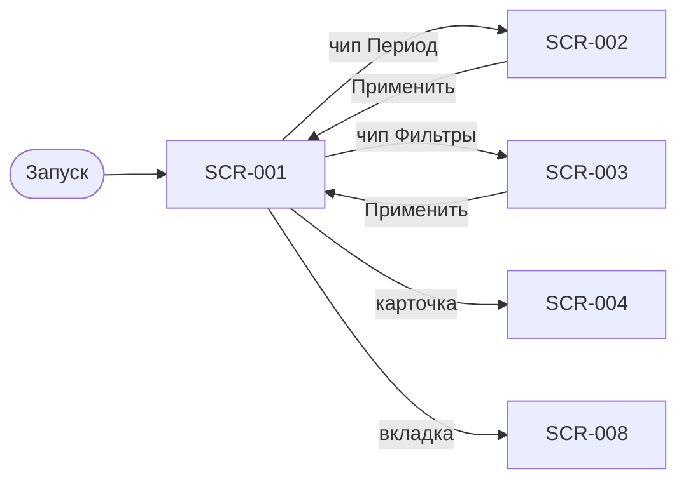

# SCR-001 — Расписание заездов

**ID:** SCR-001  
**Тип:** Экран  
**Домен:** 01. Расписание  
**Приоритет:** Critical  
**Статус:** Актуален  
**Сессия клиента:** Не требуется  
**Дизайн-макет:** Figma — TBD · **Design brief:** [SCR-001-schedule.md](./SCR-001-schedule.md)

> **Платформа:** iOS (NFR-001) · **Язык UI:** только русский (NFR-008) · **Оплата:** на месте (FR-013).

---

## Содержание

- [Обзор](#обзор)
- [Навигация](#навигация)
- [Входные данные](#входные-данные)
- [Применяемые логики](#применяемые-логики)
- [Инициализация](#инициализация)
- [Используемые запросы](#используемые-запросы)
- [Макет экрана](#макет-экрана)
- [Элементы экрана](#элементы-экрана)
- [Состояния экрана](#состояния-экрана)
- [Связанные требования](#связанные-требования)
- [Критерии приёмки](#критерии-приёмки)

---

## Обзор

Главный экран приложения картинг-центра «Апекс»: клиент просматривает доступные **заезды**, фильтрует их по периоду и критериям MVP, выбирает слот для записи. По умолчанию показываются заезды на **ближайшие 7 дней** (R-027, FR-001). Экран — основная точка входа в сценарий записи (UC-001 → SCR-004).

### User Story

> Как клиент, я хочу видеть ближайшие заезды и быстро отфильтровать расписание, чтобы выбрать подходящий заезд и перейти к записи.

**Не в MVP:** лист ожидания при `NO_SPOTS` (FR-012) — только возврат к расписанию; фильтр по конфигурации трассы и уровню; Android; рейтинги маршалов в UI (FR-028 — v2).

---

## Навигация

### Входящая

| Источник | Триггер | Условие | Параметры |
| :-- | :-- | :-- | :-- |
| Запуск приложения | Открытие приложения | Первый/повторный вход | — |
| Нижняя навигация | Тап по вкладке «Расписание» | Всегда | `appliedDateRange?`, `appliedHeatFilters?` |
| SCR-002 | «Применить» / «Сбросить» периода | Выбран диапазон или сброс | `dateFrom?`, `dateTo?` |
| SCR-003 | «Применить» / «Сбросить» фильтров | Изменены фильтры | `marshalIds?`, `timeOfDay?` |
| SCR-004 | «Назад» / swipe back | Возврат из детали заезда | Сохранённое состояние списка |
| Push / deep link (v2) | Открытие уведомления | Отмена центром, перезапись | — |

### Исходящая

| Назначение | Триггер | Параметры |
| :-- | :-- | :-- |
| SCR-002 | Тап по чипу «Период» / «7 дней» | `appliedDateRange` |
| SCR-003 | Тап по чипу «Фильтры» | `appliedHeatFilters` |
| SCR-004 | Тап по карточке заезда | `slotId` |
| SCR-008 | Тап по вкладке «Мои записи» | — |



> **Нижняя навигация:** 2 вкладки — «Расписание» (SCR-001) | «Мои записи» (SCR-008). Отдельной вкладки «Профиль» нет.

---

## Входные данные

| Название | Тип | Источник | Описание |
| :-- | :-- | :-- | :-- |
| `dateFrom` | `string(date)?` | SCR-002 | Начало диапазона, если выбран не дефолтный период |
| `dateTo` | `string(date)?` | SCR-002 | Конец диапазона, если выбран не дефолтный период |
| `marshalIds` | `uuid[]` | SCR-003 | Выбранные маршалы (OR внутри группы) |
| `timeOfDay` | `morning \| afternoon \| evening?` | SCR-003 | Фильтр по времени суток |
| `limit` | `number` | Клиент | Размер страницы (`50` по умолчанию) |
| `offset` | `number` | Клиент | Смещение страницы (`0` при первой загрузке) |

---

## Применяемые логики

| Логика | Элемент / триггер | Описание |
| :-- | :-- | :-- |
| [LOGIC-002](../../5-mobile-app-spec/09_Логики/LOGIC-002_Доступность-слота.md) | Бейдж доступности на карточке | «Есть места» / «Мест нет» по `hasSpots`; бейдж «Недоступно» при `isBookable = false` |
| [LOGIC-005](../../5-mobile-app-spec/09_Логики/LOGIC-005_Фильтрация-заездов.md) | Первичная загрузка, pull-to-refresh, применение фильтров | Формирование query для `listSlots`, badge фильтров, группировка по дням |
| [LOGIC-006](../../5-mobile-app-spec/09_Логики/LOGIC-006_Оценка-маршала.md) | Блок рейтинга на карточке | **Не рендерится в MVP v1** (FR-028); заложено под v2 |
| [LOGIC-008](../../5-mobile-app-spec/09_Логики/LOGIC-008_Паттерн-состояний-экрана.md) | Рендер состояний Loading/Content/Empty/Error/Offline/Refreshing | Единый паттерн состояний и retry/pull-to-refresh |

---

## Инициализация

### Запросы при открытии

| № | operationId | Критичный | Условие |
| :-: | :-- | :--: | :-- |
| 1 | `listSlots` | Да | При первом открытии экрана, возврате на вкладку с флагом обновления, применении SCR-002/SCR-003, pull-to-refresh |

> Если период по умолчанию (7 дней), `dateFrom` и `dateTo` **не передаются** (R-027, FR-001).

---

## Используемые запросы

### listSlots

**Метод:** GET  
**Путь:** `/slots`  
**Спецификация:** [../../api/openapi.yaml](../../api/openapi.yaml) → `listSlots`

**Query-параметры экрана:**

| Параметр | Обязательность | Источник |
| :-- | :-- | :-- |
| `dateFrom` | Нет | SCR-002 |
| `dateTo` | Нет | SCR-002 |
| `marshalIds` | Нет | SCR-003 |
| `timeOfDay` | Нет | SCR-003 |
| `limit` | Нет | Клиент (`50`) |
| `offset` | Нет | Клиент (`0`) |

**Обработка ответа:**

| HTTP / код | UI-реакция |
| :-- | :-- |
| 200 + `items.length > 0` | Content: карточки, отсортированные по `startsAt` и сгруппированные по дням |
| 200 + `items.length = 0` + дефолтный период/фильтры | Empty: «Пока нет доступных заездов» (FR-005) |
| 200 + `items.length = 0` + активные фильтры или нестандартный период | Empty: «Ничего не найдено», CTA «Сбросить фильтры» |
| 400 | Error: «Проверьте параметры фильтра» + «Повторить» |
| 500 / timeout | Error: «Не удалось загрузить расписание» + «Повторить» |
| Нет сети | Error: «Нет подключения к интернету. Проверьте сеть и попробуйте снова» (кэш в MVP не используется) |

---

## Макет экрана

```
┌─────────────────────────────────────┐
│  Расписание                         │  ← заголовок (без поиска в MVP)
├─────────────────────────────────────┤
│  [7 дней ▾]  [Фильтры •1]           │  ← горизонтальная полоса чипов
│  [12–18 июл]  (если ≠ дефолт)       │  ← чип кастомного периода
├─────────────────────────────────────┤
│  ▼ Сегодня, 3 июля                  │  ← заголовок группы дня (sticky)
│  ┌─────────────────────────────┐    │
│  │ 18:00 · Короткая трасса      │    │  ← карточка заезда
│  │ Маршал: Алексей К.           │    │
│  │ Есть места · 1 500 ₽         │    │
│  └─────────────────────────────┘    │
│  ┌─────────────────────────────┐    │
│  │ 19:30 · Длинная трасса       │    │
│  │ Маршал: Дмитрий П.           │    │
│  │ Мест нет · 2 000 ₽           │    │  ← приглушённый стиль
│  └─────────────────────────────┘    │
│  ┌─────────────────────────────┐    │
│  │ 20:00 · Короткая трасса      │    │
│  │ Маршал: Алексей К.           │    │
│  │ Недоступно · 1 500 ₽         │    │  ← isBookable = false
│  └─────────────────────────────┘    │
│  ▼ Завтра, 4 июля                   │
│  ...                                │
├─────────────────────────────────────┤
│  [Расписание]    [Мои записи]       │  ← нижняя навигация (2 вкладки)
└─────────────────────────────────────┘
```

Вертикальный скролл: список заездов, сгруппированный по календарным дням. Заголовки дней — **sticky** при прокрутке внутри группы. Пустые дни после фильтрации **не показываются**.

---

## Элементы экрана

| Элемент | Описание | Источник данных | Валидация / поведение |
| :-- | :-- | :-- | :-- |
| Заголовок «Расписание» | Название вкладки | Константа UI | Непрокручиваемый header; без поиска в MVP v1 |
| Чип «Период» | Текущее окно дат | Локальное состояние + SCR-002 | Дефолт: «7 дней» / «Ближайшие 7 дней»; при кастомном: «12–18 июл» или «28 июл – 3 авг» |
| Чип «Фильтры» | Открытие фильтров заездов | Локальное состояние + SCR-003 | Badge = число активных **категорий** (0–2): время суток + маршал |
| Заголовок группы дня | День и дата | `items[].startsAt` | «Сегодня, 3 июля», «Завтра, 4 июля», далее «Пятница, 5 июля»; sticky |
| Время начала | Время заезда | `items[].startsAt` | Формат `HH:mm`, локаль ru-RU, часовой пояс центра |
| Конфигурация трассы | Краткое название | `items[].trackConfiguration.name` | Напр. «Короткая трасса» / «Длинная трасса» (FR-004) |
| Имя маршала | Ведущий заезда | `items[].marshal.fullName` | «Маршал: Алексей К.»; опционально аватар 32–40 pt |
| Рейтинг маршала | Публичный рейтинг | `items[].marshal.avgRating` | **Не рендерится в MVP v1** (FR-028, LOGIC-006) |
| Доступность | Наличие мест | `items[].hasSpots`, `items[].isBookable` | «Есть места» / «Мест нет» — **без** числа картов (Q 2.6); при `isBookable = false` — бейдж «Недоступно» |
| Цена | Стоимость за участника | `items[].pricePerParticipant` | Формат `N ₽`; при `null` — строку не показывать |
| Карточка заезда | CTA переход в детали | `items[].id` | Единая тап-зона (min height ~72 pt); тап → SCR-004 с `slotId` |
| Pull-to-refresh | Обновление списка | — | `UIRefreshControl`; повторный `listSlots` с текущими параметрами |
| Нижняя навигация | Переключение вкладок | — | «Расписание» (активна) \| «Мои записи» → SCR-008 |

**Терминология:** **маршал**, **заезд**, **конфигурация трассы**; не «класс», «шеф», «инструктор», «слот тренировки». Прокат (шлем, подшлемник) **не влияет на цену** (FR-013).

---

## Состояния экрана

| Состояние | Условие | Отображение |
| :-- | :-- | :-- |
| Loading | Первый запрос `listSlots` в процессе | Skeleton: 3–5 placeholder-карточек под «Сегодня» + 2–3 под «Завтра»; шапка и чипы видны сразу |
| Content | 200 + `items.length > 0` | Сгруппированный список карточек |
| Empty | 200 + `items.length = 0` | «Пока нет доступных заездов» (FR-005) или «Ничего не найдено» + CTA «Сбросить фильтры» |
| Error | 4xx / 5xx / timeout | «Не удалось загрузить расписание» + «Повторить» |
| Offline | Нет сети при открытии | Как Error: «Нет подключения к интернету»; не показывать пустой список без пояснения |
| Refreshing | Pull-to-refresh в процессе | Список остаётся видимым; при ошибке — toast «Не удалось обновить» без очистки списка |

> Сквозной паттерн — [LOGIC-008](../../5-mobile-app-spec/09_Логики/LOGIC-008_Паттерн-состояний-экрана.md).

---

## Связанные требования

| ID | Связь |
| :-- | :-- |
| FR-001 | Дефолтный показ заездов за 7 дней |
| FR-002 | Применение фильтра периода через SCR-002 |
| FR-003 | Фильтрация по времени суток и маршалу через SCR-003 |
| FR-004 | Состав карточки: время, конфигурация, маршал, доступность, цена |
| FR-005 | Empty state с точным текстом |
| FR-009 | Слот с исчерпанным прокатом — «Недоступно» |
| FR-012 | «Мест нет» без листа ожидания |
| FR-013 | Отображение цены заезда; оплата на месте |
| FR-028 | Рейтинг маршала — v2, не в MVP v1 |
| R-027 | Дефолтный период 7 дней |
| UC-001 | Просмотр расписания |
| US-001 | Просмотр ближайших заездов |
| US-002 | Изменение периода отображения |
| US-003 | Применение фильтров заездов |

---

## Критерии приёмки

| ID | Критерий |
| :-- | :-- |
| AC-001 | **Дано** пользователь открыл SCR-001 без параметров, **Когда** выполняется `listSlots`, **Тогда** отправляется запрос без `dateFrom`/`dateTo` и показываются ближайшие 7 дней. |
| AC-002 | **Дано** `listSlots` вернул непустой список, **Когда** экран отрисован, **Тогда** карточки отсортированы по `startsAt` и сгруппированы по дням со sticky-заголовками. |
| AC-003 | **Дано** `listSlots` вернул пустой список при дефолтных фильтрах, **Когда** загрузка завершилась, **Тогда** отображается текст «Пока нет доступных заездов». |
| AC-004 | **Дано** активны фильтры или нестандартный период и `listSlots` вернул пусто, **Когда** экран показывает Empty, **Тогда** отображается «Ничего не найдено» и CTA «Сбросить фильтры». |
| AC-005 | **Дано** в слоте `hasSpots = false`, **Когда** карточка отображается, **Тогда** пользователь видит «Мест нет» (без числа картов) и может открыть SCR-004 (без листа ожидания). |
| AC-006 | **Дано** в слоте `isBookable = false` (прокат исчерпан), **Когда** карточка отображается, **Тогда** показан бейдж «Недоступно» в приглушённом стиле. |
| AC-007 | **Дано** в ответе есть `marshal.avgRating`, **Когда** карточка заезда отображается в MVP v1, **Тогда** рейтинг маршала **не** показывается. |
| AC-008 | **Дано** пользователь потянул список вниз, **Когда** запрос refresh завершился ошибкой, **Тогда** ранее загруженный список остаётся на экране и показывается сообщение об ошибке обновления. |
| AC-009 | **Дано** пользователь нажал «Фильтры», выбрал «Вечер» и 2 маршалов и применил, **Когда** возврат на SCR-001 завершён, **Тогда** chip «Фильтры» показывает badge `2` (категории, не количество маршалов) и список перезагружен с `timeOfDay=evening` и `marshalIds`. |
| AC-010 | **Дано** пользователь тапнул карточку заезда, **Когда** переход выполнен, **Тогда** открывается SCR-004 с `slotId` выбранного заезда. |
