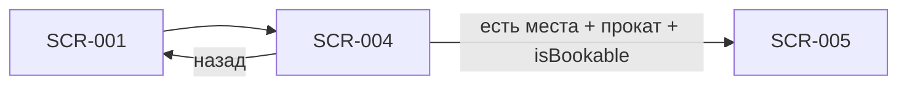

# SCR-004 — Деталь заезда

**ID:** SCR-004  
**Тип:** Экран  
**Домен:** 02. Бронирование  
**Приоритет:** Critical  
**Статус:** Актуален  
**Сессия клиента:** Не требуется  
**Дизайн-макет:** Figma — TBD · **Design brief:** [SCR-004-heat-detail.md](./SCR-004-heat-detail.md)

> **Платформа:** iOS (NFR-001) · **Язык UI:** только русский (NFR-008) · **Оплата:** на месте (FR-013).

---

## Содержание

- [Обзор](#обзор)
- [Навигация](#навигация)
- [Входные данные](#входные-данные)
- [Применяемые логики](#применяемые-логики)
- [Инициализация](#инициализация)
- [Используемые запросы](#используемые-запросы)
- [Макет экрана](#макет-экрана)
- [Элементы экрана](#элементы-экрана)
- [Состояния экрана](#состояния-экрана)
- [Связанные требования](#связанные-требования)
- [Критерии приёмки](#критерии-приёмки)

---

## Обзор

Экран показывает полную информацию о выбранном **заезде**: время, длительность, конфигурацию трассы, маршала, доступность, инструктаж и цену. Закрывает FR-004 и FR-013. Основная точка конверсии в поток бронирования (UC-002 → SCR-005). Учитывает FR-009: при исчерпании проката слот **недоступен**; FR-012: при заполнении — только «Мест нет», **без листа ожидания**.

### User Story

> Как клиент, я хочу увидеть деталь заезда, чтобы понять, подходит ли мне время и маршал, и перейти к записи.

**Не в MVP:** лист ожидания при `NO_SPOTS` (FR-012); рейтинг маршала в UI (FR-028 — v2); Android; запись «со своим» при исчерпании проката.

---

## Навигация

### Входящая

| Источник | Триггер | Условие | Параметры |
| :-- | :-- | :-- | :-- |
| SCR-001 | Тап по карточке заезда | Всегда | `slotId` |
| Push / deep link (v2) | Открытие ссылки на заезд | Перезапись после отмены центром | `slotId` |

### Исходящая

| Назначение | Триггер | Параметры |
| :-- | :-- | :-- |
| SCR-001 | «Назад» / swipe back | — (сохранение позиции скролла и фильтров) |
| SCR-005 | CTA «Записаться» | `slotId` |



> **Нижняя навигация:** 2 вкладки — «Расписание» (SCR-001) | «Мои записи» (SCR-008). Отдельной вкладки «Профиль» нет.

---

## Входные данные

| Название | Тип | Источник | Описание |
| :-- | :-- | :-- | :-- |
| `slotId` | uuid | Навигация | Идентификатор выбранного заезда |
| `slot` | SlotDetail | API `getSlot` | Детали заезда для отображения |
| `slot.hasSpots` | boolean | API `getSlot` | «Есть места» / «Мест нет» (Q 2.6 — без счётчика) |
| `slot.isBookable` | boolean | API `getSlot` | Итоговая доступность записи |
| `slot.rentalAvailability` | RentalAvailability | API `getSlot` | Доступность проката (FR-009) |
| `slot.briefingRequiredForClient` | boolean? | API `getSlot` | Нужен ли инструктаж для текущего клиента (при ClientSession) |

---

## Применяемые логики

| Логика | Элемент / триггер | Описание |
| :-- | :-- | :-- |
| [LOGIC-002](../../5-mobile-app-spec/09_Логики/LOGIC-002_Доступность-слота.md) | CTA «Записаться», бейджи доступности, баннер проката | `hasSpots`, `status`, `isBookable`, `rentalAvailable`; без waitlist |
| [LOGIC-003](../../5-mobile-app-spec/09_Логики/LOGIC-003_Расчёт-цены-брони.md) | Блок цены | `pricePerParticipant` из конфигурации трассы; оплата на месте |
| [LOGIC-006](../../5-mobile-app-spec/09_Логики/LOGIC-006_Оценка-маршала.md) | Карточка маршала | Рейтинг **не отображается в MVP v1** (FR-028) |
| [LOGIC-008](../../5-mobile-app-spec/09_Логики/LOGIC-008_Паттерн-состояний-экрана.md) | Loading / Content / Error / Refreshing | Единый паттерн состояний экрана |

---

## Инициализация

### Запросы при открытии

| № | operationId | Критичный | Условие |
| :-: | :-- | :--: | :-- |
| 1 | `getSlot` | Да | При открытии экрана по `slotId`; опционально с ClientSession для `briefingRequiredForClient` |

> Bottom sheet без GET (SCR-002, SCR-003, SCR-010, SCR-011) — инициализация из параметров навигации.

---

## Используемые запросы

### getSlot

**Метод:** GET  
**Путь:** `/slots/{slotId}`  
**Спецификация:** [../../api/openapi.yaml](../../api/openapi.yaml) → `getSlot`

**Security:** опционально `ClientSession` (Bearer) — для поля `briefingRequiredForClient`.

**Обработка ответа:**

| HTTP / код | UI-реакция |
| :-- | :-- |
| 200 + data, `hasSpots = true`, `isBookable = true`, `rentalAvailable = true`, `status = OPEN` | Content + активный CTA «Записаться» |
| 200 + data, `hasSpots = false` или `status = FULL` | Content + бейдж «Мест нет», CTA **скрыт** |
| 200 + data, `rentalAvailability.rentalAvailable = false` | Content + баннер «Прокат на это время закончился. Запись недоступна»; CTA **скрыт** (FR-009) |
| 200 + data, `status = CANCELLED` | Content + «Заезд отменён»; CTA скрыт (R-008, FR-017) |
| 404 | Error: «Заезд не найден» + «К расписанию» |
| 5xx / timeout | Error + «Повторить» |
| Нет сети | Error: «Нет подключения к интернету» + retry (кэш в MVP не используется) |

**Доменные коды createBooking (связанные):** `NO_SPOTS`, `SLOT_CANCELLED`, `RENTAL_UNAVAILABLE`, `SLOT_REBOOK_FORBIDDEN` — обрабатываются на SCR-005/SCR-007.

---

## Макет экрана

```
┌─────────────────────────────────┐
│ ← Назад                         │
├─────────────────────────────────┤
│ Сб, 5 июля · 18:30              │  ← дата + время старта
│ Длительность ~18 мин            │
│ [ Короткая трасса ]             │  ← бейдж конфигурации
├─────────────────────────────────┤
│ [ Есть места ]                  │  ← или «Мест нет»
├─────────────────────────────────┤
│ Карточка маршала                │
│ [фото] Дмитрий К.               │
│ (рейтинг — v2, не в MVP)        │
├─────────────────────────────────┤
│ Инструктаж                      │
│ «Перед заездом — инструктаж     │
│  с маршалом»                    │
│ или «Инструктаж не потребуется» │
├─────────────────────────────────┤
│ Цена: 3 500 ₽                   │
│ за участника                    │
│ Оплата на месте                 │
├─────────────────────────────────┤
│ [ Записаться ]                  │  ← sticky CTA, safe area
└─────────────────────────────────┘

--- При hasSpots = false ---

┌─────────────────────────────────┐
│ ...                             │
│ [ Мест нет ]                    │
│ (CTA отсутствует)               │
└─────────────────────────────────┘

--- При rentalAvailable = false ---

┌─────────────────────────────────┐
│ ...                             │
│ ⚠ Прокат на это время закончился│
│   Запись недоступна             │
│ (CTA скрыт)                     │
└─────────────────────────────────┘
```

Вертикальный скролл; CTA закреплён внизу (sticky footer, iOS safe area).

---

## Элементы экрана

| Элемент | Описание | Источник данных | Валидация / поведение |
| :-- | :-- | :-- | :-- |
| Кнопка «Назад» | Возврат к расписанию | Навигация | Native back swipe; возврат без потери контекста фильтров SCR-001/002/003 |
| Дата и время старта | Старт заезда | `slot.startsAt` | Формат «Сб, 5 июля · 18:30», локаль ru-RU |
| Длительность заезда | Продолжительность | `slot.durationMinutes` | «~18 мин» или «~15–20 мин» при отсутствии точного значения |
| Бейдж конфигурации трассы | Краткое название | `slot.trackConfiguration.name` | «Короткая трасса» / «Длинная трасса»; опционально `summary` вторичным текстом |
| Бейдж доступности | Наличие мест | `slot.hasSpots` | «Есть места» или «Мест нет» — **без** точного числа картов (Q 2.6) |
| Карточка маршала — фото | Аватар маршала | `slot.marshal.photoUrl` | Плейсхолдер при отсутствии |
| Карточка маршала — имя | Имя маршала | `slot.marshal.fullName` | Акцент на имени |
| Рейтинг маршала | Публичный рейтинг | `slot.marshal.avgRating`, `ratingCount` | **Не в MVP v1** (FR-028, LOGIC-006) |
| Блок инструктажа | Нужен ли инструктаж | `briefingRequiredForClient` или `briefingRequiredDefault` | `true` → «Перед заездом — инструктаж с маршалом»; `false` → «Инструктаж не потребуется» или блок скрыт |
| Блок цены | Стоимость за участника | `slot.pricePerParticipant` или `trackConfigurationInfo.pricePerParticipant` | «3 500 ₽ за участника»; при `null` — числовой блок скрыт |
| Подпись «Оплата на месте» | Способ оплаты | Константа UI | Вторичный текст под ценой (FR-013) |
| CTA «Записаться» | Переход к форме | LOGIC-002 | Primary; виден только при `isBookable = true`, `hasSpots = true`, `rentalAvailable = true`, `status = OPEN` |
| Баннер «Прокат недоступен» | Исчерпание проката | `rentalAvailability.rentalAvailable = false` | «Прокат на это время закончился. Запись недоступна»; CTA скрыт (FR-009) |
| Skeleton / shimmer | Загрузка | — | При `getSlot` в процессе |

**Терминология:** **маршал**, **заезд**, **конфигурация трассы**; не «класс», «шеф», «инструктор». Прокат (шлем, подшлемник) **не влияет на цену** (FR-013).

---

## Состояния экрана

| Состояние | Условие | Отображение |
| :-- | :-- | :-- |
| Loading | `getSlot` в процессе | Skeleton блоков + placeholder CTA |
| Content | 200 + data | Полный контент экрана |
| Empty | Не используется | Для SCR-004 отдельный Empty отсутствует |
| Error | 404 / 5xx / timeout | Баннер + «Повторить» и «К расписанию» |
| Offline | Нет сети | «Нет подключения к интернету» + retry |
| Full | `hasSpots = false` или `status = FULL` | Бейдж «Мест нет», CTA записи скрыт; waitlist CTA **отсутствует** |
| Rental exhausted | `rentalAvailable = false` | Баннер о прокате; CTA скрыт (не «со своим») |
| Cancelled | `status = CANCELLED` | «Заезд отменён»; CTA скрыт |
| Refreshing | Повторный `getSlot` (опционально) | Контент остаётся видимым |

> Сквозной паттерн — [LOGIC-008](../../5-mobile-app-spec/09_Логики/LOGIC-008_Паттерн-состояний-экрана.md).

---

## Связанные требования

| ID | Связь |
| :-- | :-- |
| FR-004 | Время, конфигурация трассы, маршал, «есть места / мест нет», цена |
| FR-009 | При исчерпании проката слот недоступен — CTA скрыт |
| FR-012 | «Мест нет» без листа ожидания |
| FR-013 | Цена от конфигурации трассы; оплата на месте |
| FR-017 | Отмена заезда центром — статус CANCELLED |
| FR-020 | Данные заезда, маршала и проката из API |
| FR-028 | Рейтинг маршала — v2, не в MVP v1 |
| R-008 | Отмена заезда центром |
| UC-002 | Выбор заезда и переход к записи |
| US-006 | Просмотр детали заезда перед записью |

---

## Критерии приёмки

| ID | Критерий |
| :-- | :-- |
| AC-001 | **Дано** пользователь открыл заезд из SCR-001, **Когда** `getSlot` вернул 200, **Тогда** показываются дата, конфигурация трассы, маршал, доступность и цена. |
| AC-002 | **Дано** `hasSpots = true`, `isBookable = true`, `rentalAvailable = true`, `status = OPEN`, **Когда** экран в Content, **Тогда** CTA «Записаться» активен и ведёт в SCR-005 с `slotId`. |
| AC-003 | **Дано** `hasSpots = false`, **Когда** экран загружен, **Тогда** показывается «Мест нет», CTA записи и CTA waitlist **отсутствуют**. |
| AC-004 | **Дано** `rentalAvailability.rentalAvailable = false`, **Когда** экран загружен, **Тогда** показан баннер «Прокат на это время закончился. Запись недоступна», CTA скрыт (не «со своим»). |
| AC-005 | **Дано** `getSlot` вернул 404, **Когда** открыт экран, **Тогда** отображается Error с «Повторить» и «К расписанию». |
| AC-006 | **Дано** нет сети, **Когда** открывается экран, **Тогда** показывается офлайн-ошибка и кнопка «Повторить». |
| AC-007 | **Дано** MVP v1, **Когда** отображается карточка маршала, **Тогда** рейтинг (`avgRating`, звёзды) **не** показывается. |
| AC-008 | **Дано** `briefingRequiredForClient = false` (или `briefingRequiredDefault = false`), **Когда** блок инструктажа отображается, **Тогда** текст «Инструктаж не потребуется» или блок скрыт. |
| AC-009 | **Дано** `pricePerParticipant = 3500`, **Когда** экран загружен, **Тогда** отображается «3 500 ₽» и подпись «Оплата на месте». |
| AC-010 | **Дано** пользователь нажал «Назад», **Когда** возврат на SCR-001, **Тогда** сохранены фильтры периода и заездов, позиция скролла — по возможности. |
