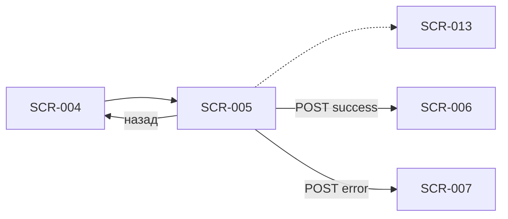

# Оформление записи

**ID:** SCR-005  
**Тип:** Экран  
**Домен:** 02. Бронирование  
**Приоритет:** Critical  
**Статус:** Актуален  
**Сессия клиента:** Не требуется (первая запись); ClientSession — Bearer после первой записи  
**Дизайн-макет:** Figma — TBD · **Design brief:** [SCR-005-booking-form.md](SCR-005-booking-form.md)

> **Платформа:** iOS (NFR-001) · **Язык UI:** только русский (NFR-008) · **Оплата:** на месте (FR-013).

---

## Содержание

- [Обзор](#обзор)
- [Навигация](#навигация)
- [Входные данные](#входные-данные)
- [Применяемые логики](#применяемые-логики)
- [Инициализация](#инициализация)
- [Используемые запросы](#используемые-запросы)
- [Макет экрана](#макет-экрана)
- [Элементы экрана](#элементы-экрана)
- [Состояния экрана](#состояния-экрана)
- [Связанные требования](#связанные-требования)
- [Критерии приёмки](#критерии-приёмки)

---

## Обзор

Экран сбора данных для бронирования **заезда** в картинг-центре «Апекс»: контактные данные ([SCR-013](#секция-контактов-scr-013)), **количество участников** (stepper, FR-007), выбор экипировки (своё / прокат: шлем, подшлемник) и итоговая стоимость перед отправкой `createBooking`. Цена = **цена конфигурации трассы × количество участников**; прокат **не влияет** на сумму (FR-013). Закрывает FR-006, FR-007, FR-008, FR-010. Ограничение «одна запись в день» **не применяется** (FR-011).

### User Story

> Как клиент, я хочу оформить запись на заезд, указав контакты, число участников и экипировку, чтобы центр «Апекс» подготовился к моему визиту, а я увидел итоговую сумму к оплате на месте.

**Не в MVP:** лист ожидания при `NO_SPOTS` (FR-012) — только возврат к расписанию; фильтр по конфигурации/уровню; Android; рейтинги маршалов в UI (FR-028 — v2); секция аллергий (в отличие от других проектов).

---

## Навигация

### Входящая

| Источник | Триггер | Условие | Параметры |
| :-- | :-- | :-- | :-- |
| SCR-004 | CTA «Записаться» | `hasSpots = true`, `isBookable = true`, `rentalAvailable = true` | `slotId` |
| SCR-009 → SCR-001 → SCR-004 | Перезапись после отмены центром (v2) | Профиль может быть заполнен | `slotId` |
| Push / deep link (v2) | Косвенный вход | Только через выбор слота (SCR-001 → SCR-004) | `slotId` |

### Исходящая

| Назначение | Триггер | Параметры |
| :-- | :-- | :-- |
| SCR-004 | «Назад» / swipe back | — |
| SCR-006 | `createBooking` → 201 | `bookingId`, `booking`, `slot`, `sessionToken`, `isFirstBooking` |
| SCR-007 | `createBooking` → 403/409 или 5xx после retry | `errorCode`, `slotId` |
| SCR-013 (sheet) | «Изменить» в сводке контактов | `profile` |

> **Нижняя навигация:** 2 вкладки — «Расписание» (SCR-001) | «Мои записи» (SCR-008). Отдельной вкладки «Профиль» нет.



---

## Входные данные

| Название | Тип | Источник | Описание |
| :-- | :-- | :-- | :-- |
| `slotId` | uuid | Навигация | Идентификатор выбранного заезда |
| `slot` | SlotDetail | API `getSlot` | Детали заезда для сводки, цены и проверки доступности |
| `profile` | ClientProfile | API `getProfile` | Контакты; 404 → режим первой записи |
| `profile.isComplete` | boolean | API `getProfile` | Inline-поля vs сводка контактов |
| `profile.isRegularClient` | boolean | API `getProfile` | Бейдж «Постоянный клиент» (FR-019) |
| `slot.rentalAvailability.rentalAvailable` | boolean | API `getSlot` | Доступность проката на слоте (FR-009) |
| `slot.pricePerParticipant` | decimal? | API `getSlot` | Цена за одного участника для блока «Итого» |
| `participantCount` | int | Локально | Значение stepper, min **1** (FR-007) |
| `equipment` | EquipmentChoice | Локально | `mode`: OWN \| RENTAL; `rentalHelmet`, `rentalBalaclava` |

---

## Применяемые логики

| Логика | Элемент / триггер | Описание |
| :-- | :-- | :-- |
| [LOGIC-001_Контактный-профиль](../../5-mobile-app-spec/09_Логики/LOGIC-001_Контактный-профиль.md) | Секция SCR-013, валидация, submit | Режимы inline / сводка; бейдж постоянного клиента; upsert при `createBooking` |
| [LOGIC-002_Доступность-слота](../../5-mobile-app-spec/09_Логики/LOGIC-002_Доступность-слота.md) | Pre-check перед submit | При `isBookable = false` — блокировка CTA; коды ошибок → SCR-007 |
| [LOGIC-003_Расчёт-цены-брони](../../5-mobile-app-spec/09_Логики/LOGIC-003_Расчёт-цены-брони.md) | Stepper, блок «Итого», CTA | `pricePerParticipant × participantCount`; прокат бесплатный |
| [LOGIC-008_Паттерн-состояний-экрана](../../5-mobile-app-spec/09_Логики/LOGIC-008_Паттерн-состояний-экрана.md) | Загрузка, submit | Loading / Content / Error + Submitting на CTA |

---

## Инициализация

### Запросы при открытии

| № | operationId | Критичный | Условие |
| :-: | :-- | :--: | :-- |
| 1 | `getSlot` | Да | При открытии по `slotId` |
| 2 | `getProfile` | Нет | Параллельно; 404 → первая запись, inline-режим SCR-013 |

> После загрузки: `participantCount = 1` по умолчанию; `equipment.mode = OWN` по умолчанию (если прокат доступен — клиент может переключить на RENTAL).

---

## Используемые запросы

### getSlot

**Метод:** GET  
**Путь:** `/slots/{slotId}`  
**Спецификация:** [../../api/openapi.yaml](../../api/openapi.yaml) → `getSlot`

**Обработка ответа:**

| HTTP / код | UI-реакция |
| :-- | :-- |
| 200 + data | Content: сводка заезда, блок цены, настройка экипировки |
| 200 + data (`rentalAvailable = false`) | Error state + «К расписанию» — на SCR-004 такой слот уже недоступен (FR-009) |
| 200 + data (`hasSpots = false` или `isBookable = false`) | Error state + «К расписанию» |
| 404 | Error state + «К расписанию» |
| 5xx / timeout | Error state + «Повторить» |

---

### getProfile

**Метод:** GET  
**Путь:** `/profile`  
**Спецификация:** [../../api/openapi.yaml](../../api/openapi.yaml) → `getProfile`

**Обработка ответа:**

| HTTP / код | UI-реакция |
| :-- | :-- |
| 200 + data (`isComplete = true`) | Сводка SCR-013; CTA активен при валидной экипировке и участниках |
| 200 + data (`isComplete = false`) | Inline-поля SCR-013 |
| 404 | Первая запись: пустые контакты |
| 401 | Повтор без сессии → режим первой записи (inline) |
| 5xx / timeout | Snack; форма в режиме inline с ручным вводом |

---

### updateProfile

**Метод:** PATCH  
**Путь:** `/profile`  
**Спецификация:** [../../api/openapi.yaml](../../api/openapi.yaml) → `updateProfile`

**Обработка ответа:**

| HTTP / код | UI-реакция |
| :-- | :-- |
| 200 + data | Закрытие sheet SCR-013; обновление сводки; сохранение `sessionToken` |
| 400 `VALIDATION_ERROR` | Inline-ошибки в sheet |
| 5xx / timeout | Snack + «Повторить» в sheet |

> Опционально при «Сохранить» в sheet SCR-013. При submit формы upsert выполняется неявно в `createBooking`.

---

### createBooking

**Метод:** POST  
**Путь:** `/bookings`  
**Спецификация:** [../../api/openapi.yaml](../../api/openapi.yaml) → `createBooking`  
**Последовательность:** [../../4-design/api-sequence.md](../../4-design/api-sequence.md)

**Тело запроса (ключевые поля):**

| Поле | Источник UI |
| :-- | :-- |
| `slotId` | Навигация |
| `client.name`, `client.phone` | SCR-013 |
| `participantCount` | Stepper участников |
| `equipment.mode`, `rentalHelmet`, `rentalBalaclava` | Секция экипировки |

**Пример тела:**

```json
{
  "slotId": "uuid",
  "client": { "name": "Иван", "phone": "+79001234567" },
  "participantCount": 2,
  "equipment": {
    "mode": "RENTAL",
    "rentalHelmet": true,
    "rentalBalaclava": true
  }
}
```

**Обработка ответа:**

| HTTP / код | UI-реакция |
| :-- | :-- |
| 201 + data | Сохранить `sessionToken`; переход SCR-006 с `booking.totalPrice`, `booking.participantCount` |
| 400 `VALIDATION_ERROR` | Inline-ошибки на SCR-005 / SCR-013 (поля из `details[].field`) |
| 403 `SLOT_REBOOK_FORBIDDEN` | SCR-007 (modal) |
| 409 `NO_SPOTS` | SCR-007 (modal, без waitlist CTA) |
| 409 `SLOT_CANCELLED` | SCR-007 (modal) |
| 409 `RENTAL_UNAVAILABLE` | SCR-007 (modal) — слот недоступен, **без** переключения на «со своим» |
| 5xx / timeout | SCR-007 с `NETWORK_ERROR` или Snack + retry submit; форма сохранена |

**Доменные коды createBooking:** `NO_SPOTS`, `SLOT_CANCELLED`, `RENTAL_UNAVAILABLE`, `SLOT_REBOOK_FORBIDDEN`, `VALIDATION_ERROR`.

> При `RENTAL_UNAVAILABLE` форма под modal **остаётся заполненной**, но повторный submit бессмысленен — слот недоступен для записи с прокатом; CTA «К расписанию» (FR-009, api-sequence §5).

---

## Макет экрана

```
┌─────────────────────────────────┐
│ ← Оформление записи             │
├─────────────────────────────────┤
│ Краткая сводка заезда           │
│ 📅 Сб, 5 июля · 18:30           │
│ ⏱ ~15–20 мин                    │
│ 🏁 Длинная трасса               │
│ 🏎 Маршал: Алексей              │
├─────────────────────────────────┤
│ Контактные данные          SCR-013│
│ [🏷 Постоянный клиент]          │  ← если isRegularClient
│ Имя *     [________________]    │  ← или сводка + «Изменить»
│ Телефон * [+7 (___) ___-__-__]  │
├─────────────────────────────────┤
│ Участники                       │
│ Количество:  [ − ]  2  [ + ]    │
│ ℹ Включая вас                   │
├─────────────────────────────────┤
│ Экипировка                      │
│ ○ Со своей экипировкой          │
│ ○ Нужен прокат                  │
│   ☐ Шлем                        │
│   ☐ Подшлемник                  │
│ ℹ Прокат бесплатный             │
├─────────────────────────────────┤
│ Итого                           │
│ Заезд (2 участ.)    7 000 ₽     │
│ ─────────────────────────       │
│ К оплате на месте   7 000 ₽     │
│ ℹ Оплата на месте в центре      │
│    «Апекс»                      │
├─────────────────────────────────┤
│ [ Записаться · 7 000 ₽ ] sticky │
└─────────────────────────────────┘

--- Прокат без выбора позиций ---

┌─────────────────────────────────┐
│ ○ Нужен прокат (выбрано)        │
│   ☐ Шлем                        │
│   ☐ Подшлемник                  │
│ ⚠ Выберите, что нужно взять     │
│   в прокат                      │
│ [ Записаться ]  (disabled)      │
└─────────────────────────────────┘

--- Submitting ---

┌─────────────────────────────────┐
│ [ ◌ Записаться ]  dim overlay   │
└─────────────────────────────────┘
```

Вертикальный скролл; CTA «Записаться» закреплён внизу (sticky footer, iOS safe area).

---

## Элементы экрана

| Элемент | Описание | Источник данных | Валидация / поведение |
| :-- | :-- | :-- | :-- |
| Кнопка «Назад» | Возврат на SCR-004 | Навигация | Черновик формы не сохраняется; профиль на сервере — сохранён |
| Сводка заезда | Компактный блок: дата, время, конфигурация, маршал | `slot.*` | Формат «Сб, 5 июля · 18:30»; длительность `~15–20 мин` |
| Stepper участников | Мин **1**; шаг ±1 | `participantCount` | Подпись «Включая вас»; max не ограничен в UI — сервер вернёт `NO_SPOTS` |
| CTA «Записаться · XXX ₽» | Primary, sticky | [LOGIC-003](../../5-mobile-app-spec/09_Логики/LOGIC-003_Расчёт-цены-брони.md) | Disabled до валидных контактов и экипировки |
| Radio «Со своей экипировкой» | Шлем и подшлемник клиента | Локально | По умолчанию; чекбоксы проката скрыты |
| Radio «Нужен прокат» | Раскрывает чекбоксы | Локально | Доступен только если слот прошёл проверку `rentalAvailable` на SCR-004 |
| Чекбокс «Шлем» | Прокат шлема | Локально | Активен только при `mode = RENTAL` |
| Чекбокс «Подшлемник» | Прокат подшлемника | Локально | Аналогично шлему |
| Подпись «Прокат бесплатный» | Инфо FR-013 | — | Не добавлять строку проката в разбивку цены |
| Разбивка цены | «Заезд (N участ.) XXX ₽» | `pricePerParticipant × participantCount` | Без строк проката |
| Итого «К оплате на месте» | Сумма к оплате | `totalPricePreview` | Равна превью при любом `equipment.mode` |
| Подпись «Оплата на месте» | Информационный блок | — | Нет интеграции с платёжными системами |
| Индикатор загрузки | Spinner на CTA | Локально | При Submitting; блокировка повторного тапа |
| Inline-ошибки | Под полями контактов / экипировки | Локальная валидация | Фокус на первое невалидное поле |

**Терминология:** **маршал**, **заезд**, **конфигурация трассы**; прокат (шлем, подшлемник) **не влияет на цену** (FR-013).

### Секция контактов (SCR-013)

Inline-секция на SCR-005; bottom sheet при тапе «Изменить» на повторной записи. Детали — [SCR-013-contact-profile.md](SCR-013-contact-profile.md), логика — [LOGIC-001](../../5-mobile-app-spec/09_Логики/LOGIC-001_Контактный-профиль.md).

| Элемент | Описание | Источник данных | Валидация / поведение |
| :-- | :-- | :-- | :-- |
| Заголовок секции | «Контактные данные» | — | — |
| Бейдж «Постоянный клиент» | Chip при `isRegularClient` | `profile.isRegularClient` | Read-only; без скидок (FR-019) |
| Поле «Имя» | Inline при первой записи | `profile.name` | 2–50 символов; «Укажите имя» |
| Поле «Телефон» | Маска +7 (XXX) XXX-XX-XX | `profile.phone` | Паттерн `^\+7\d{10}$`; «Введите корректный номер» |
| Сводка (повтор) | «{name} · +7 XXX ***-XX-XX» | `profile` | Тап «Изменить» → bottom sheet SCR-013 |
| Кнопка «Сохранить» (sheet) | PATCH профиля | `updateProfile` | Активна при изменениях и валидности |

---

## Состояния экрана

| Состояние | Условие | Отображение |
| :-- | :-- | :-- |
| Loading | `getSlot` / `getProfile` в процессе | Skeleton сводки и секций |
| Content | 200 `getSlot` | Полный контент формы |
| Error | 404 / 5xx `getSlot` или слот недоступен | Баннер + «Повторить» / «К расписанию» |
| Offline | Нет сети при открытии | «Нет подключения к интернету» + retry (без кэша в MVP) |
| Первая запись | 404 / пустой профиль | Inline SCR-013; CTA disabled до валидных контактов |
| Повторная запись | `isComplete = true` | Сводка контактов + «Изменить» |
| Постоянный клиент | `isRegularClient = true` | Бейдж в секции SCR-013 (FR-019) |
| Один участник | `participantCount = 1` | Итого = цена × 1; строка «Заезд (1 участ.)» |
| Несколько участников | `participantCount > 1` | Итого = цена × N |
| Своё | `equipment.mode = OWN` | Чекбоксы проката скрыты / disabled |
| Прокат выбран | `mode = RENTAL` + чекбоксы | Цена не меняется |
| Прокат без выбора | `RENTAL`, ни один чекбокс | CTA disabled + «Выберите, что нужно взять в прокат» |
| Submitting | `createBooking` в процессе | Spinner на CTA, dim overlay |
| Ошибка валидации | Локальная проверка fail | Inline-ошибки; submit не уходит |
| Ошибка бэкенда | 403/409 от `createBooking` | SCR-007 modal поверх формы |

> Сквозной паттерн — [LOGIC-008](../../5-mobile-app-spec/09_Логики/LOGIC-008_Паттерн-состояний-экрана.md).

### Сценарии

1. **Первая запись, один участник, своё:** заполнить SCR-013 → stepper = 1 → «Со своей» → «Записаться» → loading → SCR-006.
2. **Запись на компанию:** stepper = 3 → цена × 3 → выбрать прокат (шлем + подшлемник) → submit → SCR-006.
3. **Постоянный клиент:** превью контактов + бейдж → «Изменить» → SCR-013 sheet → сохранить → вернуться на форму.
4. **Гонка за место:** submit → `NO_SPOTS` → SCR-007 (без листа ожидания).
5. **Недостаточно карт для N участников:** stepper = 4 → submit → `NO_SPOTS` → SCR-007 → уменьшить stepper или выбрать другой заезд.
6. **Прокат кончился на submit:** редкий `RENTAL_UNAVAILABLE` → SCR-007 → «К расписанию» (не «со своим»).
7. **Несколько заездов в один день:** после успеха клиент может записаться снова — лимит «1 запись в день» **не применяется** (FR-011).
8. **Отмена:** «Назад» → SCR-004; введённые данные формы не сохраняются.

---

## Связанные требования

| ID | Связь |
| :-- | :-- |
| FR-006 | Имя и телефон при первой записи (секция SCR-013) |
| FR-007 | Несколько участников в одной брони — stepper на форме |
| FR-008 | Выбор своей или прокатной экипировки (шлем, подшлемник) |
| FR-009 | При исчерпании проката слот недоступен; `RENTAL_UNAVAILABLE` на submit |
| FR-010 | Отправка брони и обработка результата (успех / отказ) |
| FR-011 | Несколько записей в один день разрешены — без блокировки на форме |
| FR-012 | При `NO_SPOTS` — без листа ожидания |
| FR-013 | Цена от конфигурации трассы × участники; прокат не в сумме; оплата на месте |
| FR-018 | `SLOT_REBOOK_FORBIDDEN` — запрет повторной записи на отменённый слот |
| FR-019 | Бейдж «Постоянный клиент» в блоке контактов |
| UC-002 | Оформление записи на заезд |
| US-006 | Клиент указывает контакты и участников при записи |

---

## Критерии приёмки

| ID | Критерий |
| :-- | :-- |
| AC-001 | **Дано** пользователь перешёл из SCR-004 с `slotId`, **Когда** `getSlot` и `getProfile` завершились, **Тогда** отображаются сводка заезда, секция SCR-013, stepper участников, экипировка и блок «Итого». |
| AC-002 | **Дано** пустой профиль (404 `getProfile`), **Когда** открыт SCR-005, **Тогда** контакты в inline-режиме SCR-013, CTA «Записаться» disabled до заполнения обязательных полей. |
| AC-003 | **Дано** `isComplete = true`, **Когда** экран в Content, **Тогда** показана сводка контактов с ссылкой «Изменить», CTA активен при валидной экипировке. |
| AC-004 | **Дано** `isRegularClient = true`, **Когда** отображается секция SCR-013, **Тогда** виден бейдж «Постоянный клиент» без UI скидок. |
| AC-005 | **Дано** `participantCount = 2` и `pricePerParticipant = 3500`, **Когда** отображается блок «Итого», **Тогда** сумма превью = 7000 ₽ и строка «Заезд (2 участ.)». |
| AC-006 | **Дано** stepper на минимуме, **Когда** пользователь нажимает «−», **Тогда** значение остаётся **1** (ниже не опускается). |
| AC-007 | **Дано** выбран прокат шлема и подшлемника, **Когда** отображается блок «Итого», **Тогда** сумма не включает стоимость проката (FR-013). |
| AC-008 | **Дано** выбрано «Нужен прокат» без чекбоксов, **Когда** пользователь видит форму, **Тогда** CTA disabled и показана подсказка о выборе позиций проката. |
| AC-009 | **Дано** валидная форма, **Когда** `createBooking` вернул 201, **Тогда** сохранён `sessionToken`, выполнен переход на SCR-006 с `booking.totalPrice` и `booking.participantCount`. |
| AC-010 | **Дано** `createBooking` вернул `NO_SPOTS`, **Когда** открывается SCR-007, **Тогда** на ошибке отсутствует CTA листа ожидания (FR-012). |
| AC-011 | **Дано** `createBooking` вернул `RENTAL_UNAVAILABLE`, **Когда** modal открыт, **Тогда** текст **не** предлагает переключиться на «со своей экипировкой»; primary CTA — «К расписанию». |
| AC-012 | **Дано** невалидный телефон, **Когда** пользователь нажимает «Записаться», **Тогда** показана inline-ошибка, запрос `createBooking` не отправляется. |
| AC-013 | **Дано** `createBooking` вернул 400 `VALIDATION_ERROR`, **Когда** ответ содержит `details`, **Тогда** inline-ошибки на соответствующих полях SCR-005/SCR-013, SCR-007 **не** открывается. |
| AC-014 | **Дано** успешная первая запись, **Когда** клиент снова открывает SCR-005 в тот же день, **Тогда** форма доступна без ограничения «одна запись в день» (FR-011). |
| AC-015 | **Дано** submit в процессе, **Когда** `createBooking` выполняется, **Тогда** CTA в состоянии Submitting, повторный тап заблокирован. |
