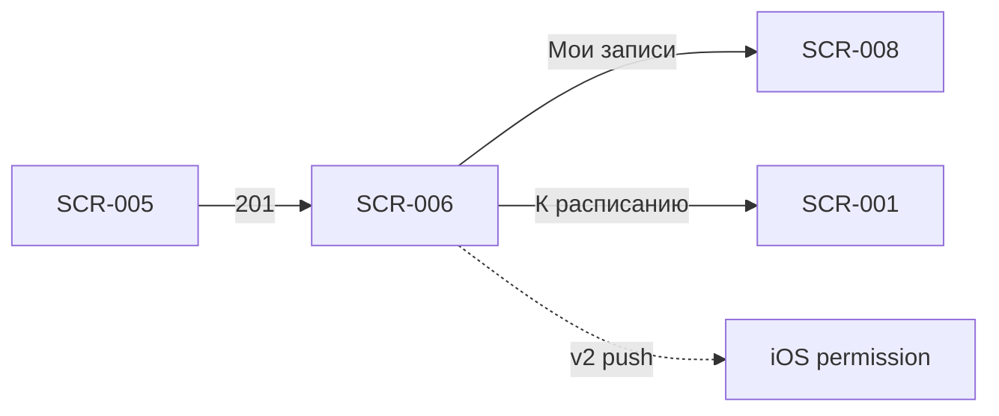

# Успешная запись

**ID:** SCR-006  
**Тип:** Экран  
**Домен:** 02. Бронирование  
**Приоритет:** Critical  
**Статус:** Актуален  
**Сессия клиента:** ClientSession — Bearer после первой записи (`sessionToken` из ответа `createBooking`)  
**Дизайн-макет:** Figma — TBD · **Design brief:** [SCR-006-booking-success.md](SCR-006-booking-success.md)

> **Платформа:** iOS (NFR-001) · **Язык UI:** только русский (NFR-008) · **Оплата:** на месте (FR-013).

---

## Содержание

- [Обзор](#обзор)
- [Навигация](#навигация)
- [Входные данные](#входные-данные)
- [Применяемые логики](#применяемые-логики)
- [Инициализация](#инициализация)
- [Используемые запросы](#используемые-запросы)
- [Макет экрана](#макет-экрана)
- [Элементы экрана](#элементы-экрана)
- [Состояния экрана](#состояния-экрана)
- [Сценарии](#сценарии)
- [Связанные требования](#связанные-требования)
- [Критерии приёмки](#критерии-приёмки)

---

## Обзор

Экран подтверждает клиенту успешное создание брони на **заезд** после ответа `createBooking` (201). Показывает **сводку заезда, число участников, экипировку и цену** с явной подписью «К оплате на месте». При первой успешной записи сохраняет `sessionToken` для `ClientSession`. Закрывает успешную ветку FR-010 и задаёт следующий шаг: просмотр «Мои записи» или возврат к расписанию.

Полноэкранный success-state предпочтительнее modal — ясное завершение потока записи.

### User Story

> Как клиент, я хочу увидеть подтверждение записи и сводку заезда, чтобы быть уверенным, что бронь создана, и перейти к следующему действию.

**Не в MVP v1:** блок запроса push-разрешения на экране (FR-029 — v2, [LOGIC-007](../../5-mobile-app-spec/09_Логики/LOGIC-007_Запрос-push-разрешения.md)); лист ожидания при `NO_SPOTS` (FR-012); Android; рейтинги маршалов.

---

## Навигация

### Входящая

| Источник | Триггер | Условие | Параметры |
| :-- | :-- | :-- | :-- |
| SCR-005 | Успешный `createBooking` | HTTP 201 | `bookingId`, `booking`, `slot`, `sessionToken`, `isFirstBooking` |

### Исходящая

| Назначение | Триггер | Параметры |
| :-- | :-- | :-- |
| SCR-008 | CTA «Мои записи» | — (вкладка «Мои записи») |
| SCR-001 | CTA «К расписанию» | — (вкладка «Расписание») |
| SCR-001 | Системная «Назад» / swipe back | **Сброс стека** — не возврат на SCR-005 |
| OS (v2) | CTA «Включить уведомления» | Системный диалог push-разрешения iOS |

> **Нижняя навигация:** 2 вкладки — «Расписание» (SCR-001) | «Мои записи» (SCR-008). Отдельной вкладки «Профиль» нет.

> **Сброс back stack:** при любом выходе с SCR-006 форма SCR-005 **не** остаётся в стеке — избежать повторного submit.



---

## Входные данные

| Название | Тип | Источник | Описание |
| :-- | :-- | :-- | :-- |
| `bookingId` | uuid | Навигация / `createBooking` | Идентификатор созданной брони |
| `booking` | Booking | API `createBooking` 201 | Полный объект: статус, цена, участники, экипировка |
| `booking.totalPrice` | decimal | API `createBooking` | **Источник истины** для отображения суммы |
| `booking.participantCount` | int | API `createBooking` | Подтверждённое число участников |
| `booking.equipment` | EquipmentChoice | API `createBooking` | `mode`: OWN \| RENTAL; `rentalHelmet`, `rentalBalaclava` |
| `booking.status` | enum | API `createBooking` | `ACTIVE` → бейдж «Записан» |
| `booking.briefingRequired` | boolean | API `createBooking` | Нужен ли инструктаж (Q 1.7) |
| `slot` | SlotDetail | Передано из SCR-005 / контекст ответа | Дата, конфигурация, маршал для сводки |
| `sessionToken` | string | API `createBooking` | **Обязательно сохранить** локально при первой записи |
| `isFirstBooking` | boolean | Локально / навигация | Первая успешная бронь на устройстве |
| `pushPermissionRequested` | boolean | Локальное хранилище | Флаг: системный запрос push уже показывался (v2) |

---

## Применяемые логики

| Логика | Элемент / триггер | Описание |
| :-- | :-- | :-- |
| [LOGIC-001_Контактный-профиль](../../5-mobile-app-spec/09_Логики/LOGIC-001_Контактный-профиль.md) | Сохранение `sessionToken` | После 201 — persist JWT для `ClientSession` |
| [LOGIC-003_Расчёт-цены-брони](../../5-mobile-app-spec/09_Логики/LOGIC-003_Расчёт-цены-брони.md) | Блок «К оплате на месте» | Сумма из `booking.totalPrice`; прокат не влияет на цену |
| [LOGIC-007_Запрос-push-разрешения](../../5-mobile-app-spec/09_Логики/LOGIC-007_Запрос-push-разрешения.md) | Блок «Напоминания о заезде» (**v2**) | Показ только при первой записи и feature-flag v2 |

---

## Инициализация

### Запросы при открытии

| № | operationId | Критичный | Условие |
| :-: | :-- | :--: | :-- |
| — | — | — | **GET не выполняется.** Данные передаются из ответа `createBooking` (201) через навигацию |

### Действия при открытии (синхронно)

| Шаг | Действие | Условие |
| :-- | :-- | :-- |
| 1 | Сохранить `sessionToken` в secure storage | `sessionToken` присутствует в ответе 201 |
| 2 | Установить `isFirstBooking = false` в локальном флаге | После первой успешной брони на устройстве |
| 3 | Отрисовать Content success-state | Данные `booking` + `slot` валидны |

> Экран открывается только после успешного `createBooking`. Инициализация — из параметров навигации и локальных флагов.

---

## Используемые запросы

### createBooking (входящий, выполнен на SCR-005)

**Метод:** POST  
**Путь:** `/bookings`  
**Спецификация:** [../../api/openapi.yaml](../../api/openapi.yaml) → `createBooking`  
**Последовательность:** [../../4-design/api-sequence.md](../../4-design/api-sequence.md)

**Обработка ответа (контекст перехода на SCR-006):**

| HTTP / код | UI-реакция |
| :-- | :-- |
| 201 + data | Переход на SCR-006; передать `booking`, `slot`, `isFirstBooking`; **сохранить `sessionToken`** |
| 4xx / 5xx | SCR-007 (не SCR-006) |

**Пример ответа 201 (ключевые поля):**

```json
{
  "id": "uuid",
  "status": "ACTIVE",
  "participantCount": 2,
  "totalPrice": 7000,
  "briefingRequired": false,
  "equipment": { "mode": "RENTAL", "rentalHelmet": true, "rentalBalaclava": true },
  "sessionToken": "eyJhbGciOiJIUzI1NiIsInR5cCI6IkpXVCJ9..."
}
```

**Доменные коды createBooking:** `NO_SPOTS`, `SLOT_CANCELLED`, `RENTAL_UNAVAILABLE`, `SLOT_REBOOK_FORBIDDEN`, `VALIDATION_ERROR`.

---

### registerPushToken (v2)

**Метод:** POST  
**Путь:** `/profile/push-token`  
**Спецификация:** [../../api/openapi.yaml](../../api/openapi.yaml) → `registerPushToken`

**Тело запроса:**

```json
{ "token": "<APNs>", "platform": "ios" }
```

**Обработка ответа:**

| HTTP / код | UI-реакция |
| :-- | :-- |
| 204 | Токен зарегистрирован; UI не прерывается |
| 401 / 400 / 500 | Ошибка логируется; навигация с SCR-006 работает штатно |

> Вызывается **асинхронно** после разрешения push в системном диалоге iOS (v2, [LOGIC-007](../../5-mobile-app-spec/09_Логики/LOGIC-007_Запрос-push-разрешения.md)). Не блокирует CTA «Мои записи» / «К расписанию». В **MVP v1** не вызывается.

---

## Макет экрана

```
┌─────────────────────────────────┐
│                                 │
│         ✓ (иконка успеха)       │
│                                 │
│      Вы записаны!               │
│                                 │
├─────────────────────────────────┤
│ Сводка брони                    │
│ 📅 Сб, 5 июля · 18:30           │
│ ⏱ ~15–20 мин                    │
│ 🏁 Длинная трасса               │
│ 🏎 Маршал: Алексей              │
│ 👥 Участников: 2                │
│ 🎒 Со своей / Прокат: шлем,     │
│    подшлемник                   │
│ 📋 Инструктаж потребуется       │  ← если briefingRequired
│ 💰 К оплате на месте: 7 000 ₽   │
│ [ Записан ]                     │
├─────────────────────────────────┤
│ 🔔 Напоминания о заезде         │  ← v2, первая запись
│ Мы напомним за 2 ч, сообщим     │
│ об отмене и переносе.           │
│ [ Включить уведомления ]        │
│ [ Не сейчас ]                   │
├─────────────────────────────────┤
│ [ Мои записи ]    (primary)     │
│ [ К расписанию ]  (secondary)   │
└─────────────────────────────────┘
```

---

## Элементы экрана

| Элемент | Описание | Источник данных | Валидация / поведение |
| :-- | :-- | :-- | :-- |
| Иконка успеха | Галочка / лёгкая анимация подтверждения | Локально | Дублируется текстом заголовка (a11y) |
| Заголовок | «Вы записаны!» или «Запись подтверждена» | Локально | VoiceOver focus при появлении |
| Сводка брони | Дата, время, длительность, конфигурация, маршал | `slot.*` | Дата/время — крупнее остального |
| Строка участников | «Участников: N» | `booking.participantCount` | Явно видно при групповой записи |
| Бейдж «Записан» | Статус брони | `booking.status` | Согласован со статусами SCR-008 |
| Строка экипировки | OWN или перечень проката | `booking.equipment` | OWN → «Со своей экипировкой»; RENTAL → «Прокат: шлем, подшлемник» |
| Строка инструктажа | Условная | `booking.briefingRequired` | `true` → «Инструктаж потребуется»; `false` → скрыта или «Инструктаж не потребуется» |
| Блок цены | Сумма к оплате на месте | `booking.totalPrice` | Формат «К оплате на месте: X ₽»; без разбивки проката |
| Блок push-разрешения (**v2**) | Объяснение типов уведомлений FR-029 | [LOGIC-007](../../5-mobile-app-spec/09_Логики/LOGIC-007_Запрос-push-разрешения.md) | Только при `isFirstBooking`, v2 feature-flag, `pushPermissionRequested = false` |
| CTA «Включить уведомления» (**v2**) | Запуск системного запроса push iOS | Локально | Без жаргона «APNs» / «push-токен» |
| CTA «Не сейчас» (**v2**) | Пропуск запроса | Локально | Скрывает блок; без nag-screen |
| CTA «Мои записи» | Primary — переход к списку с новой записью | Навигация | Сброс стека; SCR-008 с новой бронью вверху |
| CTA «К расписанию» | Secondary — возврат к поиску заездов | Навигация | Сброс стека до SCR-001 |

**Терминология:** **маршал**, **заезд**, **конфигурация трассы**; прокат (шлем, подшлемник) **не влияет на цену** (FR-013).

**Критерии для дизайнера:**

- Тон экрана — позитивный, динамичный (картинг); без излишней «праздничной» анимации.
- **MVP v1:** блок push **не показывать** — допустима серая пометка в Figma «v2: уведомления».
- Сводка — карточка с иерархией: **дата/время крупнее**; конфигурация и маршал — второй уровень.
- Два CTA: primary «Мои записи», secondary «К расписанию» — не конкурируют визуально.
- iOS safe area; на маленьких экранах сводка скроллится, CTA внизу.
- Цена — одна строка «К оплате на месте»; без разбивки проката.

---

## Состояния экрана

| Состояние | Условие | Отображение |
| :-- | :-- | :-- |
| Content (успех, своё) | `equipment.mode = OWN` | «Со своей экипировкой» |
| Content (успех, прокат) | `equipment.mode = RENTAL` | «Прокат: шлем, подшлемник» (перечень выбранного) |
| Один участник | `participantCount = 1` | «Участников: 1» |
| Несколько участников | `participantCount > 1` | «Участников: N»; сумма = серверный `totalPrice` |
| Инструктаж нужен | `briefingRequired = true` | Строка «Инструктаж потребуется» |
| Инструктаж не нужен | `briefingRequired = false` | Строка скрыта или «Инструктаж не потребуется» |
| Push primer (**v2**) | `isFirstBooking = true`, push не запрашивался, v2 enabled | Блок «Напоминания о заезде» + CTA |
| Push hidden (MVP v1 / повтор) | v1 или не первая бронь | Блок push **скрыт** |
| Push granted (**v2**) | OS permission granted | Блок push скрыт; подпись «Мы напомним о заезде» |
| Push denied (**v2**) | Permission denied | Блок скрыт; без повторного запроса на этом экране |

> Единственное основное состояние — **Content (успех)** после 201; ошибки обрабатываются на SCR-007. SCR-006 **не** входит в сквозной паттерн Loading/Empty/Error — см. [LOGIC-008](../../5-mobile-app-spec/09_Логики/LOGIC-008_Паттерн-состояний-экрана.md).

---

## Сценарии

1. **Проверить запись:** успех → «Мои записи» → SCR-008 (новая бронь вверху со статусом «Записан»).
2. **Записаться ещё в тот же день:** успех → «К расписанию» → SCR-001 → выбор другого заезда → SCR-005. **Несколько заездов в один день разрешены** (FR-011).
3. **Первая запись + sessionToken:** успех → `sessionToken` сохранён → последующие `getProfile` / `listBookings` с `ClientSession`.
4. **Первая запись + push (v2):** успех → блок уведомлений → «Включить уведомления» → системный диалог iOS → разрешено → `registerPushToken` async → CTA внизу.
5. **Первая запись, отказ push (v2):** «Не сейчас» → блок скрывается → клиент переходит в «Мои записи».
6. **Системная «Назад»:** сброс стека до SCR-001 — **не** возврат на SCR-005 (избежать повторного submit).

---

## Связанные требования

| ID | Связь |
| :-- | :-- |
| FR-010 | Подтверждение успешного бронирования после ответа бэкенда |
| FR-011 | Клиент может записаться на другой заезд в тот же день — CTA «К расписанию» актуален |
| FR-013 | Сводка содержит итоговую цену; «К оплате на месте»; прокат не в сумме |
| FR-022 | Сохранение `sessionToken` для последующих запросов |
| FR-029 | Push/SMS-напоминания — **v2**; блок разрешений **не в MVP v1** |
| NFR-010 | Push и deep links (v2) |
| UC-002 | Успешное завершение сценария записи |
| US-006 | Клиент получает подтверждение брони |

---

## Критерии приёмки

| ID | Критерий |
| :-- | :-- |
| AC-001 | **Дано** `createBooking` вернул 201, **Когда** открывается SCR-006, **Тогда** отображаются иконка успеха, заголовок «Вы записаны!» и сводка с датой, конфигурацией трассы, маршалом и `booking.totalPrice`. |
| AC-002 | **Дано** `booking.participantCount = 3`, **Когда** экран отрисован, **Тогда** в сводке строка «Участников: 3» и сумма соответствует `booking.totalPrice`. |
| AC-003 | **Дано** `booking.equipment.mode = RENTAL` с шлемом и подшлемником, **Когда** экран отрисован, **Тогда** в сводке перечень проката; цена не включает стоимость проката. |
| AC-004 | **Дано** ответ 201 содержит `sessionToken`, **Когда** SCR-006 инициализирован, **Тогда** токен сохранён локально для заголовка `Authorization: Bearer` в последующих запросах. |
| AC-005 | **Дано** MVP v1 (push feature-flag выключен), **Когда** SCR-006 открыт после первой записи, **Тогда** блок push-разрешения **не** отображается. |
| AC-006 | **Дано** v2, `isFirstBooking = true` и push ещё не запрашивался, **Когда** SCR-006 в Content, **Тогда** показан блок «Напоминания о заезде» с CTA «Включить уведомления» и «Не сейчас». |
| AC-007 | **Дано** v2, клиент разрешил push в iOS, **Когда** получен APNs-токен, **Тогда** асинхронно вызывается `registerPushToken` с `platform: ios`; ошибки API не блокируют навигацию. |
| AC-008 | **Дано** это не первая бронь на устройстве, **Когда** SCR-006 открыт, **Тогда** блок push-разрешения **скрыт** (v2). |
| AC-009 | **Дано** пользователь на SCR-006, **Когда** нажата системная «Назад» или CTA «К расписанию», **Тогда** выполняется переход в SCR-001 **без** возврата на SCR-005. |
| AC-010 | **Дано** пользователь на SCR-006, **Когда** нажат CTA «Мои записи», **Тогда** выполняется переход в SCR-008; новая бронь отображается со статусом «Записан». |
| AC-011 | **Дано** `booking.briefingRequired = true`, **Когда** экран отрисован, **Тогда** в сводке указано, что инструктаж потребуется. |
| AC-012 | **Дано** push уже разрешён в iOS (v2), **Когда** SCR-006 открыт после первой записи, **Тогда** блок primer скрыт и показана подпись «Мы напомним о заезде». |
