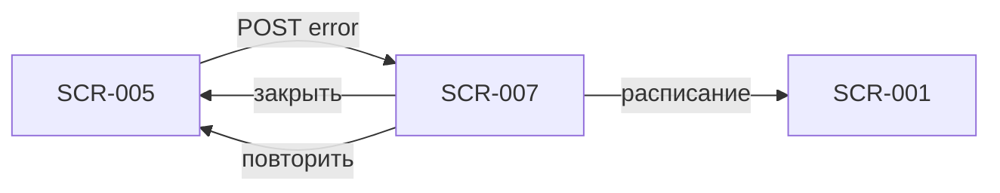

# Ошибка записи

**ID:** SCR-007  
**Тип:** Dialog  
**Домен:** 02. Бронирование  
**Приоритет:** Critical  
**Статус:** Актуален  
**Сессия клиента:** ClientSession — Bearer после первой записи (если уже была)  
**Дизайн-макет:** Figma — TBD · **Design brief:** [SCR-007-booking-error.md](SCR-007-booking-error.md)

> **Платформа:** iOS (NFR-001) · **Язык UI:** только русский (NFR-008) · **Оплата:** на месте (FR-013).

---

## Содержание

- [Обзор](#обзор)
- [Навигация](#навигация)
- [Входные данные](#входные-данные)
- [Применяемые логики](#применяемые-логики)
- [Инициализация](#инициализация)
- [Используемые запросы](#используемые-запросы)
- [Макет экрана](#макет-экрана)
- [Элементы экрана](#элементы-экрана)
- [Состояния экрана](#состояния-экрана)
- [Связанные требования](#связанные-требования)
- [Критерии приёмки](#критерии-приёмки)

---

## Обзор

Dialog/modal информирует клиента об отказе бронирования после submit на SCR-005. Покрывает гонку за последние места, недостаток карт для числа участников, отмену заезда центром, исчерпание проката, запрет повторной записи на отменённый слот и сетевые сбои. Закрывает неуспешную ветку FR-010 **без потери контекста формы**. **Лист ожидания не предлагается** (FR-012). Ограничение «одна запись в день» **отсутствует** (FR-011).

### User Story

> Как клиент, я хочу понять, почему запись на заезд не удалась, и быстро выбрать следующий шаг — исправить форму, перейти к расписанию или повторить отправку.

**Не в MVP:** лист ожидания при `NO_SPOTS` (FR-012); Android; переключение на «со своей экипировкой» при `RENTAL_UNAVAILABLE` (слот полностью недоступен — FR-009).

---

## Навигация

### Входящая

| Источник | Триггер | Условие | Параметры |
| :-- | :-- | :-- | :-- |
| SCR-005 | Ошибка `createBooking` | HTTP 403, 409 или доменный код | `errorCode`, `slotId` |
| SCR-005 | Сетевая ошибка после retry | 5xx, timeout | `errorCode = NETWORK_ERROR`, `slotId` |

> `400 VALIDATION_ERROR` обрабатывается **inline на SCR-005**, SCR-007 **не** открывается.

### Исходящая

| Назначение | Триггер | Параметры |
| :-- | :-- | :-- |
| SCR-001 | CTA «К расписанию» | Закрыть modal + обновить список заездов |
| SCR-005 | CTA «Понятно» / закрытие (✕) / tap outside | Форма с сохранёнными данными |
| SCR-005 | CTA «Повторить» | При `NETWORK_ERROR` — повторный `POST /bookings` |

> **Нижняя навигация:** 2 вкладки — «Расписание» (SCR-001) | «Мои записи» (SCR-008). Отдельной вкладки «Профиль» нет.



---

## Входные данные

| Название | Тип | Источник | Описание |
| :-- | :-- | :-- | :-- |
| `errorCode` | string | API `createBooking` / локально | Доменный код или `NETWORK_ERROR` / `GENERIC` |
| `slotId` | uuid | Навигация | Идентификатор слота для retry и возврата |
| `bookingDraft` | локальная модель | SCR-005 | Сохранённые поля формы при закрытии modal |
| `participantCount` | int | SCR-005 | Для контекста при `NO_SPOTS` |

---

## Применяемые логики

| Логика | Элемент / триггер | Описание |
| :-- | :-- | :-- |
| [LOGIC-002_Доступность-слота](../../5-mobile-app-spec/09_Логики/LOGIC-002_Доступность-слота.md) | Коды `NO_SPOTS`, `RENTAL_UNAVAILABLE`, `SLOT_CANCELLED` | Без waitlist; при прокате — слот недоступен целиком |
| [LOGIC-008_Паттерн-состояний-экрана](../../5-mobile-app-spec/09_Логики/LOGIC-008_Паттерн-состояний-экрана.md) | Фон SCR-005 | Dialog overlay; фоновая форма в Content |

---

## Инициализация

### Запросы при открытии

| № | operationId | Критичный | Условие |
| :-: | :-- | :--: | :-- |
| — | — | — | **GET не выполняется.** Dialog строится из `errorCode`, переданного из SCR-005 после неуспешного `createBooking` |

> Инициализация из параметров навигации. Фон — SCR-005 в состоянии Content (форма сохранена, Submitting снят).

---

## Используемые запросы

### createBooking (контекст ошибки, выполнен на SCR-005)

**Метод:** POST  
**Путь:** `/bookings`  
**Спецификация:** [../../api/openapi.yaml](../../api/openapi.yaml) → `createBooking`  
**Последовательность:** [../../4-design/api-sequence.md](../../4-design/api-sequence.md)

**Обработка ответа (переход на SCR-007):**

| HTTP / код | UI-реакция |
| :-- | :-- |
| 403 `SLOT_REBOOK_FORBIDDEN` | SCR-007 modal |
| 409 `NO_SPOTS` | SCR-007 modal, **без waitlist CTA** |
| 409 `SLOT_CANCELLED` | SCR-007 modal |
| 409 `RENTAL_UNAVAILABLE` | SCR-007 modal — **без** рекомендации «со своей экипировкой» |
| 5xx / timeout | SCR-007 modal с `NETWORK_ERROR` |
| 400 `VALIDATION_ERROR` | Inline на SCR-005 (**не** SCR-007) |
| Прочие 4xx | SCR-007 modal с `GENERIC` |

**Доменные коды createBooking:** `NO_SPOTS`, `SLOT_CANCELLED`, `RENTAL_UNAVAILABLE`, `SLOT_REBOOK_FORBIDDEN`, `VALIDATION_ERROR`.

---

## Макет экрана

Modal поверх SCR-005 (форма видна затемнённой под modal):

```
┌─────────────────────────────────┐
│            ✕                    │
│                                 │
│     [ иконка предупреждения ]   │
│                                 │
│     {Заголовок по типу ошибки}  │
│                                 │
│     {Поясняющий текст}          │
│                                 │
│  [ К расписанию ]     (primary) │
│  [ Понятно ]          (secondary)│
│  [ Повторить ]        (сеть)    │
└─────────────────────────────────┘
```

Компактный dialog по центру; на маленьких экранах допустим bottom sheet с тем же содержимым (iOS). Затемнение фона 40–60 %.

---

## Элементы экрана

| Элемент | Описание | Источник данных | Валидация / поведение |
| :-- | :-- | :-- | :-- |
| Кнопка закрытия (✕) | Закрывает modal | Локально | Форма SCR-005 сохранена; эквивалент «Понятно» (где применимо) |
| Иконка | Предупреждение (amber), не panic-red | Локально | Ситуация штатная при высокой загрузке выходных |
| Заголовок | Зависит от `errorCode` | `errorCode` | Технические коды **не показывать** пользователю |
| Текст пояснения | 1–2 предложения, конкретная причина | `errorCode` | Дружелюбный тон; термин **заезд**, не «слот тренировки» |
| CTA «К расписанию» | Primary для большинства сценариев | Навигация | После перехода — refresh `listSlots` |
| CTA «Понятно» | Закрыть modal, остаться на форме | Локально | Доступен где указано в таблице состояний |
| CTA «Повторить» | При `NETWORK_ERROR` | SCR-005 | Повторный `createBooking` без потери полей |
| Затемнение фона | Overlay | Локально | Tap outside = «Понятно» (где применимо) |

**Терминология:** **маршал**, **заезд**, **конфигурация трассы**, **прокат экипировки** (шлем, подшлемник).

---

## Состояния экрана

| `errorCode` (API) | HTTP | Заголовок | Текст | CTA |
| :-- | :--: | :-- | :-- | :-- |
| `NO_SPOTS` | 409 | Мест больше нет | Пока вы оформляли запись, места на этот заезд закончились. Уменьшите число участников или выберите другой заезд в расписании. | «К расписанию», «Понятно» |
| `SLOT_CANCELLED` | 409 | Заезд отменён | Этот заезд больше недоступен. Выберите другой заезд в расписании. | «К расписанию» |
| `RENTAL_UNAVAILABLE` | 409 | Запись недоступна | Прокат экипировки на это время закончился. Выберите другой заезд или время. | «К расписанию», «Понятно» |
| `SLOT_REBOOK_FORBIDDEN` | 403 | Запись на этот заезд недоступна | Вы уже были записаны на этот заезд, который отменил центр. Повторная запись на него невозможна — выберите другой заезд. | «К расписанию» |
| `NETWORK_ERROR` | 5xx / timeout | Не удалось записаться | Проверьте подключение к интернету и попробуйте снова. | «Повторить», «К расписанию» |
| `GENERIC` | прочие | Не удалось записаться | Попробуйте ещё раз или выберите другой заезд. | «Понятно», «К расписанию» |

> **`NO_SPOTS`:** CTA «В лист ожидания» **отсутствует** — лист ожидания не в MVP (FR-012).

> **`RENTAL_UNAVAILABLE` на submit** — редкий случай: на SCR-004 слот был доступен, но прокат исчерпался между открытием формы и отправкой. **Не** предлагать переключиться на «со своей экипировкой» — в «Апекс» при исчерпании проката слот недоступен целиком (FR-009, api-sequence §5).

> **`VALIDATION_ERROR`:** обрабатывается inline на SCR-005 / SCR-013; SCR-007 **не** показывается.

> SCR-007 — dialog overlay поверх SCR-005. Фоновая форма остаётся в Content или переходит в Submitting при «Повторить».

### Сценарии

1. **Гонка за место:** два клиента на последние карты → первый успех, второй `NO_SPOTS` → modal → «К расписанию» → SCR-001 (обновить список).
2. **Слишком много участников:** stepper = 4, свободно 2 карта → `NO_SPOTS` → «Понятно» → уменьшить stepper на SCR-005 или «К расписанию».
3. **Прокат кончился на submit:** редкий `RENTAL_UNAVAILABLE` → «К расписанию» (остаться на форме бессмысленно — слот недоступен).
4. **Заезд отменён центром:** `SLOT_CANCELLED` → «К расписанию».
5. **Повторная запись на отменённый слот:** `SLOT_REBOOK_FORBIDDEN` → «К расписанию» (FR-018).
6. **Сеть:** timeout → «Повторить» на SCR-005 без потери полей.
7. **Закрытие modal:** «Понятно» / ✕ → SCR-005 с теми же данными; клиент может изменить `participantCount` и повторить (если ошибка `NO_SPOTS`).

---

## Связанные требования

| ID | Связь |
| :-- | :-- |
| FR-009 | `RENTAL_UNAVAILABLE` — слот недоступен; на SCR-004 уже заблокирован, на submit — edge case |
| FR-010 | Отображение отказа бронирования после ответа бэкенда |
| FR-011 | Несколько записей в день разрешены — код `ONE_BOOKING_PER_DAY` **отсутствует** |
| FR-012 | При `NO_SPOTS` — без листа ожидания, только возврат к расписанию |
| FR-018 | `SLOT_REBOOK_FORBIDDEN` — запрет повторной записи на отменённый центром заезд |
| UC-002 | Неуспешное завершение сценария записи |

---

## Критерии приёмки

| ID | Критерий |
| :-- | :-- |
| AC-001 | **Дано** `createBooking` вернул 409 `NO_SPOTS`, **Когда** открывается SCR-007, **Тогда** показаны заголовок «Мест больше нет», поясняющий текст и CTA «К расписанию»; CTA «В лист ожидания» **отсутствует** (FR-012). |
| AC-002 | **Дано** `createBooking` вернул 409 `NO_SPOTS`, **Когда** modal открыт, **Тогда** доступен CTA «Понятно», закрывающий modal с сохранением данных формы SCR-005. |
| AC-003 | **Дано** `createBooking` вернул 409 `SLOT_CANCELLED`, **Когда** modal открыт, **Тогда** отображаются заголовок «Заезд отменён» и primary CTA «К расписанию». |
| AC-004 | **Дано** `createBooking` вернул 409 `RENTAL_UNAVAILABLE`, **Когда** modal открыт, **Тогда** текст **не** содержит предложения записаться «со своей экипировкой»; primary CTA — «К расписанию». |
| AC-005 | **Дано** `createBooking` вернул 403 `SLOT_REBOOK_FORBIDDEN`, **Когда** modal открыт, **Тогда** отображается текст о запрете повторной записи на отменённый заезд и CTA «К расписанию». |
| AC-006 | **Дано** сетевая ошибка (5xx / timeout), **Когда** SCR-007 с `NETWORK_ERROR`, **Тогда** показаны CTA «Повторить» и «К расписанию»; «Повторить» инициирует повторный submit на SCR-005. |
| AC-007 | **Дано** modal открыт поверх SCR-005, **Когда** пользователь нажал ✕ или «Понятно» (где доступно), **Тогда** форма SCR-005 отображается с сохранёнными полями, включая `participantCount` и экипировку. |
| AC-008 | **Дано** пользователь выбрал «К расписанию», **Когда** выполнен переход в SCR-001, **Тогда** список заездов обновляется для актуальных «есть места / мест нет». |
| AC-009 | **Дано** любой `errorCode`, **Когда** modal отображён, **Тогда** технические коды (`NO_SPOTS`, `RENTAL_UNAVAILABLE` и т.д.) **не видны** пользователю. |
| AC-010 | **Дано** `createBooking` вернул 400 `VALIDATION_ERROR`, **Когда** обрабатывается ответ, **Тогда** SCR-007 **не** открывается; ошибки показаны inline на SCR-005. |
| AC-011 | **Дано** modal открыт, **Когда** VoiceOver активен, **Тогда** при открытии озвучивается заголовок dialog (iOS a11y). |
| AC-012 | **Дано** код `ONE_BOOKING_PER_DAY`, **Когда** —, **Тогда** такой код **не используется** в «Апекс» (FR-011); соответствующего состояния SCR-007 нет. |
