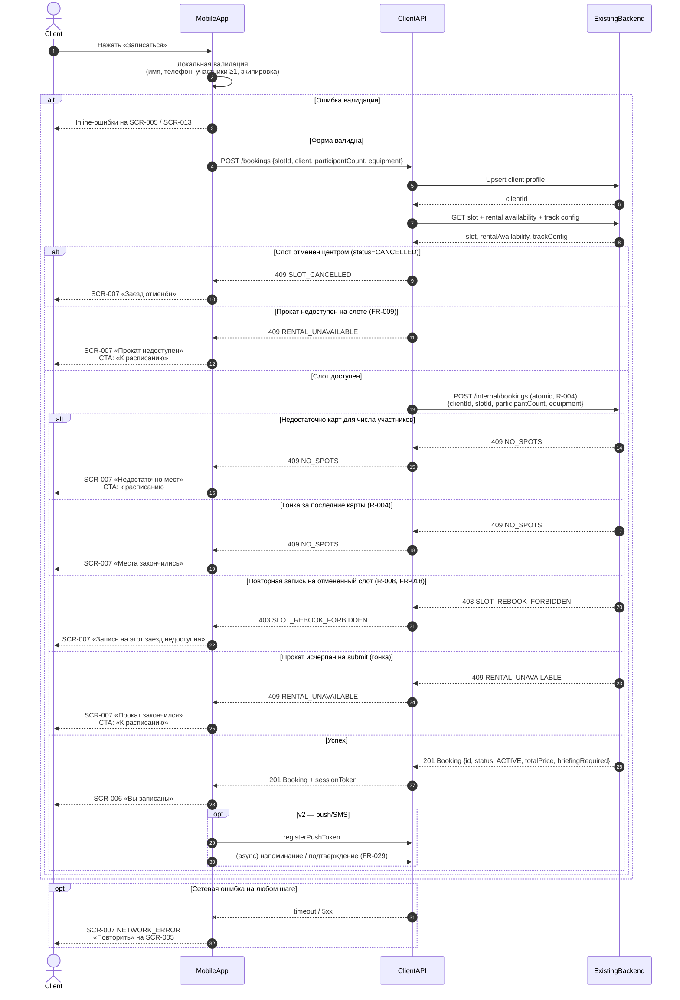

# API Sequence — createBooking

> Этап проектирования. Источники: [data-model.md](data-model.md), UC-002, FR-006–FR-013, R-004;
> [customer-questions.md](../1-elicitation/customer-questions.md) (Q 1.1, 1.2, 1.3, 2.3, 2.4).
>
> Диаграмма описывает поток **создания брони** из клиентского приложения через Client API в Existing Backend.

---

## 1. Участники

| Участник | Описание |
| :-- | :-- |
| **Client** | Пользователь (клиент картинг-центра) |
| **MobileApp** | Клиентское iOS-приложение (SCR-005 → SCR-006 / SCR-007) |
| **ClientAPI** | API слоя клиентского приложения (контракт для mobile) |
| **ExistingBackend** | Существующий бэкенд центра — black-box, источник истины (R-004) |

---

## 2. Предусловия

- Клиент выбрал слот с `has_spots = true`, `status = OPEN`, `rental_available = true` (если нужен прокат) — UC-002, SCR-004.
- На SCR-005 заполнены: контакты (имя, телефон), **количество участников** ≥ 1 (FR-007), выбор экипировки (FR-008).
- Ограничение «одна запись в день» **не применяется** (FR-011).

---

## 3. Диаграмма последовательности (с ветками)



---

## 4. Описание шагов

### 4.1. Локальная валидация (MobileApp)

| Шаг | Проверка | Результат |
| :-- | :-- | :-- |
| Имя | Непустое (FR-006) | Ошибка на SCR-005 / SCR-013 |
| Телефон | Формат +7, 10 цифр | Ошибка на SCR-005 / SCR-013 |
| Участники | `participantCount ≥ 1` (FR-007) | Ошибка на SCR-005 |
| Экипировка | При `mode=RENTAL` — хотя бы шлем или подшлемник | Ошибка на SCR-005 |
| Прокат на слоте | `rental_available = true` при входе на SCR-005 | SCR-004 не пускает при исчерпании (FR-009) |

### 4.2. Upsert профиля (ClientAPI → Backend)

- Сохранить `Client.name`, `Client.phone` при первой записи или изменении (FR-006).
- Возвращает `clientId` и `sessionToken` для последующих запросов.

### 4.3. Pre-check слота (ClientAPI)

- Повторное чтение `Slot`, `RentalAvailability`, `TrackConfiguration` перед атомарным create.
- Ранний отказ при `status = CANCELLED`.
- Ранний отказ при `rental_available = false` и `equipment.mode = RENTAL` (FR-009).

### 4.4. Атомарное создание (ExistingBackend, R-004)

Бэкенд в одной транзакции:
1. Блокирует слот.
2. Проверяет `free_karts ≥ participant_count` (резерв **N картов** на N участников).
3. Проверяет запрет повторной записи на `CANCELLED` слот (R-008, FR-018).
4. При `equipment.mode = RENTAL` — проверяет прокатный фонд на **всех** участников (шлемы, подшлемники).
5. Вычисляет `briefing_required` из `Client.briefing_completed` и правил слота (Q 1.7).
6. Создаёт `Booking` со статусом `ACTIVE`, `total_price` = `price_per_participant × participant_count`.
7. Уменьшает доступные карты; обновляет `has_spots`.

---

## 5. Коды ответов Client API

| HTTP | Код | Условие | UI |
| :--: | :-- | :-- | :-- |
| 201 | — | Бронь создана | SCR-006 |
| 400 | `VALIDATION_ERROR` | Невалидное тело запроса | SCR-005 inline |
| 403 | `SLOT_REBOOK_FORBIDDEN` | Слот ранее отменён центром | SCR-007 |
| 409 | `NO_SPOTS` | Недостаточно карт / гонка | SCR-007 → SCR-001 |
| 409 | `SLOT_CANCELLED` | Заезд отменён центром | SCR-007 |
| 409 | `RENTAL_UNAVAILABLE` | Прокат исчерпан | SCR-007 → «К расписанию» |
| 5xx / timeout | `NETWORK_ERROR` | Ошибка бэкенда / сеть | SCR-007 → «Повторить» |

> **Примечание:** лист ожидания **не** предусмотрен (FR-012). При `NO_SPOTS` — только возврат к расписанию.
>
> **Отличие от «Шеф-стол»:** нет `ONE_BOOKING_PER_DAY`; при исчерпании проката слот **недоступен** (не переключение на «со своим»).

---

## 6. Тело запроса POST /bookings

```json
{
  "slotId": "uuid",
  "client": {
    "name": "Иван",
    "phone": "+79001234567"
  },
  "participantCount": 2,
  "equipment": {
    "mode": "RENTAL",
    "rentalHelmet": true,
    "rentalBalaclava": true
  }
}
```

---

## 7. Тело ответа 201 Created

```json
{
  "id": "uuid",
  "slotId": "uuid",
  "status": "ACTIVE",
  "participantCount": 2,
  "totalPrice": 7000.00,
  "briefingRequired": false,
  "equipment": {
    "mode": "RENTAL",
    "rentalHelmet": true,
    "rentalBalaclava": true
  },
  "createdAt": "2026-07-03T18:00:00+03:00",
  "sessionToken": "eyJhbGciOiJIUzI1NiIsInR5cCI6IkpXVCJ9..."
}
```

---

## 8. Связанные сценарии

| Сценарий | Документ |
| :-- | :-- |
| Отмена брони клиентом (≥ 1 ч / < 1 ч) | UC-004, FR-015–FR-016 |
| Отмена заезда центром / погода | UC-005, FR-017–FR-018 |
| Перенос заезда | UC-006, FR-025 (v2) |
| Оценка маршала | UC-007, FR-026–FR-028 (v2) |
| Push / SMS напоминания | UC-008, FR-029 (v2) |
