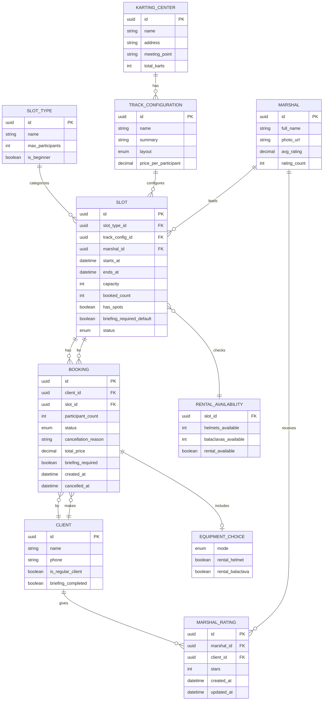
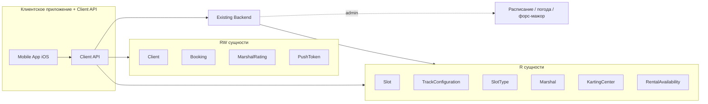

# Модель данных — картинг-центр «Апекс»

> Этап проектирования. Источники: [domain-description.md](../1-elicitation/domain-description.md),
> [2-requirements/](../2-requirements/), [customer-questions.md](../1-elicitation/customer-questions.md),
> [brief-karting.md](../0-customer-brief/brief-karting.md) (R-004, R-008, R-015, R-027).
>
> Каноническая схема для клиентского контура — **контракт API** (R-015). Бэкенд центра — источник истины
> для расписания и атомарности бронирования картов (R-004).

---

## 1. ER-диаграмма

---

## 2. Матрица доступа клиентского приложения

Обозначения:
- **R** — только чтение (данные приходят из бэкенда, приложение не изменяет)
- **RW** — чтение и запись через Client API (приложение инициирует изменение)

| Сущность | Доступ | Кто владеет данными | Операции клиента |
| :-- | :--: | :-- | :-- |
| **KartingCenter** (картинг-центр) | **R** | Бэкенд / админка | Просмотр названия, адреса, места сбора (R-015) |
| **TrackConfiguration** (конфигурация трассы) | **R** | Бэкенд / админка | Просмотр (кратко); цена за участника (FR-013) |
| **SlotType** (тип слота) | **R** | Бэкенд / админка | Лимит вместимости (8 на новичковый — Q 2.1) |
| **Marshal** (маршал) | **R** | Бэкенд / админка | Просмотр; фильтр (FR-003); рейтинг — v2 (FR-028) |
| **Slot** (заезд / слот) | **R** | Бэкенд / админка | Просмотр расписания; `has_spots` обновляет бэкенд |
| **RentalAvailability** (прокатный фонд) | **R** | Бэкенд / админка | Проверка доступности проката на слот (FR-009) |
| **Client** (клиент / профиль) | **RW** | Client API + бэкенд | Upsert при первой записи (имя, телефон — FR-006) |
| **Booking** (бронь / запись) | **RW** | Client API + бэкенд | **Создание**; **отмена** клиентом; чтение своих записей |
| **EquipmentChoice** (экипировка) | **RW** | Часть Booking | Задаётся при создании брони (FR-008); не влияет на цену |
| **MarshalRating** (оценка маршала) | **RW** | Client API + бэкенд | Create/update после посещения — **v2** (FR-026, FR-027) |
| **PushToken** (токен уведомлений) | **RW** | Client API + бэкенд | Регистрация для push/SMS — **v2** (NFR-010) |

**Изменяются только бэкендом** (клиент лишь получает обновления):
- Статус слота при отмене / переносе заезда центром
- Статус брони → `CANCELLED_BY_CENTER` + `cancellation_reason` (R-008)
- Статус брони → `ATTENDED` после заезда
- `booked_count` / `has_spots` слота
- Метка `is_regular_client` (FR-019) — устанавливается бэкендом
- Флаг `briefing_completed` после прохождения инструктажа
- Учёт поздних отмен и неявок — пометки в админке (Q 3.3)

**Не в MVP (отсутствуют в модели клиента):**
- **WaitlistEntry** — лист ожидания не реализуется (FR-012)
- **AllergyProfile / AllergyInfo** — не применимо к домену «Апекс»

---

## 3. Описание сущностей

### 3.1. KartingCenter (картинг-центр)

| Поле | Тип | Описание |
| :-- | :-- | :-- |
| `id` | UUID | Идентификатор |
| `name` | string | Название («Апекс») |
| `address` | string | Адрес площадки (R-015) |
| `meeting_point` | string | Место сбора перед заездом (R-015) |
| `total_karts` | int | Всего картов в центре (**14**) |

**Доступ:** R · **Источник:** domain §2, brief

---

### 3.2. TrackConfiguration (конfigурация трассы)

| Поле | Тип | Описание |
| :-- | :-- | :-- |
| `id` | UUID | Идентификатор |
| `name` | string | Название (короткая / длинная) |
| `summary` | string | Краткое описание для карточки (FR-004, Q 1.8) |
| `layout` | enum | `SHORT` \| `LONG` |
| `price_per_participant` | decimal | Цена за одного участника (FR-013) |

**Доступ:** R · **Источник:** domain §2–3, FR-013

**Правило:** прокат экипировки **не влияет** на цену (FR-013, Q 2.3).

---

### 3.3. SlotType (тип слота)

| Поле | Тип | Описание |
| :-- | :-- | :-- |
| `id` | UUID | Идентификатор |
| `name` | string | Название типа (новичковый, стандартный и т. п.) |
| `max_participants` | int | Макс. участников на заезд (**8** для новичкового — Q 2.1) |
| `is_beginner` | boolean | Признак новичкового заезда |

**Доступ:** R · **Источник:** domain §2–3, Q 2.1

**Правило:** лимит **8** человек на новичковый заезд определяется **типом слота**, не конфигурацией трассы.

---

### 3.4. Marshal (маршал-инструктор)

| Поле | Тип | Описание |
| :-- | :-- | :-- |
| `id` | UUID | Идентификатор |
| `full_name` | string | ФИО |
| `photo_url` | string? | Фото |
| `avg_rating` | decimal | Средний рейтинг (публичный, v2 — FR-028) |
| `rating_count` | int | Число оценок |

**Доступ:** R · **Связи:** Marshal 1—N Slot · **Источник:** domain §2, FR-003

---

### 3.5. Slot (слот / заезд)

| Поле | Тип | Описание |
| :-- | :-- | :-- |
| `id` | UUID | Идентификатор |
| `slot_type_id` | UUID FK | Тип слота (лимит 8/14) |
| `track_config_id` | UUID FK | Конфигурация трассы |
| `marshal_id` | UUID FK | Маршал |
| `starts_at` | datetime | Начало заезда |
| `ends_at` | datetime | Окончание (~15–20 мин от начала) |
| `capacity` | int | Вместимость (картов на заезд) |
| `booked_count` | int | Занято картов (внутреннее поле бэкенда) |
| `has_spots` | boolean | **«Есть места» / «Мест нет»** для UI (FR-004, Q 2.6) |
| `briefing_required_default` | boolean | Нужен ли инструктаж по умолчанию для слота |
| `status` | enum | `OPEN` \| `FULL` \| `CANCELLED` \| `RESCHEDULED` |

**Доступ:** R (клиент); изменение счётчиков и статуса — бэкенд · **Источник:** domain §2–3, FR-001–004, R-027

**Правила:**
- `status = CANCELLED` — заезд отменён центром (погода, форс-мажор); повторная запись запрещена (R-008, FR-018)
- `status = FULL` или `has_spots = false` — мест нет; лист ожидания **не** предусмотрен (FR-012)
- `status = RESCHEDULED` — перенос времени/маршала (FR-025, v2)
- Клиенту **не показывается** точное число свободных картов — только `has_spots` (Q 2.6)

---

### 3.6. RentalAvailability (доступность проката на слот)

| Поле | Тип | Описание |
| :-- | :-- | :-- |
| `slot_id` | UUID FK | Слот |
| `helmets_available` | int | Свободно шлемов |
| `balaclavas_available` | int | Свободно подшлемников |
| `rental_available` | boolean | Прокат доступен для записи на слот |

**Доступ:** R · **Источник:** FR-009, R-015

**Правило (FR-009, Q 2.4):** при `rental_available = false` слот **недоступен** для записи (не «только со своим»). На SCR-004 CTA «Записаться» скрыт.

---

### 3.7. Client (клиент)

| Поле | Тип | Описание |
| :-- | :-- | :-- |
| `id` | UUID | Идентификатор |
| `name` | string | Имя (FR-006) |
| `phone` | string | Телефон (FR-006) |
| `is_regular_client` | boolean | Метка постоянного клиента (FR-019, Q 7.3) |
| `briefing_completed` | boolean | Клиент уже проходил инструктаж (Q 1.7) |

**Доступ:** RW · **Источник:** domain §2, FR-006, FR-019

**Правило:** `is_regular_client` — **только отображение** в UI; скидки и приоритет записи в MVP **нет** (Q 7.3).

---

### 3.8. Booking (бронь / запись)

| Поле | Тип | Описание |
| :-- | :-- | :-- |
| `id` | UUID | Идентификатор |
| `client_id` | UUID FK | Клиент (заказчик записи) |
| `slot_id` | UUID FK | Слот |
| `participant_count` | int | Количество участников в одной брони (FR-007, min 1) |
| `status` | enum | См. таблицу статусов ниже |
| `cancellation_reason` | string? | Причина при отмене центром (R-008) |
| `equipment` | EquipmentChoice | Вложенный выбор экипировки |
| `total_price` | decimal | Итог к оплате на месте |
| `briefing_required` | boolean | Нужен ли инструктаж для этой брони (Q 1.7) |
| `created_at` | datetime | Время создания |
| `cancelled_at` | datetime? | Время отмены |

**Статусы `Booking.status`:**

| Значение | Описание | Кто устанавливает |
| :-- | :-- | :-- |
| `ACTIVE` | Запись подтверждена | Client API / бэкенд при create |
| `CANCELLED_BY_CLIENT` | Отменена клиентом | Client API при cancel |
| `CANCELLED_BY_CENTER` | Отменена центром (в т.ч. погода) | Бэкенд (R-008) |
| `ATTENDED` | Заезд посещён | Бэкенд после заезда |

**Доступ:** RW · **Источник:** domain §2–3, FR-010–FR-018

**Правила:**
- **Несколько записей в один день** разрешены (FR-011, Q 1.3)
- `participant_count` резервирует **столько картов**, сколько участников (R-004)
- При отмене клиентом за **≥ 1 ч** карт(ы) освобождаются сразу (FR-015)
- Поздняя отмена (< 1 ч) — учёт на бэкенде/админке; штрафов в MVP нет (FR-016, Q 3.3)
- `total_price` = `price_per_participant × participant_count` (расчёт на бэкенде)

---

### 3.9. EquipmentChoice (выбор экипировки)

Вложенный объект в `Booking`, не отдельная таблица в клиентском API.

| Поле | Тип | Описание |
| :-- | :-- | :-- |
| `mode` | enum | `OWN` \| `RENTAL` |
| `rental_helmet` | boolean | Прокат шлема |
| `rental_balaclava` | boolean | Прокат подшлемника |

**Доступ:** RW (при создании брони) · **Источник:** FR-008, Q 2.3

**Правила:**
- Выбор **не влияет на `total_price`** (FR-013)
- При `mode = RENTAL` — проверка прокатного фонда на **всех** участников (`participant_count`)
- Карты с ограничением скорости **не моделируются** в клиентском API — назначает маршал на месте (Q 2.5)

---

### 3.10. MarshalRating (оценка маршала) — v2

| Поле | Тип | Описание |
| :-- | :-- | :-- |
| `id` | UUID | Идентификатор |
| `marshal_id` | UUID FK | Маршал |
| `client_id` | UUID FK | Клиент |
| `stars` | int | 1–5 (FR-026) |
| `created_at` | datetime | Первая оценка |
| `updated_at` | datetime | Последнее изменение |

**Доступ:** RW (create/update клиентом) · **Источник:** FR-026–FR-028

**Правила:**
- Только после `Booking.status = ATTENDED`
- Срок — **в течение недели** после заезда (FR-026, Q 5.1)
- **Один клиент — одна оценка на маршала**; можно изменить (FR-027, Q 5.4)
- Без текстового отзыва
- Агрегируется в `Marshal.avg_rating`

---

## 4. Ключевые связи и кардинальности

| Связь | Кардинальность | Комментарий |
| :-- | :-- | :-- |
| KartingCenter → TrackConfiguration | 1:N | |
| SlotType → Slot | 1:N | Лимит 8 — на тип «новичковый» |
| TrackConfiguration → Slot | 1:N | Цена — от конфигурации |
| Marshal → Slot | 1:N | Фильтр по маршалу (FR-003) |
| Client → Booking | 1:N | **Несколько броней в день** разрешены (FR-011) |
| Slot → Booking | 1:N | Атомарная резервация картов (R-004) |
| Client → MarshalRating | 1:N | Уникальность пара (client, marshal) |
| Marshal → MarshalRating | 1:N | Агрегируется в `avg_rating` |
| Slot → RentalAvailability | 1:1 | На каждый слот |

---

## 5. Граница Client API ↔ Existing Backend

**Existing Backend** создаёт и изменяет: Slot, TrackConfiguration, SlotType, Marshal, расписание, отмены/переносы центром, статус `ATTENDED`, метку `is_regular_client`, `briefing_completed`, учёт поздних отмен.

**Client API** создаёт и изменяет: Client, Booking (create/cancel), MarshalRating (v2), PushToken (v2); проксирует чтение остальных сущностей.
