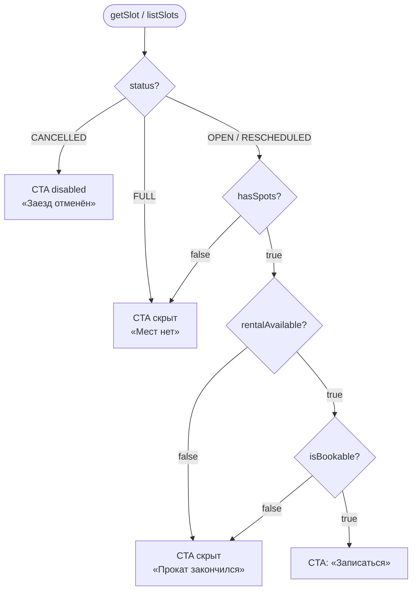

# LOGIC-002 — Доступность слота

**ID:** LOGIC-002  
**Тип:** Логика  
**Приоритет:** Critical  
**Статус:** Актуален

---

## Обзор

Определяет доступность заезда для записи на основе полей `SlotDetail` / `SlotSummary` из API
(`getSlot`, `listSlots`). Учитывает **«есть места» / «мест нет»** (`hasSpots`), статус слота (`status`),
флаг записи (`isBookable`) и доступность проката (`rentalAvailability.rentalAvailable`) — FR-009, R-008.

**Отличие от других проектов:** при исчерпании проката слот **полностью недоступен** (не «со своим»);
лист ожидания **не** предусмотрен (FR-012).

---

## Точки применения

| Экран | Элемент/Триггер |
|-------|-----------------|
| [SCR-001](../../3-design-brief/screens/SCR-001-schedule.md) | Бейдж «Есть места» / «Мест нет» на карточке |
| [SCR-004](../../3-design-brief/screens/SCR-004-heat-detail.md) | CTA «Записаться», баннер проката |
| [SCR-005](../../3-design-brief/screens/SCR-005-booking-form.md) | Pre-check перед submit `createBooking` |
| [SCR-007](../../3-design-brief/screens/SCR-007-booking-error.md) | Маппинг кодов `NO_SPOTS`, `RENTAL_UNAVAILABLE`, `SLOT_CANCELLED` |

---

## Флоу

---

## Описание логики

### Источник данных

Поля из схемы OpenAPI `SlotSummary` / `SlotDetail`:

| Поле | Тип | Назначение |
|------|-----|------------|
| `hasSpots` | boolean | «Есть места» / «Мест нет» для UI (Q 2.6) |
| `status` | SlotStatus | `OPEN`, `FULL`, `CANCELLED`, `RESCHEDULED` |
| `isBookable` | boolean | Итоговая доступность записи |
| `rentalAvailability.rentalAvailable` | boolean | Прокат доступен для слота (FR-009) |

**Клиенту не показывается** точное число свободных картов — только `hasSpots`.

**Спецификация:** [../../api/openapi.yaml](../../api/openapi.yaml) → `getSlot`, `listSlots`.

### Правила CTA на SCR-004

| Условие | UI |
|---------|-----|
| `status = CANCELLED` | Пометка «Заезд отменён»; CTA скрыт (R-008, FR-017) |
| `hasSpots = false` или `status = FULL` | Бейдж «Мест нет»; CTA **скрыт** (FR-012, без waitlist) |
| `rentalAvailable = false` | Баннер «Прокат на это время закончился. Запись недоступна»; CTA скрыт (FR-009) |
| `hasSpots = true`, `isBookable = true`, `status = OPEN` | CTA **«Записаться»** активна |

### Отображение на SCR-001

- Бейдж **«Есть места»** при `hasSpots = true` и `isBookable = true`.
- Бейдж **«Мест нет»** при `hasSpots = false` или `status = FULL`.
- Без числового счётчика картов (Q 2.6).

### Pre-check на SCR-005

Перед `createBooking` клиент повторно запрашивает `getSlot` (api-sequence §4.3). Если
`isBookable = false`, `hasSpots = false` или `rentalAvailable = false` — блокировать submit.

### Ошибки бронирования (связанные коды)

| ErrorCode | Смысл |
|-----------|-------|
| `NO_SPOTS` | Места закончились / недостаточно карт для `participantCount` |
| `SLOT_CANCELLED` | Заезд отменён центром |
| `RENTAL_UNAVAILABLE` | Прокатный фонд исчерпан (гонка) |
| `SLOT_REBOOK_FORBIDDEN` | Повторная запись на отменённый слот (R-008) |

---

## Входные / выходные данные

| Параметр | Тип | Направление | Описание |
|----------|-----|-------------|----------|
| `slotId` | uuid | Вход | Идентификатор слота |
| `hasSpots` | boolean | Вход (API) | Есть ли места |
| `status` | SlotStatus | Вход (API) | Статус слота |
| `isBookable` | boolean | Вход (API) | Флаг доступности записи |
| `rentalAvailable` | boolean | Вход (API) | Доступность проката |
| `ctaVisible` | boolean | Выход | Показывать ли CTA «Записаться» |
| `availabilityLabel` | string | Выход | «Есть места» \| «Мест нет» |
| `bannerMessage` | string? | Выход | Текст баннера при блокировке |

---

## Связанные требования

| ID | Описание |
|----|----------|
| FR-004 | Отображение доступности |
| FR-009 | Исчерпание проката → слот недоступен |
| FR-012 | «Мест нет» без листа ожидания |
| FR-018 | Запрет повторной записи на отменённый слот |
| Q 2.4 | Прокат исчерпан — запись недоступна |
| Q 2.6 | Без счётчика мест |
| R-008 | Отмена заезда центром |
| UC-002 | Выбор слота перед записью |

---

## Критерии приёмки

| ID | Критерий |
|----|----------|
| AC-L-001 | **Дано** `hasSpots = false`, **Когда** SCR-004, **Тогда** CTA «Записаться» скрыт, бейдж «Мест нет». |
| AC-L-002 | **Дано** `hasSpots = true`, `isBookable = true`, `status = OPEN`, **Когда** SCR-004, **Тогда** CTA активна. |
| AC-L-003 | **Дано** `rentalAvailable = false`, **Когда** SCR-004, **Тогда** CTA скрыт и баннер о прокате (FR-009). |
| AC-L-004 | **Дано** `status = CANCELLED`, **Когда** SCR-004, **Тогда** CTA скрыт, «Заезд отменён». |
| AC-L-005 | **Дано** карточка на SCR-001, **Когда** отображается доступность, **Тогда** только «Есть места» / «Мест нет», без числа картов. |
