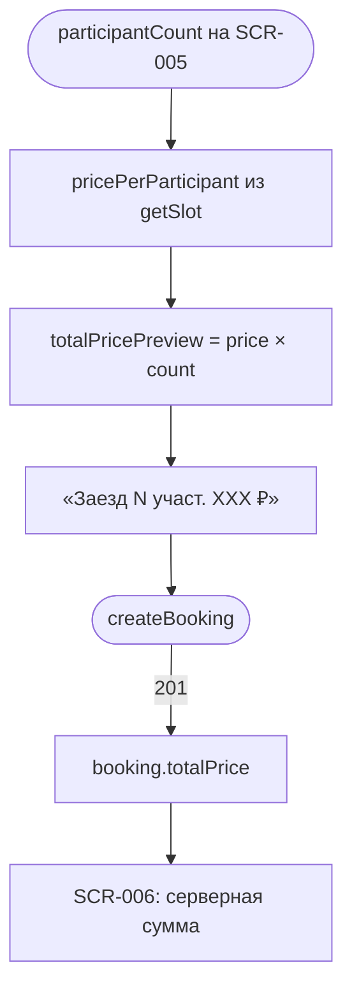

# LOGIC-003 — Расчёт цены брони

**ID:** LOGIC-003  
**Тип:** Логика  
**Приоритет:** High  
**Статус:** Актуален

---

## Обзор

Расчёт и отображение стоимости брони: **цена конфигурации трассы × количество участников**.
Прокат экипировки **не влияет** на сумму (FR-013). Оплата **на месте** — приложение не проводит
онлайн-платёж. На SCR-005 показывается **клиентский превью-расчёт**; после успешного `createBooking`
— **серверный** `totalPrice` (источник истины, R-004).

---

## Точки применения

| Экран | Элемент/Триггер |
|-------|-----------------|
| [SCR-004](../../3-design-brief/screens/SCR-004-heat-detail.md) | «XXX ₽ за участника», оплата на месте |
| [SCR-005](../../3-design-brief/screens/SCR-005-booking-form.md) | Stepper участников, «Заезд (N участ.) XXX ₽», CTA |
| [SCR-006](../../3-design-brief/screens/SCR-006-booking-success.md) | «К оплате на месте: XXX ₽» из `booking.totalPrice` |
| [SCR-008](../../3-design-brief/screens/SCR-008-my-bookings.md) | Сумма в карточке брони |
| [SCR-009](../../3-design-brief/screens/SCR-009-booking-detail.md) | Итоговая сумма и `participantCount` |

---

## Флоу



---

## Описание логики

### Формула превью (SCR-005)

```
totalPricePreview = trackConfiguration.pricePerParticipant × participantCount
```

Где:
- `pricePerParticipant` — из `slot.pricePerParticipant` или `slot.trackConfigurationInfo.pricePerParticipant`
- `participantCount` — значение stepper, min **1** (FR-007)

Все значения **только из API** (R-015). Хардкод тарифов запрещён.

### Участники (stepper)

| Правило | Описание |
|---------|----------|
| Min | 1 |
| Max | Ограничение не задаётся жёстко в UI; сервер вернёт `NO_SPOTS`, если карт недостаточно |
| Резерв | `participantCount` картов на бэкенде (R-004) |
| Несколько броней в день | Разрешены (FR-011) |

### Прокат и цена

| Условие | Поведение |
|---------|-----------|
| `equipment.mode = OWN` | Цена не меняется |
| `equipment.mode = RENTAL` | Цена **не меняется** (FR-013); проверка прокатного фонда — отдельно (LOGIC-002) |
| При `mode = RENTAL` | Хотя бы один из: `rentalHelmet`, `rentalBalaclava` = true |

### Правила отображения

| Условие | Поведение |
|---------|-----------|
| `pricePerParticipant = null` | Блок суммы скрыт; подпись «Оплата на месте» остаётся |
| После 201 | Показывать `booking.totalPrice`; **не** пересчитывать на клиенте |
| SCR-004 | «XXX ₽» за участника / заезд (из design brief) |

### Подпись UI

Обязательная строка: «Оплата на месте в картинг-центре» (FR-013).

---

## Входные / выходные данные

| Параметр | Тип | Описание |
|----------|-----|----------|
| `pricePerParticipant` | decimal? | Цена за одного участника |
| `participantCount` | int | Число участников (≥ 1) |
| `equipment.mode` | `OWN` \| `RENTAL` | Не влияет на сумму |
| `totalPricePreview` | decimal | Выход превью для SCR-005 |
| `booking.totalPrice` | decimal | Серверный итог после 201 |
| `booking.participantCount` | int | Подтверждённое число участников |

---

## Связанные требования

| ID | Описание |
|----|----------|
| FR-007 | Несколько участников в одной брони |
| FR-008 | Выбор экипировки |
| FR-010 | Подтверждение с итоговой суммой |
| FR-013 | Цена от конфигурации; прокат не влияет; оплата на месте |
| Q 2.3 | Прокат не влияет на цену |
| R-004 | Атомарная резервация N картов |
| R-015 | Числа из API |

**API:** [../api/openapi.yaml](../api/openapi.yaml) → `getSlot`, `createBooking`

---

## Критерии приёмки

| ID | Критерий |
|----|----------|
| AC-L-001 | **Дано** `participantCount = 2`, `pricePerParticipant = 3500`, **Когда** stepper меняется, **Тогда** превью = 7000 ₽. |
| AC-L-002 | **Дано** выбран прокат шлема, **Когда** меняется экипировка, **Тогда** `totalPricePreview` **не** меняется. |
| AC-L-003 | **Дано** успешный `createBooking` → 201, **Когда** SCR-006, **Тогда** отображается `booking.totalPrice`. |
| AC-L-004 | **Дано** `pricePerParticipant = null`, **Когда** SCR-005, **Тогда** числовой блок скрыт, «Оплата на месте» видна. |
| AC-L-005 | **Дано** `participantCount = 3`, **Когда** submit при нехватке карт, **Тогда** SCR-007 с `NO_SPOTS`. |
