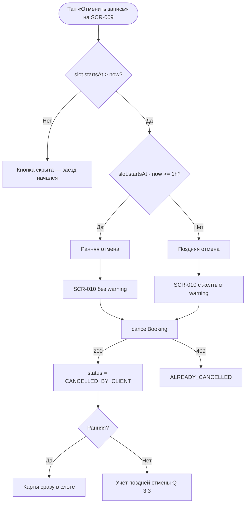

# LOGIC-004 — Отмена: правило 1 часа

**ID:** LOGIC-004  
**Тип:** Логика  
**Приоритет:** Critical  
**Статус:** Актуален

---

## Обзор

Классификация отмены активной брони клиентом на **раннюю** (≥ 1 ч до начала заезда) и **позднюю**
(< 1 ч до начала). Логика определяет:

- показ предупреждающего блока на [SCR-010](../../3-design-brief/screens/SCR-010-cancel-confirm.md);
- видимость кнопки «Отменить запись» на [SCR-009](../../3-design-brief/screens/SCR-009-booking-detail.md);
- ожидаемое поведение бэкенда при вызове `cancelBooking`.

В MVP: при поздней отмене показывается **предупреждение**, но отмена **не блокируется**; штрафов нет
(FR-016, Q 3.3). При ранней отмене карты освобождаются **сразу** (FR-015).

---

## Точки применения

| Экран | Элемент/Триггер |
|-------|-----------------|
| [SCR-009](../../3-design-brief/screens/SCR-009-booking-detail.md) | Кнопка «Отменить запись» — при `canCancel` / `ACTIVE` и заезд в будущем |
| [SCR-010](../../3-design-brief/screens/SCR-010-cancel-confirm.md) | Блок предупреждения; расчёт `isLateCancellation` |

---

## Флоу



---

## Описание логики

### Входные данные

| Параметр | Тип | Источник | Описание |
|----------|-----|----------|----------|
| `slot.startsAt` | datetime (ISO 8601) | `getBooking` | Время начала заезда |
| `now` | datetime | Локальное время устройства | Текущий момент |
| `status` | `BookingStatus` | `getBooking` | Должен быть `ACTIVE` |
| `canCancel` | boolean | `getBooking` | Серверный флаг (опционально) |

### Формулы

```
minutesUntilStart = (slot.startsAt - now) в минутах

canCancel = status == ACTIVE AND minutesUntilStart > 0

isEarlyCancel = canCancel AND minutesUntilStart >= 60

isLateCancel = canCancel AND minutesUntilStart < 60
```

### Правила классификации

| Тип | Условие | UI (SCR-010) | Бэкенд (`cancelBooking`) |
|-----|---------|--------------|--------------------------|
| **Недоступна** | `minutesUntilStart <= 0` | Кнопка «Отменить» скрыта | — |
| **Ранняя** | `minutesUntilStart >= 60` | Sheet без жёлтого блока | 200; карты освобождаются сразу (FR-015) |
| **Поздняя** | `0 < minutesUntilStart < 60` | Sheet с warning-блоком | 200 в MVP; штрафов нет (FR-016) |

### Текст предупреждения (поздняя отмена)

> До начала заезда осталось меньше часа. Карты могут не успеть освободиться для других участников.

- Фон: warning (жёлтый), **не** error.
- Без упоминания штрафов (Q 3.3).

### Ограничения MVP

| Правило | Описание |
|---------|----------|
| Блокировка | Поздняя отмена **разрешена** |
| Штрафы | Отсутствуют (FR-016) |
| Офлайн | Отмена недоступна без сети |
| Повторная отмена | `409 ALREADY_CANCELLED` — обновление UI |
| Лист ожидания | **Не применяется** — освободившиеся карты доступны для новой записи |

### Отмена центром

Статус `CANCELLED_BY_CENTER` устанавливает **бэкенд** (UC-005). Клиент **не** может отменить такую
бронь повторно; отображается причина `cancellationReason` (R-008).

---

## Входные / выходные данные

| Параметр | Тип | Направление | Описание |
|----------|-----|-------------|----------|
| `slot.startsAt` | datetime | Вход | Время начала слота |
| `status` | `BookingStatus` | Вход | Статус брони |
| `isEarlyCancel` | boolean | Выход | `true` если ≥ 60 мин до старта |
| `isLateCancel` | boolean | Выход | `true` если 0 < минут < 60 |
| `canCancel` | boolean | Выход | Можно ли показать кнопку отмены |
| `showWarning` | boolean | Выход | Жёлтый блок на SCR-010 (= `isLateCancel`) |
| `isLateCancellation` | boolean | Выход | Из ответа `cancelBooking` |

---

## Связанные требования

| ID | Описание |
|----|----------|
| UC-004 | Отмена записи клиентом |
| FR-015 | Ранняя отмена ≥ 1 ч |
| FR-016 | Поздняя отмена — предупреждение |
| Q 3.2 | Порог «заранее» = 1 час |
| Q 3.3 | Учёт поздних отмен на бэкенде |
| NFR-008 | Тексты на русском |

**API:** `cancelBooking` — [bookings.yaml](../../api/paths/bookings.yaml)

---

## Критерии приёмки

| ID | Критерий |
|----|----------|
| AC-L-001 | **Дано** до `slot.startsAt` осталось 2 ч, **Когда** SCR-010, **Тогда** warning **не** показывается. |
| AC-L-002 | **Дано** до `slot.startsAt` осталось 30 мин, **Когда** SCR-010, **Тогда** warning-блок виден. |
| AC-L-003 | **Дано** `slot.startsAt <= now`, **Когда** SCR-009, **Тогда** кнопка «Отменить» скрыта. |
| AC-L-004 | **Дано** поздняя отмена подтверждена, **Когда** `cancelBooking`, **Тогда** 200, штраф не применяется. |
| AC-L-005 | **Дано** SCR-009 офлайн, **Когда** `status == ACTIVE`, **Тогда** кнопка отмены disabled. |
