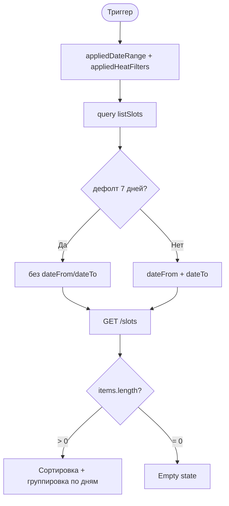

# LOGIC-005 — Фильтрация заездов

**ID:** LOGIC-005  
**Тип:** Логика  
**Приоритет:** High  
**Статус:** Актуален

---

## Обзор

Формирует query-параметры для `listSlots` из фильтров периода ([SCR-002](../../3-design-brief/screens/SCR-002-date-filter.md))
и заездов ([SCR-003](../../3-design-brief/screens/SCR-003-heat-filters.md)), управляет badge на SCR-001,
сортировкой и группировкой. Фильтры MVP: **время суток** и **маршал** (FR-003). Фильтр по конфигурации
трассы и уровню **не в MVP v1**.

---

## Точки применения

| Экран | Элемент / триггер |
| :-- | :-- |
| [SCR-001](../../3-design-brief/screens/SCR-001-schedule.md) | Загрузка списка, pull-to-refresh, empty, badge |
| [SCR-002](../../3-design-brief/screens/SCR-002-date-filter.md) | «Применить» / «Сбросить» — `dateFrom`/`dateTo` |
| [SCR-003](../../3-design-brief/screens/SCR-003-heat-filters.md) | «Применить» / «Сбросить» — `marshalIds`, `timeOfDay` |

---

## Флоу

---

## Описание логики

### Параметры `listSlots`

| Параметр | Источник | По умолчанию | Правило |
| :-- | :-- | :-- | :-- |
| `dateFrom`, `dateTo` | SCR-002 | — | Не передаются при дефолте 7 дней (R-027, FR-001) |
| `marshalIds` | SCR-003 | все | OR внутри группы; не передаётся при `[]` |
| `timeOfDay` | SCR-003 | все | `morning` / `afternoon` / `evening` |

Справочник маршалов: `listMarshals` на SCR-003.

### Badge «Фильтры»

Считается число заполненных категорий (0–2):

| Категория | +1 если |
| :-- | :-- |
| Маршал | `marshalIds.length > 0` |
| Время суток | `timeOfDay` задан |

Период ≠ дефолт — отдельный чип «Период», не в badge.

### Empty states

| Условие | Текст |
| :-- | :-- |
| Пусто, дефолт | «Пока нет доступных заездов» (FR-005) |
| Пусто, фильтры активны | «Ничего не найдено» + «Сбросить фильтры» |

### Группировка (клиент)

1. Сортировка: `startsAt` ↑.
2. Группировка по календарному дню.
3. Заголовки: «Сегодня», «Завтра», иначе «День недели, D MMM».

### Кэш справочника

`listMarshals` рекомендуется кэшировать при первом открытии SCR-003 (TTL на усмотрение реализации).

---

## Входные / выходные данные

| Параметр | Тип | Направление | Описание |
| :-- | :-- | :--: | :-- |
| `appliedDateRange` | object | in | Период из SCR-002 |
| `appliedHeatFilters` | object | in | Фильтры из SCR-003 |
| `queryParams` | object | out | Для `listSlots` |
| `filterBadgeCount` | int | out | 0–2 |

---

## Связанные требования

| ID | Описание |
| :-- | :-- |
| FR-001–FR-005 | Расписание и фильтры |
| FR-003 | Время суток, маршал |
| R-027 | Дефолт 7 дней |
| UC-001 | Просмотр расписания |

**API:** [../../api/openapi.yaml](../../api/openapi.yaml) → `listSlots`, `listMarshals`

---

## Критерии приёмки

| ID | Критерий |
| :-- | :-- |
| AC-L-001 | **Дано** «Сбросить» на SCR-002, **Тогда** `dateFrom`/`dateTo` не передаются, API — 7 дней. |
| AC-L-002 | **Дано** выбран маршал и `evening`, **Тогда** badge = 2, query содержит оба параметра. |
| AC-L-003 | **Дано** пустой список при фильтрах, **Тогда** empty «Ничего не найдено» + сброс. |
| AC-L-004 | **Дано** непустой список, **Тогда** группировка по дням, сортировка по времени. |
