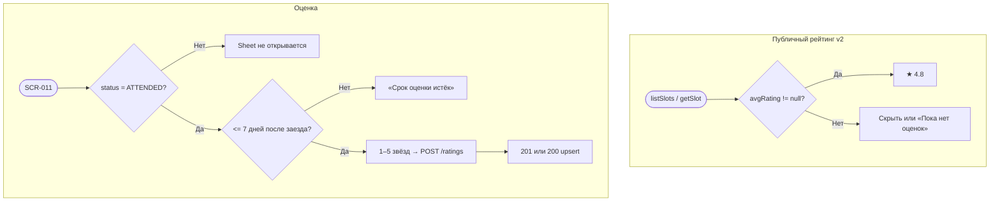

# LOGIC-006 — Оценка маршала

**ID:** LOGIC-006  
**Тип:** Логика  
**Приоритет:** Should (v2)  
**Статус:** Актуален

---

## Обзор

**Отображение** публичного рейтинга маршала (`marshal.avgRating`, `marshal.ratingCount`) на карточках
заездов (FR-028) и **создание/обновление** оценки 1–5 через `createOrUpdateMarshalRating` после
посещённого заезда (FR-026–FR-027). В **MVP v1** рейтинги в UI расписания **не показываются**;
логика готовится под v2.

---

## Точки применения

| Экран | Элемент / триггер |
| :-- | :-- |
| [SCR-001](../../3-design-brief/screens/SCR-001-schedule.md) | ★ на карточке — v2 |
| [SCR-004](../../3-design-brief/screens/SCR-004-heat-detail.md) | Карточка маршала — рейтинг v2 |
| [SCR-009](../../3-design-brief/screens/SCR-009-booking-detail.md) | CTA «Оценить маршала» / read-only оценка |
| [SCR-011](../../3-design-brief/screens/SCR-011-rate-marshal.md) | Выбор звёзд, `createOrUpdateMarshalRating` |

---

## Флоу

---

## Описание логики

### Отображение (read-only, v2)

| Контекст | Условие | UI |
| :-- | :-- | :-- |
| SCR-001 | `avgRating != null` | **★ 4.8** (1 знак) |
| SCR-001 MVP v1 | — | Блок рейтинга **скрыт** |
| SCR-004 v2 | `ratingCount > 0` | Звёзды + «4,2 · 28 оценок» |
| SCR-004 v2 | иначе | «Пока нет оценок» |

### Создание / обновление

**API:** POST `/ratings` → `createOrUpdateMarshalRating`

| Поле | Описание |
| :-- | :-- |
| `marshalId` | Обязателен |
| `bookingId` | Для проверки ATTENDED при первой оценке |
| `stars` | 1–5, без текста |

| Правило | Описание |
| :-- | :-- |
| Условие | `Booking.status = ATTENDED` |
| Срок | **7 дней** после заезда (FR-026) |
| Уникальность | **Один клиент — одна оценка на маршала**; повторный POST обновляет (FR-027) |
| Ответ | 201 создание / 200 обновление |

Ошибки: 403 `BOOKING_NOT_ATTENDED`, `RATING_PERIOD_EXPIRED`.

### SCR-009

| `marshalRating` | UI |
| :-- | :-- |
| `null`, `status = ATTENDED`, в сроке | CTA «Оценить маршала» |
| объект | Read-only звёзды + «Изменить оценку» |
| `status ≠ ATTENDED` | CTA скрыт |

---

## Входные / выходные данные

| Параметр | Тип | Направление | Описание |
| :-- | :-- | :--: | :-- |
| `marshalId` | uuid | in | Маршал заезда |
| `bookingId` | uuid | in | Бронь для проверки |
| `stars` | int 1–5 | in/out | Оценка |
| `marshal.avgRating` | float? | in | Публичный рейтинг |
| `booking.marshalRating` | object? | in | Оценка клиента |

---

## Связанные требования

| ID | Описание |
| :-- | :-- |
| FR-026–FR-028 | Оценки и публичный рейтинг |
| UC-007 | Оценка маршала после заезда |
| Q 5.1 | Срок неделя |
| Q 5.4 | Одна оценка, можно изменить |

**API:** [../../api/openapi.yaml](../../api/openapi.yaml) → `createOrUpdateMarshalRating`

---

## Критерии приёмки

| ID | Критерий |
| :-- | :-- |
| AC-L-001 | **Дано** MVP v1, **Когда** SCR-001/SCR-004, **Тогда** рейтинг маршала не отображается. |
| AC-L-002 | **Дано** `status = ATTENDED`, в сроке, **Когда** SCR-011, **Тогда** POST `/ratings` с 1–5 звёздами. |
| AC-L-003 | **Дано** повторная оценка того же маршала, **Тогда** 200 upsert, не дубликат. |
| AC-L-004 | **Дано** > 7 дней после заезда, **Тогда** 403 `RATING_PERIOD_EXPIRED`. |
