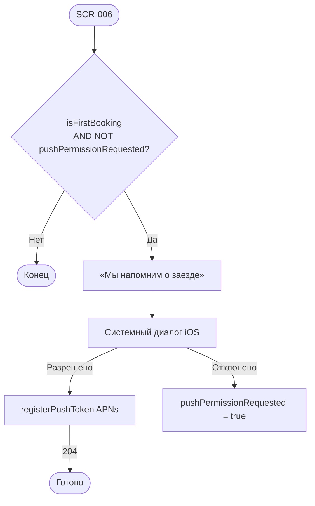

# LOGIC-007 — Запрос push-разрешения

**ID:** LOGIC-007  
**Тип:** Логика  
**Приоритет:** Should (v2)  
**Статус:** Актуален

---

## Обзор

Системный запрос разрешения на push после **первой успешной брони**. В v2 также SMS (FR-029, NFR-010).
Запрос **один раз** на устройстве; отказ не блокирует приложение. Токен — APNs через
`registerPushToken` (`platform: ios`).

В **MVP v1** push/SMS могут быть отключены feature-flag; логика документирует целевое поведение v2.

---

## Точки применения

| Экран | Элемент / триггер |
| :-- | :-- |
| [SCR-006](../../3-design-brief/screens/SCR-006-booking-success.md) | После отрисовки сводки успешной записи |

---

## Флоу



---

## Описание логики

### Условия показа

| Условие | Значение |
| :-- | :-- |
| `isFirstBooking` | Первая успешная бронь на устройстве |
| `pushPermissionRequested` | `false` — диалог ещё не показывался |
| Момент | После Content на SCR-006, не блокирует CTA |
| Feature flag v2 | Push/SMS включены в сборке |

### registerPushToken

**POST** `/profile/push-token` · `Authorization: Bearer {sessionToken}`

```json
{ "token": "<APNs>", "platform": "ios" }
```

Ошибки логируются; UI не прерывается.

### Типы уведомлений (v2, FR-023–FR-025, FR-029)

| Событие | Канал | Deep link |
| :-- | :-- | :-- |
| Напоминание за 2 ч | push + SMS | SCR-009 |
| Подтверждение записи | push + SMS | SCR-009 |
| Отмена клиентом | push + SMS | SCR-009 |
| Отмена центром / погода | push + SMS | SCR-009 или SCR-004 (перезапись) |
| Перенос заезда | push + SMS | SCR-009 |

> Лист ожидания **не** используется.

---

## Входные / выходные данные

| Параметр | Тип | Направление | Описание |
| :-- | :-- | :--: | :-- |
| `isFirstBooking` | boolean | in | Первая бронь |
| `pushPermissionRequested` | boolean | in/out | Флаг локально |
| `sessionToken` | string | in | ClientSession |
| `deviceToken` | string | out | APNs token |

---

## Связанные требования

| ID | Описание |
| :-- | :-- |
| FR-023–FR-025 | Push при отмене/переносе |
| FR-029 | Push и SMS напоминания |
| NFR-010 | Push и SMS, deep links |

**API:** [../../api/openapi.yaml](../../api/openapi.yaml) → `registerPushToken`

---

## Критерии приёмки

| ID | Критерий |
| :-- | :-- |
| AC-L-001 | **Дано** v2, первая бронь, **Когда** SCR-006 отрисован, **Тогда** системный запрос push один раз. |
| AC-L-002 | **Дано** отказ push, **Тогда** навигация с SCR-006 работает штатно. |
| AC-L-003 | **Дано** разрешение, **Тогда** async `registerPushToken` с `platform: ios`. |
| AC-L-004 | **Дано** вторая запись, **Тогда** запрос push не показывается. |
