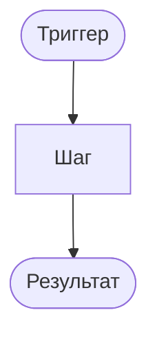

# {Название логики}

**ID:** LOGIC-XXX  
**Тип:** Логика  
**Приоритет:** {Critical | High | Medium | Should (v2)}  
**Статус:** Черновик

> **Продукт:** картинг-центр «Апекс» · **Платформа:** iOS · **Роль:** Клиент (R-028).
> **API:** [../api/openapi.yaml](../api/openapi.yaml) · **Модель данных:** [../4-design/data-model.md](../4-design/data-model.md).

---

## Обзор

{Что делает логика; какие бизнес-правила инкапсулирует.}

**Не хардкодить:** лимиты участников (8 на новичковый — от типа слота), прокатный фонд, цены конфигурации трассы — только из API (R-015, FR-020).

---

## Точки применения

| Экран | Элемент / триггер |
| :-- | :-- |
| [SCR-XXX](../../3-design-brief/screens/SCR-XXX-{slug}.md) | {триггер} |

> Ссылки на экраны — только в [3-design-brief/screens/](../../3-design-brief/screens/).

---

## Флоу

---

## Описание логики

{Детальное описание правил, формул, ветвлений.}

**Терминология MVP:** **маршал** (не «инструктор»), **заезд / слот**, **конфигурация трассы**.

**Вне MVP (не описывать в логике):** лист ожидания (FR-012), фильтр по конфигурации/уровню, онлайн-оплата, текстовые отзывы, Android.

---

## Входные / выходные данные

| Параметр | Тип | Направление | Описание |
| :-- | :-- | :--: | :-- |
| `{param}` | {type} | Вход / Выход | {desc} |

**operationId (если применимо):** `{operationId}` — см. OpenAPI.

---

## Связанные требования

| ID | Описание |
| :-- | :-- |
| FR-XXX | … |
| UC-XXX | … |
| NFR-XXX | … |

---

## Критерии приёмки

| ID | Критерий |
| :-- | :-- |
| AC-L-001 | **Дано** … **Когда** … **Тогда** … |
