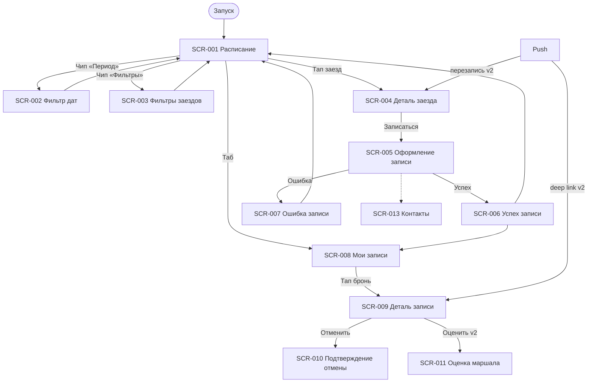

# Фича-лист — мобильное приложение «Апекс»

> **Этап 5.** Перечень экранов клиентского приложения и функций на них.
> Связующий артефакт между [требованиями](../2-requirements/) и детальным ТЗ.

**Статус:** Актуален · **Версия:** 1.0 · **Дата:** 2026-07-03

---

## 1. Назначение

**«Апекс»** — клиентское iOS-приложение для самостоятельной записи на заезды картинг-центра.
Заменяет ручную запись через телефон и таблицы, устраняя двойные брони картов.

**Скоуп — только роль «Клиент»** (R-028). Владелец и маршал работают через существующую инфраструктуру.
Справочные данные (слоты, конфигурации трасс, маршалы, прокат) — **read-only** из API. Оплата —
**на месте**; приложение показывает цену и фиксирует запись.

**Источники:**
[brief-karting.md](../0-customer-brief/brief-karting.md) ·
[2-requirements/](../2-requirements/) ·
[3-design-brief/](../3-design-brief/) ·
[4-design/](../4-design/) ·
[customer-questions.md](../1-elicitation/customer-questions.md)

---

## 2. Глоссарий

| Термин | Значение |
|--------|----------|
| **Слот / заезд** | Картинг-заезд: дата, время, конфигурация трассы, маршал, доступность, цена |
| **Конфигурация трассы** | Короткая / длинная трасса; цена — **за участника** (FR-013) |
| **Маршал** | Инструктор заезда; фильтр в MVP (FR-003) |
| **Бронь** | Запись клиента: статус, **число участников**, экипировка |
| **Прокат** | Шлем и/или подшлемник из фонда центра; **не влияет на цену** (FR-013) |
| **Ранняя отмена** | ≥ 1 ч до начала → карты освобождаются сразу (FR-015) |
| **Поздняя отмена** | < 1 ч до начала → предупреждение; отмена разрешена, штрафов нет (FR-016) |

> **Принцип:** лимиты участников, прокатный фонд и цены **не хардкодятся** — приходят из API (R-015).
> Доступность — только **«есть места» / «мест нет»** (`hasSpots`), без счётчика (Q 2.6).

---

## 3. Карта навигации

---

## 4. Инвентарь экранов

| ID | Экран | Тип | Приоритет | Постановка |
|----|-------|-----|-----------|------------|
| SCR-001 | Расписание заездов | Экран (вкладка) | Critical | [SCR-001-schedule.md](../3-design-brief/screens/SCR-001-schedule.md) |
| SCR-002 | Фильтр периода дат | Bottom Sheet | High | [SCR-002-date-filter.md](../3-design-brief/screens/SCR-002-date-filter.md) |
| SCR-003 | Фильтры заездов | Bottom Sheet | High | [SCR-003-heat-filters.md](../3-design-brief/screens/SCR-003-heat-filters.md) |
| SCR-004 | Деталь заезда | Экран | Critical | [SCR-004-heat-detail.md](../3-design-brief/screens/SCR-004-heat-detail.md) |
| SCR-005 | Оформление записи | Экран | Critical | [SCR-005-booking-form.md](../3-design-brief/screens/SCR-005-booking-form.md) |
| SCR-006 | Успешная запись | Экран | High | [SCR-006-booking-success.md](../3-design-brief/screens/SCR-006-booking-success.md) |
| SCR-007 | Ошибка записи | Dialog | High | [SCR-007-booking-error.md](../3-design-brief/screens/SCR-007-booking-error.md) |
| SCR-008 | Мои записи | Экран (вкладка) | Critical | [SCR-008-my-bookings.md](../3-design-brief/screens/SCR-008-my-bookings.md) |
| SCR-009 | Деталь записи | Экран | Critical | [SCR-009-booking-detail.md](../3-design-brief/screens/SCR-009-booking-detail.md) |
| SCR-010 | Подтверждение отмены | Bottom Sheet | High | [SCR-010-cancel-confirm.md](../3-design-brief/screens/SCR-010-cancel-confirm.md) |
| SCR-011 | Оценка маршала | Bottom Sheet | Should (v2) | [SCR-011-rate-marshal.md](../3-design-brief/screens/SCR-011-rate-marshal.md) |
| SCR-013 | Контактные данные | Секция / Sheet | High | [SCR-013-contact-profile.md](../3-design-brief/screens/SCR-013-contact-profile.md) |

---

## 5. Сквозные функции

- **Push / SMS** (FR-023–FR-025, FR-029, NFR-010) — **v2**: напоминания, отмена центром, перенос, перезапись
- **Офлайн-кэш** «Мои записи» (NFR-009): SCR-008, SCR-009
- **Паттерн состояний** [LOGIC-008](09_Логики/LOGIC-008_Паттерн-состояний-экрана.md): Loading → Content → Empty → Error → Offline → Refreshing
- **Несколько участников в брони** (FR-007): stepper на SCR-005, резерв N картов (R-004)
- **Только русский язык** (NFR-008)

---

## 6. Не входит в MVP

| Функция | Источник |
|---------|----------|
| Лист ожидания | FR-012, backlog |
| Аллергии / мед. анкеты | domain §6 |
| Фильтр по конфигурации / уровню | design-brief, backlog |
| Онлайн-оплата | domain §6 |
| Android | NFR-001, backlog |
| Текстовые отзывы | FR-026 |
| Штрафы за позднюю отмену | FR-016, Q 3.3 |
| Скидки для постоянных клиентов | FR-019, Q 7.3 |
| Админка / интерфейс маршала | R-028 |
| Рейтинги маршалов в UI расписания | FR-028 — v2 |

---

## 7. Трассировка требований → экраны

| Требование | Экран |
|------------|-------|
| FR-001–005 | SCR-001 |
| FR-002 | SCR-002 |
| FR-003 | SCR-003 |
| FR-004, FR-009, FR-013, FR-028 | SCR-004 |
| FR-006–FR-013, FR-019 | SCR-005 → SCR-006 / SCR-007 |
| FR-014 | SCR-008, SCR-009 |
| FR-015–FR-016 | SCR-009, SCR-010 |
| FR-017–FR-018 | SCR-009 (статус «Отменён центром») |
| FR-023–FR-024 | SCR-004, SCR-009 (push, v2) |
| FR-025 | SCR-009 (перенос, v2) |
| FR-026–FR-028 | SCR-011 (v2) |
| FR-029 | SCR-006, SCR-009 (v2) |
| Q 1.1 | SCR-005, SCR-013 |
| UC-001 | SCR-001 → SCR-004 → SCR-005 → SCR-006 |
| UC-002 | SCR-005 → SCR-006 / SCR-007 |
| UC-003 | SCR-008 → SCR-009 |
| UC-004 | SCR-009 → SCR-010 |
| UC-005 | SCR-009 |
| UC-007 | SCR-011 (v2) |

---

## 8. API контракт

Спецификация Client API: [openapi.yaml](../api/openapi.yaml) (версия 1.0.0).

Базовый URL: `https://api.apex-karting.example/v1`. Идентификация — сессионный `Bearer`-токен
(`ClientSession`), выдаётся в ответах `PATCH /profile` и `POST /bookings`.

### Эндпоинты

| operationId | Метод | Путь | Tag | Экран(ы) | Назначение |
|-------------|-------|------|-----|----------|------------|
| `listSlots` | GET | `/slots` | slots | SCR-001 | Список заездов с фильтрами |
| `getSlot` | GET | `/slots/{slotId}` | slots | SCR-004, SCR-005 | Детали заезда, pre-check |
| `listMarshals` | GET | `/marshals` | marshals | SCR-003 | Справочник маршалов |
| `listBookings` | GET | `/bookings` | bookings | SCR-008 | Список броней клиента |
| `createBooking` | POST | `/bookings` | bookings | SCR-005 | Создание брони (+ upsert профиля) |
| `getBooking` | GET | `/bookings/{bookingId}` | bookings | SCR-009, SCR-011 | Детали брони, deep link |
| `cancelBooking` | POST | `/bookings/{bookingId}/cancel` | bookings | SCR-010 | Отмена брони клиентом |
| `getProfile` | GET | `/profile` | profile | SCR-005, SCR-013 | Контактный профиль |
| `updateProfile` | PATCH | `/profile` | profile | SCR-013, SCR-005 | Upsert контактов |
| `registerPushToken` | POST | `/profile/push-token` | profile | SCR-006 | Регистрация APNs-токена (v2) |
| `createOrUpdateMarshalRating` | POST | `/ratings` | ratings | SCR-011 | Оценка маршала (v2) |
